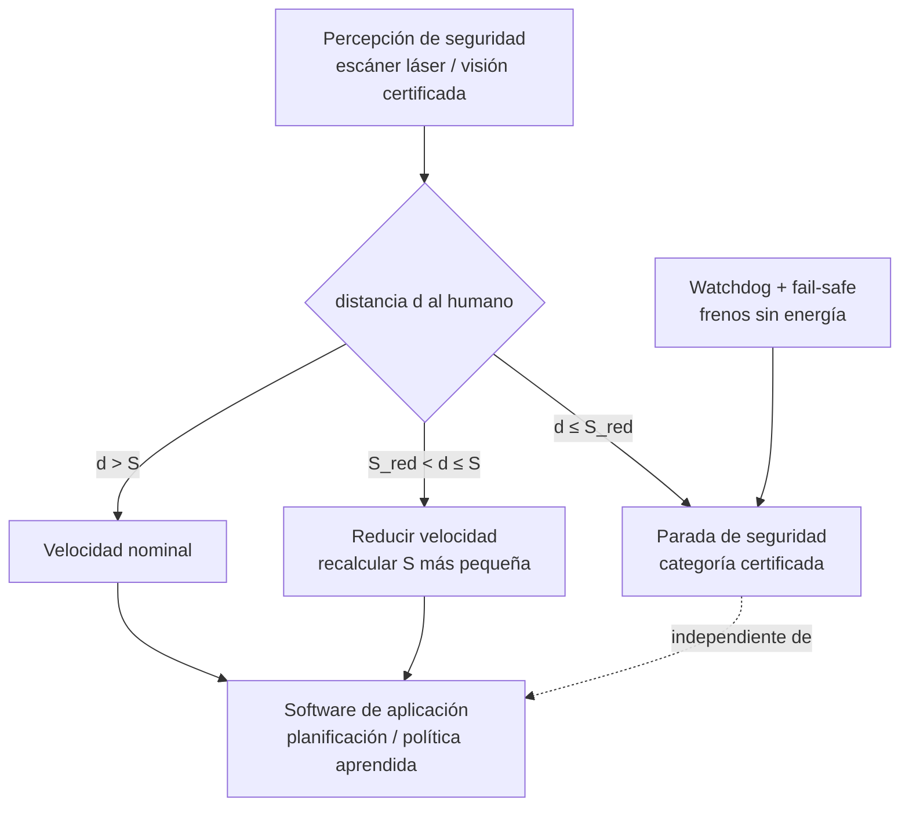

# 140 — Robots colaborativos y seguridad física

> [← Clase anterior](../../../classes/part-11-embodied-ai-robotics-and-computer-use/139-simulacion-sim-to-real-y-digital-twins/README.md) · [Índice de la parte](../README.md) · [Clase siguiente →](../../../classes/part-11-embodied-ai-robotics-and-computer-use/141-computer-use-basado-en-vision/README.md)

**Parte:** 11 — IA encarnada, robótica y uso de computadores  
**Nivel:** experto · **Horas estimadas:** 6  
**Laboratorio:** `safety` · **Estado:** `EXECUTABLE_CORE`

## 🎯 Propósito

Comprender **robots colaborativos y seguridad física** dentro de la evolución de la inteligencia
artificial, implementar un experimento mínimo verificable y distinguir qué parte
constituye evidencia frente a una afirmación todavía no comprobada.

## 📚 Resultados de aprendizaje

Al finalizar podrás:

1. Explicar robots colaborativos y seguridad física usando los conceptos `cobot`, `safety`, `fail-safe`, `human`.
2. Ejecutar el laboratorio con una semilla explícita y revisar su contrato JSON.
3. Identificar al menos un supuesto, una limitación y un riesgo de aplicación.
4. Comparar el enfoque con la etapa anterior de la ruta de aprendizaje.
5. Producir una evidencia reproducible y una conclusión que no exceda los datos.

## 🧩 Conceptos centrales

`cobot`, `safety`, `fail-safe`, `human`

## 🗺️ Ubicación en el mapa de la IA

Hasta aquí el robot aprendía y planificaba; esta clase introduce la restricción
que gobierna todo despliegue físico real: **un robot que comparte espacio con
personas puede lastimarlas**. La robótica colaborativa (cobots) sustituyó el
paradigma "robot enjaulado" por seguridad *diseñada* — normas ISO, límites de
potencia, velocidad y separación — y sus principios (capas independientes de
seguridad, fail-safe, evaluación de riesgos) son exactamente los que las
clases 141-144 trasladan a los agentes que actúan sobre computadoras: cambiar
"par máximo" por "acciones irreversibles" deja el mismo esquema.

## 📖 Fundamentos

### 🤝 Robot industrial clásico vs cobot

El robot industrial tradicional opera **separado** de las personas (jaulas,
barreras fotoeléctricas): la seguridad es exclusión. Un **cobot** está
diseñado para compartir espacio de trabajo: la seguridad se traslada al diseño
del robot y de la aplicación — menos masa, superficies redondeadas, sensores
de fuerza articulares, y límites certificados de velocidad/fuerza.
Advertencia clave: *"cobot" describe el diseño del brazo, no la seguridad de
la aplicación*: un cobot con un cuchillo como herramienta no es colaborativo.

### 📜 El marco normativo: ISO 10218 e ISO/TS 15066

- **ISO 10218** (partes 1 y 2): requisitos de seguridad para robots
  industriales — parte 1 el robot, parte 2 la integración y la célula.
- **ISO/TS 15066**: especificación técnica para robots *colaborativos*;
  define los cuatro modos de colaboración y aporta los datos biomecánicos
  (umbrales de dolor por región corporal) para diseñar contactos admisibles.

Los cuatro modos de ISO/TS 15066:

```text
1. Parada monitorizada de seguridad: el robot se detiene (manteniendo
   servos) cuando el humano entra; reanuda al salir.
2. Guiado manual: el operario mueve el robot con la mano (programación
   por demostración — enlaza con la clase 138).
3. Monitorización de velocidad y separación (SSM): robot y humano se
   mueven a la vez; la velocidad del robot se regula en función de la
   distancia al humano, garantizando poder parar antes del contacto.
4. Limitación de potencia y fuerza (PFL): el contacto está permitido,
   pero fuerza/presión quedan bajo los umbrales biomecánicos de TS 15066.
```

### 📏 Velocidad y separación: la distancia protectora

El corazón cuantitativo de SSM es la **distancia mínima protectora** `S`: el
robot debe poder detenerse antes de que el humano lo alcance. Forma
simplificada:

```text
S = v_h·(t_r + t_s) + v_r·t_r + d_frenado + C

v_h: velocidad del humano hacia el robot (norma: 1.6 m/s andando)
v_r: velocidad del robot hacia el humano
t_r: tiempo de reacción del sistema (sensado + procesamiento)
t_s: tiempo de frenado del robot
d_frenado: distancia que recorre el robot mientras frena
C: margen (incertidumbre de sensores, alcance de brazos)
```

Si la distancia medida cae por debajo de S, el robot reduce velocidad (lo que
reduce t_s y d_frenado, y por tanto S: un lazo de regulación) o se detiene.

### 🛡️ Principios de ingeniería de seguridad

- **Independencia de capas**: la función de seguridad (parada, límites) corre
  en hardware/software certificado (categorías PL/SIL) *separado* del software
  de aplicación. La política de RL puede fallar; el limitador de par no.
- **Fail-safe**: todo fallo (pérdida de sensor, corte de energía, watchdog
  vencido) lleva a un estado seguro — frenos que cierran sin energía.
- **Evaluación de riesgos** (ISO 12100): enumerar peligros por tarea,
  estimar severidad × probabilidad, reducir por jerarquía: eliminar el
  peligro > diseño seguro > protecciones técnicas > señalización/formación.
- **La seguridad es de la aplicación, no del componente**: se certifica la
  célula completa (robot + herramienta + pieza + entorno + procedimiento).

## 🧮 Ejemplo trabajado

Célula SSM con: humano a `v_h = 1.6 m/s`, robot acercándose a
`v_r = 1.0 m/s`, tiempo de reacción `t_r = 0.1 s`, frenado `t_s = 0.3 s`
(durante el cual el robot recorre `d_frenado ≈ v_r·t_s/2 = 0.15 m`), margen
`C = 0.2 m`.

```text
S = 1.6·(0.1 + 0.3) + 1.0·0.1 + 0.15 + 0.2
  = 0.64 + 0.10 + 0.15 + 0.20 = 1.09 m
```

El robot debe empezar a frenar cuando el humano esté a **1.09 m**. Si el robot
baja su velocidad a `v_r = 0.25 m/s` (y con ella `t_s = 0.15 s`,
`d_frenado ≈ 0.019 m`):

```text
S = 1.6·(0.1 + 0.15) + 0.25·0.1 + 0.019 + 0.2 = 0.40 + 0.025 + 0.019 + 0.2 = 0.64 m
```

Moraleja cuantitativa: **reducir la velocidad del robot encoge la zona de
exclusión** (de 1.09 a 0.64 m) y permite colaborar más cerca. Ese es el
mecanismo del modo SSM: velocidad como función continua de la distancia. Si
además el contacto ocurriera, PFL exige quedar bajo el umbral biomecánico de
la región de contacto (TS 15066 tabula, p. ej., valores mucho más estrictos
para cara/cuello que para hombro), lo que en la práctica limita masa efectiva
y velocidad de la herramienta.

## 📊 Propiedades y comparación

| Modo (TS 15066) | ¿Movimiento simultáneo? | ¿Contacto permitido? | Productividad | Requisito clave |
|---|---|---|---|---|
| Parada monitorizada | No (robot se detiene) | No | Baja | Detección fiable de presencia |
| Guiado manual | Solo guiado | Sí (guiado) | — (programación) | Fuerza limitada durante guiado |
| Velocidad y separación (SSM) | Sí | No | Media-alta | Sensado de distancia + cálculo de S |
| Potencia y fuerza (PFL) | Sí | Sí (bajo umbral) | Alta | Diseño biomecánico del contacto |



## ⚠️ Errores conceptuales frecuentes

1. **"Un cobot es seguro por ser cobot."** La seguridad pertenece a la
   aplicación completa (herramienta, pieza, proceso); el mismo brazo puede ser
   colaborativo o peligroso según qué sujete.
2. **"La IA puede encargarse de la seguridad."** Las funciones de seguridad
   exigen determinismo y certificación (PL/SIL); una política aprendida no
   certificable puede *comandar*, nunca *custodiar* los límites.
3. **"Más lento siempre = más seguro."** La relación correcta es
   velocidad-distancia (S): a distancia amplia la velocidad nominal es
   legítima; la lentitud injustificada solo destruye la productividad que
   motiva el cobot.
4. **"El contacto está prohibido en colaboración."** El modo PFL lo permite
   explícitamente bajo umbrales biomecánicos; lo prohibido es el contacto
   *fuera* de esos límites.
5. **"Con parada de emergencia basta."** El botón es la última capa y depende
   de un humano atento; SSM/PFL son automáticos y previos — la jerarquía de
   reducción de riesgos existe para no depender de reflejos humanos.

## 🚀 Del aprendizaje a la operación

Desplegar una célula colaborativa real añade: evaluación de riesgos formal y
documentada por tarea (ISO 12100), medición instrumentada de fuerzas de
contacto para validar PFL (no se estima: se mide con dispositivos
calibrados), certificación de la cadena de seguridad (sensores, PLC, frenos)
con su nivel PL/SIL, formación del personal y procedimientos de rearme, y
auditorías periódicas: cada cambio de herramienta, pieza o layout invalida la
evaluación anterior. Nada de esto aparece en el lab educativo y todo es
obligatorio (y legalmente exigible) en una fábrica.

## 🧪 Laboratorio

```bash
python lab.py
```

El laboratorio llama a `ai_evolution.labs.run_lab("safety")`. Esta
decisión evita 180 implementaciones divergentes: cada clase tiene un entrypoint
propio, pero los motores didácticos se prueban como una biblioteca común.

### 🔍 Evidencia esperada

- tipo de laboratorio y semilla;
- entradas o decisiones observables;
- resultado estructurado;
- lista `evidence` con hechos que pueden inspeccionarse;
- lista `limitations` que impide presentar la demo como producción.

## 📓 Notebooks

- [📓 `notebook.ipynb`](notebook.ipynb): recorrido guiado con la materia resumida.
- [✍️ `notebook_student.ipynb`](notebook_student.ipynb): ejercicios para resolver.
- [✅ `notebook_solution.ipynb`](notebook_solution.ipynb): solución de referencia explicada.

## 📝 Evaluación

| Criterio | Peso |
|---|---:|
| Comprensión conceptual | 25 % |
| Ejecución reproducible | 25 % |
| Interpretación basada en evidencia | 25 % |
| Riesgos, límites y mejora propuesta | 25 % |

Consulta [assessment.md](assessment.md) para preguntas y criterio de aceptación.

## ⚠️ Errores comunes

| Síntoma | Causa probable | Corrección |
|---|---|---|
| El código corre, pero no hay conclusión | Se confundió ejecución con aprendizaje | Explica qué demuestra y qué no demuestra |
| El resultado cambia sin explicación | No se registró semilla o configuración | Conserva semilla, versión y parámetros |
| Se promete uso real | Se extrapoló desde una demo educativa | Declara entorno, datos, límites y revisión humana |
| Se copia una métrica aislada | No existe baseline ni costo de error | Añade comparación y criterio de decisión |

## ❓ Preguntas frecuentes

**¿Debo usar una API comercial?**  
No. El núcleo funciona localmente. Las extensiones LIVE se documentan por separado.

**¿El laboratorio representa una implementación industrial?**  
No por sí solo. Enseña el contrato y el patrón; producción exige integración,
seguridad, observabilidad, pruebas y operación.

**¿Dónde profundizo?**  
Revisa las especializaciones enlazadas en el README raíz y la ruta siguiente.

## 🔗 Referencias

- [ISO 10218-1:2025 — Robotics: Safety requirements, Part 1 (página oficial ISO)](https://www.iso.org/standard/73933.html)
- [ISO/TS 15066:2016 — Robots and robotic devices: Collaborative robots (página oficial ISO)](https://www.iso.org/standard/62996.html)
- [ISO 12100:2010 — Safety of machinery: Risk assessment and risk reduction](https://www.iso.org/standard/51528.html)
- [Siciliano, B. & Khatib, O. (eds.). Springer Handbook of Robotics, 2e — cap. de Physical Human-Robot Interaction](https://link.springer.com/book/10.1007/978-3-319-32552-1)
- [Villani, V. et al. (2018). Survey on human-robot collaboration in industrial settings. Mechatronics. DOI 10.1016/j.mechatronics.2018.02.009](https://doi.org/10.1016/j.mechatronics.2018.02.009)

---

## ⬅️ Clase anterior

[139 — Simulación, sim-to-real y digital twins](../../part-11-embodied-ai-robotics-and-computer-use/139-simulacion-sim-to-real-y-digital-twins/README.md)

## ➡️ Siguiente clase

[141 — Computer use basado en visión](../../part-11-embodied-ai-robotics-and-computer-use/141-computer-use-basado-en-vision/README.md)
