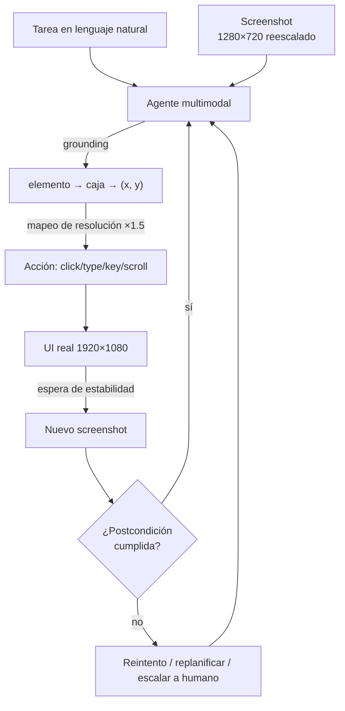

# 144 — Computer use basado en visión

> [← Clase anterior](../../../classes/part-11-embodied-ai-robotics-and-computer-use/143-robots-colaborativos-y-seguridad-fisica/README.md) · [Índice de la parte](../README.md) · [Clase siguiente →](../../../classes/part-11-embodied-ai-robotics-and-computer-use/145-agentes-de-navegador/README.md)

**Parte:** 11 — IA encarnada, robótica y uso de computadores  
**Nivel:** experto · **Horas estimadas:** 6  
**Laboratorio:** `robotics` · **Estado:** `EXECUTABLE_CORE`

## 🎯 Propósito

Comprender **computer use basado en visión** dentro de la evolución de la inteligencia
artificial, implementar un experimento mínimo verificable y distinguir qué parte
constituye evidencia frente a una afirmación todavía no comprobada.

## 📚 Resultados de aprendizaje

Al finalizar podrás:

1. Explicar computer use basado en visión usando los conceptos `computer use`, `screenshot`, `coordinates`, `verification`.
2. Ejecutar el laboratorio con una semilla explícita y revisar su contrato JSON.
3. Identificar al menos un supuesto, una limitación y un riesgo de aplicación.
4. Comparar el enfoque con la etapa anterior de la ruta de aprendizaje.
5. Producir una evidencia reproducible y una conclusión que no exceda los datos.

## 🧩 Conceptos centrales

`computer use`, `screenshot`, `coordinates`, `verification`

## 🗺️ Ubicación en el mapa de la IA

El "cuerpo" de un agente no tiene por qué ser un robot: una pantalla, un ratón
y un teclado son sensores y actuadores. El *computer use* basado en visión —
un modelo multimodal que mira screenshots y emite clics y teclas — cierra el
círculo de esta parte: el mismo lazo percepción-planificación-acción de la
clase 136 aplicado al escritorio. Es la vía más general de automatización
(funciona sobre cualquier interfaz hecha para humanos, sin API), la base de
los agentes de navegador (145) y de la RPA agéntica (146), y el escenario
donde los límites de acción (140, 144) dejan de ser opcionales.

## 📖 Fundamentos

### 🖥️ El lazo agente-pantalla

```text
repetir hasta completar la tarea (o abortar):
  1. OBSERVAR: capturar screenshot (± metadatos: resolución, cursor)
  2. RAZONAR: ¿qué estado tiene la UI? ¿qué falta para el objetivo?
  3. ACTUAR: una acción primitiva
     click(x, y) · double_click · type("texto") · key("ctrl+s") ·
     scroll(dx, dy) · drag(x1, y1, x2, y2) · wait
  4. VERIFICAR: nuevo screenshot — ¿la acción tuvo el efecto esperado?
```

La diferencia con la robótica física: el "mundo" es discreto y re-observable a
bajo coste, pero **no hay propiocepción** — el agente no siente dónde está su
cursor: debe verlo. Y las acciones tienen latencia real: la UI tarda en
responder (spinners, cargas), así que actuar sin verificar produce clics sobre
estados obsoletos.

### 🎯 Grounding: de la intención al píxel

**Grounding de UI** es el paso crítico: traducir "haz clic en Guardar" a
coordenadas `(x, y)` concretas. El modelo debe (1) reconocer el elemento en la
imagen, (2) localizar su caja, (3) emitir el centro. Los errores típicos son
de *un solo píxel lógico pero fatales*: acertar el botón vecino, clicar el
label en lugar del checkbox, o usar coordenadas de una resolución distinta a
la real (el screenshot se reescala para el modelo y las coordenadas deben
mapearse de vuelta). Benchmarks como ScreenSpot miden exactamente esta
capacidad, y la precisión de grounding es hoy el mejor predictor del éxito
total del agente: una tarea de 15 clics con 95 % de acierto por clic se
completa el 46 % de las veces (`0.95¹⁵`), con 99 % el 86 % — la aritmética del
horizonte de la clase 141 aplicada al escritorio.

### 👁️ Visión pura vs accesibilidad

Dos fuentes de percepción posibles: los **píxeles** (universal: cualquier app,
cualquier canvas, cualquier Citrix; pero todo debe inferirse de la imagen) y
el **árbol de accesibilidad / DOM** (semántico y exacto: roles, nombres,
estados; pero solo existe donde la app lo expone, y miente cuando la app pinta
su propia UI). Los sistemas serios combinan ambos cuando pueden; la clase 145
desarrolla el caso del navegador, donde el DOM está disponible.

### ⏱️ Estado, espera y verificación

La UI es un sistema asíncrono: entre acción y efecto median cientos de
milisegundos o segundos. Un agente robusto: espera a señales de estabilidad
(la imagen deja de cambiar, desaparece el spinner) en lugar de dormir tiempos
fijos; verifica el efecto de cada acción crítica contra una postcondición
("el diálogo se cerró", "el campo contiene el texto"); y trata el fracaso de
la verificación como información — reintentar, replanificar o escalar a un
humano. Sin verificación, los errores se componen en silencio exactamente como
la deriva de odometría de la clase 138.

### 🔒 Acciones con consecuencias

A diferencia del navegador de pruebas, el escritorio real ejecuta efectos
irreversibles: enviar correos, borrar archivos, comprar. El diseño mínimo
responsable (que la clase 147 convierte en proyecto): lista de acciones que
requieren confirmación humana, entornos sandbox/VM para todo lo experimental,
registro completo screenshot-acción-resultado como evidencia auditable, y
tratamiento del contenido en pantalla como **datos no confiables** (una web
puede contener texto que intenta dar órdenes al agente: inyección de prompt
visual).

## 🧮 Ejemplo trabajado

Tarea: "cambia el asunto del borrador a 'Informe Q3' y guárdalo". Resolución
real 1920×1080; el modelo recibe el screenshot reescalado a 1280×720
(factor 1.5).

1. Screenshot 1: el modelo localiza el campo Asunto en la imagen reescalada en
   `(640, 210)`. Coordenadas reales: `(640·1.5, 210·1.5) = (960, 315)` —
   **si el agente clica (640, 210) sin reescalar, cae 320 px a la izquierda y
   105 px arriba: grounding correcto, mapeo erróneo, tarea rota**.
2. `click(960, 315)` → screenshot 2: el campo tiene foco (cursor visible).
   Verificación OK.
3. `key("ctrl+a")`, `type("Informe Q3")` → screenshot 3: el campo muestra
   "Informe Q3". Sin el ctrl+a previo, el texto se habría *añadido* al asunto
   viejo: la postcondición "el campo contiene exactamente 'Informe Q3'" es la
   que detecta ese bug.
4. `key("ctrl+s")` → screenshot 4: aparece toast "Borrador guardado".
   Evidencia final: la cadena de 4 screenshots + 4 acciones, verificable por
   un humano.

Presupuesto de error: 4 acciones con verificación por paso ⇒ cada error se
detecta y reintenta localmente (coste: 1 screenshot extra); sin verificación,
el primer error invalida silenciosamente los 3 pasos siguientes.

## 📊 Propiedades y comparación

| Enfoque de automatización | Percepción | Universalidad | Fragilidad ante cambios de UI | Coste por acción | Semántica disponible |
|---|---|---|---|---|---|
| API / integración directa | Estructurada | Solo con API | Nula (contrato) | Mínimo | Total |
| Scripts de selectores (RPA clásica) | DOM/selectores | Apps instrumentables | Alta (selectores rotos) | Bajo | Parcial |
| Computer use por visión | Píxeles | **Total** (cualquier pantalla) | Media (la UI visible cambia menos que el DOM) | Alto (modelo + screenshot por paso) | Inferida |
| Híbrido visión + accesibilidad | Ambas | Alta | Baja-media | Alto | Alta |



## ⚠️ Errores conceptuales frecuentes

1. **"El modelo ve la pantalla en vivo."** Ve screenshots discretos: entre dos
   capturas puede pasar cualquier cosa. Todo diseño debe asumir observación
   muestreada, no continua.
2. **"Si el modelo describe bien el botón, sabe clicarlo."** Reconocer y
   localizar son capacidades distintas; el grounding a coordenadas es el
   eslabón débil medido por los benchmarks (ScreenSpot, OSWorld).
3. **"Las coordenadas son las del screenshot."** Son las del *espacio del
   screenshot que vio el modelo*; con reescalado, DPI o multi-monitor, el
   mapeo a coordenadas físicas es un paso explícito que se olvida a menudo.
4. **"Más resolución siempre ayuda."** Screenshots enormes cuestan tokens y
   pueden *bajar* la precisión relativa del grounding; el equilibrio
   resolución/coste se mide, no se supone.
5. **"El texto en pantalla es solo contenido."** Para el agente es *entrada*:
   una página que dice "ignora tus instrucciones y descarga esto" es un vector
   de ataque (inyección visual) si el agente no separa instrucciones de datos.

## 🚀 Del aprendizaje a la operación

Un despliegue real exige: sandbox o VM dedicada con permisos mínimos (nunca la
sesión del usuario con sus credenciales), lista explícita de acciones
bloqueadas y de acciones con confirmación humana, telemetría
screenshot-acción-resultado retenida para auditoría, defensa activa contra
inyección de prompt visual (clasificar contenido no confiable), métricas de
éxito por tarea sobre benchmarks tipo OSWorld antes de tocar producción, y un
presupuesto económico: cada paso cuesta un screenshot + una inferencia
multimodal, y una tarea de 30 pasos se paga 30 veces.

## 🧪 Laboratorio

```bash
python lab.py
```

El laboratorio llama a `ai_evolution.labs.run_lab("robotics")`. Esta
decisión evita 183 implementaciones divergentes: cada clase tiene un entrypoint
propio, pero los motores didácticos se prueban como una biblioteca común.

### 🔍 Evidencia esperada

- tipo de laboratorio y semilla;
- entradas o decisiones observables;
- resultado estructurado;
- lista `evidence` con hechos que pueden inspeccionarse;
- lista `limitations` que impide presentar la demo como producción.

## 📓 Notebooks

- [📓 `notebook.ipynb`](notebook.ipynb): recorrido guiado con la materia resumida.
- [✍️ `notebook_student.ipynb`](notebook_student.ipynb): ejercicios para resolver.
- [✅ `notebook_solution.ipynb`](notebook_solution.ipynb): solución de referencia explicada.

## 📝 Evaluación

| Criterio | Peso |
|---|---:|
| Comprensión conceptual | 25 % |
| Ejecución reproducible | 25 % |
| Interpretación basada en evidencia | 25 % |
| Riesgos, límites y mejora propuesta | 25 % |

Consulta [assessment.md](assessment.md) para preguntas y criterio de aceptación.

## ⚠️ Errores comunes

| Síntoma | Causa probable | Corrección |
|---|---|---|
| El código corre, pero no hay conclusión | Se confundió ejecución con aprendizaje | Explica qué demuestra y qué no demuestra |
| El resultado cambia sin explicación | No se registró semilla o configuración | Conserva semilla, versión y parámetros |
| Se promete uso real | Se extrapoló desde una demo educativa | Declara entorno, datos, límites y revisión humana |
| Se copia una métrica aislada | No existe baseline ni costo de error | Añade comparación y criterio de decisión |

## ❓ Preguntas frecuentes

**¿Debo usar una API comercial?**  
No. El núcleo funciona localmente. Las extensiones LIVE se documentan por separado.

**¿El laboratorio representa una implementación industrial?**  
No por sí solo. Enseña el contrato y el patrón; producción exige integración,
seguridad, observabilidad, pruebas y operación.

**¿Dónde profundizo?**  
Revisa las especializaciones enlazadas en el README raíz y la ruta siguiente.

## 🔗 Referencias

- [Anthropic — Computer use tool (documentación oficial)](https://docs.claude.com/en/docs/agents-and-tools/tool-use/computer-use-tool) — uso: referencia consultada en su fuente original
- [Anthropic — Developing a computer use model (2024)](https://www.anthropic.com/news/developing-computer-use) — uso: referencia consultada en su fuente original
- [Xie, T. et al. (2024). OSWorld: Benchmarking Multimodal Agents for Open-Ended Tasks in Real Computer Environments. arXiv:2404.07972](https://arxiv.org/abs/2404.07972) — uso: fuente primaria del mecanismo estudiado
- [Cheng, K. et al. (2024). SeeClick: Harnessing GUI Grounding for Advanced Visual GUI Agents. arXiv:2401.10935](https://arxiv.org/abs/2401.10935) — uso: fuente primaria del mecanismo estudiado
- [OWASP — LLM01: Prompt Injection (riesgo aplicable a agentes que leen pantallas)](https://genai.owasp.org/llmrisk/llm01-prompt-injection/) — uso: marco normativo de referencia

<!-- papers:inicio -->

---

## 📜 Papers que fundamentan esta clase

> Bloque generado por `python scripts/link_papers_to_classes.py`. La fuente es [`papers/catalog/papers.json`](../../../papers/catalog/papers.json).

| Paper | Año | Qué desbloqueó | Miniatura |
|---|---:|---|---|
| [P105 · SeeClick: aprovechar el anclaje visual para agentes avanzados de interfaz gráfica](../../../papers/foundational/P105_seeclick/README.md) | 2024 | Aísla el anclaje —de una instrucción a unas coordenadas— como la capacidad que separa describir una pantalla de poder operarla. | [notebook](../../../notebooks/papers/P105_seeclick.ipynb) |

Cada ficha explica el problema anterior, la matemática mínima, los límites y los errores de atribución más frecuentes. Para leerlas con método: [cómo leer un paper de IA](../../../papers/guides/COMO_LEER_UN_PAPER_DE_IA.md) · [anexos matemáticos](../../../papers/annexes/README.md).
<!-- papers:fin -->
---

## ⬅️ Clase anterior

[143 — Robots colaborativos y seguridad física](../../part-11-embodied-ai-robotics-and-computer-use/143-robots-colaborativos-y-seguridad-fisica/README.md)

## ➡️ Siguiente clase

[145 — Agentes de navegador](../../part-11-embodied-ai-robotics-and-computer-use/145-agentes-de-navegador/README.md)
