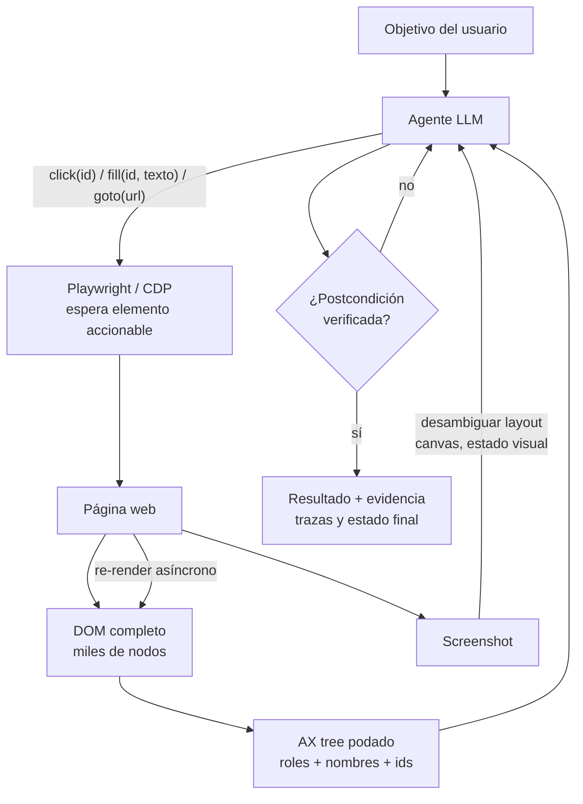

# 145 — Agentes de navegador

> [← Clase anterior](../../../classes/part-11-embodied-ai-robotics-and-computer-use/144-computer-use-basado-en-vision/README.md) · [Índice de la parte](../README.md) · [Clase siguiente →](../../../classes/part-11-embodied-ai-robotics-and-computer-use/146-automatizacion-de-escritorio-y-rpa-agentica/README.md)

**Parte:** 11 — IA encarnada, robótica y uso de computadores  
**Nivel:** experto · **Horas estimadas:** 6  
**Laboratorio:** `agent` · **Estado:** `EXECUTABLE_CORE`

## 🎯 Propósito

Comprender **agentes de navegador** dentro de la evolución de la inteligencia
artificial, implementar un experimento mínimo verificable y distinguir qué parte
constituye evidencia frente a una afirmación todavía no comprobada.

## 📚 Resultados de aprendizaje

Al finalizar podrás:

1. Explicar agentes de navegador usando los conceptos `browser`, `DOM`, `navigation`, `forms`.
2. Ejecutar el laboratorio con una semilla explícita y revisar su contrato JSON.
3. Identificar al menos un supuesto, una limitación y un riesgo de aplicación.
4. Comparar el enfoque con la etapa anterior de la ruta de aprendizaje.
5. Producir una evidencia reproducible y una conclusión que no exceda los datos.

## 🧩 Conceptos centrales

`browser`, `DOM`, `navigation`, `forms`

## 🗺️ Ubicación en el mapa de la IA

El navegador es el hábitat natural del agente digital: casi todo el software de
consumo y de empresa vive detrás de una URL. A diferencia del escritorio
genérico (clase 144), el navegador expone una estructura semántica — el DOM y
el árbol de accesibilidad — que el agente puede leer y manipular con
precisión de programa, no de píxel. Los agentes de navegador son hoy el área
más medida del campo (WebArena, Mind2Web, WebVoyager) y el laboratorio donde
mejor se ve la distancia entre demos espectaculares y fiabilidad real: los
mejores agentes rondan tasas de éxito muy por debajo del humano en tareas
largas. Esta clase prepara directamente la RPA agéntica (146) y el proyecto
con límites (147).

## 📖 Fundamentos

### 🌳 Qué ofrece el navegador que el escritorio no

- **DOM**: árbol de elementos con etiquetas, atributos, texto y jerarquía. Se
  consulta con selectores (CSS/XPath) y refleja el estado real de la página.
- **Árbol de accesibilidad (AX tree)**: proyección semántica del DOM (roles:
  `button`, `textbox`, `link`; nombres accesibles; estados). Suele ser la
  mejor representación para un LLM: compacta y orientada a la interacción.
- **Acciones de alto nivel**: `click(elemento)`, `fill(campo, texto)`,
  `select(opción)`, `goto(url)`, ejecutadas por herramientas tipo
  Playwright/CDP que esperan automáticamente a que el elemento sea accionable.
- **Observabilidad extra**: peticiones de red, consola, eventos — señales de
  verificación que la visión pura no tiene.

### ⚖️ DOM vs visión: el trade-off central

```text
DOM/AX:    preciso, barato en tokens, verificable...
           ...pero miente cuando la página pinta canvas, mapas, editores
           embebidos, o esconde elementos con CSS; y los sitios modernos
           generan árboles enormes (miles de nodos) que hay que podar.

Visión:    ve exactamente lo que vería un humano (incluido canvas y
           posición real)...
           ...pero paga grounding a coordenadas, resolución y tokens de
           imagen (clase 144).
```

Los agentes competitivos son **híbridos**: AX tree podado + screenshot,
usando cada canal para lo que es bueno (el DOM para actuar con precisión, la
imagen para desambiguar layout y detectar lo que el DOM no cuenta).

### 🧭 El bucle del agente de navegador

```text
estado = {objetivo, historial de acciones, observación actual}
repetir:
  1. observar: AX tree podado (± screenshot) de la pestaña activa
  2. decidir: siguiente acción de alto nivel sobre un elemento identificado
     (por id de nodo del árbol, no por coordenadas)
  3. actuar y ESPERAR: navegación, re-render, XHR — la página es asíncrona
  4. verificar postcondición y actualizar el historial
condiciones de salida: éxito verificado · presupuesto agotado · bloqueo
```

Los fallos característicos: **estado obsoleto** (el DOM cambió tras un
re-render y la referencia al nodo murió), **iframes** y shadow DOM (árboles
anidados que el selector ingenuo no ve), **esperas mal calibradas** (actuar
antes de que el listener esté montado: el clic "funciona" y no hace nada), y
**bucles** (reintentar la misma acción fallida sin cambiar de estrategia).

### 📏 Evaluación: WebArena y la brecha con el humano

WebArena (Zhou et al., 2023 — arXiv:2307.13854) es el benchmark de
referencia: sitios web *auto-hospedados y funcionales* (e-commerce, foro tipo
Reddit, GitLab, CMS) con 812 tareas largas y **verificación programática del
resultado** (no juicio subjetivo: se comprueba el estado final). Resultado
fundacional: el humano logra ~78 % de éxito; el mejor agente GPT-4 del paper
original, ~14 %. Los agentes posteriores han escalado esa cifra
sustancialmente, pero la lección metodológica permanece: (1) medir éxito
end-to-end verificado, no pasos "razonables"; (2) las tareas largas componen
errores — la aritmética `p^n` de las clases 138 y 141; (3) los agentes fallan
distinto que los humanos: no por no saber, sino por perder el hilo del estado.

## 🧮 Ejemplo trabajado

Tarea: "encuentra el pedido #1043 y descarga su factura" en un panel de
administración.

**Agente por visión pura** (clase 144): screenshot → localizar el buscador →
`click(x, y)` → `type("1043")` → localizar la fila → localizar el icono de
descarga (16×16 px: grounding difícil) → clic. Riesgos: el icono pequeño, la
tabla re-renderiza al filtrar y los pixeles del icono se mueven.

**Agente DOM**: AX tree revela
`searchbox "Buscar pedidos"`, `row "1043 ... "`, dentro
`button "Descargar factura"`. Acciones:
`fill(searchbox, "1043")` → esperar a que la tabla se re-renderice (la
herramienta espera al elemento accionable) → `click(button dentro de la fila
1043)`. Verificación: evento de descarga registrado + el fichero existe.

Conteo honesto: visión ≈ 6 acciones con 2 groundings difíciles; DOM ≈ 3
acciones sin grounding a píxel. Con acierto 0.9 en los groundings difíciles y
0.99 en el resto: visión ≈ `0.99⁴·0.9² ≈ 0.78`; DOM ≈ `0.99³ ≈ 0.97`.
**Pero** si la tabla fuera un canvas dibujado (sin DOM útil), el agente DOM
quedaría ciego y la visión sería la única vía: por eso el híbrido gana en
general.

## 📊 Propiedades y comparación

| Dimensión | Agente DOM/AX | Agente visión | Híbrido | RPA con selectores fijos |
|---|---|---|---|---|
| Precisión de acción | Muy alta (por nodo) | Media (por píxel) | Muy alta | Alta hasta que la UI cambia |
| Cobertura (canvas, PDF, Citrix) | Baja | **Total** | Total | Baja |
| Coste por paso (tokens) | Bajo-medio | Alto (imágenes) | Alto | Mínimo (sin modelo) |
| Robustez a rediseños | Media (roles estables) | Media-alta | Alta | **Nula** (selector roto) |
| Verificabilidad del resultado | Alta (estado del DOM, red) | Media (píxeles) | Alta | Alta pero ciega a cambios |
| Adaptación a sitios nuevos | Sí (razonamiento) | Sí | Sí | No (reprogramar) |



## ⚠️ Errores conceptuales frecuentes

1. **"El DOM siempre dice la verdad."** Elementos presentes pero invisibles,
   canvas sin semántica, shadow DOM y frameworks que recrean nodos: el DOM es
   una representación, no la pantalla.
2. **"Visión y DOM compiten; hay que elegir."** Los mejores agentes usan
   ambos; la pregunta de ingeniería es qué canal para qué subtarea.
3. **"Si cada paso parece razonable, la tarea va bien."** WebArena existe
   porque los pasos plausibles no predicen el éxito final verificado; solo
   cuenta el estado terminal comprobado.
4. **"Un benchmark del 60 % significa que 6 de cada 10 tareas de mi empresa
   funcionarán."** Los benchmarks miden *sus* sitios y *sus* tareas; la
   transferencia a un dominio concreto se mide en ese dominio.
5. **"Esperar 3 segundos arregla la asincronía."** Las esperas fijas fallan en
   ambos sentidos (lentas de más, cortas de menos); lo correcto es esperar
   condiciones: elemento accionable, red inactiva, postcondición visible.

## 🚀 Del aprendizaje a la operación

Para producción faltan: gestión de sesiones y credenciales fuera del prompt
(el agente nunca debe ver contraseñas), manejo de CAPTCHAs y 2FA con
intervención humana explícita, respeto de términos de servicio y robots.txt
del sitio objetivo, defensa contra inyección de prompt en contenido web (una
reseña puede contener instrucciones dirigidas al agente), poda y cacheo del
AX tree para controlar coste, reintentos con cambio de estrategia (no bucles),
y evaluación continua sobre un conjunto de tareas propias con verificación
programática — el método WebArena aplicado a tu dominio.

## 🧪 Laboratorio

```bash
python lab.py
```

El laboratorio llama a `ai_evolution.labs.run_lab("agent")`. Esta
decisión evita 183 implementaciones divergentes: cada clase tiene un entrypoint
propio, pero los motores didácticos se prueban como una biblioteca común.

### 🔍 Evidencia esperada

- tipo de laboratorio y semilla;
- entradas o decisiones observables;
- resultado estructurado;
- lista `evidence` con hechos que pueden inspeccionarse;
- lista `limitations` que impide presentar la demo como producción.

## 📓 Notebooks

- [📓 `notebook.ipynb`](notebook.ipynb): recorrido guiado con la materia resumida.
- [✍️ `notebook_student.ipynb`](notebook_student.ipynb): ejercicios para resolver.
- [✅ `notebook_solution.ipynb`](notebook_solution.ipynb): solución de referencia explicada.

## 📝 Evaluación

| Criterio | Peso |
|---|---:|
| Comprensión conceptual | 25 % |
| Ejecución reproducible | 25 % |
| Interpretación basada en evidencia | 25 % |
| Riesgos, límites y mejora propuesta | 25 % |

Consulta [assessment.md](assessment.md) para preguntas y criterio de aceptación.

## ⚠️ Errores comunes

| Síntoma | Causa probable | Corrección |
|---|---|---|
| El código corre, pero no hay conclusión | Se confundió ejecución con aprendizaje | Explica qué demuestra y qué no demuestra |
| El resultado cambia sin explicación | No se registró semilla o configuración | Conserva semilla, versión y parámetros |
| Se promete uso real | Se extrapoló desde una demo educativa | Declara entorno, datos, límites y revisión humana |
| Se copia una métrica aislada | No existe baseline ni costo de error | Añade comparación y criterio de decisión |

## ❓ Preguntas frecuentes

**¿Debo usar una API comercial?**  
No. El núcleo funciona localmente. Las extensiones LIVE se documentan por separado.

**¿El laboratorio representa una implementación industrial?**  
No por sí solo. Enseña el contrato y el patrón; producción exige integración,
seguridad, observabilidad, pruebas y operación.

**¿Dónde profundizo?**  
Revisa las especializaciones enlazadas en el README raíz y la ruta siguiente.

## 🔗 Referencias

- [Zhou, S. et al. (2023). WebArena: A Realistic Web Environment for Building Autonomous Agents. arXiv:2307.13854](https://arxiv.org/abs/2307.13854) — uso: fuente primaria del mecanismo estudiado
- [Deng, X. et al. (2023). Mind2Web: Towards a Generalist Agent for the Web. arXiv:2306.06070](https://arxiv.org/abs/2306.06070) — uso: fuente primaria del mecanismo estudiado
- [Playwright — documentación oficial (auto-waiting y actionability)](https://playwright.dev/docs/actionability) — uso: referencia consultada en su fuente original
- [Chrome DevTools Protocol — documentación oficial](https://chromedevtools.github.io/devtools-protocol/) — uso: referencia consultada en su fuente original
- [W3C — Accessibility Tree (WAI-ARIA): roles y nombres accesibles](https://www.w3.org/TR/wai-aria-1.2/) — uso: marco normativo de referencia
- [Anthropic — Computer use tool (acciones de navegador y escritorio)](https://docs.claude.com/en/docs/agents-and-tools/tool-use/computer-use-tool) — uso: referencia consultada en su fuente original

<!-- papers:inicio -->

---

## 📜 Papers que fundamentan esta clase

> Bloque generado por `python scripts/link_papers_to_classes.py`. La fuente es [`papers/catalog/papers.json`](../../../papers/catalog/papers.json).

| Paper | Año | Qué desbloqueó | Miniatura |
|---|---:|---|---|
| [P104 · WebArena: un entorno web realista para construir agentes autónomos](../../../papers/foundational/P104_webarena/README.md) | 2023 | Evalúa agentes de navegador comprobando el ESTADO del sitio al terminar, no lo que el agente dice haber hecho. | [notebook](../../../notebooks/papers/P104_webarena.ipynb) |

Cada ficha explica el problema anterior, la matemática mínima, los límites y los errores de atribución más frecuentes. Para leerlas con método: [cómo leer un paper de IA](../../../papers/guides/COMO_LEER_UN_PAPER_DE_IA.md) · [anexos matemáticos](../../../papers/annexes/README.md).
<!-- papers:fin -->
---

## ⬅️ Clase anterior

[144 — Computer use basado en visión](../../part-11-embodied-ai-robotics-and-computer-use/144-computer-use-basado-en-vision/README.md)

## ➡️ Siguiente clase

[146 — Automatización de escritorio y RPA agéntica](../../part-11-embodied-ai-robotics-and-computer-use/146-automatizacion-de-escritorio-y-rpa-agentica/README.md)
