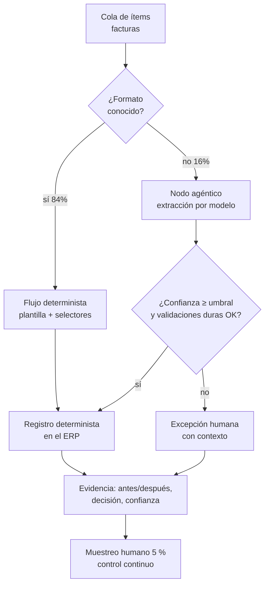

# 146 — Automatización de escritorio y RPA agéntica

> [← Clase anterior](../../../classes/part-11-embodied-ai-robotics-and-computer-use/145-agentes-de-navegador/README.md) · [Índice de la parte](../README.md) · [Clase siguiente →](../../../classes/part-11-embodied-ai-robotics-and-computer-use/147-proyecto-agente-que-actua-con-limites/README.md)

**Parte:** 11 — IA encarnada, robótica y uso de computadores  
**Nivel:** experto · **Horas estimadas:** 6  
**Laboratorio:** `workflow` · **Estado:** `EXECUTABLE_CORE`

## 🎯 Propósito

Comprender **automatización de escritorio y rpa agéntica** dentro de la evolución de la inteligencia
artificial, implementar un experimento mínimo verificable y distinguir qué parte
constituye evidencia frente a una afirmación todavía no comprobada.

## 📚 Resultados de aprendizaje

Al finalizar podrás:

1. Explicar automatización de escritorio y rpa agéntica usando los conceptos `desktop`, `RPA`, `Playwright`, `evidence`.
2. Ejecutar el laboratorio con una semilla explícita y revisar su contrato JSON.
3. Identificar al menos un supuesto, una limitación y un riesgo de aplicación.
4. Comparar el enfoque con la etapa anterior de la ruta de aprendizaje.
5. Producir una evidencia reproducible y una conclusión que no exceda los datos.

## 🧩 Conceptos centrales

`desktop`, `RPA`, `Playwright`, `evidence`

## 🗺️ Ubicación en el mapa de la IA

La automatización de procesos de oficina no nació con los LLM: la industria
RPA (UiPath, Automation Anywhere, Blue Prism) lleva dos décadas grabando y
reproduciendo interacciones con interfaces. Entender su tecnología — y su
talón de Aquiles, los selectores frágiles — es imprescindible para juzgar qué
aporta de verdad un agente (clases 144-145) cuando se inserta en un proceso
de negocio, y qué NO conviene delegarle. Esta clase es el puente entre el
computer use como capacidad y el proyecto final (147), donde la automatización
se somete a límites y auditoría.

## 📖 Fundamentos

### 🤖 RPA clásica: qué es y por qué funciona

RPA (Robotic Process Automation) automatiza tareas repetitivas manejando las
mismas interfaces que un humano: leer un correo, copiar campos a un ERP,
descargar y renombrar ficheros. Sus piezas:

- **Grabador + diseñador de flujos**: se graba la interacción y se edita como
  diagrama (secuencias, condiciones, bucles).
- **Selectores**: expresiones que identifican cada elemento de UI (jerarquía
  de ventanas + atributos: `wnd[app='sap.exe'] → ctrl[name='Aceptar']`).
- **Orquestador**: programa, distribuye y monitoriza los "robots" en flotas
  (attended: asisten a una persona; unattended: corren solos en servidores).
- **Colas de trabajo y reintentos**: cada ítem de negocio (una factura) se
  procesa, se reintenta o se deriva a excepción humana.

Cuando el proceso es estable y de reglas fijas, la RPA es imbatible en coste:
determinista, auditable, sin inferencia por paso.

### 🧨 El talón de Aquiles: selectores frágiles

El selector describe la UI *tal como era el día de la grabación*. Cualquier
cambio — una actualización del ERP que renombra un control, un idioma
distinto, una resolución diferente, un popup inesperado — rompe el selector y
el robot se detiene (o peor: actúa sobre el elemento equivocado). Consecuencia
estructural: los despliegues RPA acumulan un coste de mantenimiento creciente;
una parte sustancial del presupuesto se va en reparar automatizaciones rotas
por cambios de UI. Además la RPA clásica **no decide**: ante una factura
ambigua o un caso no previsto, solo puede lanzar excepción.

### 🧠 RPA agéntica: qué cambia con un agente

La RPA agéntica inserta un modelo (LLM/multimodal) en puntos concretos:

```text
1. Percepción robusta: localizar "el botón Aceptar" por semántica o visión
   aunque el selector cambiara (auto-reparación de selectores).
2. Decisión bajo ambigüedad: clasificar el documento, extraer campos de
   formatos nunca vistos, decidir la rama del flujo.
3. Manejo de excepciones: en lugar de abortar, diagnosticar el popup
   inesperado y continuar o escalar con contexto.
4. Construcción de flujos: describir el proceso en lenguaje natural y
   generar el esqueleto de automatización.
```

El precio: no determinismo (la misma entrada puede producir distinta salida),
coste por inferencia, y una superficie nueva de fallos (alucinación de
campos, inyección de prompt en documentos procesados). La regla de diseño
que esta clase defiende: **el flujo determinista sigue siendo la columna
vertebral; el agente se usa en los nodos donde la variabilidad es
irreducible** — no al revés.

### 🧾 Evidencia y auditoría

En procesos de negocio, cada acción automatizada debe dejar rastro: qué ítem
se procesó, qué se leyó, qué se decidió, con qué confianza, y captura del
estado antes/después de cada efecto (el análogo del registro
screenshot-acción-resultado de la clase 144). La auditoría no es burocracia:
es lo que permite (1) reclamar ante errores, (2) medir dónde fallan los nodos
agénticos, y (3) cumplir requisitos regulatorios cuando el proceso toca
dinero o datos personales.

## 🧮 Ejemplo trabajado

Proceso: 500 facturas de proveedores al mes → extraer 5 campos → registrarlas
en el ERP.

**RPA clásica**: 420 facturas (84 %) siguen los 3 formatos conocidos y se
procesan a coste ~0 con plantillas de extracción fijas. Las 80 restantes (16 %)
van a excepción humana: a 6 min/factura son **8 horas/mes** de trabajo manual.
Cada cambio de formato de un proveedor grande rompe la plantilla y añade
mantenimiento.

**Agéntica en los nodos correctos**: el flujo, las colas y el registro en el
ERP siguen siendo deterministas. El nodo de extracción usa un modelo para las
80 no estándar: supongamos que extrae bien el 90 % → 72 facturas se
automatizan y 8 van a excepción (**48 min/mes** de humano + revisión por
muestreo). Coste de inferencia: 80 × ~2 llamadas ≈ trivial frente a 7 horas
ahorradas. Riesgo nuevo: un campo alucinado *entra al ERP con formato válido*;
por eso el diseño añade: validaciones duras (el total debe cuadrar con
líneas + impuestos), umbral de confianza bajo el cual se escala, y muestreo
humano del 5 % como control continuo.

**Lo que NO se hace**: darle al agente el navegador y "que registre facturas
como le parezca" — convertiría 420 casos deterministas y auditables en 500
inferencias no deterministas. La agenticidad se compra donde rinde.

## 📊 Propiedades y comparación

| Dimensión | RPA clásica | Agente puro (computer use) | RPA agéntica (híbrido) |
|---|---|---|---|
| Determinismo | Total | Bajo | Alto en el flujo, acotado en nodos |
| Robustez a cambios de UI | **Nula** (selector frágil) | Alta | Alta donde importa |
| Casos ambiguos / no previstos | Excepción humana | Los intenta (con riesgo) | Modelo + umbral + escalado |
| Coste por ítem | Mínimo | Alto (inferencia por paso) | Bajo + picos en nodos |
| Auditoría | Natural (log determinista) | Difícil (razonamiento opaco) | Log + confianza + capturas |
| Mantenimiento | Alto (selectores) | Bajo-medio | Medio |
| Riesgo característico | Robot parado | Acción equivocada plausible | Alucinación que pasa validación |



## ⚠️ Errores conceptuales frecuentes

1. **"Los agentes vuelven obsoleta a la RPA."** Para procesos estables de
   reglas fijas, el determinismo barato y auditable gana; el agente aporta en
   la variabilidad residual.
2. **"El selector es el problema; la visión lo resuelve todo."** La visión
   elimina la fragilidad del selector pero introduce la suya (grounding,
   no determinismo); se cambia un modo de fallo por otro y hay que medir ambos.
3. **"Si la extracción es correcta el 90 % de las veces, el proceso mejora
   90 %."** Sin validaciones duras, el 10 % erróneo entra al sistema con
   apariencia válida: un proceso puede *empeorar* con un modelo bueno mal
   integrado.
4. **"Automatizar = eliminar al humano."** Los diseños que funcionan mueven al
   humano de teclear a supervisar excepciones y muestras; eliminarlo del todo
   elimina también el control de calidad.
5. **"El log del agente es su cadena de pensamiento."** La auditoría útil
   registra hechos verificables (entradas, salidas, capturas, validaciones),
   no prosa del modelo que puede racionalizar a posteriori.

## 🚀 Del aprendizaje a la operación

Falta para producción: orquestación real (colas, reintentos idempotentes,
límites de tasa contra el ERP), gestión de credenciales de los robots fuera
del código y del prompt, control de versiones de flujos con pruebas de
regresión sobre UI de staging, métricas por nodo (tasa de excepción, precisión
del extractor, deriva mensual), tratamiento de datos personales conforme a
normativa, y un plan de reversa: cómo deshacer 500 registros si se descubre un
error sistemático del extractor una semana después.

## 🧪 Laboratorio

```bash
python lab.py
```

El laboratorio llama a `ai_evolution.labs.run_lab("workflow")`. Esta
decisión evita 183 implementaciones divergentes: cada clase tiene un entrypoint
propio, pero los motores didácticos se prueban como una biblioteca común.

### 🔍 Evidencia esperada

- tipo de laboratorio y semilla;
- entradas o decisiones observables;
- resultado estructurado;
- lista `evidence` con hechos que pueden inspeccionarse;
- lista `limitations` que impide presentar la demo como producción.

## 📓 Notebooks

- [📓 `notebook.ipynb`](notebook.ipynb): recorrido guiado con la materia resumida.
- [✍️ `notebook_student.ipynb`](notebook_student.ipynb): ejercicios para resolver.
- [✅ `notebook_solution.ipynb`](notebook_solution.ipynb): solución de referencia explicada.

## 📝 Evaluación

| Criterio | Peso |
|---|---:|
| Comprensión conceptual | 25 % |
| Ejecución reproducible | 25 % |
| Interpretación basada en evidencia | 25 % |
| Riesgos, límites y mejora propuesta | 25 % |

Consulta [assessment.md](assessment.md) para preguntas y criterio de aceptación.

## ⚠️ Errores comunes

| Síntoma | Causa probable | Corrección |
|---|---|---|
| El código corre, pero no hay conclusión | Se confundió ejecución con aprendizaje | Explica qué demuestra y qué no demuestra |
| El resultado cambia sin explicación | No se registró semilla o configuración | Conserva semilla, versión y parámetros |
| Se promete uso real | Se extrapoló desde una demo educativa | Declara entorno, datos, límites y revisión humana |
| Se copia una métrica aislada | No existe baseline ni costo de error | Añade comparación y criterio de decisión |

## ❓ Preguntas frecuentes

**¿Debo usar una API comercial?**  
No. El núcleo funciona localmente. Las extensiones LIVE se documentan por separado.

**¿El laboratorio representa una implementación industrial?**  
No por sí solo. Enseña el contrato y el patrón; producción exige integración,
seguridad, observabilidad, pruebas y operación.

**¿Dónde profundizo?**  
Revisa las especializaciones enlazadas en el README raíz y la ruta siguiente.

## 🔗 Referencias

- [van der Aalst, W., Bichler, M. & Heinzl, A. (2018). Robotic Process Automation. Business & Information Systems Engineering. DOI 10.1007/s12599-018-0542-4](https://doi.org/10.1007/s12599-018-0542-4) — uso: fuente primaria del mecanismo estudiado
- [UiPath — documentación oficial de selectores (anatomía y fragilidad)](https://docs.uipath.com/studio/standalone/latest/user-guide/about-selectors) — uso: referencia consultada en su fuente original
- [Playwright — documentación oficial (la alternativa moderna de automatización web)](https://playwright.dev/docs/intro) — uso: referencia consultada en su fuente original
- [Xie, T. et al. (2024). OSWorld: Benchmarking Multimodal Agents in Real Computer Environments. arXiv:2404.07972](https://arxiv.org/abs/2404.07972) — uso: fuente primaria del mecanismo estudiado
- [Anthropic — Computer use tool (documentación oficial)](https://docs.claude.com/en/docs/agents-and-tools/tool-use/computer-use-tool) — uso: referencia consultada en su fuente original

<!-- papers:inicio -->

---

## 📜 Papers que fundamentan esta clase

> Bloque generado por `python scripts/link_papers_to_classes.py`. La fuente es [`papers/catalog/papers.json`](../../../papers/catalog/papers.json).

| Paper | Año | Qué desbloqueó | Miniatura |
|---|---:|---|---|
| [P106 · OSWorld: evaluación de agentes multimodales en tareas abiertas sobre entornos informáticos reales](../../../papers/foundational/P106_osworld/README.md) | 2024 | Lleva la evaluación de agentes al escritorio completo, con tareas que cruzan aplicaciones y un verificador por tarea que inspecciona el sistema real. | [notebook](../../../notebooks/papers/P106_osworld.ipynb) |

Cada ficha explica el problema anterior, la matemática mínima, los límites y los errores de atribución más frecuentes. Para leerlas con método: [cómo leer un paper de IA](../../../papers/guides/COMO_LEER_UN_PAPER_DE_IA.md) · [anexos matemáticos](../../../papers/annexes/README.md).
<!-- papers:fin -->
---

## ⬅️ Clase anterior

[145 — Agentes de navegador](../../part-11-embodied-ai-robotics-and-computer-use/145-agentes-de-navegador/README.md)

## ➡️ Siguiente clase

[147 — Proyecto: agente que actúa con límites](../../part-11-embodied-ai-robotics-and-computer-use/147-proyecto-agente-que-actua-con-limites/README.md)
