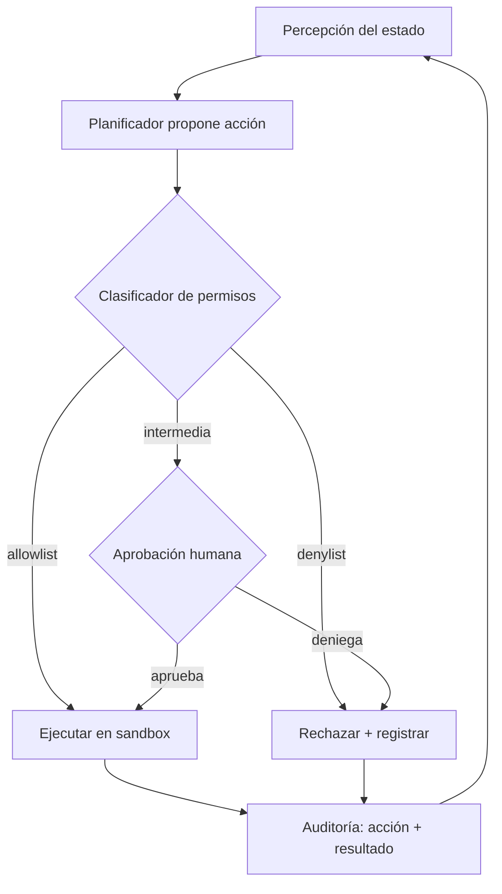

# 147 — Proyecto: agente que actúa con límites

> [← Clase anterior](../../../classes/part-11-embodied-ai-robotics-and-computer-use/146-automatizacion-de-escritorio-y-rpa-agentica/README.md) · [Índice de la parte](../README.md) · [Clase siguiente →](../../../classes/part-12-ai-engineering-mlops-llmops-and-agentops/148-ciclo-de-vida-de-datos-modelos-y-agentes/README.md)

**Parte:** 11 — IA encarnada, robótica y uso de computadores  
**Nivel:** experto · **Horas estimadas:** 10  
**Laboratorio:** `capstone` · **Estado:** `EXECUTABLE_CORE`

## 🎯 Propósito

Comprender **proyecto: agente que actúa con límites** dentro de la evolución de la inteligencia
artificial, implementar un experimento mínimo verificable y distinguir qué parte
constituye evidencia frente a una afirmación todavía no comprobada.

## 📚 Resultados de aprendizaje

Al finalizar podrás:

1. Explicar proyecto: agente que actúa con límites usando los conceptos `embodied`, `computer use`, `approval`, `evidence`.
2. Ejecutar el laboratorio con una semilla explícita y revisar su contrato JSON.
3. Identificar al menos un supuesto, una limitación y un riesgo de aplicación.
4. Comparar el enfoque con la etapa anterior de la ruta de aprendizaje.
5. Producir una evidencia reproducible y una conclusión que no exceda los datos.

## 🧩 Conceptos centrales

`embodied`, `computer use`, `approval`, `evidence`

## 🗺️ Ubicación en el mapa de la IA

Esta clase cierra la parte 11 integrando todo lo anterior: la arquitectura
percepción–planificación–acción (136), la incertidumbre sensorial (134-135), la
planificación de movimiento (139), el control (137-138), la transferencia
sim-to-real (142), la seguridad física (143) y el uso de computadores por visión
(141-143). El resultado es el patrón que hoy define a los agentes que actúan en
el mundo — robots colaborativos y agentes de computer use como los descritos en
la documentación de Anthropic — y que la parte 12 aprenderá a operar: un agente
solo es desplegable cuando sus acciones están **acotadas por permisos, sandbox y
aprobación humana**, no cuando su tasa de éxito es alta.

## 📖 Fundamentos

### 🧱 El problema: capacidad sin límites es riesgo, no valor

Un agente encarnado o de computer use ejecuta acciones con efectos en el mundo
(mover un brazo, hacer clic en «enviar», borrar un archivo). A diferencia de un
clasificador, su error no es una predicción incorrecta sino un **efecto
irreversible**. El proyecto formaliza cuatro capas de defensa que convierten un
agente capaz en un agente desplegable:

1. **Modelo de permisos (allowlist/denylist)**: cada acción se clasifica antes
   de ejecutarse. Una *allowlist* enumera lo permitido (leer pantalla, mover el
   cursor); una *denylist* enumera lo prohibido (transferir dinero, borrar
   permanentemente). Todo lo no clasificado cae en una categoría intermedia que
   requiere aprobación. El principio rector es **mínimo privilegio**: el agente
   recibe solo las capacidades que la tarea exige.
2. **Sandboxing**: el agente opera dentro de un entorno con límites duros
   impuestos desde fuera (contenedor, máquina virtual, workspace acotado del
   robot, límites de fuerza/velocidad de ISO/TS 15066). La diferencia clave con
   los permisos es el punto de aplicación: el permiso es una decisión del
   orquestador; el sandbox es una barrera que actúa **aunque el orquestador
   falle**.
3. **Aprobación humana (human-in-the-loop)**: las acciones irreversibles o de
   alto costo se pausan y se presentan a una persona con el contexto necesario
   para decidir. El criterio de diseño no es «pedir permiso para todo» (fatiga
   de aprobación) sino calibrar el umbral por **reversibilidad × costo del
   error**.
4. **Auditoría y evidencia**: cada acción, decisión de permiso y aprobación
   queda registrada con marca temporal. Sin traza no hay evaluación de
   seguridad posible.

### ⚙️ Mecanismo: el ciclo de decisión con compuertas

```text
percibir(estado) → proponer(accion) → clasificar(accion):
    si accion ∈ denylist:        rechazar y registrar
    si accion ∈ allowlist:       ejecutar en sandbox y registrar
    en otro caso:                pausar → pedir aprobación humana
                                  aprobada  → ejecutar en sandbox y registrar
                                  denegada  → registrar y replanificar
```

La propiedad importante es que la clasificación ocurre **antes** de la
ejecución y es independiente del modelo que propone la acción: un LLM o una
política aprendida pueden equivocarse al proponer; la compuerta determinista no
depende de que no se equivoquen.

### 📏 Evaluación de seguridad física y digital

La evaluación de un agente con límites mide dos familias de métricas:

- **Eficacia**: tasa de éxito de tarea, pasos hasta completar, costo.
- **Seguridad**: número de acciones bloqueadas por denylist (deben ser 0 si el
  planificador es correcto, >0 indica propuestas peligrosas), número de
  escaladas a humano, tasa de falsos positivos de escalada (fatiga), y — en lo
  físico — violaciones de límites de fuerza/velocidad según ISO/TS 15066.

Un agente que logra 95 % de éxito proponiendo acciones que la denylist tuvo que
bloquear **no es un agente seguro**: la última línea de defensa no debe ser la
única que trabaja (defensa en profundidad).

## 🧮 Ejemplo trabajado

Agente de escritorio que debe «organizar la carpeta de descargas». Traza de un
episodio con la política de compuertas:

| # | Acción propuesta | Clasificación | Decisión | Registro |
|---|---|---|---|---|
| 1 | `listar(descargas/)` | allowlist (lectura) | ejecuta | ok |
| 2 | `mover(a.pdf → docs/)` | allowlist (reversible) | ejecuta | ok |
| 3 | `eliminar_definitivo(tmp.zip)` | denylist (irreversible) | rechaza | ⚠️ propuesta peligrosa |
| 4 | `enviar_a_papelera(tmp.zip)` | intermedia (recuperable pero destructiva) | escala a humano | aprobada → ejecuta |
| 5 | `vaciar_papelera()` | denylist | rechaza | ⚠️ propuesta peligrosa |

Métricas del episodio: éxito de tarea = sí; acciones ejecutadas = 3;
bloqueos de denylist = 2; escaladas = 1 (aprobada). Conclusión honesta: la
tarea se completó, pero el planificador propuso 2 acciones prohibidas — antes
de relajar límites hay que corregir el planificador, no la denylist.

## 📊 Propiedades y comparación

| Mecanismo | Punto de aplicación | Protege contra | Costo | Falla si… |
|---|---|---|---|---|
| Allowlist/denylist | Orquestador, pre-ejecución | Acciones conocidas peligrosas | Bajo (lookup) | La acción peligrosa no está enumerada |
| Sandbox | Entorno, durante ejecución | Efectos fuera del ámbito | Medio (infraestructura) | El sandbox tiene escapes |
| Aprobación humana | Flujo, pre-ejecución | Casos ambiguos e irreversibles | Alto (latencia, fatiga) | El humano aprueba por hábito |
| Límites físicos (ISO/TS 15066) | Hardware/control | Daño a personas | Alto (diseño) | Se configuran mal fuerza/velocidad |



## ⚠️ Errores conceptuales frecuentes

1. **«Si el modelo es bueno, los límites sobran.»** Falso: los límites protegen
   contra la cola de la distribución de errores, que ningún benchmark de tasa
   de éxito media captura.
2. **«Sandbox y permisos son lo mismo.»** No: el permiso es una decisión del
   software orquestador; el sandbox es una barrera externa que funciona aunque
   el orquestador esté comprometido. Se necesitan ambos (defensa en
   profundidad).
3. **«Más aprobaciones humanas = más seguridad.»** Escalar todo produce fatiga
   de aprobación: el humano deja de leer y aprueba por hábito, y la capa se
   vuelve teatro de seguridad.
4. **«Un episodio exitoso valida el agente.»** La evaluación de seguridad exige
   mirar las acciones *propuestas y bloqueadas*, no solo el resultado final.
5. **«Lo digital no necesita el rigor de lo físico.»** Borrar datos, enviar
   correos o mover dinero son tan irreversibles como una colisión; cambia el
   medio, no la lógica de reversibilidad × costo.

## 🚀 Del aprendizaje a la operación

El laboratorio usa un mundo simulado con acciones simbólicas; un despliegue
real exige: inventario exhaustivo de acciones con su reversibilidad revisado
por seguridad; sandboxing real (contenedores, cuentas de mínimo privilegio,
límites físicos certificados); interfaz de aprobación con contexto suficiente y
métricas de fatiga; red-teaming contra inyección de instrucciones en el
contenido observado; y la operación continua (observabilidad, deriva, costos)
que es exactamente el tema de la parte 12.

## 🧪 Laboratorio

```bash
python lab.py
```

El laboratorio llama a `ai_evolution.labs.run_lab("capstone")`. Esta
decisión evita 183 implementaciones divergentes: cada clase tiene un entrypoint
propio, pero los motores didácticos se prueban como una biblioteca común.

### 🔍 Evidencia esperada

- tipo de laboratorio y semilla;
- entradas o decisiones observables;
- resultado estructurado;
- lista `evidence` con hechos que pueden inspeccionarse;
- lista `limitations` que impide presentar la demo como producción.

## 📓 Notebooks

- [📓 `notebook.ipynb`](notebook.ipynb): recorrido guiado con la materia resumida.
- [✍️ `notebook_student.ipynb`](notebook_student.ipynb): ejercicios para resolver.
- [✅ `notebook_solution.ipynb`](notebook_solution.ipynb): solución de referencia explicada.

## 📝 Evaluación

| Criterio | Peso |
|---|---:|
| Comprensión conceptual | 25 % |
| Ejecución reproducible | 25 % |
| Interpretación basada en evidencia | 25 % |
| Riesgos, límites y mejora propuesta | 25 % |

Consulta [assessment.md](assessment.md) para preguntas y criterio de aceptación.

## ⚠️ Errores comunes

| Síntoma | Causa probable | Corrección |
|---|---|---|
| El código corre, pero no hay conclusión | Se confundió ejecución con aprendizaje | Explica qué demuestra y qué no demuestra |
| El resultado cambia sin explicación | No se registró semilla o configuración | Conserva semilla, versión y parámetros |
| Se promete uso real | Se extrapoló desde una demo educativa | Declara entorno, datos, límites y revisión humana |
| Se copia una métrica aislada | No existe baseline ni costo de error | Añade comparación y criterio de decisión |

## ❓ Preguntas frecuentes

**¿Debo usar una API comercial?**  
No. El núcleo funciona localmente. Las extensiones LIVE se documentan por separado.

**¿El laboratorio representa una implementación industrial?**  
No por sí solo. Enseña el contrato y el patrón; producción exige integración,
seguridad, observabilidad, pruebas y operación.

**¿Dónde profundizo?**  
Revisa las especializaciones enlazadas en el README raíz y la ruta siguiente.

## 🔗 Referencias

- Thrun, Burgard y Fox — *Probabilistic Robotics* (MIT Press, 2005): fundamento de percepción y estado bajo incertidumbre. <https://mitpress.mit.edu/9780262201629/probabilistic-robotics/>
- LaValle — *Planning Algorithms* (Cambridge University Press, 2006), libro completo gratuito: <http://lavalle.pl/planning/>
- ISO/TS 15066:2016 — *Robots and robotic devices — Collaborative robots* (límites de fuerza y velocidad para colaboración humano-robot): <https://www.iso.org/standard/62996.html>
- Anthropic — guía de computer use (herramientas, sandboxing y precauciones): <https://docs.anthropic.com/en/docs/agents-and-tools/computer-use>
- NIST — *AI Risk Management Framework* (AI RMF 1.0, 2023): <https://www.nist.gov/itl/ai-risk-management-framework>
- Amodei et al. (2016) — *Concrete Problems in AI Safety*: <https://arxiv.org/abs/1606.06565>

---

## ⬅️ Clase anterior

[146 — Automatización de escritorio y RPA agéntica](../../part-11-embodied-ai-robotics-and-computer-use/146-automatizacion-de-escritorio-y-rpa-agentica/README.md)

## ➡️ Siguiente clase

[148 — Ciclo de vida de datos, modelos y agentes](../../part-12-ai-engineering-mlops-llmops-and-agentops/148-ciclo-de-vida-de-datos-modelos-y-agentes/README.md)
