# 🦾 Parte 11 — IA encarnada, robótica y uso de computadores

**Nivel:** experto · **Duración sugerida:** 5–6 semanas ·
**Clases:** 12

Lleva la toma de decisiones al mundo físico y a interfaces digitales, con sensores, control, simulación, navegación y acciones verificables.

## 🧭 Secuencia de la parte

```mermaid
flowchart LR
    L133["133<br/>Arquitectura percepción-planificación-acción"]
    L134["134<br/>Sensores, actuadores y<br/>fusión"]
    L135["135<br/>Localización, mapeo y<br/>SLAM"]
    L136["136<br/>Planificación de movimiento<br/>y navegación"]
    L137["137<br/>Control clásico y<br/>control aprendido"]
    L138["138<br/>Aprendizaje por imitación"]
    L139["139<br/>Simulación, sim-to-real y<br/>digital twins"]
    L140["140<br/>Robots colaborativos y<br/>seguridad física"]
    L141["141<br/>Computer use basado<br/>en visión"]
    L142["142<br/>Agentes de navegador"]
    L143["143<br/>Automatización de escritorio<br/>y RPA agéntica"]
    L144["144<br/>Proyecto: agente que<br/>actúa con límites"]
    L133 --> L134
    L134 --> L135
    L135 --> L136
    L136 --> L137
    L137 --> L138
    L138 --> L139
    L139 --> L140
    L140 --> L141
    L141 --> L142
    L142 --> L143
    L143 --> L144
```

## 📚 Clases

| ID | Tema | Laboratorio | Horas |
|---:|---|---|---:|
| 133 | [Arquitectura percepción-planificación-acción](133-arquitectura-percepcion-planificacion-accion/README.md) | `robotics` | 6 |
| 134 | [Sensores, actuadores y fusión](134-sensores-actuadores-y-fusion/README.md) | `robotics` | 6 |
| 135 | [Localización, mapeo y SLAM](135-localizacion-mapeo-y-slam/README.md) | `robotics` | 6 |
| 136 | [Planificación de movimiento y navegación](136-planificacion-de-movimiento-y-navegacion/README.md) | `search` | 6 |
| 137 | [Control clásico y control aprendido](137-control-clasico-y-control-aprendido/README.md) | `robotics` | 6 |
| 138 | [Aprendizaje por imitación](138-aprendizaje-por-imitacion/README.md) | `robotics` | 6 |
| 139 | [Simulación, sim-to-real y digital twins](139-simulacion-sim-to-real-y-digital-twins/README.md) | `robotics` | 6 |
| 140 | [Robots colaborativos y seguridad física](140-robots-colaborativos-y-seguridad-fisica/README.md) | `safety` | 6 |
| 141 | [Computer use basado en visión](141-computer-use-basado-en-vision/README.md) | `robotics` | 6 |
| 142 | [Agentes de navegador](142-agentes-de-navegador/README.md) | `agent` | 6 |
| 143 | [Automatización de escritorio y RPA agéntica](143-automatizacion-de-escritorio-y-rpa-agentica/README.md) | `workflow` | 6 |
| 144 | [Proyecto: agente que actúa con límites](144-proyecto-agente-que-actua-con-limites/README.md) | `capstone` | 10 |

## 📝 Evaluación de la parte

- 40 % laboratorios y notebooks.
- 25 % explicaciones y comparación de enfoques.
- 20 % evaluación de riesgos y limitaciones.
- 15 % mini-proyecto o integración.

[⬅️ Parte 10 — Sistemas multiagente e interoperabilidad](../part-10-multi-agent-systems-and-interoperability/README.md) · [🏠 Volver al programa](../../README.md) · [➡️ Parte 12 — Ingeniería de IA, MLOps, LLMOps y AgentOps](../part-12-ai-engineering-mlops-llmops-and-agentops/README.md)
