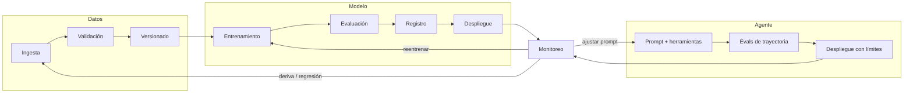

# 148 — Ciclo de vida de datos, modelos y agentes

> [← Clase anterior](../../../classes/part-11-embodied-ai-robotics-and-computer-use/147-proyecto-agente-que-actua-con-limites/README.md) · [Índice de la parte](../README.md) · [Clase siguiente →](../../../classes/part-12-ai-engineering-mlops-llmops-and-agentops/149-experimentos-semillas-y-trazabilidad/README.md)

**Parte:** 12 — Ingeniería de IA, MLOps, LLMOps y AgentOps  
**Nivel:** experto · **Horas estimadas:** 6  
**Laboratorio:** `workflow` · **Estado:** `EXECUTABLE_CORE`

## 🎯 Propósito

Comprender **ciclo de vida de datos, modelos y agentes** dentro de la evolución de la inteligencia
artificial, implementar un experimento mínimo verificable y distinguir qué parte
constituye evidencia frente a una afirmación todavía no comprobada.

## 📚 Resultados de aprendizaje

Al finalizar podrás:

1. Explicar ciclo de vida de datos, modelos y agentes usando los conceptos `lifecycle`, `data`, `model`, `agent`.
2. Ejecutar el laboratorio con una semilla explícita y revisar su contrato JSON.
3. Identificar al menos un supuesto, una limitación y un riesgo de aplicación.
4. Comparar el enfoque con la etapa anterior de la ruta de aprendizaje.
5. Producir una evidencia reproducible y una conclusión que no exceda los datos.

## 🧩 Conceptos centrales

`lifecycle`, `data`, `model`, `agent`

## 🗺️ Ubicación en el mapa de la IA

Hasta la parte 11 construiste modelos y agentes como artefactos aislados; esta parte los
convierte en **sistemas operados**. El ciclo de vida es el mapa base de todo MLOps: Sculley
et al. (2015) mostraron que el código de ML es una fracción pequeña de un sistema real, y que
la deuda técnica vive en los bordes — datos, configuración, serving, monitoreo. Esta clase
define los tres ciclos (datos, modelos, agentes) que las once clases siguientes
instrumentan, prueban, sirven, observan y recuperan.

## 📖 Fundamentos

### 🔄 Tres ciclos, no uno

Un sistema de IA en operación encadena **tres ciclos de vida** con ritmos y artefactos
distintos:

1. **Ciclo de datos** — ingesta → validación → transformación → versionado → catálogo →
   expiración. Su artefacto es el *dataset versionado* (con esquema, estadísticas y hash).
   Cambia al ritmo del mundo: cada hora o cada día.
2. **Ciclo de modelos** — experimentación → entrenamiento → evaluación → registro →
   promoción → despliegue → monitoreo → reentrenamiento o retiro. Su artefacto es el
   *modelo registrado* (pesos + código + entorno + métricas). Cambia por decisión: días o
   semanas.
3. **Ciclo de agentes** — diseño de herramientas y prompts → evaluación de trayectorias →
   despliegue con límites → observación de intervenciones → ajuste de política. Su
   artefacto es la *configuración del agente* (prompt del sistema, herramientas,
   presupuestos, modelo base). Cambia con cada ajuste de prompt o herramienta: horas o días.

La diferencia clave: en software clásico el comportamiento lo define el **código**; en ML
lo define **código + datos**; en agentes lo define **código + datos + modelo base +
prompt + entorno de herramientas**. Cada término adicional es una fuente de cambio no
controlado que el ciclo debe versionar y vigilar.

### 🧱 Etapas y artefactos con contrato

Cada transición entre etapas debe producir un artefacto **identificable y reproducible**:

```text
etapa            artefacto                    identidad mínima
---------------  ---------------------------  --------------------------------
ingesta          dataset crudo                fuente + fecha + hash contenido
validación       reporte de esquema           versión de reglas + resultado
entrenamiento    modelo candidato             dataset_id + código (commit) + semilla + hiperparámetros
evaluación       reporte de métricas          modelo_id + dataset_eval_id + métricas
registro         modelo versionado (v N)      todo lo anterior + firma de entrada/salida
despliegue       endpoint / job               modelo_id + configuración de serving
monitoreo        métricas de operación        ventana temporal + versión desplegada
```

Si no puedes responder «¿con qué datos, código y semilla se produjo este artefacto?»,
el ciclo está roto en ese punto: es el problema de **linaje** (lineage) que la clase 149
trata en detalle.

### ⚖️ Deuda técnica oculta (Sculley et al., 2015)

El paper canónico identifica deudas específicas de ML que motivan todo el ciclo:

- **Erosión de fronteras**: los modelos entrelazan señales (CACE: *Changing Anything
  Changes Everything*); no hay modularidad real entre features.
- **Dependencias de datos** más costosas que las de código: señales inestables,
  features legadas, cascadas de correcciones.
- **Bucles de retroalimentación**: el modelo influye en los datos futuros que lo
  reentrenan (directos e indirectos).
- **Antipatrones**: código pegamento, junglas de pipelines, configuración gigante sin
  pruebas.

La consecuencia operativa: el mantenimiento de un sistema de ML se parece más a operar
una refinería (flujos, válvulas, sensores) que a mantener una biblioteca de funciones.

### 🤖 Qué añade el ciclo de agentes

Un agente añade tres fuentes de no determinismo que el ciclo debe encerrar: el **modelo
base** (puede cambiar por versión del proveedor), el **entorno de herramientas** (una API
externa cambia su respuesta) y la **trayectoria** (número variable de pasos). Por eso
AgentOps (clase 156) versiona prompts y herramientas igual que MLOps versiona datasets y
pesos, y añade métricas propias: tasa de éxito de tarea, pasos por tarea, costo por
tarea e intervenciones humanas.

## 🧮 Ejemplo trabajado

Un equipo opera un clasificador de churn. Reconstruyamos el linaje de un incidente:
el lunes las predicciones se degradan. La tabla de artefactos dice:

```text
artefacto          id / versión   producido con
dataset_train      ds-2025-12     ventana 2025-06→2025-11, hash 9f3a…
modelo             churn-v7       ds-2025-12 + commit a1b2c3 + seed 42, AUC 0.83
endpoint           prod           churn-v7 desde 2026-01-10
dataset_scoring    (diario)       hash del lunes: 77e1… — esquema OK
```

Diagnóstico por ciclos, en orden de velocidad de cambio:

1. **¿Ciclo de datos?** El esquema valida, pero la media de la feature `visitas_30d`
   pasó de 11.2 (entrenamiento) a 4.1 (lunes). Los datos del lunes provienen de una
   app que cambió su tracking el viernes. → deriva de datos (clase 154).
2. **¿Ciclo de modelo?** `churn-v7` no cambió (mismo id). Descartado como causa raíz.
3. **¿Ciclo de agente?** No aplica: no hay agente en este sistema.

Conclusión: la causa vive en el ciclo de datos; la corrección es reparar el tracking o
reentrenar con la nueva distribución — y el hallazgo fue posible porque cada artefacto
tenía identidad. Sin los hashes y las estadísticas de `ds-2025-12`, solo habría
«el modelo anda mal», sin causa accionable.

## 📊 Propiedades y comparación

| Dimensión | Ciclo de datos | Ciclo de modelos | Ciclo de agentes |
|---|---|---|---|
| Artefacto central | dataset versionado | modelo registrado | configuración (prompt + herramientas) |
| Ritmo de cambio | continuo (horas/días) | por decisión (días/semanas) | por ajuste (horas/días) |
| Fuente de fallo típica | deriva, esquema roto | sobreajuste, staleness | herramienta rota, prompt regresivo |
| Prueba clave | validación de esquema/estadísticas | evaluación vs. baseline | evals de trayectoria |
| Rollback | re-apuntar a versión anterior | re-desplegar versión N−1 | restaurar prompt/config anterior |
| Quién dispara el cambio | el mundo | el equipo | el equipo y el proveedor del modelo |



## ⚠️ Errores conceptuales frecuentes

1. **«MLOps = DevOps aplicado a modelos.»** DevOps versiona código; MLOps debe versionar
   además datos, features, modelos y configuración, y probar el comportamiento
   estadístico, no solo el funcional.
2. **«El ciclo termina en el despliegue.»** El despliegue es la mitad del ciclo: sin
   monitoreo y política de reentrenamiento/retiro, el modelo se degrada en silencio.
3. **«Un agente se opera igual que un modelo.»** El agente depende de un modelo base que
   puede cambiar sin tu intervención y de herramientas externas; su superficie de cambio
   es mayor y sus métricas (éxito de tarea, pasos, intervenciones) son distintas.
4. **«Versionar el código basta para reproducir.»** Sin el dataset exacto, la semilla y
   el entorno, el mismo commit produce otro modelo (clase 149).
5. **«La deuda técnica de ML se paga refactorizando código.»** Sculley et al. muestran
   que la mayor parte vive en dependencias de datos y configuración, invisibles al
   refactor clásico.

## 🚀 Del aprendizaje a la operación

El laboratorio simula un flujo con etapas y artefactos deterministas; una plataforma real
añade orquestadores (Airflow, Kubeflow), stores de features, registro de modelos (MLflow),
catálogos de datos con control de acceso, y acuerdos de nivel de servicio por etapa.
La brecha principal no es técnica sino organizativa: definir quién es dueño de cada ciclo,
quién aprueba una promoción y quién responde cuando el monitoreo dispara una alerta.

## 🧪 Laboratorio

```bash
python lab.py
```

El laboratorio llama a `ai_evolution.labs.run_lab("workflow")`. Esta
decisión evita 183 implementaciones divergentes: cada clase tiene un entrypoint
propio, pero los motores didácticos se prueban como una biblioteca común.

### 🔍 Evidencia esperada

- tipo de laboratorio y semilla;
- entradas o decisiones observables;
- resultado estructurado;
- lista `evidence` con hechos que pueden inspeccionarse;
- lista `limitations` que impide presentar la demo como producción.

## 📓 Notebooks

- [📓 `notebook.ipynb`](notebook.ipynb): recorrido guiado con la materia resumida.
- [✍️ `notebook_student.ipynb`](notebook_student.ipynb): ejercicios para resolver.
- [✅ `notebook_solution.ipynb`](notebook_solution.ipynb): solución de referencia explicada.

## 📝 Evaluación

| Criterio | Peso |
|---|---:|
| Comprensión conceptual | 25 % |
| Ejecución reproducible | 25 % |
| Interpretación basada en evidencia | 25 % |
| Riesgos, límites y mejora propuesta | 25 % |

Consulta [assessment.md](assessment.md) para preguntas y criterio de aceptación.

## ⚠️ Errores comunes

| Síntoma | Causa probable | Corrección |
|---|---|---|
| El código corre, pero no hay conclusión | Se confundió ejecución con aprendizaje | Explica qué demuestra y qué no demuestra |
| El resultado cambia sin explicación | No se registró semilla o configuración | Conserva semilla, versión y parámetros |
| Se promete uso real | Se extrapoló desde una demo educativa | Declara entorno, datos, límites y revisión humana |
| Se copia una métrica aislada | No existe baseline ni costo de error | Añade comparación y criterio de decisión |

## ❓ Preguntas frecuentes

**¿Debo usar una API comercial?**  
No. El núcleo funciona localmente. Las extensiones LIVE se documentan por separado.

**¿El laboratorio representa una implementación industrial?**  
No por sí solo. Enseña el contrato y el patrón; producción exige integración,
seguridad, observabilidad, pruebas y operación.

**¿Dónde profundizo?**  
Revisa las especializaciones enlazadas en el README raíz y la ruta siguiente.

## 🔗 Referencias

- [Sculley et al. (2015), "Hidden Technical Debt in Machine Learning Systems", NeurIPS](https://papers.nips.cc/paper/2015/hash/86df7dcfd896fcaf2674f757a2463eba-Abstract.html) — uso: referencia consultada en su fuente original
- [Google Cloud, "MLOps: Continuous delivery and automation pipelines in machine learning"](https://cloud.google.com/architecture/mlops-continuous-delivery-and-automation-pipelines-in-machine-learning) — uso: referencia consultada en su fuente original
- [Google, "Rules of Machine Learning" (Martin Zinkevich)](https://developers.google.com/machine-learning/guides/rules-of-ml) — uso: referencia consultada en su fuente original
- [Paleyes, Urma & Lawrence (2022), "Challenges in Deploying Machine Learning", ACM Computing Surveys (arXiv:2011.09926)](https://arxiv.org/abs/2011.09926) — uso: fuente primaria del mecanismo estudiado
- [MLflow Documentation](https://mlflow.org/docs/latest/) — uso: referencia consultada en su fuente original
- [Huyen, *Designing Machine Learning Systems* (O'Reilly, 2022)](https://www.oreilly.com/library/view/designing-machine-learning/9781098107956/) — uso: referencia consultada en su fuente original

<!-- papers:inicio -->

---

## 📜 Papers que fundamentan esta clase

> Bloque generado por `python scripts/link_papers_to_classes.py`. La fuente es [`papers/catalog/papers.json`](../../../papers/catalog/papers.json).

| Paper | Año | Qué desbloqueó | Miniatura |
|---|---:|---|---|
| [P111 · Deuda técnica oculta en los sistemas de aprendizaje automático](../../../papers/foundational/P111_deuda_tecnica/README.md) | 2015 | Nombra el hecho incómodo del área: el código del modelo es una fracción diminuta del sistema, y el resto acumula una deuda que ninguna herramienta detecta. | [notebook](../../../notebooks/papers/P111_deuda_tecnica.ipynb) |
| [P115 · Hojas de datos para conjuntos de datos](../../../papers/foundational/P115_hojas_de_datos/README.md) | 2021 | Traslada a los conjuntos de datos la hoja de características que acompaña a cualquier componente electrónico: qué es, cómo se hizo y para qué no sirve. | [notebook](../../../notebooks/papers/P115_hojas_de_datos.ipynb) |

Cada ficha explica el problema anterior, la matemática mínima, los límites y los errores de atribución más frecuentes. Para leerlas con método: [cómo leer un paper de IA](../../../papers/guides/COMO_LEER_UN_PAPER_DE_IA.md) · [anexos matemáticos](../../../papers/annexes/README.md).
<!-- papers:fin -->
---

## ⬅️ Clase anterior

[147 — Proyecto: agente que actúa con límites](../../part-11-embodied-ai-robotics-and-computer-use/147-proyecto-agente-que-actua-con-limites/README.md)

## ➡️ Siguiente clase

[149 — Experimentos, semillas y trazabilidad](../../part-12-ai-engineering-mlops-llmops-and-agentops/149-experimentos-semillas-y-trazabilidad/README.md)
