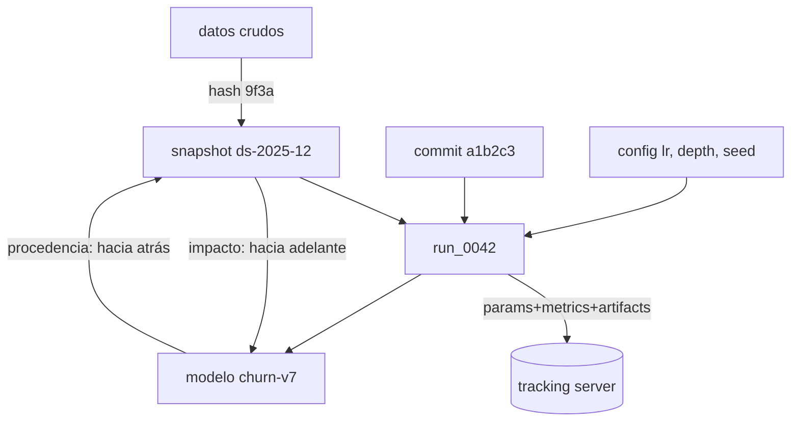

# 149 — Experimentos, semillas y trazabilidad

> [← Clase anterior](../../../classes/part-12-ai-engineering-mlops-llmops-and-agentops/148-ciclo-de-vida-de-datos-modelos-y-agentes/README.md) · [Índice de la parte](../README.md) · [Clase siguiente →](../../../classes/part-12-ai-engineering-mlops-llmops-and-agentops/150-registro-y-promocion-champion-challenger/README.md)

**Parte:** 12 — Ingeniería de IA, MLOps, LLMOps y AgentOps  
**Nivel:** experto · **Horas estimadas:** 6  
**Laboratorio:** `observability` · **Estado:** `EXECUTABLE_CORE`

## 🎯 Propósito

Comprender **experimentos, semillas y trazabilidad** dentro de la evolución de la inteligencia
artificial, implementar un experimento mínimo verificable y distinguir qué parte
constituye evidencia frente a una afirmación todavía no comprobada.

## 📚 Resultados de aprendizaje

Al finalizar podrás:

1. Explicar experimentos, semillas y trazabilidad usando los conceptos `experiments`, `seeds`, `lineage`, `artifacts`.
2. Ejecutar el laboratorio con una semilla explícita y revisar su contrato JSON.
3. Identificar al menos un supuesto, una limitación y un riesgo de aplicación.
4. Comparar el enfoque con la etapa anterior de la ruta de aprendizaje.
5. Producir una evidencia reproducible y una conclusión que no exceda los datos.

## 🧩 Conceptos centrales

`experiments`, `seeds`, `lineage`, `artifacts`

## 🗺️ Ubicación en el mapa de la IA

La ciencia experimental exige que un resultado sea reproducible; el ML industrial lo exige
dos veces: para creer una métrica y para depurar producción. Esta clase toma el ciclo de
vida de la clase 148 y lo hace **auditable**: tracking de experimentos, semillas, linaje de
artefactos. Es el prerequisito del registro champion-challenger (150) y del CI/CD (151):
no se puede promover ni probar lo que no se puede reproducir.

## 📖 Fundamentos

### 🎲 Fuentes de no determinismo

Un entrenamiento «igual» puede producir modelos distintos por:

1. **Semillas no fijadas**: inicialización de pesos, shuffling de batches, dropout,
   muestreo de negativos.
2. **Paralelismo**: reducciones en punto flotante no asociativas (`(a+b)+c ≠ a+(b+c)`
   en float32); kernels no deterministas de GPU (p. ej. atomics en cuDNN).
3. **Entorno**: versiones de librerías, drivers, hardware distinto.
4. **Datos**: el «mismo» dataset leído de una tabla viva que cambió entre corridas.

Fijar la semilla controla (1); (2) exige flags de determinismo (con costo de velocidad);
(3) exige congelar el entorno (lockfiles, contenedores); (4) exige **snapshots
versionados**. La reproducibilidad práctica se declara por niveles: *repetible* (misma
máquina, mismos bits), *reproducible* (otro entorno, misma conclusión estadística),
*replicable* (otros datos del mismo dominio, mismo hallazgo).

### 📋 Tracking de experimentos

Un experimento es una función `f(código, datos, configuración, azar) → métricas +
artefactos`. El tracking registra **todas** las entradas y salidas para poder comparar y
reproducir. El modelo mental de MLflow (equivalente en W&B o Neptune):

```text
experimento  (agrupador: "churn-2026")
 └── run     (una ejecución)
      ├── params    : lr=0.05, depth=6, seed=42, dataset=ds-2025-12
      ├── metrics   : auc=0.831, logloss=0.412   (con historia por paso)
      ├── tags      : git_commit=a1b2c3, autor, propósito
      └── artifacts : modelo serializado, curvas, reporte de evaluación
```

Regla práctica: los `params` deben bastar para **relanzar** el run; las `metrics` deben
bastar para **decidir** entre runs; los `artifacts` deben bastar para **desplegar** sin
reentrenar.

### 🧬 Linaje (lineage)

El linaje responde «¿de qué proviene este artefacto?» como un grafo dirigido acíclico:

```text
datos_crudos ──▶ ds-2025-12 ──▶ features_v3 ──▶ run_0042 ──▶ churn-v7
                    ▲                               ▲
              reglas_valid v2                 commit a1b2c3 + seed 42
```

Cada nodo lleva una identidad estable — un **hash de contenido** (p. ej. SHA-256 del
fichero o de las estadísticas del dataset) — y cada arista, la operación que lo produjo.
Con esto, dos preguntas se vuelven consultas: *impacto* («si cambia `features_v3`, ¿qué
modelos quedan obsoletos?», aristas hacia adelante) y *procedencia* («¿qué datos vio
`churn-v7`?», aristas hacia atrás).

### 🔁 Protocolo mínimo de experimento honesto

1. Fija y registra la semilla **antes** de mirar resultados.
2. Congela el snapshot de datos y registra su hash.
3. Registra commit de código y entorno (versiones exactas).
4. Corre con ≥ 3 semillas si vas a comparar métodos: reporta media ± desviación, no el
   mejor run (eso es *seed picking*, una forma de sobreajuste al azar).
5. Decide el criterio de comparación antes de correr (métrica, dataset de evaluación,
   umbral de mejora mínima).

## 🧮 Ejemplo trabajado

Comparamos dos configuraciones de un clasificador con 3 semillas cada una (AUC en
validación):

```text
config A (lr=0.10): seeds 1,2,3 → 0.812, 0.804, 0.808   media 0.808  desv ≈ 0.004
config B (lr=0.05): seeds 1,2,3 → 0.815, 0.799, 0.802   media 0.805  desv ≈ 0.009
```

Lectura incorrecta: «B gana porque su mejor run (0.815) supera todo lo de A».
Lectura correcta: la media de A (0.808) supera la de B (0.805), y la diferencia
(0.003) es **menor que la variación entre semillas de B** (±0.009): con 3 semillas no
hay evidencia para preferir ninguna; el «0.815» es ruido de semilla. Decisión honesta:
o más semillas, o declarar empate y elegir por otro criterio (costo, simplicidad).
Registro mínimo del run ganador si se promoviera A:

```text
params : lr=0.10, seed={1,2,3}, dataset=ds-2025-12 (hash 9f3a…), commit a1b2c3
metrics: auc_media=0.808, auc_desv=0.004
```

## 📊 Propiedades y comparación

| Práctica | Qué garantiza | Qué NO garantiza | Costo |
|---|---|---|---|
| Fijar semilla | repetibilidad del azar propio | determinismo de GPU/paralelismo | nulo |
| Flags deterministas | mismos bits en mismo hardware | velocidad (puede caer 10-30 %) | medio |
| Snapshot + hash de datos | mismas entradas | que los datos sean correctos | almacenamiento |
| Lockfile/contenedor | mismo entorno | mismo hardware numérico | mantenimiento |
| Multi-semilla + media±desv | conclusión robusta al azar | significancia con n=3 | 3-5× cómputo |
| Tracking (MLflow) | comparabilidad y auditoría | que registres lo importante | disciplina |



## ⚠️ Errores conceptuales frecuentes

1. **«Fijé la semilla, luego es reproducible.»** La semilla no controla paralelismo,
   versiones de librerías ni datos vivos; es necesaria, no suficiente.
2. **«Reporto mi mejor run.»** Elegir la mejor semilla infla la métrica; lo comparable
   es media ± desviación sobre semillas preestablecidas.
3. **«El linaje es el historial de git.»** Git versiona código; el linaje une código con
   datos, configuración y artefactos. Un commit sin hash de dataset no reproduce nada.
4. **«Tracking = guardar métricas.»** Sin params, commit, entorno y artefactos, las
   métricas son incomparables e irreproducibles: números huérfanos.
5. **«Determinismo bit a bit siempre.»** A veces basta reproducibilidad estadística
   (misma conclusión); exigir bits idénticos en GPU puede costar rendimiento sin
   cambiar ninguna decisión.

## 🚀 Del aprendizaje a la operación

El laboratorio registra un flujo determinista con semilla explícita; una plataforma real
añade un tracking server multiusuario (MLflow, W&B), versionado de datos a escala (DVC,
lakeFS, Delta), convenciones de nombres obligatorias y retención de artefactos con costo
de almacenamiento real. La disciplina que no se automatiza se pierde: los campos que el
pipeline no registra automáticamente acaban vacíos, por eso el tracking se integra en el
código de entrenamiento, no en la memoria del equipo.

## 🧪 Laboratorio

```bash
python lab.py
```

El laboratorio llama a `ai_evolution.labs.run_lab("observability")`. Esta
decisión evita 183 implementaciones divergentes: cada clase tiene un entrypoint
propio, pero los motores didácticos se prueban como una biblioteca común.

### 🔍 Evidencia esperada

- tipo de laboratorio y semilla;
- entradas o decisiones observables;
- resultado estructurado;
- lista `evidence` con hechos que pueden inspeccionarse;
- lista `limitations` que impide presentar la demo como producción.

## 📓 Notebooks

- [📓 `notebook.ipynb`](notebook.ipynb): recorrido guiado con la materia resumida.
- [✍️ `notebook_student.ipynb`](notebook_student.ipynb): ejercicios para resolver.
- [✅ `notebook_solution.ipynb`](notebook_solution.ipynb): solución de referencia explicada.

## 📝 Evaluación

| Criterio | Peso |
|---|---:|
| Comprensión conceptual | 25 % |
| Ejecución reproducible | 25 % |
| Interpretación basada en evidencia | 25 % |
| Riesgos, límites y mejora propuesta | 25 % |

Consulta [assessment.md](assessment.md) para preguntas y criterio de aceptación.

## ⚠️ Errores comunes

| Síntoma | Causa probable | Corrección |
|---|---|---|
| El código corre, pero no hay conclusión | Se confundió ejecución con aprendizaje | Explica qué demuestra y qué no demuestra |
| El resultado cambia sin explicación | No se registró semilla o configuración | Conserva semilla, versión y parámetros |
| Se promete uso real | Se extrapoló desde una demo educativa | Declara entorno, datos, límites y revisión humana |
| Se copia una métrica aislada | No existe baseline ni costo de error | Añade comparación y criterio de decisión |

## ❓ Preguntas frecuentes

**¿Debo usar una API comercial?**  
No. El núcleo funciona localmente. Las extensiones LIVE se documentan por separado.

**¿El laboratorio representa una implementación industrial?**  
No por sí solo. Enseña el contrato y el patrón; producción exige integración,
seguridad, observabilidad, pruebas y operación.

**¿Dónde profundizo?**  
Revisa las especializaciones enlazadas en el README raíz y la ruta siguiente.

## 🔗 Referencias

- [MLflow Documentation — Tracking y conceptos](https://mlflow.org/docs/latest/) — uso: referencia consultada en su fuente original
- [Pineau et al. (2021), "Improving Reproducibility in Machine Learning Research", JMLR (arXiv:2003.12206)](https://arxiv.org/abs/2003.12206) — uso: fuente primaria del mecanismo estudiado
- [Google, "Rules of Machine Learning" — reglas sobre pipelines y métricas](https://developers.google.com/machine-learning/guides/rules-of-ml) — uso: referencia consultada en su fuente original
- [DVC Documentation — versionado de datos](https://dvc.org/doc) — uso: referencia consultada en su fuente original
- [Sculley et al. (2015), "Hidden Technical Debt in Machine Learning Systems", NeurIPS](https://papers.nips.cc/paper/2015/hash/86df7dcfd896fcaf2674f757a2463eba-Abstract.html) — uso: referencia consultada en su fuente original
- [PyTorch — Reproducibility notes](https://pytorch.org/docs/stable/notes/randomness.html) — uso: referencia consultada en su fuente original

<!-- papers:inicio -->

---

## 📜 Papers que fundamentan esta clase

> Bloque generado por `python scripts/link_papers_to_classes.py`. La fuente es [`papers/catalog/papers.json`](../../../papers/catalog/papers.json).

| Paper | Año | Qué desbloqueó | Miniatura |
|---|---:|---|---|
| [P113 · Aprendizaje por refuerzo profundo que importa](../../../papers/foundational/P113_trazabilidad/README.md) | 2018 | Demuestra empíricamente que con pocas semillas el ranking entre algoritmos es una moneda al aire, y que muchas mejoras publicadas no sobreviven a la comprobación. | [notebook](../../../notebooks/papers/P113_trazabilidad.ipynb) |

Cada ficha explica el problema anterior, la matemática mínima, los límites y los errores de atribución más frecuentes. Para leerlas con método: [cómo leer un paper de IA](../../../papers/guides/COMO_LEER_UN_PAPER_DE_IA.md) · [anexos matemáticos](../../../papers/annexes/README.md).
<!-- papers:fin -->
<!-- bibliografia:inicio -->

---

## 📚 Bibliografía de apoyo

> Bloque generado por `python scripts/link_sources_to_classes.py`. Cada obra lleva su localizador verificado en [`sources/bibliography.json`](../../../sources/bibliography.json).

Los papers dicen **de dónde salió** el mecanismo. Estas obras lo **desarrollan** con el espacio que una clase no tiene: teoría completa, demostraciones y ejercicios.

| Obra | Edición | Localizador | Papel en esta clase |
|---|---|---|---|
| Huyen, Chip — *Designing Machine Learning Systems* | 2022 | [ISBN 9781098107956](https://openlibrary.org/isbn/9781098107956) · [web de la obra](https://www.oreilly.com/library/view/designing-machine-learning/9781098107956/) · _pendiente de confirmar en su catálogo_ | obra de referencia de la parte 12 · toda la parte |
<!-- bibliografia:fin -->

---

## ⬅️ Clase anterior

[148 — Ciclo de vida de datos, modelos y agentes](../../part-12-ai-engineering-mlops-llmops-and-agentops/148-ciclo-de-vida-de-datos-modelos-y-agentes/README.md)

## ➡️ Siguiente clase

[150 — Registro y promoción champion-challenger](../../part-12-ai-engineering-mlops-llmops-and-agentops/150-registro-y-promocion-champion-challenger/README.md)
