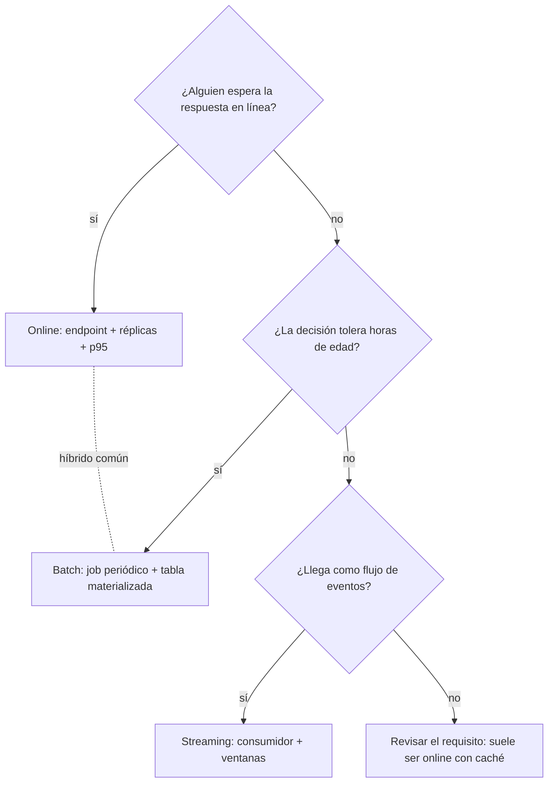

# 149 — Serving online, batch y streaming

> [← Clase anterior](../../../classes/part-12-ai-engineering-mlops-llmops-and-agentops/148-ci-cd-y-pruebas-para-sistemas-de-ia/README.md) · [Índice de la parte](../README.md) · [Clase siguiente →](../../../classes/part-12-ai-engineering-mlops-llmops-and-agentops/150-observabilidad-logs-metricas-y-trazas/README.md)

**Parte:** 12 — Ingeniería de IA, MLOps, LLMOps y AgentOps  
**Nivel:** experto · **Horas estimadas:** 6  
**Laboratorio:** `observability` · **Estado:** `EXECUTABLE_CORE`

## 🎯 Propósito

Comprender **serving online, batch y streaming** dentro de la evolución de la inteligencia
artificial, implementar un experimento mínimo verificable y distinguir qué parte
constituye evidencia frente a una afirmación todavía no comprobada.

## 📚 Resultados de aprendizaje

Al finalizar podrás:

1. Explicar serving online, batch y streaming usando los conceptos `serving`, `batch`, `streaming`, `API`.
2. Ejecutar el laboratorio con una semilla explícita y revisar su contrato JSON.
3. Identificar al menos un supuesto, una limitación y un riesgo de aplicación.
4. Comparar el enfoque con la etapa anterior de la ruta de aprendizaje.
5. Producir una evidencia reproducible y una conclusión que no exceda los datos.

## 🧩 Conceptos centrales

`serving`, `batch`, `streaming`, `API`

## 🗺️ Ubicación en el mapa de la IA

Un modelo registrado y probado (clases 147-148) todavía no sirve a nadie: falta decidir
**cómo llega la predicción al consumidor**. Online, batch y streaming son los tres
patrones de serving que gobiernan latencia, costo y frescura, y condicionan todo lo que
sigue: qué se puede observar (150), qué deriva se detecta y cuándo (151) y cuánto cuesta
operar (154). Elegir mal aquí es caro de revertir: cambia la arquitectura completa.

## 📖 Fundamentos

### ⚡ Online (síncrono, por petición)

El consumidor llama a un endpoint (REST/gRPC) y **espera** la respuesta.

- Optimiza **latencia**: el presupuesto se mide en percentiles (p50/p95/p99), no en
  promedio — el promedio esconde la cola, y la cola es lo que ve el usuario que espera
  (Dean & Barroso, *The Tail at Scale*).
- Exige features disponibles en milisegundos (feature store online, cachés).
- Escala con réplicas + balanceador; el costo corre aunque no haya tráfico (capacidad
  reservada) o paga arranques en frío (serverless).
- Para LLMs se añade una métrica propia: **TTFT** (time to first token) con streaming de
  tokens, que mejora la latencia percibida sin cambiar el throughput.

### 📦 Batch (asíncrono, por lote)

Un job periódico puntúa un conjunto grande y **materializa** los resultados (tabla,
fichero) que el consumidor lee después.

- Optimiza **throughput y costo por predicción**: sin restricción de latencia por ítem,
  se usan lotes grandes, hardware spot y horarios valle.
- La **frescura** queda acotada por la periodicidad: un score diario tiene hasta 24 h de
  edad. Si la decisión tolera esa edad, batch es casi siempre lo más barato y simple.
- Fallo benigno: el job se relanza; nadie espera en línea.

### 🌊 Streaming (asíncrono, por evento)

El modelo consume un flujo de eventos (Kafka/PubSub) y emite predicciones o features al
paso de los datos.

- Optimiza **frescura sin petición**: reacciona a eventos (fraude en la transacción,
  features "últimos 10 minutos") con latencias de sub-segundo a segundos.
- Coste de complejidad alto: exactly-once vs. at-least-once, ventanas, reprocesamiento,
  estado distribuido.
- Patrón híbrido común: features en streaming + inferencia online (el endpoint lee
  features frescas precalculadas).

### 📐 Latencia vs. throughput

Son objetivos en tensión: agrupar peticiones en lotes (batching dinámico) sube el
throughput de la GPU pero añade espera a cada petición individual. La relación de
Little (`concurrencia = tasa × latencia`) da el esqueleto del cálculo de capacidad:

```text
throughput_max ≈ (réplicas × lote) / latencia_por_lote
p. ej. 4 réplicas, lote 8, 100 ms/lote → ≈ 320 peticiones/s
```

La decisión de patrón se reduce a tres preguntas: **¿quién espera?** (usuario en línea →
online), **¿qué edad de predicción tolera la decisión?** (horas → batch), **¿la señal es
un evento que debe reaccionar solo?** (→ streaming).

## 🧮 Ejemplo trabajado

Sistema de recomendaciones de un e-commerce con 2 M de usuarios, de los cuales ~80 000
visitan al día. Comparamos servir el top-N con batch diario vs. online:

```text
batch diario (todos los usuarios):
  2 000 000 usuarios × 1 scoring = 2.0 M predicciones/día
  utilidad: solo 80 000 se usan → 4 % de las predicciones se consumen
  frescura: hasta 24 h de edad; no reacciona a la sesión actual

online (solo visitantes):
  80 000 visitas × ~5 páginas = 400 000 predicciones/día  (5× menos cómputo útil total)
  pico: 80 000×5 / (8 h × 3600 s) ≈ 14 rps promedio; pico ~10× ≈ 140 rps
  con p95 requerido de 80 ms y ~50 rps por réplica → 3 réplicas + margen
  frescura: usa el carrito y los clics de la sesión actual
```

Decisión razonable: **híbrido** — candidatos pesados precalculados en batch (embeddings,
top-500 por usuario, donde el 96 % de desperdicio es aceptable porque el costo unitario
es bajo) y re-ranking online ligero con la señal de sesión. El ejemplo muestra el
criterio general: batch para lo costoso y tolerante a edad, online para lo barato y
sensible al contexto inmediato.

## 📊 Propiedades y comparación

| Dimensión | Online | Batch | Streaming |
|---|---|---|---|
| Quién espera | el usuario (síncrono) | nadie (materializado) | nadie (reactivo) |
| Métrica reina | latencia p95/p99 | costo por predicción y ventana de job | lag del consumidor y frescura |
| Frescura de features | ms (feature store online) | horas | segundos |
| Costo en reposo | réplicas encendidas | cero entre jobs | brokers + procesadores siempre activos |
| Complejidad operativa | media | baja | alta |
| Fallo típico | timeout, cola de latencia | job tardío o parcial | rezago (lag), duplicados |
| Ejemplo natural | scoring de una búsqueda | score de churn semanal | detección de fraude por transacción |



## ⚠️ Errores conceptuales frecuentes

1. **«Optimizar la latencia promedio.»** El usuario del p99 existe y suele ser el que
   más peticiones hace; los SLO se definen sobre percentiles, y las colas se amplifican
   cuando una página hace N llamadas (la probabilidad de tocar el p99 crece con N).
2. **«Online es siempre mejor porque es más fresco.»** Si la decisión tolera horas de
   edad, online solo añade costo fijo, complejidad y modos de fallo nuevos.
3. **«Streaming = batch más rápido.»** Cambia el modelo de fallos completo: estado,
   reprocesamiento, garantías de entrega. No es un parámetro de velocidad, es otra
   arquitectura.
4. **«El throughput de la GPU es mi throughput.»** Sin batching dinámico, una GPU sirve
   peticiones de a una; el throughput real depende del tamaño de lote alcanzable dentro
   del presupuesto de latencia.
5. **«Puedo precalcular todo.»** Las señales de sesión (carrito actual, query actual) no
   existen antes de la visita; lo sensible al contexto inmediato es irreductiblemente
   online.

## 🚀 Del aprendizaje a la operación

El laboratorio contrasta los patrones con números deterministas; producción añade
autoscaling con métricas de cola, feature stores con paridad offline/online, batching
dinámico en el servidor de inferencia (Triton, vLLM para LLMs), colas de reintento y
degradación elegante (responder con el resultado batch si el online expira). El error de
diseño más común no es técnico: es no haber escrito el requisito de frescura y el
presupuesto de latencia **antes** de elegir el patrón.

## 🧪 Laboratorio

```bash
python lab.py
```

El laboratorio llama a `ai_evolution.labs.run_lab("observability")`. Esta
decisión evita 180 implementaciones divergentes: cada clase tiene un entrypoint
propio, pero los motores didácticos se prueban como una biblioteca común.

### 🔍 Evidencia esperada

- tipo de laboratorio y semilla;
- entradas o decisiones observables;
- resultado estructurado;
- lista `evidence` con hechos que pueden inspeccionarse;
- lista `limitations` que impide presentar la demo como producción.

## 📓 Notebooks

- [📓 `notebook.ipynb`](notebook.ipynb): recorrido guiado con la materia resumida.
- [✍️ `notebook_student.ipynb`](notebook_student.ipynb): ejercicios para resolver.
- [✅ `notebook_solution.ipynb`](notebook_solution.ipynb): solución de referencia explicada.

## 📝 Evaluación

| Criterio | Peso |
|---|---:|
| Comprensión conceptual | 25 % |
| Ejecución reproducible | 25 % |
| Interpretación basada en evidencia | 25 % |
| Riesgos, límites y mejora propuesta | 25 % |

Consulta [assessment.md](assessment.md) para preguntas y criterio de aceptación.

## ⚠️ Errores comunes

| Síntoma | Causa probable | Corrección |
|---|---|---|
| El código corre, pero no hay conclusión | Se confundió ejecución con aprendizaje | Explica qué demuestra y qué no demuestra |
| El resultado cambia sin explicación | No se registró semilla o configuración | Conserva semilla, versión y parámetros |
| Se promete uso real | Se extrapoló desde una demo educativa | Declara entorno, datos, límites y revisión humana |
| Se copia una métrica aislada | No existe baseline ni costo de error | Añade comparación y criterio de decisión |

## ❓ Preguntas frecuentes

**¿Debo usar una API comercial?**  
No. El núcleo funciona localmente. Las extensiones LIVE se documentan por separado.

**¿El laboratorio representa una implementación industrial?**  
No por sí solo. Enseña el contrato y el patrón; producción exige integración,
seguridad, observabilidad, pruebas y operación.

**¿Dónde profundizo?**  
Revisa las especializaciones enlazadas en el README raíz y la ruta siguiente.

## 🔗 Referencias

- [Dean & Barroso (2013), "The Tail at Scale", CACM](https://research.google/pubs/pub40801/)
- [Huyen, *Designing Machine Learning Systems* — cap. de serving y feature stores](https://www.oreilly.com/library/view/designing-machine-learning/9781098107956/)
- [Kleppmann, *Designing Data-Intensive Applications* — batch y stream processing](https://dataintensive.net/)
- [Google Cloud, "MLOps: Continuous delivery and automation pipelines in machine learning"](https://cloud.google.com/architecture/mlops-continuous-delivery-and-automation-pipelines-in-machine-learning)
- [Apache Kafka Documentation](https://kafka.apache.org/documentation/)

---

## ⬅️ Clase anterior

[148 — CI/CD y pruebas para sistemas de IA](../../part-12-ai-engineering-mlops-llmops-and-agentops/148-ci-cd-y-pruebas-para-sistemas-de-ia/README.md)

## ➡️ Siguiente clase

[150 — Observabilidad: logs, métricas y trazas](../../part-12-ai-engineering-mlops-llmops-and-agentops/150-observabilidad-logs-metricas-y-trazas/README.md)
