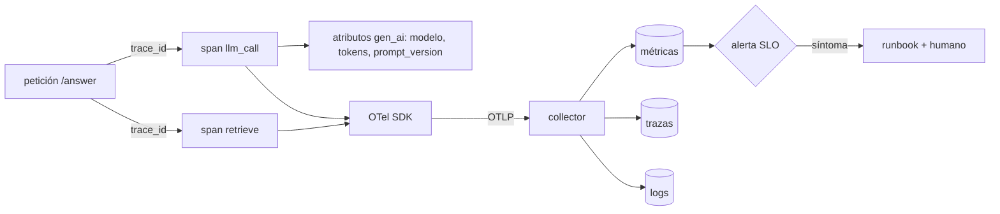

# 150 — Observabilidad: logs, métricas y trazas

> [← Clase anterior](../../../classes/part-12-ai-engineering-mlops-llmops-and-agentops/149-serving-online-batch-y-streaming/README.md) · [Índice de la parte](../README.md) · [Clase siguiente →](../../../classes/part-12-ai-engineering-mlops-llmops-and-agentops/151-deriva-feedback-y-evaluacion-continua/README.md)

**Parte:** 12 — Ingeniería de IA, MLOps, LLMOps y AgentOps  
**Nivel:** experto · **Horas estimadas:** 6  
**Laboratorio:** `observability` · **Estado:** `EXECUTABLE_CORE`

## 🎯 Propósito

Comprender **observabilidad: logs, métricas y trazas** dentro de la evolución de la inteligencia
artificial, implementar un experimento mínimo verificable y distinguir qué parte
constituye evidencia frente a una afirmación todavía no comprobada.

## 📚 Resultados de aprendizaje

Al finalizar podrás:

1. Explicar observabilidad: logs, métricas y trazas usando los conceptos `logs`, `metrics`, `traces`, `OTel`.
2. Ejecutar el laboratorio con una semilla explícita y revisar su contrato JSON.
3. Identificar al menos un supuesto, una limitación y un riesgo de aplicación.
4. Comparar el enfoque con la etapa anterior de la ruta de aprendizaje.
5. Producir una evidencia reproducible y una conclusión que no exceda los datos.

## 🧩 Conceptos centrales

`logs`, `metrics`, `traces`, `OTel`

## 🗺️ Ubicación en el mapa de la IA

Servir un modelo (149) sin observarlo es volar sin instrumentos: los sistemas de IA
fallan en silencio — la API responde 200 mientras la calidad se derrumba. Esta clase
adopta el vocabulario estándar de la observabilidad (logs, métricas, trazas; OpenTelemetry
como lingua franca) y lo extiende a lo que los sistemas clásicos no tienen: spans de
inferencia LLM con tokens, costo y versión de prompt. Es la base sensorial de la deriva
(151), del LLMOps (152) y del AgentOps (153).

## 📖 Fundamentos

### 🔭 Monitoreo vs. observabilidad

**Monitorear** es vigilar señales predefinidas («¿el p95 pasó de 200 ms?»).
**Observabilidad** es la propiedad de un sistema cuyo estado interno puede inferirse
desde sus salidas: permite responder preguntas que **no** se anticiparon («¿por qué
justo los usuarios de iOS con prompts largos reciben respuestas truncadas?»). Se
construye con tres señales complementarias:

### 📜 Logs — eventos discretos

Registros de hechos puntuales con contexto. La práctica moderna exige **logs
estructurados** (JSON con campos, no texto libre) para poder consultarlos:

```json
{"ts": "2026-07-30T10:02:11Z", "level": "WARN", "service": "inference",
 "trace_id": "a1b2…", "model": "churn-v7", "event": "fallback_used",
 "reason": "feature_store_timeout", "user_segment": "mobile"}
```

Fortaleza: máximo detalle por evento. Debilidad: volumen y costo; sin `trace_id` que los
una, son anécdotas sueltas.

### 📈 Métricas — agregados numéricos

Series temporales baratas de almacenar y alertar. Tipos canónicos (Prometheus):
**counter** (solo crece: `predicciones_total`), **gauge** (sube y baja:
`replicas_activas`), **histogram** (distribución: `latencia_segundos_bucket`, del que se
derivan percentiles). Para IA se añaden métricas de calidad y de costo:
`proporcion_fallback`, `tokens_entrada/salida`, `costo_por_peticion`,
`puntuacion_eval_muestreada`. Regla de cardinalidad: nunca usar identificadores de
usuario o request como etiqueta — cada combinación de etiquetas crea una serie nueva.

### 🧵 Trazas — el viaje de una petición

Una **traza** es un árbol de **spans**; cada span es una operación con inicio, duración,
atributos y estado, unidos por un `trace_id` que viaja por todos los servicios
(propagación de contexto). OpenTelemetry estandariza API, SDK y el protocolo OTLP para
exportar las tres señales; sus **convenciones semánticas para IA generativa** definen
atributos como `gen_ai.request.model`, `gen_ai.usage.input_tokens`,
`gen_ai.usage.output_tokens`, de modo que cualquier backend entienda un span de LLM.

```text
traza: POST /answer                                    total 1 840 ms
 └── span retrieve_context      (vector DB)              310 ms
 └── span rerank                 (cross-encoder)          95 ms
 └── span llm_call               (gen_ai.*)             1 380 ms
      atributos: model=claude-…, input_tokens=2 900,
                 output_tokens=210, prompt_version=v12
 └── span guardrail_check                                 55 ms
```

Sin la traza solo verías «/answer tarda 1.8 s»; con ella sabes que el 75 % es la llamada
al LLM y que el contexto recuperado mide 2 900 tokens — la palanca está en el retriever.

### 🚨 De señales a alertas

Alertar sobre **síntomas que duelen al usuario** (SLO de latencia, tasa de error, tasa de
fallback), no sobre causas internas (CPU alta). Cada alerta debe ser accionable y llevar
a un runbook; las señales de calidad de IA (score de evals muestreadas, deriva) suelen
alertar a revisión humana, no paginar a las 3 a.m.

### 🚪 El gateway de IA: observabilidad y gobernanza en un solo punto

En la empresa, las tres señales convergen en un patrón arquitectónico que maduró en
2025-2026: el **AI gateway** — un proxy único por el que pasan todas las llamadas a
modelos y agentes. Al concentrar el tráfico, el gateway obtiene gratis lo que costaría
instrumentar servicio a servicio: trazas y costos por equipo/modelo/agente, límites de
tasa y presupuesto, y enrutamiento con fallback entre proveedores. Sobre esa base se
apilan capas de gobernanza que ya son productos estándar: **registros** de qué modelos,
APIs y skills están autorizados (descubrimiento incluido: qué IA está usando la
organización *sin* permiso — shadow AI), y **agent personas** — la identidad operativa
de cada agente que ata su descripción de rol a su modelo, herramientas y guardrails
concretos, de modo que "qué puede hacer este agente" sea una configuración auditable y
no una promesa del prompt. Es el mismo principio de mínimo privilegio de la clase 116,
elevado de un agente a la flota completa.

## 🧮 Ejemplo trabajado

Presupuesto de latencia de un endpoint RAG con SLO p95 ≤ 2 000 ms. Medición de una
ventana de 10 000 peticiones (histogramas por span):

```text
span                p50      p95      contribución al p95 total
retrieve_context    180 ms   520 ms   26 %
rerank               60 ms   110 ms    6 %
llm_call            900 ms  1 450 ms  72 %
guardrail_check      40 ms    70 ms    4 %
p95 total observado: 1 980 ms  (los p95 no se suman: la traza muestra qué coincide)
```

El SLO está a 20 ms de romperse. Las trazas de las peticiones > 2 000 ms muestran un
patrón: `input_tokens > 4 000` por contextos largos del retriever. Acción con datos: cap
de contexto a 3 000 tokens → el p95 de `llm_call` cae a 1 150 ms y el total a 1 630 ms.
La observabilidad convirtió «a veces va lento» en una decisión de ingeniería con una
palanca concreta y verificable tras el cambio.

## 📊 Propiedades y comparación

| Señal | Granularidad | Costo relativo | Responde | Límite |
|---|---|---|---|---|
| Logs estructurados | evento | alto (volumen) | ¿qué pasó exactamente aquí? | correlación manual sin trace_id |
| Métricas | agregado | bajo | ¿cuánto, cuántos, qué tan rápido? | sin detalle por petición; cardinalidad |
| Trazas | petición completa | medio (se muestrea) | ¿dónde se fue el tiempo / qué llamó a qué? | muestreo pierde casos raros salvo tail-sampling |
| Spans gen_ai (OTel) | llamada LLM | medio | ¿tokens, modelo, prompt, costo por llamada? | la calidad semántica exige evals aparte |



## ⚠️ Errores conceptuales frecuentes

1. **«HTTP 200 = sistema sano.»** Un LLM puede responder 200 con alucinaciones o un
   modelo con scores degradados; la salud de IA exige señales de calidad muestreadas,
   no solo disponibilidad.
2. **«Los p95 de los spans se suman al p95 total.»** Los percentiles no son aditivos;
   solo la traza muestra cómo se componen las duraciones en cada petición real.
3. **«Logueo todo y ya soy observable.»** Logs sin estructura ni `trace_id` son texto
   caro; observabilidad es poder *consultar* lo no anticipado.
4. **«Etiqueto la métrica con el user_id para poder filtrar.»** Explosión de
   cardinalidad: miles de series nuevas; el detalle por usuario pertenece a logs/trazas.
5. **«Alerto sobre CPU y memoria.»** Son causas, no síntomas; se alerta sobre lo que el
   usuario sufre (SLO) y las causas se consultan al diagnosticar.

## 🚀 Del aprendizaje a la operación

El laboratorio emite señales deterministas; producción añade un collector de OTel con
muestreo de colas (tail-based sampling para retener las trazas lentas), retención y
costo por GB de logs, dashboards y SLOs con presupuesto de error, y redacción de PII
antes de exportar prompts a un backend de trazas — un span gen_ai con el prompt completo
es también un riesgo de privacidad. La regla de madurez: cada incidente que costó
diagnosticar debe dejar tras de sí la señal que lo habría hecho trivial.

## 🧪 Laboratorio

```bash
python lab.py
```

El laboratorio llama a `ai_evolution.labs.run_lab("observability")`. Esta
decisión evita 180 implementaciones divergentes: cada clase tiene un entrypoint
propio, pero los motores didácticos se prueban como una biblioteca común.

### 🔍 Evidencia esperada

- tipo de laboratorio y semilla;
- entradas o decisiones observables;
- resultado estructurado;
- lista `evidence` con hechos que pueden inspeccionarse;
- lista `limitations` que impide presentar la demo como producción.

## 📓 Notebooks

- [📓 `notebook.ipynb`](notebook.ipynb): recorrido guiado con la materia resumida.
- [✍️ `notebook_student.ipynb`](notebook_student.ipynb): ejercicios para resolver.
- [✅ `notebook_solution.ipynb`](notebook_solution.ipynb): solución de referencia explicada.

## 📝 Evaluación

| Criterio | Peso |
|---|---:|
| Comprensión conceptual | 25 % |
| Ejecución reproducible | 25 % |
| Interpretación basada en evidencia | 25 % |
| Riesgos, límites y mejora propuesta | 25 % |

Consulta [assessment.md](assessment.md) para preguntas y criterio de aceptación.

## ⚠️ Errores comunes

| Síntoma | Causa probable | Corrección |
|---|---|---|
| El código corre, pero no hay conclusión | Se confundió ejecución con aprendizaje | Explica qué demuestra y qué no demuestra |
| El resultado cambia sin explicación | No se registró semilla o configuración | Conserva semilla, versión y parámetros |
| Se promete uso real | Se extrapoló desde una demo educativa | Declara entorno, datos, límites y revisión humana |
| Se copia una métrica aislada | No existe baseline ni costo de error | Añade comparación y criterio de decisión |

## ❓ Preguntas frecuentes

**¿Debo usar una API comercial?**  
No. El núcleo funciona localmente. Las extensiones LIVE se documentan por separado.

**¿El laboratorio representa una implementación industrial?**  
No por sí solo. Enseña el contrato y el patrón; producción exige integración,
seguridad, observabilidad, pruebas y operación.

**¿Dónde profundizo?**  
Revisa las especializaciones enlazadas en el README raíz y la ruta siguiente.

## 🔗 Referencias

- [OpenTelemetry Documentation](https://opentelemetry.io/docs/)
- [OpenTelemetry — Semantic Conventions for Generative AI](https://opentelemetry.io/docs/specs/semconv/gen-ai/)
- [Prometheus Documentation — tipos de métricas](https://prometheus.io/docs/)
- [Google SRE Book — Monitoring Distributed Systems](https://sre.google/sre-book/monitoring-distributed-systems/)
- [Dean & Barroso (2013), "The Tail at Scale", CACM](https://research.google/pubs/pub40801/)

---

## ⬅️ Clase anterior

[149 — Serving online, batch y streaming](../../part-12-ai-engineering-mlops-llmops-and-agentops/149-serving-online-batch-y-streaming/README.md)

## ➡️ Siguiente clase

[151 — Deriva, feedback y evaluación continua](../../part-12-ai-engineering-mlops-llmops-and-agentops/151-deriva-feedback-y-evaluacion-continua/README.md)
