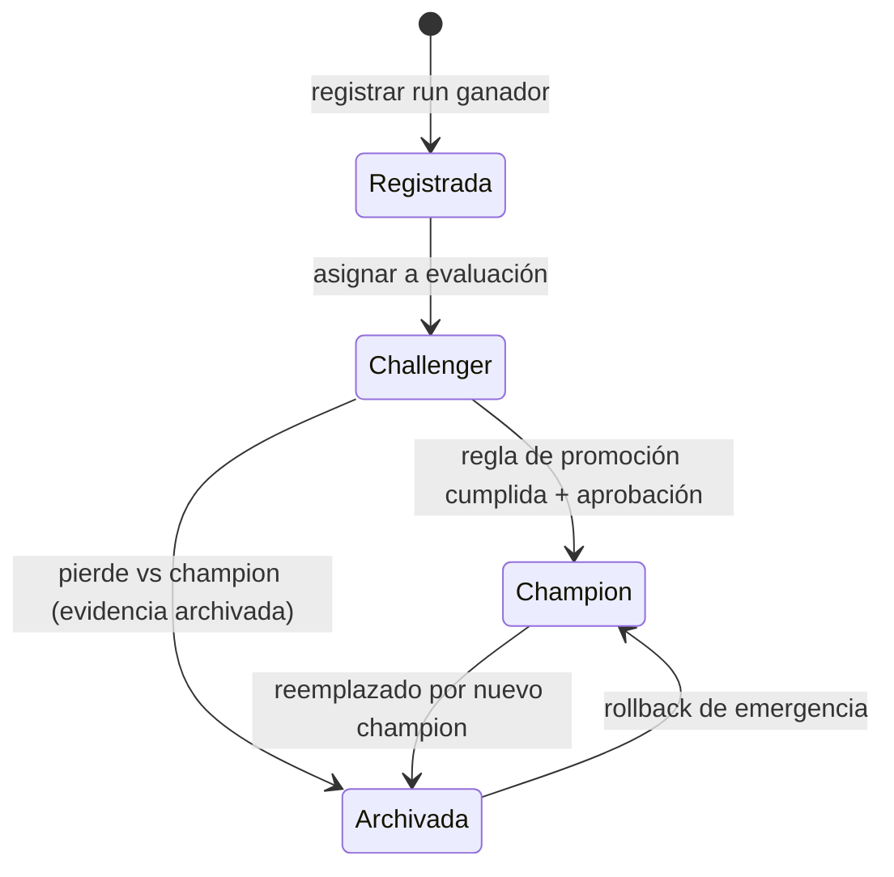

# 150 — Registro y promoción champion-challenger

> [← Clase anterior](../../../classes/part-12-ai-engineering-mlops-llmops-and-agentops/149-experimentos-semillas-y-trazabilidad/README.md) · [Índice de la parte](../README.md) · [Clase siguiente →](../../../classes/part-12-ai-engineering-mlops-llmops-and-agentops/151-ci-cd-y-pruebas-para-sistemas-de-ia/README.md)

**Parte:** 12 — Ingeniería de IA, MLOps, LLMOps y AgentOps  
**Nivel:** experto · **Horas estimadas:** 6  
**Laboratorio:** `workflow` · **Estado:** `EXECUTABLE_CORE`

## 🎯 Propósito

Comprender **registro y promoción champion-challenger** dentro de la evolución de la inteligencia
artificial, implementar un experimento mínimo verificable y distinguir qué parte
constituye evidencia frente a una afirmación todavía no comprobada.

## 📚 Resultados de aprendizaje

Al finalizar podrás:

1. Explicar registro y promoción champion-challenger usando los conceptos `registry`, `version`, `champion`, `challenger`.
2. Ejecutar el laboratorio con una semilla explícita y revisar su contrato JSON.
3. Identificar al menos un supuesto, una limitación y un riesgo de aplicación.
4. Comparar el enfoque con la etapa anterior de la ruta de aprendizaje.
5. Producir una evidencia reproducible y una conclusión que no exceda los datos.

## 🧩 Conceptos centrales

`registry`, `version`, `champion`, `challenger`

## 🗺️ Ubicación en el mapa de la IA

Con experimentos trazables (clase 149) el problema pasa a ser de gobierno: ¿qué versión
del modelo sirve tráfico real y quién decide el reemplazo? El registro de modelos y el
patrón **champion-challenger** trasladan a ML una idea vieja de la banca y el control de
riesgo: la versión titular solo cede su puesto ante un retador que la supera bajo reglas
acordadas de antemano. Es la antesala del CI/CD (151) y del serving (152).

## 📖 Fundamentos

### 🗃️ Registro de modelos

Un **registro** (model registry) es la fuente de verdad sobre qué modelos existen, en qué
versión y en qué estado. A diferencia del tracking (que guarda *todos* los runs), el
registro guarda los **candidatos con nombre y contrato**:

```text
modelo registrado: "churn"
 ├── v6  — alias: (ninguno)     archivada
 ├── v7  — alias: champion      sirviendo producción
 └── v8  — alias: challenger    en evaluación en sombra
metadatos por versión: run de origen (linaje), firma de entrada/salida,
métricas de aceptación, aprobador, fecha de promoción
```

Los **estados/alias** forman una máquina de estados con transiciones explícitas:
`registrada → en evaluación → champion → archivada`, y cada transición exige evidencia
(métricas) y autorización (humana o automática con reglas). MLflow implementa esto con
versiones y alias sobre un nombre de modelo.

### 🥊 Champion-challenger

- **Champion**: la versión que sirve tráfico y define el baseline vivo.
- **Challenger**: candidata que se evalúa contra el champion **con los mismos datos y
  las mismas métricas**, idealmente en *shadow mode*: recibe copia del tráfico real,
  sus predicciones se registran pero no se usan.

El patrón separa dos preguntas que suelen mezclarse: «¿el challenger es mejor?»
(estadística) y «¿lo promovemos?» (decisión de negocio con costos asimétricos).

### 📏 Criterio de promoción

Una regla de promoción seria tiene cuatro componentes:

1. **Métrica primaria y umbral de mejora mínima** (Δ mínimo que paga el costo del
   cambio), evaluada con incertidumbre (varias semillas o intervalo por bootstrap).
2. **Guardas (guardrails)**: métricas que no pueden empeorar más de X aunque la primaria
   mejore — latencia p95, calibración, equidad por segmento, tasa de errores.
3. **Ventana y población de evaluación**: mismo periodo, mismo segmento; nunca comparar
   el champion de diciembre con el challenger de enero.
4. **Reversibilidad**: la promoción anterior queda archivada y re-desplegable
   (rollback en minutos, clase 158).

```text
PROMOVER si:
  metrica_primaria(challenger) − metrica_primaria(champion) ≥ delta_min
  y para toda guarda g:  degradacion_g ≤ tolerancia_g
  y evaluacion hecha en la misma ventana/poblacion
EN OTRO CASO: mantener champion, archivar evidencia del challenger
```

### 🌓 Modos de evaluación en producción

- **Shadow**: challenger predice en paralelo sin afectar usuarios. Mide acuerdo con el
  champion y métricas técnicas; no mide impacto causal en negocio.
- **Canario / A-B**: challenger recibe un porcentaje pequeño de tráfico real. Mide
  impacto real; expone a usuarios y exige tamaño de muestra.
- **Replay offline**: evaluar el challenger sobre tráfico histórico etiquetado. Barato,
  pero ciego a bucles de retroalimentación y a features solo disponibles online.

## 🧮 Ejemplo trabajado

Modelo de riesgo crediticio. Regla acordada: promover si el AUC sube ≥ 0.005, con
guardas: tasa de falsos negativos (FN) en el segmento «jóvenes sin historial» no puede
subir más de 1 punto porcentual, y latencia p95 ≤ 150 ms.

Evaluación en la misma ventana (4 semanas de tráfico en sombra, n = 48 000):

```text
                       champion v7    challenger v8    Δ
AUC                    0.831          0.842            +0.011  ✓ (≥ 0.005)
FN jóvenes sin hist.   8.2 %          9.9 %            +1.7 pp ✗ (tolerancia 1.0)
latencia p95           110 ms         128 ms           +18 ms  ✓ (≤ 150)
```

Decisión: **NO promover**, aunque la métrica primaria mejora claramente. La guarda de
equidad se viola: v8 gana AUC global empeorando justo el segmento protegido. Acciones
posibles: reentrenar v8 con re-ponderación del segmento, o renegociar la guarda con
quien es dueño del riesgo (decisión de negocio explícita, no default silencioso).
El registro archiva la evaluación completa: dentro de seis meses alguien preguntará por
qué v8 no se promovió, y la respuesta debe estar escrita.

## 📊 Propiedades y comparación

| Modo de evaluación | Riesgo para usuarios | Mide impacto causal | Costo | Cuándo usar |
|---|---|---|---|---|
| Replay offline | nulo | no | bajo | primer filtro de candidatos |
| Shadow | nulo | no (solo acuerdo y métricas técnicas) | medio (2× cómputo) | validar contrato y estabilidad |
| Canario 1-5 % | bajo y acotado | sí, con muestra suficiente | medio | antes de promoción total |
| A/B formal | medio | sí, con potencia estadística | alto | cambios de alto impacto |



## ⚠️ Errores conceptuales frecuentes

1. **«Gana la métrica primaria, se promueve.»** Sin guardas, se promueven modelos que
   mejoran el promedio degradando latencia, calibración o segmentos sensibles.
2. **«Comparar el AUC de validación del challenger con el AUC histórico del champion.»**
   Ventanas y poblaciones distintas no son comparables; la evaluación debe ser
   simultánea y sobre la misma población.
3. **«Shadow mode demuestra impacto en negocio.»** Solo demuestra estabilidad técnica y
   acuerdo; el impacto causal exige exponer tráfico (canario/A-B).
4. **«El registro es una carpeta de ficheros de pesos.»** Sin linaje, firma, estados y
   aprobadores, es almacenamiento, no gobierno: nadie sabe qué se puede desplegar.
5. **«Un delta positivo cualquiera justifica el cambio.»** Cambiar de modelo tiene costo
   (riesgo, revalidación, documentación); por eso existe `delta_min > 0`.

## 🚀 Del aprendizaje a la operación

El laboratorio decide una promoción con números deterministas; en producción se añade la
incertidumbre muestral (intervalos, potencia estadística), aprobaciones humanas con
segregación de funciones (quien entrena no aprueba), auditoría regulatoria en dominios
como crédito o salud, y automatización del despliegue del nuevo champion con rollback
listo. La regla de promoción escrita *antes* de ver los números es lo que separa un
proceso de gobierno de una discusión post-hoc.

## 🧪 Laboratorio

```bash
python lab.py
```

El laboratorio llama a `ai_evolution.labs.run_lab("workflow")`. Esta
decisión evita 183 implementaciones divergentes: cada clase tiene un entrypoint
propio, pero los motores didácticos se prueban como una biblioteca común.

### 🔍 Evidencia esperada

- tipo de laboratorio y semilla;
- entradas o decisiones observables;
- resultado estructurado;
- lista `evidence` con hechos que pueden inspeccionarse;
- lista `limitations` que impide presentar la demo como producción.

## 📓 Notebooks

- [📓 `notebook.ipynb`](notebook.ipynb): recorrido guiado con la materia resumida.
- [✍️ `notebook_student.ipynb`](notebook_student.ipynb): ejercicios para resolver.
- [✅ `notebook_solution.ipynb`](notebook_solution.ipynb): solución de referencia explicada.

## 📝 Evaluación

| Criterio | Peso |
|---|---:|
| Comprensión conceptual | 25 % |
| Ejecución reproducible | 25 % |
| Interpretación basada en evidencia | 25 % |
| Riesgos, límites y mejora propuesta | 25 % |

Consulta [assessment.md](assessment.md) para preguntas y criterio de aceptación.

## ⚠️ Errores comunes

| Síntoma | Causa probable | Corrección |
|---|---|---|
| El código corre, pero no hay conclusión | Se confundió ejecución con aprendizaje | Explica qué demuestra y qué no demuestra |
| El resultado cambia sin explicación | No se registró semilla o configuración | Conserva semilla, versión y parámetros |
| Se promete uso real | Se extrapoló desde una demo educativa | Declara entorno, datos, límites y revisión humana |
| Se copia una métrica aislada | No existe baseline ni costo de error | Añade comparación y criterio de decisión |

## ❓ Preguntas frecuentes

**¿Debo usar una API comercial?**  
No. El núcleo funciona localmente. Las extensiones LIVE se documentan por separado.

**¿El laboratorio representa una implementación industrial?**  
No por sí solo. Enseña el contrato y el patrón; producción exige integración,
seguridad, observabilidad, pruebas y operación.

**¿Dónde profundizo?**  
Revisa las especializaciones enlazadas en el README raíz y la ruta siguiente.

## 🔗 Referencias

- [MLflow Documentation — Model Registry](https://mlflow.org/docs/latest/)
- [Google Cloud, "MLOps: Continuous delivery and automation pipelines in machine learning"](https://cloud.google.com/architecture/mlops-continuous-delivery-and-automation-pipelines-in-machine-learning)
- [Huyen, *Designing Machine Learning Systems*, cap. de despliegue y evaluación online](https://www.oreilly.com/library/view/designing-machine-learning/9781098107956/)
- [Kohavi, Tang & Xu, *Trustworthy Online Controlled Experiments* (Cambridge UP)](https://www.cambridge.org/core/books/trustworthy-online-controlled-experiments/D97B26382EB0EB2DC2019A7A7B518F59)
- [Breck et al. (2017), "The ML Test Score", IEEE Big Data](https://research.google/pubs/pub46555/)

<!-- papers:inicio -->

---

## 📜 Papers que fundamentan esta clase

> Bloque generado por `python scripts/link_papers_to_classes.py`. La fuente es [`papers/catalog/papers.json`](../../../papers/catalog/papers.json).

| Paper | Año | Qué desbloqueó | Miniatura |
|---|---:|---|---|
| [P114 · Tarjetas de modelo para el reporte de modelos](../../../papers/foundational/P114_tarjetas_de_modelo/README.md) | 2019 | Propone un documento corto y estandarizado que acompaña a cada modelo, con evaluación **desagregada** por subgrupo y usos fuera de alcance declarados. | [notebook](../../../notebooks/papers/P114_tarjetas_de_modelo.ipynb) |

Cada ficha explica el problema anterior, la matemática mínima, los límites y los errores de atribución más frecuentes. Para leerlas con método: [cómo leer un paper de IA](../../../papers/guides/COMO_LEER_UN_PAPER_DE_IA.md) · [anexos matemáticos](../../../papers/annexes/README.md).
<!-- papers:fin -->
---

## ⬅️ Clase anterior

[149 — Experimentos, semillas y trazabilidad](../../part-12-ai-engineering-mlops-llmops-and-agentops/149-experimentos-semillas-y-trazabilidad/README.md)

## ➡️ Siguiente clase

[151 — CI/CD y pruebas para sistemas de IA](../../part-12-ai-engineering-mlops-llmops-and-agentops/151-ci-cd-y-pruebas-para-sistemas-de-ia/README.md)
