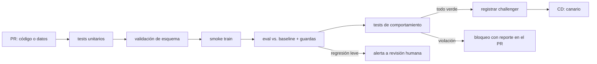

# 151 — CI/CD y pruebas para sistemas de IA

> [← Clase anterior](../../../classes/part-12-ai-engineering-mlops-llmops-and-agentops/150-registro-y-promocion-champion-challenger/README.md) · [Índice de la parte](../README.md) · [Clase siguiente →](../../../classes/part-12-ai-engineering-mlops-llmops-and-agentops/152-serving-online-batch-y-streaming/README.md)

**Parte:** 12 — Ingeniería de IA, MLOps, LLMOps y AgentOps  
**Nivel:** experto · **Horas estimadas:** 6  
**Laboratorio:** `evaluation` · **Estado:** `EXECUTABLE_CORE`

## 🎯 Propósito

Comprender **ci/cd y pruebas para sistemas de ia** dentro de la evolución de la inteligencia
artificial, implementar un experimento mínimo verificable y distinguir qué parte
constituye evidencia frente a una afirmación todavía no comprobada.

## 📚 Resultados de aprendizaje

Al finalizar podrás:

1. Explicar ci/cd y pruebas para sistemas de ia usando los conceptos `CI`, `tests`, `validation`, `contracts`.
2. Ejecutar el laboratorio con una semilla explícita y revisar su contrato JSON.
3. Identificar al menos un supuesto, una limitación y un riesgo de aplicación.
4. Comparar el enfoque con la etapa anterior de la ruta de aprendizaje.
5. Producir una evidencia reproducible y una conclusión que no exceda los datos.

## 🧩 Conceptos centrales

`CI`, `tests`, `validation`, `contracts`

## 🗺️ Ubicación en el mapa de la IA

El CI/CD clásico automatizó la pregunta «¿este cambio de código rompe algo?». En sistemas
de IA la pregunta se triplica: el cambio puede venir del código, de los **datos** o del
**modelo**, y «romper» puede significar un test rojo o una degradación estadística
silenciosa. Esta clase adapta la integración y entrega continuas al ciclo de vida de la
clase 148, usando el registro de la 147 como puerta de salida hacia el serving (152).

## 📖 Fundamentos

### 🔺 Tres ejes de prueba

Siguiendo el *ML Test Score* de Breck et al. (2017), un sistema de ML se prueba en
cuatro frentes; aquí los agrupamos en tres ejes más la infraestructura:

1. **Tests de datos**: el insumo cumple su contrato.
   - Esquema: columnas, tipos, rangos (`edad ∈ [0, 120]`), nulos permitidos.
   - Distribución: estadísticas dentro de bandas esperadas (media, cuantiles,
     cardinalidad de categóricas).
   - Legalidad/privacidad: features permitidas, sin fuga de PII.
2. **Tests de modelo**: el artefacto entrenado es apto.
   - Calidad mínima contra baseline fijo (¿supera al heurístico y a la versión anterior?).
   - Sin *training-serving skew*: la feature calculada offline coincide con la online.
   - Reproducibilidad del entrenamiento (semilla + snapshot, clase 149).
3. **Tests de comportamiento**: el modelo hace lo correcto en casos con significado.
   - **Invariancia**: cambiar el nombre propio en un texto no debe cambiar el sentimiento.
   - **Direccionales**: subir el ingreso no debe subir la probabilidad de impago.
   - **Casos mínimos de funcionalidad**: ejemplos canónicos que jamás deben fallar
     (la «suite de humo» del modelo, cf. CheckList de Ribeiro et al.).

### 🔁 CI/CD y CT

El whitepaper de MLOps de Google distingue:

- **CI**: además de compilar y testear código, valida datos y produce artefactos de
  pipeline probados.
- **CD**: despliega no un binario sino un **pipeline completo** que a su vez entrena y
  sirve modelos.
- **CT (Continuous Training)**: el reentrenamiento automático disparado por calendario,
  llegada de datos o deriva — exclusivo de ML, no existe en DevOps clásico.

```text
pipeline de CI para un cambio (código o datos):
1. tests unitarios de código           (segundos)
2. validación de esquema de datos      (segundos)
3. entrenamiento en muestra pequeña    (minutos)   ← smoke train
4. evaluación vs. baseline + guardas   (minutos)
5. tests de comportamiento             (minutos)
6. registro del candidato (challenger) (clase 150)
solo si 1-6 pasan → CD: despliegue canario → promoción
```

Herramientas como **CML** (Continuous Machine Learning) insertan en cada pull request un
reporte con métricas y gráficas del candidato, convirtiendo la revisión de modelos en
revisión de código: el diff incluye el delta de métricas.

### 🚦 Qué bloquea y qué alerta

No todo test debe bloquear el despliegue. Regla práctica: **bloquean** los contratos
(esquema, firma del modelo, casos mínimos de funcionalidad, guardas duras); **alertan**
las señales estadísticas ruidosas (pequeñas caídas de una métrica secundaria, cambios de
distribución leves), que exigen juicio humano. Un pipeline donde todo bloquea acaba con
overrides sistemáticos; uno donde todo alerta, con alertas ignoradas.

## 🧮 Ejemplo trabajado

Un PR cambia el binning de la feature `ingreso`. El pipeline corre:

```text
paso                         resultado
tests unitarios              ✓ 214/214
esquema de datos             ✓ (mismas columnas y tipos)
smoke train (5 % datos)      ✓ entrena sin error, 92 s
eval vs. baseline            accuracy 0.902 → 0.897  (Δ −0.005; umbral bloqueo −0.01)
test direccional             ✗ p(impago) SUBE al subir ingreso en 3.1 % de los casos
                               (umbral: 1 %)
casos mínimos                ✓ 40/40
```

Veredicto: **bloqueado por el test direccional**, no por la métrica. La caída de
accuracy (−0.005) está dentro de la tolerancia y solo habría alertado; pero el modelo
ahora viola monotonicidad esperada en una fracción de casos tres veces mayor que la
tolerada — señal típica de un binning con bordes mal ordenados. El autor corrige los
bordes del bin, el direccional baja a 0.4 % y el PR entra. Nótese lo que el ejemplo
enseña: la métrica agregada era aceptable; el **comportamiento** no.

## 📊 Propiedades y comparación

| Tipo de test | Detecta | No detecta | Cuándo corre | ¿Bloquea? |
|---|---|---|---|---|
| Unitario de código | bugs de lógica | problemas de datos/modelo | cada commit | sí |
| Esquema de datos | columnas/tipos/rangos rotos | deriva de distribución | cada ingesta y cada PR | sí |
| Distribución de datos | cambios estadísticos | causas del cambio | cada ingesta | alerta |
| Eval vs. baseline | regresión de calidad global | fallos por segmento | cada candidato | sí (umbral) |
| Comportamiento (invariancia/direccional/mínimos) | fallos con significado | regresiones fuera de los casos escritos | cada candidato | sí |
| Skew offline/online | features inconsistentes | deriva temporal | pre-despliegue + muestreo | sí |



## ⚠️ Errores conceptuales frecuentes

1. **«Si los tests de código pasan, el sistema está sano.»** El código puede ser
   perfecto y el modelo inútil: los datos y el comportamiento estadístico necesitan sus
   propios tests (ese es el punto del ML Test Score).
2. **«La métrica agregada cubre el comportamiento.»** Un modelo puede mantener accuracy
   y violar invariancias o monotonicidad en subconjuntos críticos, como en el ejemplo.
3. **«CT es un cron que reentrena.»** Sin validación automática post-entrenamiento y
   regla de promoción, un cron reentrenando es una fábrica de regresiones desatendida.
4. **«Todo test debe bloquear.»** Las señales estadísticas ruidosas como bloqueo duro
   producen overrides crónicos; se degradan a alerta con revisión humana.
5. **«El skew se prueba una vez.»** La paridad offline/online se erosiona con cada
   cambio de pipeline; se verifica en CI y se muestrea en producción continuamente.

## 🚀 Del aprendizaje a la operación

El laboratorio ejecuta una batería de validaciones deterministas; un CI/CD real añade
runners con GPU y colas (el smoke train compite por recursos), cachés de datasets,
gestión de secretos para fuentes de datos, reportes de CML en el PR, y la política de
quién puede hacer override de un bloqueo y cómo queda auditado. La inversión con mejor
retorno suele ser la más barata: validación de esquema en cada ingesta, que atrapa la
mayoría de los incidentes reales antes de que toquen un modelo.

## 🧪 Laboratorio

```bash
python lab.py
```

El laboratorio llama a `ai_evolution.labs.run_lab("evaluation")`. Esta
decisión evita 183 implementaciones divergentes: cada clase tiene un entrypoint
propio, pero los motores didácticos se prueban como una biblioteca común.

### 🔍 Evidencia esperada

- tipo de laboratorio y semilla;
- entradas o decisiones observables;
- resultado estructurado;
- lista `evidence` con hechos que pueden inspeccionarse;
- lista `limitations` que impide presentar la demo como producción.

## 📓 Notebooks

- [📓 `notebook.ipynb`](notebook.ipynb): recorrido guiado con la materia resumida.
- [✍️ `notebook_student.ipynb`](notebook_student.ipynb): ejercicios para resolver.
- [✅ `notebook_solution.ipynb`](notebook_solution.ipynb): solución de referencia explicada.

## 📝 Evaluación

| Criterio | Peso |
|---|---:|
| Comprensión conceptual | 25 % |
| Ejecución reproducible | 25 % |
| Interpretación basada en evidencia | 25 % |
| Riesgos, límites y mejora propuesta | 25 % |

Consulta [assessment.md](assessment.md) para preguntas y criterio de aceptación.

## ⚠️ Errores comunes

| Síntoma | Causa probable | Corrección |
|---|---|---|
| El código corre, pero no hay conclusión | Se confundió ejecución con aprendizaje | Explica qué demuestra y qué no demuestra |
| El resultado cambia sin explicación | No se registró semilla o configuración | Conserva semilla, versión y parámetros |
| Se promete uso real | Se extrapoló desde una demo educativa | Declara entorno, datos, límites y revisión humana |
| Se copia una métrica aislada | No existe baseline ni costo de error | Añade comparación y criterio de decisión |

## ❓ Preguntas frecuentes

**¿Debo usar una API comercial?**  
No. El núcleo funciona localmente. Las extensiones LIVE se documentan por separado.

**¿El laboratorio representa una implementación industrial?**  
No por sí solo. Enseña el contrato y el patrón; producción exige integración,
seguridad, observabilidad, pruebas y operación.

**¿Dónde profundizo?**  
Revisa las especializaciones enlazadas en el README raíz y la ruta siguiente.

## 🔗 Referencias

- [Breck et al. (2017), "The ML Test Score: A Rubric for ML Production Readiness", IEEE Big Data](https://research.google/pubs/pub46555/) — uso: referencia consultada en su fuente original
- [Google Cloud, "MLOps: Continuous delivery and automation pipelines in machine learning"](https://cloud.google.com/architecture/mlops-continuous-delivery-and-automation-pipelines-in-machine-learning) — uso: referencia consultada en su fuente original
- [Ribeiro et al. (2020), "Beyond Accuracy: Behavioral Testing of NLP Models with CheckList", ACL (arXiv:2005.04118)](https://arxiv.org/abs/2005.04118) — uso: fuente primaria del mecanismo estudiado
- [CML — Continuous Machine Learning (iterative.ai)](https://cml.dev/) — uso: referencia consultada en su fuente original
- [Great Expectations Documentation — validación de datos](https://docs.greatexpectations.io/) — uso: referencia consultada en su fuente original
- [Fowler, "Continuous Integration"](https://martinfowler.com/articles/continuousIntegration.html) — uso: referencia consultada en su fuente original

<!-- papers:inicio -->

---

## 📜 Papers que fundamentan esta clase

> Bloque generado por `python scripts/link_papers_to_classes.py`. La fuente es [`papers/catalog/papers.json`](../../../papers/catalog/papers.json).

| Paper | Año | Qué desbloqueó | Miniatura |
|---|---:|---|---|
| [P112 · La puntuación de pruebas de ML: una rúbrica de preparación para producción](../../../papers/foundational/P112_ml_test_score/README.md) | 2017 | Convierte «¿está listo para producción?» en una rúbrica de 28 pruebas concretas, puntuada por su categoría más débil. | [notebook](../../../notebooks/papers/P112_ml_test_score.ipynb) |

Cada ficha explica el problema anterior, la matemática mínima, los límites y los errores de atribución más frecuentes. Para leerlas con método: [cómo leer un paper de IA](../../../papers/guides/COMO_LEER_UN_PAPER_DE_IA.md) · [anexos matemáticos](../../../papers/annexes/README.md).
<!-- papers:fin -->
<!-- bibliografia:inicio -->

---

## 📚 Bibliografía de apoyo

> Bloque generado por `python scripts/link_sources_to_classes.py`. Cada obra lleva su localizador verificado en [`sources/bibliography.json`](../../../sources/bibliography.json).

Los papers dicen **de dónde salió** el mecanismo. Estas obras lo **desarrollan** con el espacio que una clase no tiene: teoría completa, demostraciones y ejercicios.

| Obra | Edición | Localizador | Papel en esta clase |
|---|---|---|---|
| Huyen, Chip — *Designing Machine Learning Systems* | 2022 | [ISBN 9781098107956](https://openlibrary.org/isbn/9781098107956) · [web de la obra](https://www.oreilly.com/library/view/designing-machine-learning/9781098107956/) · _pendiente de confirmar en su catálogo_ | obra de referencia de la parte 12 · toda la parte |
<!-- bibliografia:fin -->

---

## ⬅️ Clase anterior

[150 — Registro y promoción champion-challenger](../../part-12-ai-engineering-mlops-llmops-and-agentops/150-registro-y-promocion-champion-challenger/README.md)

## ➡️ Siguiente clase

[152 — Serving online, batch y streaming](../../part-12-ai-engineering-mlops-llmops-and-agentops/152-serving-online-batch-y-streaming/README.md)
