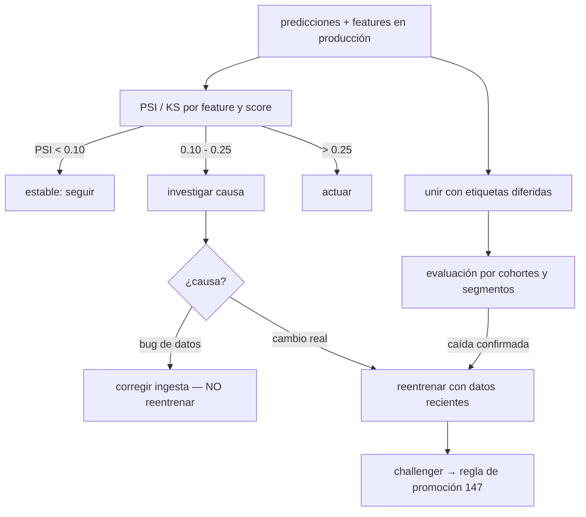

# 154 — Deriva, feedback y evaluación continua

> [← Clase anterior](../../../classes/part-12-ai-engineering-mlops-llmops-and-agentops/153-observabilidad-logs-metricas-y-trazas/README.md) · [Índice de la parte](../README.md) · [Clase siguiente →](../../../classes/part-12-ai-engineering-mlops-llmops-and-agentops/155-llmops-y-gestion-de-prompts/README.md)

**Parte:** 12 — Ingeniería de IA, MLOps, LLMOps y AgentOps  
**Nivel:** experto · **Horas estimadas:** 6  
**Laboratorio:** `evaluation` · **Estado:** `EXECUTABLE_CORE`

## 🎯 Propósito

Comprender **deriva, feedback y evaluación continua** dentro de la evolución de la inteligencia
artificial, implementar un experimento mínimo verificable y distinguir qué parte
constituye evidencia frente a una afirmación todavía no comprobada.

## 📚 Resultados de aprendizaje

Al finalizar podrás:

1. Explicar deriva, feedback y evaluación continua usando los conceptos `drift`, `feedback`, `continuous eval`, `monitoring`.
2. Ejecutar el laboratorio con una semilla explícita y revisar su contrato JSON.
3. Identificar al menos un supuesto, una limitación y un riesgo de aplicación.
4. Comparar el enfoque con la etapa anterior de la ruta de aprendizaje.
5. Producir una evidencia reproducible y una conclusión que no exceda los datos.

## 🧩 Conceptos centrales

`drift`, `feedback`, `continuous eval`, `monitoring`

## 🗺️ Ubicación en el mapa de la IA

Un modelo se entrena sobre una fotografía del mundo, y el mundo sigue moviéndose: la
**deriva** es la razón por la que todo sistema de ML se degrada por defecto. Esta clase
conecta la observabilidad (153) con la acción: detectar el cambio (PSI, monitoreo por
segmento), cerrar el bucle de feedback con etiquetas reales y evaluar continuamente. Es
el disparador del reentrenamiento (CT, clase 151) y de la decisión champion-challenger
(150).

## 📖 Fundamentos

### 🌪️ Taxonomía de la deriva

Con entrada `X`, objetivo `Y` y modelo que aproxima `P(Y|X)`:

- **Deriva de datos (covariate shift)**: cambia `P(X)`; la relación `P(Y|X)` se
  mantiene. Ej.: llegan más usuarios jóvenes; el modelo acierta en cada segmento, pero
  opera fuera de su zona densa de entrenamiento.
- **Deriva de etiquetas (prior shift)**: cambia `P(Y)`. Ej.: la tasa base de fraude sube
  del 0.3 % al 1 % — la calibración del umbral queda obsoleta.
- **Deriva de concepto (concept drift)**: cambia `P(Y|X)` — la *regla del mundo*. Ej.:
  tras una crisis, el mismo perfil de cliente ahora sí impaga. Es la más grave: el
  modelo está objetivamente equivocado aunque las entradas parezcan normales.

La forma temporal importa: súbita (cambio de app), gradual (hábitos), recurrente
(estacionalidad — que NO es deriva a corregir sino patrón a modelar).

### 📐 PSI: Population Stability Index

Métrica clásica (scoring bancario) para comparar la distribución esperada `p` (baseline,
p. ej. entrenamiento) con la actual `q` sobre `B` bins:

```text
PSI = Σ_{i=1..B} (q_i − p_i) · ln(q_i / p_i)
```

Cada término es ≥ 0 (si `q_i > p_i`, ambos factores positivos; si `q_i < p_i`, ambos
negativos), así que PSI ≥ 0 y solo es 0 con distribuciones idénticas por bin. Es
simétrica y equivale a la suma de las divergencias KL en ambos sentidos. Convención de
la industria (regla empírica, no teorema): **< 0.10** estable; **0.10–0.25** cambio
moderado, investigar; **> 0.25** cambio mayor, actuar. Precauciones: elegir bins sobre
el baseline (deciles típicos), suavizar bins vacíos (q_i = 0 rompe el logaritmo), y
recordar que el PSI depende del binning y del tamaño muestral.

### 🔁 Feedback y evaluación continua

Detectar deriva de `X` es fácil; saber si el **desempeño** cayó exige etiquetas reales,
que llegan con retardo (el impago se conoce a 90 días) o sesgadas (solo ves el resultado
de los créditos que aprobaste — *selective labels*). El bucle honesto:

1. **Proxies inmediatos**: tasa de fallback, distribución de scores, acuerdo con un
   modelo de referencia, quejas de usuarios.
2. **Etiquetas diferidas**: unir predicciones con resultados cuando maduran
   (evaluación retrospectiva por cohortes).
3. **Muestreo etiquetado**: presupuesto fijo de revisión humana continua (o LLM-judge
   calibrado con humanos) sobre una muestra aleatoria — no solo sobre los casos raros.
4. **Política de acción escrita**: qué PSI o qué caída de métrica dispara alerta,
   revisión, reentrenamiento o rollback. Detección sin política es un dashboard que
   nadie mira.

### 🧩 Dónde medir

Deriva por feature (PSI/KS por columna), deriva del score (distribución de salidas del
modelo — barata y sorprendentemente sensible), y desempeño por **segmento** (una métrica
global estable puede esconder un segmento en caída, cf. clase 150).

## 🧮 Ejemplo trabajado

Feature `monto_compra` binned en cuartiles del baseline de entrenamiento (p = 25 % cada
bin, por construcción). Distribución del último mes:

```text
bin          p (train)   q (mes)    (q−p)      ln(q/p)     término
Q1 bajo      0.25        0.15       −0.10      ln(0.60)=−0.511   0.0511
Q2           0.25        0.20       −0.05      ln(0.80)=−0.223   0.0112
Q3           0.25        0.30       +0.05      ln(1.20)=+0.182   0.0091
Q4 alto      0.25        0.35       +0.10      ln(1.40)=+0.336   0.0336
                                                        PSI  ≈  0.105
```

Lectura: PSI ≈ 0.105 cae en la banda 0.10–0.25 → **cambio moderado: investigar**. La
masa migró hacia montos altos (Q4: 25 %→35 %). Investigación: ¿inflación?, ¿campaña de
productos premium?, ¿bug que duplica montos? La acción depende de la causa: si es un
cambio real y persistente del mundo, reentrenar con datos recientes; si es un bug de
ingesta, corregirlo (reentrenar aprendería el error). El PSI **detecta**, no diagnostica:
convierte «algo cambió» en «esto cambió, así, en esta feature».

## 📊 Propiedades y comparación

| Método | Tipo de dato | Detecta | Necesita etiquetas | Nota |
|---|---|---|---|---|
| PSI | numérico binned / categórico | cambio de distribución | no | estándar bancario; umbrales 0.10/0.25 |
| Test KS | numérico continuo | diferencia de CDFs | no | con n grande, significativo ante cambios triviales |
| Divergencia JS | distribuciones | cambio simétrico y acotado [0, ln2] | no | robusta a bins vacíos |
| Deriva del score | salidas del modelo | efecto agregado de cambios en X | no | primera alarma barata |
| Métrica con etiquetas diferidas | pred + resultado | caída real de desempeño | sí (con retardo) | la única verdad de fondo |
| Evals muestreadas (humano/juez) | casos individuales | degradación cualitativa | sí (muestra) | clave en LLMs sin etiqueta natural |



## ⚠️ Errores conceptuales frecuentes

1. **«Detecté deriva de X, el modelo está roto.»** Covariate shift no implica caída de
   desempeño: la regla `P(Y|X)` puede seguir válida. La deriva de datos es una alarma
   temprana, no un veredicto.
2. **«Sin deriva de X, el modelo está bien.»** El concept drift cambia `P(Y|X)` sin
   mover necesariamente `P(X)`: entradas idénticas, mundo distinto. Solo las etiquetas
   lo confirman.
3. **«Reentrenar arregla toda deriva.»** Si la causa es un bug de ingesta, reentrenar
   aprende el bug; si es estacional, un modelo con features de calendario supera al
   reentrenamiento reactivo.
4. **«PSI > 0.25 en alguna feature = reentrenar ya.»** El umbral es convención, depende
   del binning y de la importancia de la feature en el modelo; una feature irrelevante
   puede derivar sin efecto alguno.
5. **«Las etiquetas de producción llegan limpias.»** Llegan tarde y sesgadas (solo
   observas el resultado de lo que aprobaste); la evaluación por cohortes y el muestreo
   aleatorio existen para corregir ese sesgo.

## 🚀 Del aprendizaje a la operación

El laboratorio calcula deriva sobre distribuciones simuladas; en producción se añaden
ventanas deslizantes con estacionalidad, cientos de features monitoreadas (control de
falsas alarmas por comparaciones múltiples), herramientas como Evidently o los monitores
de las plataformas cloud, y el bucle organizativo: quién investiga una alerta de PSI,
con qué presupuesto de etiquetado continuo y qué autoridad para disparar el
reentrenamiento. El costo real del sistema no es calcular PSI: es mantener el bucle de
etiquetas vivo.

## 🧪 Laboratorio

```bash
python lab.py
```

El laboratorio llama a `ai_evolution.labs.run_lab("evaluation")`. Esta
decisión evita 183 implementaciones divergentes: cada clase tiene un entrypoint
propio, pero los motores didácticos se prueban como una biblioteca común.

### 🔍 Evidencia esperada

- tipo de laboratorio y semilla;
- entradas o decisiones observables;
- resultado estructurado;
- lista `evidence` con hechos que pueden inspeccionarse;
- lista `limitations` que impide presentar la demo como producción.

## 📓 Notebooks

- [📓 `notebook.ipynb`](notebook.ipynb): recorrido guiado con la materia resumida.
- [✍️ `notebook_student.ipynb`](notebook_student.ipynb): ejercicios para resolver.
- [✅ `notebook_solution.ipynb`](notebook_solution.ipynb): solución de referencia explicada.

## 📝 Evaluación

| Criterio | Peso |
|---|---:|
| Comprensión conceptual | 25 % |
| Ejecución reproducible | 25 % |
| Interpretación basada en evidencia | 25 % |
| Riesgos, límites y mejora propuesta | 25 % |

Consulta [assessment.md](assessment.md) para preguntas y criterio de aceptación.

## ⚠️ Errores comunes

| Síntoma | Causa probable | Corrección |
|---|---|---|
| El código corre, pero no hay conclusión | Se confundió ejecución con aprendizaje | Explica qué demuestra y qué no demuestra |
| El resultado cambia sin explicación | No se registró semilla o configuración | Conserva semilla, versión y parámetros |
| Se promete uso real | Se extrapoló desde una demo educativa | Declara entorno, datos, límites y revisión humana |
| Se copia una métrica aislada | No existe baseline ni costo de error | Añade comparación y criterio de decisión |

## ❓ Preguntas frecuentes

**¿Debo usar una API comercial?**  
No. El núcleo funciona localmente. Las extensiones LIVE se documentan por separado.

**¿El laboratorio representa una implementación industrial?**  
No por sí solo. Enseña el contrato y el patrón; producción exige integración,
seguridad, observabilidad, pruebas y operación.

**¿Dónde profundizo?**  
Revisa las especializaciones enlazadas en el README raíz y la ruta siguiente.

## 🔗 Referencias

- [Gama et al. (2014), "A Survey on Concept Drift Adaptation", ACM Computing Surveys](https://doi.org/10.1145/2523813) — uso: fuente primaria del mecanismo estudiado
- [Evidently AI Documentation — monitoreo de deriva](https://docs.evidentlyai.com/) — uso: referencia consultada en su fuente original
- [Huyen, *Designing Machine Learning Systems* — cap. de distribution shifts y monitoreo](https://www.oreilly.com/library/view/designing-machine-learning/9781098107956/) — uso: referencia consultada en su fuente original
- [Breck et al. (2017), "The ML Test Score", IEEE Big Data — tests de monitoreo](https://research.google/pubs/pub46555/) — uso: referencia consultada en su fuente original
- [Google, "Rules of Machine Learning" — reglas de monitoreo (parte III)](https://developers.google.com/machine-learning/guides/rules-of-ml) — uso: referencia consultada en su fuente original

<!-- papers:inicio -->

---

## 📜 Papers que fundamentan esta clase

> Bloque generado por `python scripts/link_papers_to_classes.py`. La fuente es [`papers/catalog/papers.json`](../../../papers/catalog/papers.json).

| Paper | Año | Qué desbloqueó | Miniatura |
|---|---:|---|---|
| [P110 · Una revisión sobre adaptación a la deriva de concepto](../../../papers/foundational/P110_deriva/README.md) | 2014 | Ordena el problema de que el mundo cambie después de entrenar, y separa detectar de adaptarse. | [notebook](../../../notebooks/papers/P110_deriva.ipynb) |

Cada ficha explica el problema anterior, la matemática mínima, los límites y los errores de atribución más frecuentes. Para leerlas con método: [cómo leer un paper de IA](../../../papers/guides/COMO_LEER_UN_PAPER_DE_IA.md) · [anexos matemáticos](../../../papers/annexes/README.md).
<!-- papers:fin -->
<!-- bibliografia:inicio -->

---

## 📚 Bibliografía de apoyo

> Bloque generado por `python scripts/link_sources_to_classes.py`. Cada obra lleva su localizador verificado en [`sources/bibliography.json`](../../../sources/bibliography.json).

Los papers dicen **de dónde salió** el mecanismo. Estas obras lo **desarrollan** con el espacio que una clase no tiene: teoría completa, demostraciones y ejercicios.

| Obra | Edición | Localizador | Papel en esta clase |
|---|---|---|---|
| Huyen, Chip — *Designing Machine Learning Systems* | 2022 | [ISBN 9781098107956](https://openlibrary.org/isbn/9781098107956) · [web de la obra](https://www.oreilly.com/library/view/designing-machine-learning/9781098107956/) · _pendiente de confirmar en su catálogo_ | citada en las referencias de esta clase · obra de referencia de la parte 12 |
<!-- bibliografia:fin -->

---

## ⬅️ Clase anterior

[153 — Observabilidad: logs, métricas y trazas](../../part-12-ai-engineering-mlops-llmops-and-agentops/153-observabilidad-logs-metricas-y-trazas/README.md)

## ➡️ Siguiente clase

[155 — LLMOps y gestión de prompts](../../part-12-ai-engineering-mlops-llmops-and-agentops/155-llmops-y-gestion-de-prompts/README.md)
