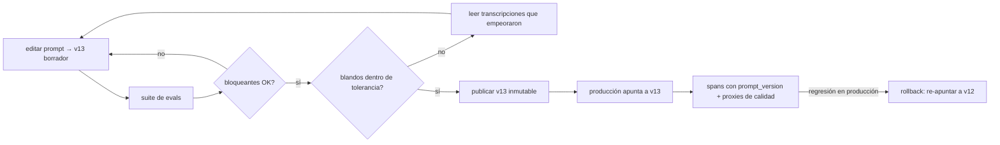

# 155 — LLMOps y gestión de prompts

> [← Clase anterior](../../../classes/part-12-ai-engineering-mlops-llmops-and-agentops/154-deriva-feedback-y-evaluacion-continua/README.md) · [Índice de la parte](../README.md) · [Clase siguiente →](../../../classes/part-12-ai-engineering-mlops-llmops-and-agentops/156-agentops-y-analisis-de-trayectorias/README.md)

**Parte:** 12 — Ingeniería de IA, MLOps, LLMOps y AgentOps  
**Nivel:** experto · **Horas estimadas:** 6  
**Laboratorio:** `observability` · **Estado:** `EXECUTABLE_CORE`

## 🎯 Propósito

Comprender **llmops y gestión de prompts** dentro de la evolución de la inteligencia
artificial, implementar un experimento mínimo verificable y distinguir qué parte
constituye evidencia frente a una afirmación todavía no comprobada.

## 📚 Resultados de aprendizaje

Al finalizar podrás:

1. Explicar llmops y gestión de prompts usando los conceptos `LLMOps`, `prompts`, `versions`, `evals`.
2. Ejecutar el laboratorio con una semilla explícita y revisar su contrato JSON.
3. Identificar al menos un supuesto, una limitación y un riesgo de aplicación.
4. Comparar el enfoque con la etapa anterior de la ruta de aprendizaje.
5. Producir una evidencia reproducible y una conclusión que no exceda los datos.

## 🧩 Conceptos centrales

`LLMOps`, `prompts`, `versions`, `evals`

## 🗺️ Ubicación en el mapa de la IA

En un sistema con LLM, el artefacto que más cambia no son los pesos (que suelen ser de un
proveedor) sino el **prompt** y su configuración. LLMOps traslada la disciplina de MLOps
(145-151) a ese nuevo artefacto: versionarlo, evaluarlo por regresión antes de cada
cambio y observarlo en producción. Esta clase toma la evaluación de LLMs (parte 06) y
la convierte en proceso operado, preparando el terreno de AgentOps (156).

## 📖 Fundamentos

### 📦 El prompt es un artefacto desplegable

Lo que se versiona no es solo el texto: es la **configuración completa de la llamada**,
porque cualquiera de sus campos cambia el comportamiento:

```yaml
prompt_config: soporte-respuestas
version: v12          # inmutable una vez publicada
model: claude-sonnet-4-5      # el modelo es parte del artefacto
params: {max_tokens: 1024, temperature: 0.2}
system: |
  Eres un agente de soporte de ACME. Responde solo con información
  del contexto. Si no está en el contexto, dilo explícitamente.
template: "Contexto:\n{contexto}\n\nPregunta: {pregunta}"
changelog: "v12: añade instrucción anti-alucinación; v11 inventaba políticas"
```

Principios heredados del registro de modelos (150): versiones **inmutables** (v12 no se
edita: se crea v13), despliegue por referencia (producción apunta a una versión, no a un
texto pegado en el código), rollback = re-apuntar, y linaje: cada respuesta en
producción registra `prompt_version` en su span (clase 153).

### 🧪 Evals de regresión

Editar un prompt es editar código sin compilador: la única red es una **suite de evals**
que corre antes de publicar, como los tests en CI (151):

1. **Dataset de evaluación curado**: casos reales + casos límite + casos adversarios,
   con salida esperada o criterios de aceptación. Crece con cada incidente (cada bug
   reportado se convierte en caso).
2. **Calificadores (graders)**: exactos (¿el JSON parsea?, ¿contiene la cláusula
   obligatoria?), programáticos (similitud, regex), o **LLM-as-judge** con rúbrica —
   este último se calibra periódicamente contra juicios humanos y se fija su versión de
   modelo (un juez que cambia solo introduce ruido en la serie histórica).
3. **Comparación A/B de versiones**: `eval(v13) vs eval(v12)` sobre el mismo dataset;
   se publica solo si no hay regresión en los criterios bloqueantes.

```text
publicar v13 si:
  aprobados(v13) ≥ aprobados(v12) en criterios bloqueantes (formato, seguridad)
  y score_medio(v13) ≥ score_medio(v12) − tolerancia en criterios blandos
  y costo y latencia dentro de presupuesto (tokens de entrada del prompt nuevo)
```

### 🎲 El problema del no determinismo

Con `temperature > 0` la misma entrada produce salidas distintas: una eval seria corre
cada caso k veces (o a temperature 0 cuando el caso lo permite) y reporta tasa de
aprobación, no un booleano. La regresión se declara sobre la tasa: «v13 aprueba el caso
de reembolsos 9/10 veces; v12 lo aprobaba 10/10» es una señal, una corrida única no.

### 🔄 Deriva sin tocar nada

Particularidad de LLMOps: el comportamiento puede cambiar **sin que tú cambies nada** —
el proveedor actualiza el modelo, o deprecia la versión anclada. Defensas: fijar la
versión exacta del modelo en la configuración, re-correr la suite ante cualquier anuncio
del proveedor, y monitorear en producción proxies de calidad (tasa de respuestas «no está
en el contexto», longitud media, tasa de fallos de formato) que delatan un cambio de
comportamiento aguas arriba.

## 🧮 Ejemplo trabajado

El equipo edita el prompt de soporte para reducir alucinaciones. Suite: 60 casos
(40 normales, 12 límite, 8 adversarios), k = 5 corridas por caso, juez con rúbrica
fijada + 2 graders exactos (formato JSON, presencia de descargo legal).

```text
                          v12                v13 (candidata)
formato JSON válido       300/300            300/300        bloqueante ✓
descargo legal presente   298/300            300/300        bloqueante ✓
fidelidad al contexto     0.86 (juez)        0.93 (juez)    objetivo ↑ ✓
utilidad percibida        0.81 (juez)        0.74 (juez)    blando: −0.07 ✗ tolerancia 0.05
tokens de entrada         310                415            +34 % de costo por llamada
```

Decisión: **no publicar todavía**. La mejora en fidelidad (el objetivo del cambio) es
real, pero la utilidad cayó más que la tolerancia: el prompt nuevo hace al asistente tan
conservador que responde «no está en el contexto» en casos donde sí estaba (se verifica
leyendo las transcripciones de los 6 casos que empeoraron — las evals dan números, las
transcripciones dan el porqué). Iteración: v14 relaja la instrucción («si la respuesta
está parcialmente, respóndela y señala el límite»), recupera utilidad 0.80 con fidelidad
0.92 y se publica. El costo +34 % se acepta y queda registrado.

## 📊 Propiedades y comparación

| Aspecto | MLOps (modelo propio) | LLMOps (LLM de proveedor) |
|---|---|---|
| Artefacto que más cambia | pesos + features | prompt + configuración + versión de modelo |
| Ciclo de cambio | días-semanas (entrenar) | minutos (editar texto) — por eso más peligroso |
| Test previo al despliegue | eval sobre dataset etiquetado | suite de evals con graders + juez |
| Determinismo | alto (seed propia) | bajo: k corridas por caso, tasas no booleanos |
| Deriva exógena | no (los pesos son tuyos) | sí: el proveedor puede cambiar el modelo |
| Rollback | re-desplegar versión anterior | re-apuntar a prompt_version anterior (segundos) |
| Costo marginal | infraestructura propia | por token: el tamaño del prompt es costo directo |



## ⚠️ Errores conceptuales frecuentes

1. **«Probé el prompt nuevo con tres ejemplos en el playground y mejora.»** Sin suite ni
   k corridas, es anécdota: los prompts mejoran unos casos y rompen otros en silencio
   (por eso el ejemplo trabajado existe).
2. **«El prompt vive en el código.»** Hardcodearlo acopla su ciclo de cambio al del
   despliegue de software e impide rollback independiente y linaje por versión.
3. **«El juez LLM es un oráculo.»** Es un modelo con sesgos (longitud, posición,
   autopreferencia); se calibra contra humanos, se fija su versión y se auditan sus
   discrepancias.
4. **«Temperature 0 me da evals deterministas, luego una corrida basta.»** Reduce la
   varianza pero no la elimina (empates numéricos, no determinismo de inferencia), y
   evalúa un régimen que quizá no es el de producción.
5. **«Si no cambio nada, nada cambia.»** El modelo del proveedor puede cambiar bajo tus
   pies; sin versión fijada y suite re-ejecutable, ni lo detectarás.

## 🚀 Del aprendizaje a la operación

El laboratorio simula el ciclo editar → evaluar → publicar con datos deterministas; en
producción se añade un gestor de prompts con control de acceso (quién puede publicar a
producción), evals en CI con presupuesto de tokens real, calibración periódica del juez
contra muestras humanas, y la cultura que más cuesta: convertir cada incidente de
producción en un caso permanente de la suite, para que el mismo bug no regrese dos veces.

## 🧪 Laboratorio

```bash
python lab.py
```

El laboratorio llama a `ai_evolution.labs.run_lab("observability")`. Esta
decisión evita 183 implementaciones divergentes: cada clase tiene un entrypoint
propio, pero los motores didácticos se prueban como una biblioteca común.

### 🔍 Evidencia esperada

- tipo de laboratorio y semilla;
- entradas o decisiones observables;
- resultado estructurado;
- lista `evidence` con hechos que pueden inspeccionarse;
- lista `limitations` que impide presentar la demo como producción.

## 📓 Notebooks

- [📓 `notebook.ipynb`](notebook.ipynb): recorrido guiado con la materia resumida.
- [✍️ `notebook_student.ipynb`](notebook_student.ipynb): ejercicios para resolver.
- [✅ `notebook_solution.ipynb`](notebook_solution.ipynb): solución de referencia explicada.

## 📝 Evaluación

| Criterio | Peso |
|---|---:|
| Comprensión conceptual | 25 % |
| Ejecución reproducible | 25 % |
| Interpretación basada en evidencia | 25 % |
| Riesgos, límites y mejora propuesta | 25 % |

Consulta [assessment.md](assessment.md) para preguntas y criterio de aceptación.

## ⚠️ Errores comunes

| Síntoma | Causa probable | Corrección |
|---|---|---|
| El código corre, pero no hay conclusión | Se confundió ejecución con aprendizaje | Explica qué demuestra y qué no demuestra |
| El resultado cambia sin explicación | No se registró semilla o configuración | Conserva semilla, versión y parámetros |
| Se promete uso real | Se extrapoló desde una demo educativa | Declara entorno, datos, límites y revisión humana |
| Se copia una métrica aislada | No existe baseline ni costo de error | Añade comparación y criterio de decisión |

## ❓ Preguntas frecuentes

**¿Debo usar una API comercial?**  
No. El núcleo funciona localmente. Las extensiones LIVE se documentan por separado.

**¿El laboratorio representa una implementación industrial?**  
No por sí solo. Enseña el contrato y el patrón; producción exige integración,
seguridad, observabilidad, pruebas y operación.

**¿Dónde profundizo?**  
Revisa las especializaciones enlazadas en el README raíz y la ruta siguiente.

## 🔗 Referencias

- [Anthropic — Documentación: prompt engineering y evaluaciones](https://docs.anthropic.com/)
- [Zheng et al. (2023), "Judging LLM-as-a-Judge with MT-Bench and Chatbot Arena" (arXiv:2306.05685)](https://arxiv.org/abs/2306.05685)
- [OpenTelemetry — Semantic Conventions for Generative AI](https://opentelemetry.io/docs/specs/semconv/gen-ai/)
- [MLflow Documentation — tracking y evaluación de LLMs](https://mlflow.org/docs/latest/)
- [Ribeiro et al. (2020), "Beyond Accuracy: Behavioral Testing of NLP Models with CheckList" (arXiv:2005.04118)](https://arxiv.org/abs/2005.04118)

---

## ⬅️ Clase anterior

[154 — Deriva, feedback y evaluación continua](../../part-12-ai-engineering-mlops-llmops-and-agentops/154-deriva-feedback-y-evaluacion-continua/README.md)

## ➡️ Siguiente clase

[156 — AgentOps y análisis de trayectorias](../../part-12-ai-engineering-mlops-llmops-and-agentops/156-agentops-y-analisis-de-trayectorias/README.md)
