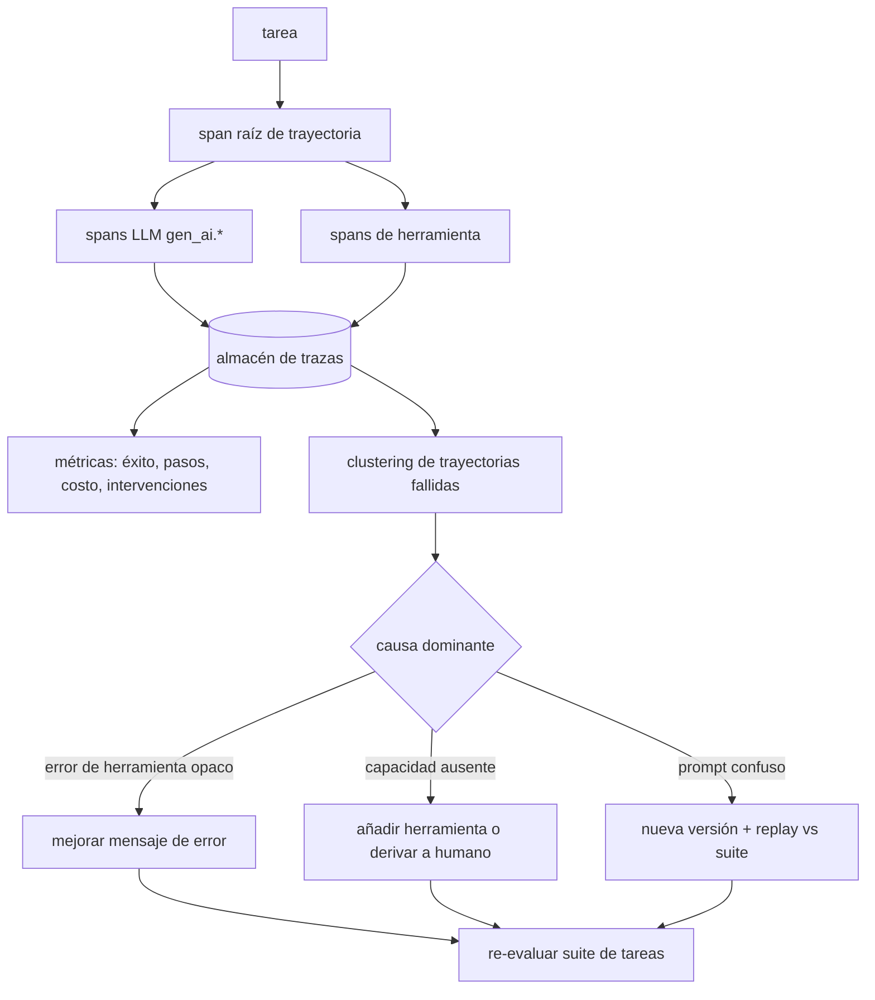

# 156 — AgentOps y análisis de trayectorias

> [← Clase anterior](../../../classes/part-12-ai-engineering-mlops-llmops-and-agentops/155-llmops-y-gestion-de-prompts/README.md) · [Índice de la parte](../README.md) · [Clase siguiente →](../../../classes/part-12-ai-engineering-mlops-llmops-and-agentops/157-costo-latencia-caching-y-capacidad/README.md)

**Parte:** 12 — Ingeniería de IA, MLOps, LLMOps y AgentOps  
**Nivel:** experto · **Horas estimadas:** 6  
**Laboratorio:** `observability` · **Estado:** `EXECUTABLE_CORE`

## 🎯 Propósito

Comprender **agentops y análisis de trayectorias** dentro de la evolución de la inteligencia
artificial, implementar un experimento mínimo verificable y distinguir qué parte
constituye evidencia frente a una afirmación todavía no comprobada.

## 📚 Resultados de aprendizaje

Al finalizar podrás:

1. Explicar agentops y análisis de trayectorias usando los conceptos `AgentOps`, `trajectories`, `tools`, `traces`.
2. Ejecutar el laboratorio con una semilla explícita y revisar su contrato JSON.
3. Identificar al menos un supuesto, una limitación y un riesgo de aplicación.
4. Comparar el enfoque con la etapa anterior de la ruta de aprendizaje.
5. Producir una evidencia reproducible y una conclusión que no exceda los datos.

## 🧩 Conceptos centrales

`AgentOps`, `trajectories`, `tools`, `traces`

## 🗺️ Ubicación en el mapa de la IA

Un LLM responde una llamada; un **agente** ejecuta una trayectoria: decide, usa
herramientas, observa y vuelve a decidir (parte 09). AgentOps extiende LLMOps (155) a ese
objeto más difícil: ya no se evalúa una salida, sino un **camino completo** con longitud
variable, costo variable y efectos en el mundo. Sus trazas son las de la clase 153 con
semántica extra, y sus métricas son las que el proyecto integrador (159) tendrá que
exponer en un panel.

## 📖 Fundamentos

### 🛤️ La trayectoria como unidad de análisis

Una **trayectoria** es la secuencia registrada de una tarea:

```text
tarea T-4471: "reembolsa el pedido 9912 si procede"
  paso 1  razonamiento → tool: consultar_pedido(9912)        → ok (320 ms)
  paso 2  razonamiento → tool: politica_reembolsos(cat=ropa) → ok (180 ms)
  paso 3  razonamiento → tool: crear_reembolso(9912, 100%)   → error: monto>límite
  paso 4  razonamiento → tool: crear_reembolso(9912, 80%)    → ok
  paso 5  respuesta final al usuario                          éxito, 4 pasos
  totales: 5 llamadas LLM, 11 200 tokens in / 840 out, 9.4 s, $0.041
```

Se instrumenta como una traza OTel: un span raíz por tarea, spans hijos por llamada LLM
(`gen_ai.*`) y por herramienta (nombre, argumentos, resultado, error). Sin esta
estructura solo sabrías que la tarea «tardó 9 s»; con ella puedes preguntar *dónde* se
gastan los pasos y *qué* herramienta falla.

### 📊 Métricas de agente

Las cuatro familias que definen la salud de un agente, siempre como distribuciones:

1. **Éxito de tarea**: tasa de tareas completadas correctamente (definida por eval, no
   por «el agente dijo que terminó» — los agentes declaran éxito con optimismo).
2. **Pasos por tarea**: distribución (p50/p95). Colas largas delatan bucles,
   herramientas confusas o tareas fuera de alcance.
3. **Costo por tarea**: tokens y $ (suma de todas las llamadas). Un agente puede tener
   85 % de éxito y ser inviable a $0.80/tarea.
4. **Intervenciones**: cuántas veces un humano corrigió, aprobó o abortó — la métrica
   que mide autonomía *real* y que decide dónde relajar o endurecer los límites.

Métricas de diagnóstico derivadas: tasa de error por herramienta, tasa de recuperación
tras error (¿el paso 3 fallido se corrige en el 4, como arriba, o se repite?), tokens
«desperdiciados» en pasos que no aportaron al resultado.

### 🔬 Análisis de trayectorias

El análisis agregado responde *cuánto*; el de trayectorias responde *por qué*:

- **Clustering de fallos**: agrupar trayectorias fallidas por patrón (misma herramienta,
  mismo tipo de error, mismo punto de abandono). Tres incidentes distintos suelen ser
  un solo bug de descripción de herramienta.
- **Puntos de divergencia**: comparar trayectorias exitosas y fallidas de la misma
  familia de tareas y localizar el primer paso donde difieren.
- **Replay**: re-ejecutar la misma tarea contra una configuración nueva (prompt de
  sistema, set de herramientas) — el champion-challenger (150) aplicado a agentes, con
  la cautela de que las herramientas con efectos reales se *mockean* en el replay.

### 🧯 Evaluación continua de agentes

Igual que en 152 pero sobre tareas: suite de tareas de referencia con criterios de éxito
verificables, ejecutada ante cada cambio de prompt, herramienta o modelo base. La guía
de Anthropic sobre agentes efectivos insiste en el prerequisito: empezar simple e
**instrumentar desde el primer día** — un agente sin trazas es indepurable por diseño.

## 🧮 Ejemplo trabajado

Agente de soporte, semana de 1 000 tareas:

```text
métrica                    valor        lectura
éxito (eval)               84.0 %       ¿bien? depende del costo del 16 % restante
pasos p50 / p95            4 / 19       p95 ≈ 5× p50 → hay bucles
costo medio / p95          $0.05 / $0.31
intervenciones             9.0 %        1 de cada 11 tareas necesitó un humano
```

Clustering de las 160 tareas fallidas:

```text
cluster A  62 fallos  crear_reembolso devuelve "monto>límite" y el agente reintenta
                      el MISMO monto hasta agotar presupuesto de pasos (bucle)
cluster B  41 fallos  la tarea exige consultar envíos: herramienta inexistente
cluster C  57 fallos  variados (larga cola)
```

Acciones quirúrgicas, no «mejorar el prompt» en abstracto: para A, incluir el límite
máximo en el mensaje de error de la herramienta (el agente reintentaba a ciegas porque
el error no decía el límite) — fallos A caen a 8; para B, o añadir la herramienta de
envíos o declarar la tarea fuera de alcance y derivarla a humano en el paso 1 (mejor
9 % de intervención temprana que 19 pasos de agonía). El p95 de pasos baja de 19 a 9.
Nada de esto era visible en la tasa de éxito agregada: salió de leer trayectorias.

## 📊 Propiedades y comparación

| Aspecto | LLMOps (llamada única) | AgentOps (trayectoria) |
|---|---|---|
| Unidad evaluada | respuesta | tarea completa (multi-paso) |
| Métrica primaria | calidad de la salida | éxito de tarea verificado |
| Costo | por llamada, acotado | por tarea, variable (pasos × llamadas) |
| No determinismo | una muestra por salida | se compone: bifurca en cada paso |
| Fallo típico | respuesta incorrecta | bucles, herramienta equivocada, éxito declarado falso |
| Depuración | leer la respuesta | leer la trayectoria (spans LLM + tools) |
| Seguridad | contenido | contenido + **acciones con efectos** (límites, aprobaciones) |



## ⚠️ Errores conceptuales frecuentes

1. **«El agente dijo que completó la tarea, cuento éxito.»** El éxito auto-reportado
   sobreestima sistemáticamente; el éxito se verifica con un criterio externo (estado
   del sistema, eval, humano muestreado).
2. **«Optimizar la tasa de éxito agregada.»** Sin clustering de fallos, se «mejora el
   prompt» a ciegas; los fallos de agentes vienen en familias con causas concretas
   (herramienta opaca, capacidad ausente), como muestra el ejemplo.
3. **«Menos pasos siempre es mejor.»** Un agente puede acortar trayectorias saltándose
   verificaciones; pasos p50 se lee junto con éxito e intervenciones, nunca solo.
4. **«Las intervenciones humanas son ruido a eliminar.»** Son la señal de autonomía
   real y la red de seguridad: la meta es reducirlas *donde el agente demuestra
   fiabilidad*, no suprimir el mecanismo.
5. **«Replay de trayectorias = repetir la tarea.»** Sin mockear herramientas con
   efectos (pagos, correos), el replay re-ejecuta efectos reales; y con estado del mundo
   cambiado, la comparación puede no ser válida.

## 🚀 Del aprendizaje a la operación

El laboratorio analiza trayectorias sintéticas deterministas; producción añade
plataformas de trazas para agentes (backends OTel, LangSmith y equivalentes), muestreo
de trayectorias largas, redacción de PII en argumentos de herramientas, presupuestos
duros por tarea (pasos, tokens, $) aplicados en el runtime, y revisión humana periódica
de trayectorias muestreadas — porque las métricas dicen cuánto falla el agente, pero
solo leer trayectorias enseña *cómo* falla.

## 🧪 Laboratorio

```bash
python lab.py
```

El laboratorio llama a `ai_evolution.labs.run_lab("observability")`. Esta
decisión evita 183 implementaciones divergentes: cada clase tiene un entrypoint
propio, pero los motores didácticos se prueban como una biblioteca común.

### 🔍 Evidencia esperada

- tipo de laboratorio y semilla;
- entradas o decisiones observables;
- resultado estructurado;
- lista `evidence` con hechos que pueden inspeccionarse;
- lista `limitations` que impide presentar la demo como producción.

## 📓 Notebooks

- [📓 `notebook.ipynb`](notebook.ipynb): recorrido guiado con la materia resumida.
- [✍️ `notebook_student.ipynb`](notebook_student.ipynb): ejercicios para resolver.
- [✅ `notebook_solution.ipynb`](notebook_solution.ipynb): solución de referencia explicada.

## 📝 Evaluación

| Criterio | Peso |
|---|---:|
| Comprensión conceptual | 25 % |
| Ejecución reproducible | 25 % |
| Interpretación basada en evidencia | 25 % |
| Riesgos, límites y mejora propuesta | 25 % |

Consulta [assessment.md](assessment.md) para preguntas y criterio de aceptación.

## ⚠️ Errores comunes

| Síntoma | Causa probable | Corrección |
|---|---|---|
| El código corre, pero no hay conclusión | Se confundió ejecución con aprendizaje | Explica qué demuestra y qué no demuestra |
| El resultado cambia sin explicación | No se registró semilla o configuración | Conserva semilla, versión y parámetros |
| Se promete uso real | Se extrapoló desde una demo educativa | Declara entorno, datos, límites y revisión humana |
| Se copia una métrica aislada | No existe baseline ni costo de error | Añade comparación y criterio de decisión |

## ❓ Preguntas frecuentes

**¿Debo usar una API comercial?**  
No. El núcleo funciona localmente. Las extensiones LIVE se documentan por separado.

**¿El laboratorio representa una implementación industrial?**  
No por sí solo. Enseña el contrato y el patrón; producción exige integración,
seguridad, observabilidad, pruebas y operación.

**¿Dónde profundizo?**  
Revisa las especializaciones enlazadas en el README raíz y la ruta siguiente.

## 🔗 Referencias

- [Anthropic, "Building Effective Agents"](https://www.anthropic.com/research/building-effective-agents)
- [Anthropic — Documentación: agentes y uso de herramientas](https://docs.anthropic.com/)
- [OpenTelemetry — Semantic Conventions for Generative AI](https://opentelemetry.io/docs/specs/semconv/gen-ai/)
- [Yao et al. (2023), "ReAct: Synergizing Reasoning and Acting in Language Models" (arXiv:2210.03629)](https://arxiv.org/abs/2210.03629)
- [Model Context Protocol — especificación](https://modelcontextprotocol.io/)

<!-- papers:inicio -->

---

## 📜 Papers que fundamentan esta clase

> Bloque generado por `python scripts/link_papers_to_classes.py`. La fuente es [`papers/catalog/papers.json`](../../../papers/catalog/papers.json).

| Paper | Año | Qué desbloqueó | Miniatura |
|---|---:|---|---|
| [P117 · AgentBench: evaluar modelos de lenguaje como agentes](../../../papers/foundational/P117_agentops/README.md) | 2023 | Evalúa agentes en ocho entornos distintos y hace visible que la tasa agregada esconde dónde y cómo fallan. | [notebook](../../../notebooks/papers/P117_agentops.ipynb) |

Cada ficha explica el problema anterior, la matemática mínima, los límites y los errores de atribución más frecuentes. Para leerlas con método: [cómo leer un paper de IA](../../../papers/guides/COMO_LEER_UN_PAPER_DE_IA.md) · [anexos matemáticos](../../../papers/annexes/README.md).
<!-- papers:fin -->
---

## ⬅️ Clase anterior

[155 — LLMOps y gestión de prompts](../../part-12-ai-engineering-mlops-llmops-and-agentops/155-llmops-y-gestion-de-prompts/README.md)

## ➡️ Siguiente clase

[157 — Costo, latencia, caching y capacidad](../../part-12-ai-engineering-mlops-llmops-and-agentops/157-costo-latencia-caching-y-capacidad/README.md)
