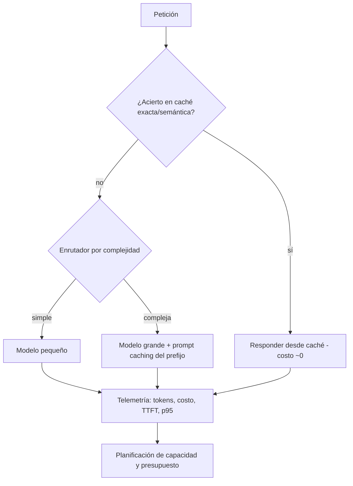

# 157 — Costo, latencia, caching y capacidad

> [← Clase anterior](../../../classes/part-12-ai-engineering-mlops-llmops-and-agentops/156-agentops-y-analisis-de-trayectorias/README.md) · [Índice de la parte](../README.md) · [Clase siguiente →](../../../classes/part-12-ai-engineering-mlops-llmops-and-agentops/158-resiliencia-idempotencia-rollback-y-recuperacion/README.md)

**Parte:** 12 — Ingeniería de IA, MLOps, LLMOps y AgentOps  
**Nivel:** experto · **Horas estimadas:** 6  
**Laboratorio:** `observability` · **Estado:** `EXECUTABLE_CORE`

## 🎯 Propósito

Comprender **costo, latencia, caching y capacidad** dentro de la evolución de la inteligencia
artificial, implementar un experimento mínimo verificable y distinguir qué parte
constituye evidencia frente a una afirmación todavía no comprobada.

## 📚 Resultados de aprendizaje

Al finalizar podrás:

1. Explicar costo, latencia, caching y capacidad usando los conceptos `cost`, `latency`, `cache`, `capacity`.
2. Ejecutar el laboratorio con una semilla explícita y revisar su contrato JSON.
3. Identificar al menos un supuesto, una limitación y un riesgo de aplicación.
4. Comparar el enfoque con la etapa anterior de la ruta de aprendizaje.
5. Producir una evidencia reproducible y una conclusión que no exceda los datos.

## 🧩 Conceptos centrales

`cost`, `latency`, `cache`, `capacity`

## 🗺️ Ubicación en el mapa de la IA

Después de saber desplegar (152), observar (153) y evaluar continuamente
(151-153) un sistema de IA, esta clase aborda la restricción que decide si el
sistema sobrevive: la **economía de la inferencia**. Los LLM cobraron por token
lo que antes era un costo fijo de servir un modelo propio, y convirtieron el
costo y la latencia en variables de diseño de producto. Lo que se aprende aquí
— modelo de costo por token, percentiles de latencia, caching y planificación
de capacidad — alimenta directamente la resiliencia (158) y el proyecto final
de plataforma observable (159).

## 📖 Fundamentos

### 💰 Modelo de costo por token

En un LLM servido por API el costo de una petición es lineal en tokens, con
precios distintos para entrada y salida (la salida es más cara porque se genera
token a token):

```text
costo_peticion = t_in · p_in + t_out · p_out
costo_mensual  = N · costo_peticion_promedio

t_in, t_out : tokens de entrada / salida
p_in, p_out : precio por token (usualmente cotizado por millón de tokens, MTok)
N           : peticiones por mes
```

Tres consecuencias de la linealidad: (1) el prompt de sistema se paga en **cada
petición**, por lo que recortarlo o cachearlo tiene efecto multiplicativo;
(2) limitar `max_tokens` acota el peor caso de costo y de latencia; (3) el
costo por petición varía con la longitud, así que se presupuesta con la
distribución real de tráfico, no con un promedio inventado.

### ⏱️ Latencia: percentiles, no promedios

La latencia de inferencia se descompone en **TTFT** (time to first token,
dominado por el procesamiento del prompt) y **tiempo por token de salida**
(generación autoregresiva). Se reporta con percentiles:

- **p50** (mediana): experiencia típica.
- **p95 / p99**: experiencia de cola; con muchas peticiones por sesión, casi
  todo usuario toca la cola (si una página hace 10 llamadas, la probabilidad de
  que al menos una caiga sobre el p95 es 1 − 0.95¹⁰ ≈ 40 %).

El promedio es engañoso porque la distribución tiene cola pesada: un p50 de
800 ms con p99 de 12 s da un promedio «aceptable» y usuarios furiosos. Los SLO
(Google SRE) se definen sobre percentiles: «p95 < 2 s durante 30 días».

### 🗃️ Caching en sistemas de IA

| Tipo | Qué guarda | Acierta cuando | Riesgo |
|---|---|---|---|
| Caché exacta | respuesta por hash del prompt | prompt idéntico byte a byte | invalidación al cambiar modelo/prompt |
| Prompt caching (API) | prefijo procesado (KV cache) | prefijo compartido (sistema + contexto) | requiere prefijos estables |
| Caché semántica | respuesta por similitud de embedding | paráfrasis de la misma pregunta | servir respuesta incorrecta a pregunta parecida |

El ahorro esperado con tasa de aciertos `h` y costo de acierto casi nulo:
`costo_efectivo ≈ (1 − h) · costo_peticion + h · costo_lookup`. Una caché
semántica exige umbral de similitud calibrado y métrica de *falsos aciertos*,
porque un acierto incorrecto es un error silencioso de calidad.

### 📈 Planificación de capacidad

Con llegadas de λ peticiones/s y tiempo medio de servicio S, la ley de Little
da la concurrencia media `L = λ · W` (W = tiempo en el sistema). La utilización
`ρ = λ · S / c` (c = servidores o slots de inferencia) debe mantenerse lejos de
1: en colas, la espera crece de forma no lineal al acercarse a saturación. La
práctica: dimensionar para el pico previsto con margen (p. ej. ρ ≤ 0.6-0.7 en
pico), definir límites de tasa por cliente y una política de degradación
(modelo más pequeño, cola, rechazo explícito) antes de saturar.

## 🧮 Ejemplo trabajado

Asistente interno: 200 000 peticiones/mes; promedio 1 800 tokens de entrada
(1 200 de ellos son un prefijo estable de sistema + contexto) y 350 de salida.
Precios ilustrativos: p_in = 3 USD/MTok, p_out = 15 USD/MTok; el prefijo
cacheado se cobra a 0.3 USD/MTok con tasa de acierto 0.9.

```text
Sin caché:
  costo_peticion = 1800·(3/1e6) + 350·(15/1e6)
                 = 0.0054 + 0.00525 = 0.01065 USD
  costo_mensual  = 200000 · 0.01065 = 2 130 USD

Con prompt caching (0.9 de aciertos sobre los 1 200 tokens de prefijo):
  entrada = 600·(3/1e6)                       (tokens no cacheables)
          + 0.9·1200·(0.3/1e6)                (prefijo con acierto)
          + 0.1·1200·(3/1e6)                  (prefijo sin acierto)
          = 0.0018 + 0.000324 + 0.00036 = 0.002484 USD
  costo_peticion = 0.002484 + 0.00525 = 0.007734 USD
  costo_mensual  = 200000 · 0.007734 ≈ 1 547 USD   (−27 %)
```

Capacidad: pico de λ = 5 peticiones/s con S = 2 s por petición y 4 peticiones
concurrentes por réplica → concurrencia media L = λ·S = 10; réplicas mínimas
= 10/4 = 2.5 → 3 réplicas a ρ ≈ 0.83: demasiado justo; con margen (ρ ≤ 0.6)
se dimensionan 5 réplicas. La decisión queda documentada con sus supuestos.

## 📊 Propiedades y comparación

| Palanca | Reduce costo | Reduce latencia | Riesgo de calidad | Esfuerzo |
|---|---|---|---|---|
| Recortar prompt / max_tokens | Sí | Sí | Medio (pérdida de contexto) | Bajo |
| Prompt caching | Sí (entrada) | Sí (TTFT) | Nulo | Bajo |
| Caché semántica | Sí (peticiones enteras) | Sí | Alto (falsos aciertos) | Medio |
| Modelo más pequeño / enrutamiento | Sí | Sí | Medio-alto (medir con evals) | Medio |
| Batching / streaming | No directo | Percibida (streaming) | Nulo | Medio |
| Más réplicas | No (sube) | Sí (colas) | Nulo | Bajo |



## ⚠️ Errores conceptuales frecuentes

1. **«La latencia promedio es buena, el sistema está bien.»** Los usuarios
   viven en los percentiles; con varias llamadas por sesión, la cola p95/p99
   domina la experiencia.
2. **«La caché semántica es ahorro gratis.»** Un acierto con umbral mal
   calibrado sirve una respuesta a otra pregunta: es un error de calidad
   silencioso que ninguna métrica de costo detecta.
3. **«Presupuesto con el prompt de prueba.»** El costo real depende de la
   distribución de longitudes en producción; el prompt de desarrollo suele ser
   más corto que el contexto real con RAG e historial.
4. **«Dimensionar al 100 % de utilización.»** Cerca de saturación la espera en
   cola crece de forma no lineal; sin margen, cualquier pico degrada a todos.
5. **«Optimizar costo es solo cambiar de modelo.»** Sin evals (clases 154-155)
   un modelo más barato puede costar más en correcciones, reintentos y fuga de
   usuarios que lo que ahorra por token.

## 🚀 Del aprendizaje a la operación

El laboratorio calcula costos y percentiles sobre tráfico sintético; operar de
verdad exige medir tokens y latencia reales por petición (OpenTelemetry, clase
150), atribuir costo por equipo/función, alertar sobre presupuesto y sobre SLO
de p95, recalibrar la caché semántica con evals periódicas y revisar precios y
límites de tasa del proveedor, que cambian con cada generación de modelos.

## 🧪 Laboratorio

```bash
python lab.py
```

El laboratorio llama a `ai_evolution.labs.run_lab("observability")`. Esta
decisión evita 183 implementaciones divergentes: cada clase tiene un entrypoint
propio, pero los motores didácticos se prueban como una biblioteca común.

### 🔍 Evidencia esperada

- tipo de laboratorio y semilla;
- entradas o decisiones observables;
- resultado estructurado;
- lista `evidence` con hechos que pueden inspeccionarse;
- lista `limitations` que impide presentar la demo como producción.

## 📓 Notebooks

- [📓 `notebook.ipynb`](notebook.ipynb): recorrido guiado con la materia resumida.
- [✍️ `notebook_student.ipynb`](notebook_student.ipynb): ejercicios para resolver.
- [✅ `notebook_solution.ipynb`](notebook_solution.ipynb): solución de referencia explicada.

## 📝 Evaluación

| Criterio | Peso |
|---|---:|
| Comprensión conceptual | 25 % |
| Ejecución reproducible | 25 % |
| Interpretación basada en evidencia | 25 % |
| Riesgos, límites y mejora propuesta | 25 % |

Consulta [assessment.md](assessment.md) para preguntas y criterio de aceptación.

## ⚠️ Errores comunes

| Síntoma | Causa probable | Corrección |
|---|---|---|
| El código corre, pero no hay conclusión | Se confundió ejecución con aprendizaje | Explica qué demuestra y qué no demuestra |
| El resultado cambia sin explicación | No se registró semilla o configuración | Conserva semilla, versión y parámetros |
| Se promete uso real | Se extrapoló desde una demo educativa | Declara entorno, datos, límites y revisión humana |
| Se copia una métrica aislada | No existe baseline ni costo de error | Añade comparación y criterio de decisión |

## ❓ Preguntas frecuentes

**¿Debo usar una API comercial?**  
No. El núcleo funciona localmente. Las extensiones LIVE se documentan por separado.

**¿El laboratorio representa una implementación industrial?**  
No por sí solo. Enseña el contrato y el patrón; producción exige integración,
seguridad, observabilidad, pruebas y operación.

**¿Dónde profundizo?**  
Revisa las especializaciones enlazadas en el README raíz y la ruta siguiente.

## 🔗 Referencias

- Anthropic — *Prompt caching* (documentación oficial): <https://docs.anthropic.com/en/docs/build-with-claude/prompt-caching>
- Google — *Site Reliability Engineering* (Beyer et al., 2016), cap. «Service Level Objectives», libro gratuito: <https://sre.google/sre-book/service-level-objectives/>
- Dean y Barroso (2013) — *The Tail at Scale*, CACM 56(2): <https://dl.acm.org/doi/10.1145/2408776.2408794>
- Little (1961) — *A Proof for the Queuing Formula L = λW*, Operations Research 9(3): <https://doi.org/10.1287/opre.9.3.383>
- Huyen — *Designing Machine Learning Systems* (O'Reilly, 2022): <https://www.oreilly.com/library/view/designing-machine-learning/9781098107956/>
- OpenTelemetry — documentación oficial (métricas y trazas para medir latencia y uso): <https://opentelemetry.io/docs/>

---

## ⬅️ Clase anterior

[156 — AgentOps y análisis de trayectorias](../../part-12-ai-engineering-mlops-llmops-and-agentops/156-agentops-y-analisis-de-trayectorias/README.md)

## ➡️ Siguiente clase

[158 — Resiliencia, idempotencia, rollback y recuperación](../../part-12-ai-engineering-mlops-llmops-and-agentops/158-resiliencia-idempotencia-rollback-y-recuperacion/README.md)
