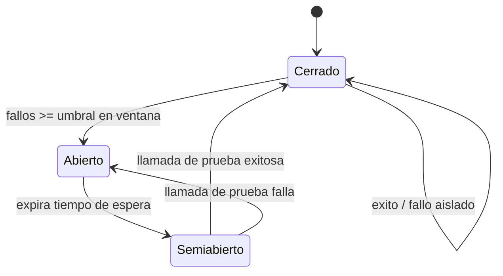

# 158 — Resiliencia, idempotencia, rollback y recuperación

> [← Clase anterior](../../../classes/part-12-ai-engineering-mlops-llmops-and-agentops/157-costo-latencia-caching-y-capacidad/README.md) · [Índice de la parte](../README.md) · [Clase siguiente →](../../../classes/part-12-ai-engineering-mlops-llmops-and-agentops/159-proyecto-plataforma-de-ia-observable/README.md)

**Parte:** 12 — Ingeniería de IA, MLOps, LLMOps y AgentOps  
**Nivel:** experto · **Horas estimadas:** 6  
**Laboratorio:** `workflow` · **Estado:** `EXECUTABLE_CORE`

## 🎯 Propósito

Comprender **resiliencia, idempotencia, rollback y recuperación** dentro de la evolución de la inteligencia
artificial, implementar un experimento mínimo verificable y distinguir qué parte
constituye evidencia frente a una afirmación todavía no comprobada.

## 📚 Resultados de aprendizaje

Al finalizar podrás:

1. Explicar resiliencia, idempotencia, rollback y recuperación usando los conceptos `resilience`, `idempotency`, `rollback`, `recovery`.
2. Ejecutar el laboratorio con una semilla explícita y revisar su contrato JSON.
3. Identificar al menos un supuesto, una limitación y un riesgo de aplicación.
4. Comparar el enfoque con la etapa anterior de la ruta de aprendizaje.
5. Producir una evidencia reproducible y una conclusión que no exceda los datos.

## 🧩 Conceptos centrales

`resilience`, `idempotency`, `rollback`, `recovery`

## 🗺️ Ubicación en el mapa de la IA

Los sistemas de IA en producción dependen de servicios remotos (APIs de
modelos, vector stores, colas) que **fallan con normalidad estadística**: la
pregunta no es si fallan sino cuándo. Esta clase importa a la ingeniería de IA
los patrones de estabilidad que Michael Nygard sistematizó en *Release It!*
tras años de sistemas caídos en producción — reintentos con backoff, circuit
breaker, bulkheads — y les suma idempotencia, rollback y sagas. Completa la
economía de la clase 157 (un reintento mal diseñado duplica costo y latencia) y
prepara el proyecto integrador 156.

## 📖 Fundamentos

### 🔁 Reintentos con backoff exponencial y jitter

Ante un fallo transitorio (timeout, HTTP 429/503) se reintenta esperando cada
vez más, con aleatoriedad para no sincronizar a todos los clientes:

```text
espera_n = random(0, min(tope, base · 2^n))      # "full jitter" (AWS)

n     : número de intento (0, 1, 2, …)
base  : espera inicial (p. ej. 0.5 s)
tope  : espera máxima (p. ej. 30 s)
```

Sin jitter, mil clientes que fallaron juntos reintentan juntos y producen una
**estampida sincronizada** (thundering herd) que vuelve a tumbar al servicio.
Reglas duras: reintentar solo errores transitorios (nunca un 400 o un error de
validación), acotar el número de intentos, y presupuestar el peor caso: con
3 intentos y espera media `tope/2`, la latencia p99 puede multiplicarse.

### ⚡ Circuit breaker

Un reintento protege una petición; el circuit breaker protege al **sistema**.
Es una máquina de estados alrededor de la dependencia:

- **Cerrado**: las llamadas pasan; se cuentan los fallos recientes.
- **Abierto**: tras superar el umbral de fallos, las llamadas se rechazan de
  inmediato (fail fast) sin tocar la dependencia, dándole tiempo a recuperarse.
- **Semiabierto**: pasado un tiempo, se deja pasar una llamada de prueba; si
  funciona se cierra, si falla se reabre.

Sin breaker, los reintentos de todos los clientes convierten una degradación
parcial en una **falla en cascada**: cada capa agota sus hilos esperando a la
capa caída (el antipatrón que Nygard llama *integration point* sin defensas).

### 🔒 Idempotencia

Una operación es idempotente si ejecutarla N veces produce el mismo estado que
ejecutarla una vez: `f(f(x)) = f(x)`. Es el **prerrequisito de los
reintentos**: reintentar un cobro no idempotente cobra dos veces. Técnica
estándar: el cliente genera una *idempotency key* única por operación lógica;
el servidor registra la clave y, si se repite, devuelve el resultado original
sin re-ejecutar. En agentes: reejecutar un paso de una trayectoria (enviar
correo, escribir fila) exige la misma disciplina.

### ↩️ Rollback y sagas

- **Rollback de despliegue**: volver a la versión anterior (modelo, prompt,
  código) ante degradación. Requisitos: artefactos versionados e inmutables
  (clase 150), despliegue gradual con baseline (canary), y datos compatibles
  hacia atrás — el rollback de código no deshace una migración de esquema.
- **Saga** (Garcia-Molina y Salem, 1987): una transacción larga se parte en
  pasos T₁…Tₙ, cada uno con una **compensación** C₁…Cₙ. Si falla Tₖ, se
  ejecutan Cₖ₋₁…C₁ en orden inverso. No hay aislamiento ACID: la compensación
  es una acción nueva que revierte el efecto (cancelar reserva, reembolsar),
  no un «undo» mágico. Es el modelo natural para trayectorias de agentes con
  efectos externos: cada herramienta con efecto debe declarar su compensación
  o marcarse como no compensable (y entonces exigir aprobación previa, clase
  144).

## 🧮 Ejemplo trabajado

Cliente llama a una API de LLM con `base = 0.5 s`, `tope = 30 s`, máximo
4 intentos, full jitter. Secuencia de esperas máximas:

```text
intento 0 falla → espera ~ U(0, min(30, 0.5·1))  = U(0, 0.5 s)
intento 1 falla → espera ~ U(0, min(30, 0.5·2))  = U(0, 1 s)
intento 2 falla → espera ~ U(0, min(30, 0.5·4))  = U(0, 2 s)
intento 3 falla → error definitivo al llamador

Peor caso de espera acumulada = 0.5 + 1 + 2 = 3.5 s (+ 4 timeouts)
Espera media acumulada ≈ 0.25 + 0.5 + 1 = 1.75 s
```

Circuit breaker con umbral «5 fallos en 30 s» y ventana de recuperación de
60 s: si la API cae del todo, tras ~5 llamadas el breaker abre y las
siguientes fallan en <1 ms hacia el fallback (respuesta en caché o modelo
local), en lugar de gastar 3.5 s + timeouts por petición. La saga del agente
«reservar viaje»: T₁ reservar vuelo / C₁ cancelar vuelo; T₂ reservar hotel /
C₂ cancelar hotel; T₃ cobrar / C₃ reembolsar. Si T₃ falla definitivamente,
se ejecutan C₂ y C₁; la idempotency key por paso evita duplicados si la
compensación misma se reintenta.

## 📊 Propiedades y comparación

| Patrón | Protege contra | Ámbito | Requiere | Riesgo si se usa mal |
|---|---|---|---|---|
| Retry + backoff + jitter | Fallos transitorios | Una petición | Operación idempotente | Amplificar carga y costo |
| Circuit breaker | Falla en cascada | Una dependencia | Umbrales calibrados | Abrir por fallos no representativos |
| Idempotency key | Efectos duplicados | Una operación con efecto | Almacén de claves | Clave mal elegida = deduplicar de más |
| Rollback | Versión degradada | Despliegue | Artefactos versionados, canary | Esquemas de datos incompatibles |
| Saga | Transacción larga fallida | Flujo multi-paso | Compensación por paso | Pasos sin compensación posible |



## ⚠️ Errores conceptuales frecuentes

1. **«Reintentar siempre es inofensivo.»** Sin idempotencia duplica efectos;
   sin jitter sincroniza clientes; sin límite convierte una degradación en
   ataque de denegación autoinfligido.
2. **«El circuit breaker es un retry sofisticado.»** Son complementarios y de
   ámbito distinto: el retry insiste por una petición; el breaker deja de
   insistir por todo el sistema para proteger a la dependencia.
3. **«Idempotencia = la operación no hace nada dos veces.»** Hace lo mismo:
   el estado final es idéntico y el cliente recibe el mismo resultado; no es
   lo mismo que ignorar la segunda llamada con un error.
4. **«El rollback deshace todo.»** Revierte el artefacto desplegado, no los
   efectos ya producidos (filas escritas, correos enviados, migraciones);
   para efectos se necesitan compensaciones (saga).
5. **«Las sagas dan garantías ACID.»** No hay aislamiento: estados intermedios
   son visibles y la compensación puede fallar; se diseña para
   *consistencia eventual* con reintentos idempotentes de la compensación.

## 🚀 Del aprendizaje a la operación

El laboratorio simula fallos con semilla fija; en producción los patrones se
implementan con bibliotecas probadas (resiliencia del SDK del proveedor,
tenacity, Polly, mallas de servicio), los umbrales del breaker se calibran con
telemetría real (clase 153), cada reintento se registra con su costo (clase
154), y los runbooks de rollback se ensayan — un rollback que nunca se probó
es una hipótesis, no un plan de recuperación.

## 🧪 Laboratorio

```bash
python lab.py
```

El laboratorio llama a `ai_evolution.labs.run_lab("workflow")`. Esta
decisión evita 183 implementaciones divergentes: cada clase tiene un entrypoint
propio, pero los motores didácticos se prueban como una biblioteca común.

### 🔍 Evidencia esperada

- tipo de laboratorio y semilla;
- entradas o decisiones observables;
- resultado estructurado;
- lista `evidence` con hechos que pueden inspeccionarse;
- lista `limitations` que impide presentar la demo como producción.

## 📓 Notebooks

- [📓 `notebook.ipynb`](notebook.ipynb): recorrido guiado con la materia resumida.
- [✍️ `notebook_student.ipynb`](notebook_student.ipynb): ejercicios para resolver.
- [✅ `notebook_solution.ipynb`](notebook_solution.ipynb): solución de referencia explicada.

## 📝 Evaluación

| Criterio | Peso |
|---|---:|
| Comprensión conceptual | 25 % |
| Ejecución reproducible | 25 % |
| Interpretación basada en evidencia | 25 % |
| Riesgos, límites y mejora propuesta | 25 % |

Consulta [assessment.md](assessment.md) para preguntas y criterio de aceptación.

## ⚠️ Errores comunes

| Síntoma | Causa probable | Corrección |
|---|---|---|
| El código corre, pero no hay conclusión | Se confundió ejecución con aprendizaje | Explica qué demuestra y qué no demuestra |
| El resultado cambia sin explicación | No se registró semilla o configuración | Conserva semilla, versión y parámetros |
| Se promete uso real | Se extrapoló desde una demo educativa | Declara entorno, datos, límites y revisión humana |
| Se copia una métrica aislada | No existe baseline ni costo de error | Añade comparación y criterio de decisión |

## ❓ Preguntas frecuentes

**¿Debo usar una API comercial?**  
No. El núcleo funciona localmente. Las extensiones LIVE se documentan por separado.

**¿El laboratorio representa una implementación industrial?**  
No por sí solo. Enseña el contrato y el patrón; producción exige integración,
seguridad, observabilidad, pruebas y operación.

**¿Dónde profundizo?**  
Revisa las especializaciones enlazadas en el README raíz y la ruta siguiente.

## 🔗 Referencias

- Nygard — *Release It! Design and Deploy Production-Ready Software* (2.ª ed., Pragmatic Bookshelf, 2018): patrones de estabilidad (circuit breaker, bulkhead, timeout). <https://pragprog.com/titles/mnee2/release-it-second-edition/>
- Garcia-Molina y Salem (1987) — *Sagas*, SIGMOD '87: <https://doi.org/10.1145/38713.38742>
- AWS Architecture Blog — *Exponential Backoff and Jitter* (análisis comparativo de estrategias de jitter): <https://aws.amazon.com/blogs/architecture/exponential-backoff-and-jitter/>
- Google — *Site Reliability Engineering*, cap. «Addressing Cascading Failures», libro gratuito: <https://sre.google/sre-book/addressing-cascading-failures/>
- Anthropic — manejo de errores y límites de tasa de la API (códigos de error y cabeceras de reintento): <https://docs.anthropic.com/en/api/errors>

<!-- papers:inicio -->

---

## 📜 Papers que fundamentan esta clase

> Bloque generado por `python scripts/link_papers_to_classes.py`. La fuente es [`papers/catalog/papers.json`](../../../papers/catalog/papers.json).

| Paper | Año | Qué desbloqueó | Miniatura |
|---|---:|---|---|
| [P108 · CAP doce años después: cómo han cambiado las «reglas»](../../../papers/foundational/P108_cap/README.md) | 2012 | Corrige la lectura simplista de su propio teorema: no se eligen dos de tres, se elige por operación y solo mientras dura la partición. | [notebook](../../../notebooks/papers/P108_cap.ipynb) |

Cada ficha explica el problema anterior, la matemática mínima, los límites y los errores de atribución más frecuentes. Para leerlas con método: [cómo leer un paper de IA](../../../papers/guides/COMO_LEER_UN_PAPER_DE_IA.md) · [anexos matemáticos](../../../papers/annexes/README.md).
<!-- papers:fin -->
---

## ⬅️ Clase anterior

[157 — Costo, latencia, caching y capacidad](../../part-12-ai-engineering-mlops-llmops-and-agentops/157-costo-latencia-caching-y-capacidad/README.md)

## ➡️ Siguiente clase

[159 — Proyecto: plataforma de IA observable](../../part-12-ai-engineering-mlops-llmops-and-agentops/159-proyecto-plataforma-de-ia-observable/README.md)
