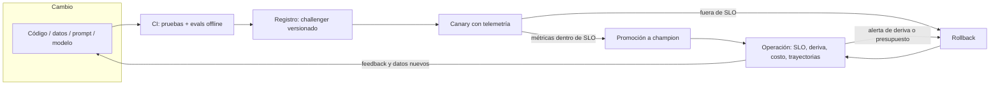

# 159 — Proyecto: plataforma de IA observable

> [← Clase anterior](../../../classes/part-12-ai-engineering-mlops-llmops-and-agentops/158-resiliencia-idempotencia-rollback-y-recuperacion/README.md) · [Índice de la parte](../README.md) · [Clase siguiente →](../../../classes/part-13-evaluation-safety-security-and-governance/160-diseno-de-evaluaciones-y-criterios-de-exito/README.md)

**Parte:** 12 — Ingeniería de IA, MLOps, LLMOps y AgentOps  
**Nivel:** experto · **Horas estimadas:** 10  
**Laboratorio:** `capstone` · **Estado:** `EXECUTABLE_CORE`

## 🎯 Propósito

Comprender **proyecto: plataforma de ia observable** dentro de la evolución de la inteligencia
artificial, implementar un experimento mínimo verificable y distinguir qué parte
constituye evidencia frente a una afirmación todavía no comprobada.

## 📚 Resultados de aprendizaje

Al finalizar podrás:

1. Explicar proyecto: plataforma de ia observable usando los conceptos `platform`, `observability`, `release`, `SLO`.
2. Ejecutar el laboratorio con una semilla explícita y revisar su contrato JSON.
3. Identificar al menos un supuesto, una limitación y un riesgo de aplicación.
4. Comparar el enfoque con la etapa anterior de la ruta de aprendizaje.
5. Producir una evidencia reproducible y una conclusión que no exceda los datos.

## 🧩 Conceptos centrales

`platform`, `observability`, `release`, `SLO`

## 🗺️ Ubicación en el mapa de la IA

Este proyecto cierra la parte 12 integrando las once clases anteriores en un
solo artefacto: una **plataforma de IA observable**, el sustrato que separa a
las organizaciones que operan IA de las que solo la demuestran. La lección de
fondo viene de Sculley et al. (2015): en un sistema real de ML el modelo es
una fracción pequeña del código; lo que domina es la infraestructura de datos,
serving, monitoreo y operación. La parte 13 construirá encima la evaluación,
la seguridad y la gobernanza — que solo son posibles si esta capa produce
evidencia trazable.

## 📖 Fundamentos

### 🏗️ Qué es una plataforma de IA observable

Una plataforma es el conjunto de capacidades compartidas que todo caso de uso
de IA de la organización reutiliza en lugar de reinventar. El proyecto integra
las piezas de las clases 148-158 como un pipeline único:

1. **Ciclo de vida y trazabilidad (145-146)**: cada artefacto (dataset,
   modelo, prompt, configuración de agente) tiene versión, linaje y semillas
   registradas. Regla: si no puedes decir *qué* produjo una predicción, no
   puedes depurarla ni auditarla.
2. **Registro y promoción (150)**: los artefactos pasan por etapas
   (challenger → champion) con criterios de promoción explícitos y
   comparación contra baseline, no por antigüedad ni entusiasmo.
3. **CI/CD y pruebas (151)**: cada cambio — código, datos, prompt — dispara
   pruebas unitarias, de contrato y de comportamiento (evals) antes de llegar
   a producción.
4. **Serving (152)**: online, batch o streaming según el caso, detrás de un
   contrato estable que permite cambiar el modelo sin cambiar a los clientes.
5. **Observabilidad (153)**: logs estructurados, métricas y trazas
   distribuidas (OpenTelemetry) con atributos específicos de IA: versión de
   modelo y de prompt, tokens, costo, latencia por span, id de trayectoria.
6. **Evaluación continua y deriva (151-153)**: la calidad no se mide una vez
   sino como serie temporal; deriva de datos y de comportamiento disparan
   alertas y re-evaluación; las trayectorias de agentes se analizan como
   trazas.
7. **Economía y resiliencia (154-155)**: presupuesto y SLO por servicio;
   reintentos, breakers y rollbacks ensayados.

### 📐 SLO y presupuesto de error

Un **SLI** es una medición (proporción de peticiones bajo 2 s); un **SLO** es
el objetivo sobre el SLI (99 % mensual); el **presupuesto de error** es el
complemento (1 % ≈ 7.3 h/mes de incumplimiento tolerado). El presupuesto
convierte la fiabilidad en una moneda de decisión: si se está gastando
demasiado rápido, se congelan lanzamientos y se invierte en estabilidad. En
IA se añaden SLO de **calidad** (tasa de aprobación de evals en producción) y
de **costo** (USD por 1 000 peticiones), no solo de disponibilidad y latencia.

### 🚦 Release con evidencia: el ciclo completo

```text
cambio (código | datos | prompt | modelo)
  → CI: pruebas + evals offline contra baseline      (148, 151)
  → registro: nueva versión candidata (challenger)    (146, 147)
  → canary: x % de tráfico con telemetría comparada   (149, 150)
  → decisión con datos: promover | rollback           (147, 155)
  → operación: SLO, deriva, costo, trayectorias       (150-154)
```

La propiedad integradora: **cada flecha produce evidencia** (reporte de evals,
diff de métricas canary vs. champion, traza del rollback). Una plataforma
donde las decisiones de release no dejan evidencia no es observable, por más
dashboards que tenga.

## 🧮 Ejemplo trabajado

Se quiere promover el prompt `v12` sobre el champion `v11` en un asistente con
SLO: p95 < 2 s, aprobación de evals ≥ 90 %, costo ≤ 12 USD/1k peticiones.

| Etapa | Evidencia producida | Resultado |
|---|---|---|
| Evals offline (n=500) | v12: 93 % vs. v11: 89 % | pasa (Δ+4 pts) |
| Registro | `prompt:v12` etiquetado challenger, linaje al commit | trazable |
| Canary 10 %, 48 h | p95: 1.7 s vs. 1.6 s; costo 11.2 vs. 10.8 USD/1k; aprobación online 91 % vs. 88 % | dentro de SLO |
| Decisión | promoción aprobada; v11 queda como objetivo de rollback | registrada |
| Día 5 | alerta de deriva: aprobación online cae a 84 % | presupuesto de error gastándose |
| Respuesta | rollback a v11 en minutos (artefacto inmutable, 155) + análisis de trayectorias (156) | causa: nuevo tipo de consulta, no v12 |

Nota honesta: el rollback no recuperó la calidad (la causa era deriva de
datos, no el prompt). La evidencia por etapa es lo que permitió distinguirlo
en horas y no en semanas.

## 📊 Propiedades y comparación

| Enfoque | Tiempo hasta detectar degradación | Atribución de causa | Costo de operación | Riesgo principal |
|---|---|---|---|---|
| Scripts ad hoc por proyecto | Semanas (usuarios se quejan) | Casi imposible | Bajo al inicio, explota después | Deuda técnica oculta (Sculley 2015) |
| Monitoreo de infraestructura solamente | Horas para caídas, nunca para calidad | Parcial (sin versión de modelo/prompt) | Medio | Degradación de calidad invisible |
| Plataforma observable (esta clase) | Minutos-horas (SLO + evals online) | Alta (linaje + trazas + versiones) | Alto al inicio, amortizado | Sobre-ingeniería para un solo caso de uso |



## ⚠️ Errores conceptuales frecuentes

1. **«Observabilidad = dashboards.»** Un dashboard muestra lo que alguien
   decidió graficar; observabilidad es poder responder preguntas nuevas con la
   telemetría existente (trazas con atributos ricos, no solo paneles).
2. **«El modelo es la plataforma.»** Sculley et al. (2015): el código de ML es
   una fracción pequeña del sistema; ignorar la infraestructura circundante
   acumula deuda técnica oculta con intereses compuestos.
3. **«Un SLO del 100 % es el ideal.»** Un objetivo de perfección elimina el
   presupuesto de error y con él la capacidad de lanzar cambios; la fiabilidad
   extra por encima de lo que el usuario nota tiene costo y no tiene valor.
4. **«Las evals offline garantizan la calidad online.»** El tráfico real
   deriva (154); las evals offline son condición necesaria de promoción, no
   suficiente — por eso existe el canary con evaluación online.
5. **«El rollback resuelve cualquier degradación.»** Solo revierte el
   artefacto; si la causa es deriva de datos o un fallo de dependencia, la
   plataforma debe poder distinguirlo con linaje y trazas (el ejemplo
   trabajado lo muestra).

## 🚀 Del aprendizaje a la operación

El laboratorio integra los conceptos sobre un pipeline simulado con semilla
fija; una plataforma real exige además: multi-tenancy con cuotas y
presupuestos por equipo, control de acceso y auditoría sobre el registro de
artefactos, retención y privacidad de la telemetría (los prompts pueden
contener datos personales), guardias de despliegue integrados con el sistema
de incidentes, y un equipo de plataforma que la trate como producto interno
con sus propios SLO.

## 🧪 Laboratorio

```bash
python lab.py
```

El laboratorio llama a `ai_evolution.labs.run_lab("capstone")`. Esta
decisión evita 183 implementaciones divergentes: cada clase tiene un entrypoint
propio, pero los motores didácticos se prueban como una biblioteca común.

### 🔍 Evidencia esperada

- tipo de laboratorio y semilla;
- entradas o decisiones observables;
- resultado estructurado;
- lista `evidence` con hechos que pueden inspeccionarse;
- lista `limitations` que impide presentar la demo como producción.

## 📓 Notebooks

- [📓 `notebook.ipynb`](notebook.ipynb): recorrido guiado con la materia resumida.
- [✍️ `notebook_student.ipynb`](notebook_student.ipynb): ejercicios para resolver.
- [✅ `notebook_solution.ipynb`](notebook_solution.ipynb): solución de referencia explicada.

## 📝 Evaluación

| Criterio | Peso |
|---|---:|
| Comprensión conceptual | 25 % |
| Ejecución reproducible | 25 % |
| Interpretación basada en evidencia | 25 % |
| Riesgos, límites y mejora propuesta | 25 % |

Consulta [assessment.md](assessment.md) para preguntas y criterio de aceptación.

## ⚠️ Errores comunes

| Síntoma | Causa probable | Corrección |
|---|---|---|
| El código corre, pero no hay conclusión | Se confundió ejecución con aprendizaje | Explica qué demuestra y qué no demuestra |
| El resultado cambia sin explicación | No se registró semilla o configuración | Conserva semilla, versión y parámetros |
| Se promete uso real | Se extrapoló desde una demo educativa | Declara entorno, datos, límites y revisión humana |
| Se copia una métrica aislada | No existe baseline ni costo de error | Añade comparación y criterio de decisión |

## ❓ Preguntas frecuentes

**¿Debo usar una API comercial?**  
No. El núcleo funciona localmente. Las extensiones LIVE se documentan por separado.

**¿El laboratorio representa una implementación industrial?**  
No por sí solo. Enseña el contrato y el patrón; producción exige integración,
seguridad, observabilidad, pruebas y operación.

**¿Dónde profundizo?**  
Revisa las especializaciones enlazadas en el README raíz y la ruta siguiente.

## 🔗 Referencias

- Sculley et al. (2015) — *Hidden Technical Debt in Machine Learning Systems*, NeurIPS 28: <https://papers.nips.cc/paper/2015/hash/86df7dcfd896fcaf2674f757a2463eba-Abstract.html>
- OpenTelemetry — documentación oficial (trazas, métricas, logs y convenciones semánticas): <https://opentelemetry.io/docs/>
- Google — *Site Reliability Engineering* (Beyer et al., 2016), caps. «Service Level Objectives» y «Embracing Risk», libro gratuito: <https://sre.google/sre-book/table-of-contents/>
- MLflow — documentación oficial (tracking, registro de modelos y evaluación): <https://mlflow.org/docs/latest/>
- Huyen — *Designing Machine Learning Systems* (O'Reilly, 2022): <https://www.oreilly.com/library/view/designing-machine-learning/9781098107956/>
- Nygard — *Release It!* (2.ª ed., 2018), patrones de estabilidad para la capa de resiliencia: <https://pragprog.com/titles/mnee2/release-it-second-edition/>

<!-- papers:inicio -->

---

## 📜 Papers que fundamentan esta clase

> Bloque generado por `python scripts/link_papers_to_classes.py`. La fuente es [`papers/catalog/papers.json`](../../../papers/catalog/papers.json).

| Paper | Año | Qué desbloqueó | Miniatura |
|---|---:|---|---|
| [P117 · AgentBench: evaluar modelos de lenguaje como agentes](../../../papers/foundational/P117_agentops/README.md) | 2023 | Evalúa agentes en ocho entornos distintos y hace visible que la tasa agregada esconde dónde y cómo fallan. | [notebook](../../../notebooks/papers/P117_agentops.ipynb) |

Cada ficha explica el problema anterior, la matemática mínima, los límites y los errores de atribución más frecuentes. Para leerlas con método: [cómo leer un paper de IA](../../../papers/guides/COMO_LEER_UN_PAPER_DE_IA.md) · [anexos matemáticos](../../../papers/annexes/README.md).
<!-- papers:fin -->
---

## ⬅️ Clase anterior

[158 — Resiliencia, idempotencia, rollback y recuperación](../../part-12-ai-engineering-mlops-llmops-and-agentops/158-resiliencia-idempotencia-rollback-y-recuperacion/README.md)

## ➡️ Siguiente clase

[160 — Diseño de evaluaciones y criterios de éxito](../../part-13-evaluation-safety-security-and-governance/160-diseno-de-evaluaciones-y-criterios-de-exito/README.md)
