# 🛠️ Parte 12 — Ingeniería de IA, MLOps, LLMOps y AgentOps

**Nivel:** experto · **Duración sugerida:** 6–7 semanas ·
**Clases:** 12

Industrializa datos, modelos y agentes mediante CI/CD, registros, serving, observabilidad, control de costos, recuperación y operación segura.

## 🧭 Secuencia de la parte

```mermaid
flowchart LR
    L145["145<br/>Ciclo de vida<br/>de datos, modelos<br/>y agentes"]
    L146["146<br/>Experimentos, semillas y<br/>trazabilidad"]
    L147["147<br/>Registro y promoción<br/>champion-challenger"]
    L148["148<br/>CI/CD y pruebas<br/>para sistemas de<br/>IA"]
    L149["149<br/>Serving online, batch<br/>y streaming"]
    L150["150<br/>Observabilidad: logs, métricas<br/>y trazas"]
    L151["151<br/>Deriva, feedback y<br/>evaluación continua"]
    L152["152<br/>LLMOps y gestión<br/>de prompts"]
    L153["153<br/>AgentOps y análisis<br/>de trayectorias"]
    L154["154<br/>Costo, latencia, caching<br/>y capacidad"]
    L155["155<br/>Resiliencia, idempotencia, rollback<br/>y recuperación"]
    L156["156<br/>Proyecto: plataforma de<br/>IA observable"]
    L145 --> L146
    L146 --> L147
    L147 --> L148
    L148 --> L149
    L149 --> L150
    L150 --> L151
    L151 --> L152
    L152 --> L153
    L153 --> L154
    L154 --> L155
    L155 --> L156
```

## 📚 Clases

| ID | Tema | Laboratorio | Horas |
|---:|---|---|---:|
| 145 | [Ciclo de vida de datos, modelos y agentes](145-ciclo-de-vida-de-datos-modelos-y-agentes/README.md) | `workflow` | 6 |
| 146 | [Experimentos, semillas y trazabilidad](146-experimentos-semillas-y-trazabilidad/README.md) | `observability` | 6 |
| 147 | [Registro y promoción champion-challenger](147-registro-y-promocion-champion-challenger/README.md) | `workflow` | 6 |
| 148 | [CI/CD y pruebas para sistemas de IA](148-ci-cd-y-pruebas-para-sistemas-de-ia/README.md) | `evaluation` | 6 |
| 149 | [Serving online, batch y streaming](149-serving-online-batch-y-streaming/README.md) | `observability` | 6 |
| 150 | [Observabilidad: logs, métricas y trazas](150-observabilidad-logs-metricas-y-trazas/README.md) | `observability` | 6 |
| 151 | [Deriva, feedback y evaluación continua](151-deriva-feedback-y-evaluacion-continua/README.md) | `evaluation` | 6 |
| 152 | [LLMOps y gestión de prompts](152-llmops-y-gestion-de-prompts/README.md) | `observability` | 6 |
| 153 | [AgentOps y análisis de trayectorias](153-agentops-y-analisis-de-trayectorias/README.md) | `observability` | 6 |
| 154 | [Costo, latencia, caching y capacidad](154-costo-latencia-caching-y-capacidad/README.md) | `observability` | 6 |
| 155 | [Resiliencia, idempotencia, rollback y recuperación](155-resiliencia-idempotencia-rollback-y-recuperacion/README.md) | `workflow` | 6 |
| 156 | [Proyecto: plataforma de IA observable](156-proyecto-plataforma-de-ia-observable/README.md) | `capstone` | 10 |

## 📝 Evaluación de la parte

- 40 % laboratorios y notebooks.
- 25 % explicaciones y comparación de enfoques.
- 20 % evaluación de riesgos y limitaciones.
- 15 % mini-proyecto o integración.

[⬅️ Parte 11 — IA encarnada, robótica y uso de computadores](../part-11-embodied-ai-robotics-and-computer-use/README.md) · [🏠 Volver al programa](../../README.md) · [➡️ Parte 13 — Evaluación, seguridad y gobernanza](../part-13-evaluation-safety-security-and-governance/README.md)
