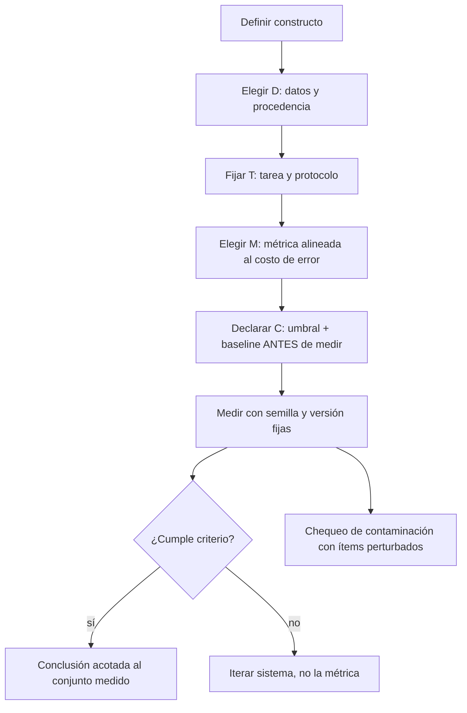

# 160 — Diseño de evaluaciones y criterios de éxito

> [← Clase anterior](../../../classes/part-12-ai-engineering-mlops-llmops-and-agentops/159-proyecto-plataforma-de-ia-observable/README.md) · [Índice de la parte](../README.md) · [Clase siguiente →](../../../classes/part-13-evaluation-safety-security-and-governance/161-golden-datasets-regresion-y-llm-as-judge/README.md)

**Parte:** 13 — Evaluación, seguridad y gobernanza  
**Nivel:** experto · **Horas estimadas:** 6  
**Laboratorio:** `evaluation` · **Estado:** `EXECUTABLE_CORE`

## 🎯 Propósito

Comprender **diseño de evaluaciones y criterios de éxito** dentro de la evolución de la inteligencia
artificial, implementar un experimento mínimo verificable y distinguir qué parte
constituye evidencia frente a una afirmación todavía no comprobada.

## 📚 Resultados de aprendizaje

Al finalizar podrás:

1. Explicar diseño de evaluaciones y criterios de éxito usando los conceptos `evals`, `rubric`, `success`, `benchmark`.
2. Ejecutar el laboratorio con una semilla explícita y revisar su contrato JSON.
3. Identificar al menos un supuesto, una limitación y un riesgo de aplicación.
4. Comparar el enfoque con la etapa anterior de la ruta de aprendizaje.
5. Producir una evidencia reproducible y una conclusión que no exceda los datos.

## 🧩 Conceptos centrales

`evals`, `rubric`, `success`, `benchmark`

## 🗺️ Ubicación en el mapa de la IA

La evaluación es la bisagra entre construir sistemas de IA (partes 1-12) y poder afirmar algo
sobre ellos. Sin un diseño de evaluación explícito, cualquier métrica es una anécdota: los
benchmarks públicos que impulsaron el progreso (ImageNet, GLUE, MMLU) también enseñaron sus
patologías — contaminación, sobreajuste al test y pérdida de validez. Esta clase abre la parte 13
porque todo lo que sigue (seguridad, fairness, gobernanza) depende de saber medir con honestidad.

## 📖 Fundamentos

### 🎯 Qué es una evaluación

Una **evaluación (eval)** es un procedimiento reproducible que convierte el comportamiento de un
sistema en una medida comparable contra un criterio de éxito declarado *antes* de medir.
Formalmente tiene cuatro componentes:

```text
Eval = (D, T, M, C)
  D: conjunto de datos o escenarios de prueba (con su procedencia documentada)
  T: tarea y protocolo (prompt, formato de respuesta, n intentos, temperatura)
  M: métrica (exact match, F1, pass@k, tasa de rechazo, rúbrica 1-5...)
  C: criterio de éxito (umbral, comparación contra baseline, o costo de error)
```

Si falta cualquiera de los cuatro, no hay evaluación: hay una demo con números.

### 🧱 Validez de constructo

El **constructo** es la capacidad abstracta que se quiere medir ("razonamiento matemático",
"utilidad como asistente"). La **validez de constructo** es el grado en que la medida realmente
captura ese constructo y no otra cosa. Amenazas típicas:

- **Subrepresentación**: el benchmark cubre solo una porción del constructo (MMLU mide opción
  múltiple, no razonamiento abierto).
- **Varianza irrelevante**: la métrica premia artefactos ajenos al constructo (longitud de la
  respuesta, formato, orden de las opciones).
- **Contaminación de benchmarks**: los ítems de test aparecieron en el corpus de entrenamiento;
  el modelo memoriza en lugar de generalizar. Se detecta con ítems perturbados (paráfrasis,
  renombrar variables) y comparando la caída de rendimiento: una caída grande ante perturbaciones
  que preservan el significado sugiere memorización.
- **Ley de Goodhart**: cuando una métrica se vuelve objetivo, deja de ser buena medida. Optimizar
  el leaderboard degrada el constructo.

### 📏 Tipos de métrica y protocolo

```text
Métrica            Tarea típica                Riesgo principal
exact match        respuesta cerrada           castiga sinónimos válidos
F1 / accuracy      clasificación               engañosa con clases desbalanceadas
pass@k             generación de código        depende de la suite de tests
rúbrica graduada   respuesta abierta           subjetividad del evaluador
preferencia A/B    calidad comparativa         sesgos de posición y longitud
```

El **protocolo** debe fijar todo lo que afecta el resultado: versión del modelo, prompt exacto,
temperatura, número de muestras, criterio de parsing. Cambiar el protocolo cambia el número:
reportar métricas sin protocolo es irreproducible por construcción.

### 🧭 Criterios de éxito

Un criterio de éxito útil se declara antes de medir y tiene tres partes: **umbral** (qué número
basta), **baseline** (contra qué se compara: azar, heurística, versión anterior, humano) y
**costo de error** (qué vale más: un falso positivo o un falso negativo). Un 92 % de accuracy es
ininterpretable sin saber que el azar da 50 %, la versión anterior daba 91 % y cada falso negativo
cuesta una revisión manual.

## 🧮 Ejemplo trabajado

Diseñemos la evaluación de un clasificador de tickets de soporte ("urgente" / "normal") con 200
ítems de test donde solo 20 son urgentes (10 %).

1. **Baseline trivial**: predecir siempre "normal" da accuracy = 180/200 = **90 %**. Por tanto,
   accuracy no sirve como métrica principal: el constructo es "detectar urgencias", no "acertar".
2. **Métrica alineada al costo**: perder una urgencia es caro; una falsa alarma es barata.
   Elegimos recall de la clase urgente como métrica principal y precisión como guardarraíl.
3. **Medición**: el modelo marca 30 tickets como urgentes; 16 lo son de verdad.
   - Recall = 16/20 = **0.80** · Precisión = 16/30 = **0.533**
   - Accuracy = (16 + 166)/200 = 0.91 — apenas 1 punto sobre el baseline trivial, pese a que el
     modelo sí aporta valor. La métrica equivocada habría ocultado el aporte.
4. **Criterio de éxito declarado**: recall ≥ 0.75 con precisión ≥ 0.50, medido con semilla y
   protocolo fijos. Resultado: **cumple**. La conclusión válida es "cumple el criterio en este
   conjunto"; no "funciona en producción".
5. **Chequeo de contaminación**: se reformulan 30 ítems conservando el significado. Si el recall
   cae de 0.80 a 0.55, hay sospecha de memorización de frases, no detección de urgencia.

## 📊 Propiedades y comparación

| Enfoque | Costo | Reproducibilidad | Validez de constructo | Riesgo dominante |
|---|---|---|---|---|
| Benchmark público | bajo | alta | baja-media | contaminación, Goodhart |
| Golden set propio | medio | alta | media-alta | tamaño pequeño, sesgo del autor |
| Rúbrica humana | alto | media | alta | inconsistencia entre jueces |
| LLM-as-judge | bajo | media | media | sesgos del juez (clase 161) |
| A/B en producción | alto | baja | máxima | riesgo para usuarios reales |



## ⚠️ Errores conceptuales frecuentes

1. **"Accuracy alta = buen modelo"**. Con clases desbalanceadas, el baseline trivial ya es alto;
   sin baseline, el número no informa nada.
2. **"El benchmark mide lo que dice su nombre"**. Un benchmark de "razonamiento" puede medirse
   con memoria; la validez de constructo se argumenta, no se asume.
3. **"Elegir la métrica después de ver resultados"**. Eso es *metric shopping*: garantiza
   encontrar algún número favorable y anula la evaluación.
4. **"Más ítems siempre es mejor"**. 50 ítems bien diseñados y auditados superan a 5 000
   contaminados o mal etiquetados; el error de etiquetado pone un techo a lo medible.
5. **"Un buen resultado en el benchmark garantiza producción"**. El benchmark es una muestra del
   constructo bajo un protocolo; producción cambia distribución, adversarios y costos.

## 🚀 Del aprendizaje a la operación

Este núcleo enseña a diseñar la evaluación; operar evaluaciones exige además: versionar datasets
y protocolos como código, automatizar la corrida en CI ante cada cambio de modelo o prompt,
monitorear drift entre la distribución evaluada y la real, renovar ítems para combatir
contaminación, y separar el equipo que diseña la eval del que optimiza el sistema para mitigar
Goodhart. Nada de eso está en esta demo: aquí solo se establece el contrato conceptual.

## 🧪 Laboratorio

```bash
python lab.py
```

El laboratorio llama a `ai_evolution.labs.run_lab("evaluation")`. Esta
decisión evita 183 implementaciones divergentes: cada clase tiene un entrypoint
propio, pero los motores didácticos se prueban como una biblioteca común.

### 🔍 Evidencia esperada

- tipo de laboratorio y semilla;
- entradas o decisiones observables;
- resultado estructurado;
- lista `evidence` con hechos que pueden inspeccionarse;
- lista `limitations` que impide presentar la demo como producción.

## 📓 Notebooks

- [📓 `notebook.ipynb`](notebook.ipynb): recorrido guiado con la materia resumida.
- [✍️ `notebook_student.ipynb`](notebook_student.ipynb): ejercicios para resolver.
- [✅ `notebook_solution.ipynb`](notebook_solution.ipynb): solución de referencia explicada.

## 📝 Evaluación

| Criterio | Peso |
|---|---:|
| Comprensión conceptual | 25 % |
| Ejecución reproducible | 25 % |
| Interpretación basada en evidencia | 25 % |
| Riesgos, límites y mejora propuesta | 25 % |

Consulta [assessment.md](assessment.md) para preguntas y criterio de aceptación.

## ⚠️ Errores comunes

| Síntoma | Causa probable | Corrección |
|---|---|---|
| El código corre, pero no hay conclusión | Se confundió ejecución con aprendizaje | Explica qué demuestra y qué no demuestra |
| El resultado cambia sin explicación | No se registró semilla o configuración | Conserva semilla, versión y parámetros |
| Se promete uso real | Se extrapoló desde una demo educativa | Declara entorno, datos, límites y revisión humana |
| Se copia una métrica aislada | No existe baseline ni costo de error | Añade comparación y criterio de decisión |

## ❓ Preguntas frecuentes

**¿Debo usar una API comercial?**  
No. El núcleo funciona localmente. Las extensiones LIVE se documentan por separado.

**¿El laboratorio representa una implementación industrial?**  
No por sí solo. Enseña el contrato y el patrón; producción exige integración,
seguridad, observabilidad, pruebas y operación.

**¿Dónde profundizo?**  
Revisa las especializaciones enlazadas en el README raíz y la ruta siguiente.

## 🔗 Referencias

- [Liang et al. (2022), *Holistic Evaluation of Language Models* (HELM), arXiv:2211.09110](https://arxiv.org/abs/2211.09110) — uso: fuente primaria del mecanismo estudiado
- [Hendrycks et al. (2020), *Measuring Massive Multitask Language Understanding* (MMLU), arXiv:2009.03300](https://arxiv.org/abs/2009.03300) — uso: fuente primaria del mecanismo estudiado
- [Raji et al. (2021), *AI and the Everything in the Whole Wide World Benchmark*, arXiv:2111.15366](https://arxiv.org/abs/2111.15366) — uso: fuente primaria del mecanismo estudiado
- [NIST AI Risk Management Framework](https://www.nist.gov/itl/ai-risk-management-framework) — uso: marco normativo de referencia
- [Zheng et al. (2023), *Judging LLM-as-a-Judge with MT-Bench and Chatbot Arena*, arXiv:2306.05685](https://arxiv.org/abs/2306.05685) — uso: fuente primaria del mecanismo estudiado

<!-- papers:inicio -->

---

## 📜 Papers que fundamentan esta clase

> Bloque generado por `python scripts/link_papers_to_classes.py`. La fuente es [`papers/catalog/papers.json`](../../../papers/catalog/papers.json).

| Paper | Año | Qué desbloqueó | Miniatura |
|---|---:|---|---|
| [P51 · SWE-bench: ¿pueden los modelos resolver incidencias reales de GitHub?](../../../papers/foundational/P51_swebench/README.md) | 2023 | Cambia el criterio de evaluación: no si el código parece bien, sino si los tests del repositorio real pasan. | [notebook](../../../notebooks/papers/P51_swebench.ipynb) |
| [P52 · Hacia la monosemanticidad: descomponer modelos de lenguaje con aprendizaje de diccionario](../../../papers/foundational/P52_superposition/README.md) | 2023 | Explica por qué una neurona no significa una cosa, y propone una forma de descomponer las activaciones en características interpretables. | [notebook](../../../notebooks/papers/P52_superposition.ipynb) |

Cada ficha explica el problema anterior, la matemática mínima, los límites y los errores de atribución más frecuentes. Para leerlas con método: [cómo leer un paper de IA](../../../papers/guides/COMO_LEER_UN_PAPER_DE_IA.md) · [anexos matemáticos](../../../papers/annexes/README.md).
<!-- papers:fin -->
<!-- bibliografia:inicio -->

---

## 📚 Bibliografía de apoyo

> Bloque generado por `python scripts/link_sources_to_classes.py`. Cada obra lleva su localizador verificado en [`sources/bibliography.json`](../../../sources/bibliography.json).

Los papers dicen **de dónde salió** el mecanismo. Estas obras lo **desarrollan** con el espacio que una clase no tiene: teoría completa, demostraciones y ejercicios.

| Obra | Edición | Localizador | Papel en esta clase |
|---|---|---|---|
| Huyen, Chip — *Designing Machine Learning Systems* | 2022 | [ISBN 9781098107956](https://openlibrary.org/isbn/9781098107956) · [web de la obra](https://www.oreilly.com/library/view/designing-machine-learning/9781098107956/) · _pendiente de confirmar en su catálogo_ | obra de referencia de la parte 13 · capítulos de evaluación y monitorización |
| Russell, Stuart J. y Norvig, Peter — *Artificial Intelligence: A Modern Approach* | 4.ª · 2020 | [ISBN 9780134610993](https://openlibrary.org/isbn/9780134610993) · [web de la obra](https://aima.cs.berkeley.edu/) | obra de referencia de la parte 13 · capítulo de filosofía, ética y seguridad de la IA |

**Normas y documentación oficial que aplica esta clase:** [AI Risk Management Framework](https://www.nist.gov/itl/ai-risk-management-framework)
<!-- bibliografia:fin -->

---

## ⬅️ Clase anterior

[159 — Proyecto: plataforma de IA observable](../../part-12-ai-engineering-mlops-llmops-and-agentops/159-proyecto-plataforma-de-ia-observable/README.md)

## ➡️ Siguiente clase

[161 — Golden datasets, regresión y LLM-as-judge](../../part-13-evaluation-safety-security-and-governance/161-golden-datasets-regresion-y-llm-as-judge/README.md)
