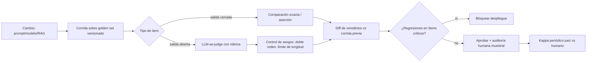

# 161 — Golden datasets, regresión y LLM-as-judge

> [← Clase anterior](../../../classes/part-13-evaluation-safety-security-and-governance/160-diseno-de-evaluaciones-y-criterios-de-exito/README.md) · [Índice de la parte](../README.md) · [Clase siguiente →](../../../classes/part-13-evaluation-safety-security-and-governance/162-red-teaming-y-abuso/README.md)

**Parte:** 13 — Evaluación, seguridad y gobernanza  
**Nivel:** experto · **Horas estimadas:** 6  
**Laboratorio:** `evaluation` · **Estado:** `EXECUTABLE_CORE`

## 🎯 Propósito

Comprender **golden datasets, regresión y llm-as-judge** dentro de la evolución de la inteligencia
artificial, implementar un experimento mínimo verificable y distinguir qué parte
constituye evidencia frente a una afirmación todavía no comprobada.

## 📚 Resultados de aprendizaje

Al finalizar podrás:

1. Explicar golden datasets, regresión y llm-as-judge usando los conceptos `golden set`, `regression`, `judge`, `agreement`.
2. Ejecutar el laboratorio con una semilla explícita y revisar su contrato JSON.
3. Identificar al menos un supuesto, una limitación y un riesgo de aplicación.
4. Comparar el enfoque con la etapa anterior de la ruta de aprendizaje.
5. Producir una evidencia reproducible y una conclusión que no exceda los datos.

## 🧩 Conceptos centrales

`golden set`, `regression`, `judge`, `agreement`

## 🗺️ Ubicación en el mapa de la IA

Si la clase 160 estableció qué es una evaluación, esta clase resuelve cómo sostenerla en el
tiempo: el golden set convierte la eval en una suite de regresión ejecutable ante cada cambio, y
el LLM-as-judge (popularizado por MT-Bench y Chatbot Arena en 2023) escala la calificación de
respuestas abiertas donde no existe una respuesta única. Ambas técnicas son hoy el estándar de
facto en ingeniería de LLMs, y ambas fallan de formas medibles que esta clase enseña a auditar.

## 📖 Fundamentos

### 🥇 Golden datasets

Un **golden set** es un conjunto pequeño y curado de casos con salida esperada (o rúbrica de
aceptación) verificada por humanos, versionado como código. Sus propiedades definitorias:

- **Curado, no muestreado**: cada ítem existe por una razón (caso típico, caso borde, fallo
  histórico, riesgo regulatorio). Un buen golden set es un mapa de riesgos, no una muestra aleatoria.
- **Etiqueta de calidad máxima**: la etiqueta se revisa por más de una persona; un golden set con
  5 % de etiquetas erróneas impone un techo de ~95 % a lo que puede medirse.
- **Versionado y trazable**: cambiar un ítem es un cambio de contrato y se registra (quién, cuándo,
  por qué), igual que el código.

### 🔁 Evaluación de regresión

La **regresión** aplica el golden set ante cada cambio (modelo, prompt, temperatura, RAG,
herramientas) y compara contra la corrida anterior:

```text
para cada ítem i del golden set:
    salida_nueva  = sistema_nuevo(entrada_i)
    veredicto_i   = comparar(salida_nueva, esperado_i)   # exacto, contains, rúbrica, judge
reporte = {pasa, falla, NUEVOS fallos vs corrida previa, fallos CORREGIDOS}
```

Lo accionable no es la tasa global sino el **diff de veredictos**: qué casos que pasaban ahora
fallan (regresión real) y cuáles se corrigieron. Un cambio que sube el promedio pero rompe 3 casos
críticos puede ser inaceptable: por eso los ítems llevan severidad.

### ⚖️ LLM-as-judge

Un **LLM-as-judge** usa un modelo (idealmente distinto y más capaz que el evaluado) para calificar
salidas abiertas, con tres modos: puntuación absoluta con rúbrica (1-10), comparación por pares
(A vs B) y veredicto con referencia (¿coincide con la respuesta dorada?). Zheng et al.
(arXiv:2306.05685) midieron que GPT-4 como juez alcanza >80 % de acuerdo con preferencias humanas
en MT-Bench — comparable al acuerdo humano-humano — pero documentaron sesgos sistemáticos:

- **Sesgo de posición**: en comparaciones A/B, favorece una posición (típicamente la primera).
  Mitigación: evaluar ambos órdenes y aceptar solo veredictos consistentes.
- **Sesgo de verbosidad**: favorece respuestas más largas aunque no sean mejores.
- **Sesgo de autopreferencia**: un modelo tiende a preferir salidas de su propia familia.
- **Capacidad limitada en matemáticas/razonamiento**: el juez no detecta errores que él mismo
  cometería; calificar por encima de la capacidad del juez no es fiable.

### 📐 Calibración del juez contra humanos

Antes de confiar en un judge se mide su **acuerdo** con etiquetas humanas en una muestra. El
acuerdo bruto engaña cuando las clases están desbalanceadas; se usa **kappa de Cohen**:

```text
kappa = (p_o - p_e) / (1 - p_e)
  p_o: acuerdo observado (proporción de ítems donde juez y humano coinciden)
  p_e: acuerdo esperado por azar (a partir de las distribuciones marginales)
Guía habitual: <0.2 pobre · 0.2-0.4 débil · 0.4-0.6 moderado · 0.6-0.8 sustancial · >0.8 casi perfecto
```

El juez se recalibra cuando cambia el dominio, la rúbrica o el modelo juez: la calibración no es
un certificado permanente.

## 🧮 Ejemplo trabajado

Calibramos un LLM-judge que veredicta "aceptable/no aceptable" contra un humano en 50 respuestas.

Tabla de contingencia (juez × humano):

```text
                humano: acept.   humano: no acept.
juez: acept.         30                 5
juez: no acept.       4                11
```

1. **Acuerdo observado**: p_o = (30 + 11) / 50 = **0.82**. Parece alto.
2. **Acuerdo por azar**: marginales del juez: acept. 35/50 = 0.70; humano: acept. 34/50 = 0.68.
   - p_e = (0.70 × 0.68) + (0.30 × 0.32) = 0.476 + 0.096 = **0.572**
3. **Kappa** = (0.82 − 0.572) / (1 − 0.572) = 0.248 / 0.428 = **0.579** → acuerdo *moderado*,
   no "casi perfecto" como sugería el 82 % bruto.
4. **Decisión**: kappa 0.58 basta para triaje automático (descartar lo claramente malo) pero no
   para veredicto final: los 5 falsos "aceptable" del juez irían a producción sin revisión.
   Política resultante: el juez filtra, el humano audita una muestra estratificada.

## 📊 Propiedades y comparación

| Método de veredicto | Costo/ítem | Escala | Fiabilidad | Cuándo usarlo |
|---|---|---|---|---|
| Comparación exacta | ~0 | total | alta (si la tarea es cerrada) | salidas deterministas |
| Aserciones programáticas | bajo | total | alta en lo que cubren | formato, contratos JSON |
| LLM-as-judge | bajo-medio | alta | media (sesgos medibles) | respuestas abiertas masivas |
| Revisión humana experta | alto | baja | alta (con doble anotación) | golden labels, auditoría |
| Preferencia de usuarios reales | alto | media | alta pero ruidosa | validación final |



## ⚠️ Errores conceptuales frecuentes

1. **"El judge reemplaza a los humanos"**. Los humanos definen la rúbrica, etiquetan el golden set
   y auditan al juez; el judge solo escala la aplicación de ese criterio.
2. **"82 % de acuerdo es excelente"**. Sin descontar el azar (kappa) el acuerdo bruto infla la
   fiabilidad, sobre todo con clases desbalanceadas — el ejemplo trabajado baja de 0.82 a 0.58.
3. **"El golden set debe ser grande"**. Debe ser *representativo de los riesgos* y de etiqueta
   impecable; 100 ítems curados con severidad valen más que 10 000 sin auditar.
4. **"Si sube el promedio, el cambio es bueno"**. El promedio oculta regresiones en casos críticos;
   el diff por ítem con severidad es la señal accionable.
5. **"Un juez calibrado una vez queda calibrado"**. Cambiar dominio, rúbrica o modelo juez invalida
   la calibración anterior; kappa se re-mide periódicamente.

## 🚀 Del aprendizaje a la operación

En operación real esto se convierte en: golden sets por producto versionados en git con dueño y
proceso de cambio, corridas de regresión en CI que bloquean el despliegue ante regresiones de
severidad alta, panel de kappa juez-humano con umbral de re-calibración, control de costos del
judge (cachear veredictos, muestrear) y rotación de ítems para evitar que los prompts se
sobreajusten al golden set. Esta clase solo construye el criterio y el cálculo manual.

## 🧪 Laboratorio

```bash
python lab.py
```

El laboratorio llama a `ai_evolution.labs.run_lab("evaluation")`. Esta
decisión evita 183 implementaciones divergentes: cada clase tiene un entrypoint
propio, pero los motores didácticos se prueban como una biblioteca común.

### 🔍 Evidencia esperada

- tipo de laboratorio y semilla;
- entradas o decisiones observables;
- resultado estructurado;
- lista `evidence` con hechos que pueden inspeccionarse;
- lista `limitations` que impide presentar la demo como producción.

## 📓 Notebooks

- [📓 `notebook.ipynb`](notebook.ipynb): recorrido guiado con la materia resumida.
- [✍️ `notebook_student.ipynb`](notebook_student.ipynb): ejercicios para resolver.
- [✅ `notebook_solution.ipynb`](notebook_solution.ipynb): solución de referencia explicada.

## 📝 Evaluación

| Criterio | Peso |
|---|---:|
| Comprensión conceptual | 25 % |
| Ejecución reproducible | 25 % |
| Interpretación basada en evidencia | 25 % |
| Riesgos, límites y mejora propuesta | 25 % |

Consulta [assessment.md](assessment.md) para preguntas y criterio de aceptación.

## ⚠️ Errores comunes

| Síntoma | Causa probable | Corrección |
|---|---|---|
| El código corre, pero no hay conclusión | Se confundió ejecución con aprendizaje | Explica qué demuestra y qué no demuestra |
| El resultado cambia sin explicación | No se registró semilla o configuración | Conserva semilla, versión y parámetros |
| Se promete uso real | Se extrapoló desde una demo educativa | Declara entorno, datos, límites y revisión humana |
| Se copia una métrica aislada | No existe baseline ni costo de error | Añade comparación y criterio de decisión |

## ❓ Preguntas frecuentes

**¿Debo usar una API comercial?**  
No. El núcleo funciona localmente. Las extensiones LIVE se documentan por separado.

**¿El laboratorio representa una implementación industrial?**  
No por sí solo. Enseña el contrato y el patrón; producción exige integración,
seguridad, observabilidad, pruebas y operación.

**¿Dónde profundizo?**  
Revisa las especializaciones enlazadas en el README raíz y la ruta siguiente.

## 🔗 Referencias

- [Zheng et al. (2023), *Judging LLM-as-a-Judge with MT-Bench and Chatbot Arena*, arXiv:2306.05685](https://arxiv.org/abs/2306.05685)
- [Cohen (1960), *A Coefficient of Agreement for Nominal Scales*, Educational and Psychological Measurement — DOI:10.1177/001316446002000104](https://doi.org/10.1177/001316446002000104)
- [Liang et al. (2022), *Holistic Evaluation of Language Models* (HELM), arXiv:2211.09110](https://arxiv.org/abs/2211.09110)
- [OpenAI Evals (framework de evaluación, código abierto)](https://github.com/openai/evals)
- [NIST AI Risk Management Framework](https://www.nist.gov/itl/ai-risk-management-framework)

---

## ⬅️ Clase anterior

[160 — Diseño de evaluaciones y criterios de éxito](../../part-13-evaluation-safety-security-and-governance/160-diseno-de-evaluaciones-y-criterios-de-exito/README.md)

## ➡️ Siguiente clase

[162 — Red teaming y abuso](../../part-13-evaluation-safety-security-and-governance/162-red-teaming-y-abuso/README.md)
