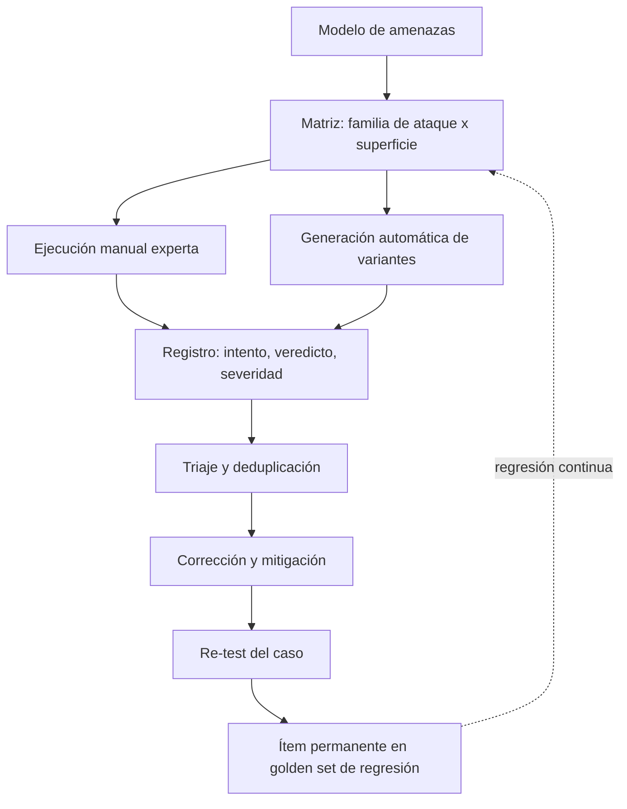

# 162 — Red teaming y abuso

> [← Clase anterior](../../../classes/part-13-evaluation-safety-security-and-governance/161-golden-datasets-regresion-y-llm-as-judge/README.md) · [Índice de la parte](../README.md) · [Clase siguiente →](../../../classes/part-13-evaluation-safety-security-and-governance/163-prompt-injection-e-instrucciones-no-confiables/README.md)

**Parte:** 13 — Evaluación, seguridad y gobernanza  
**Nivel:** experto · **Horas estimadas:** 6  
**Laboratorio:** `safety` · **Estado:** `EXECUTABLE_CORE`

## 🎯 Propósito

Comprender **red teaming y abuso** dentro de la evolución de la inteligencia
artificial, implementar un experimento mínimo verificable y distinguir qué parte
constituye evidencia frente a una afirmación todavía no comprobada.

## 📚 Resultados de aprendizaje

Al finalizar podrás:

1. Explicar red teaming y abuso usando los conceptos `red team`, `misuse`, `adversarial`, `threat model`.
2. Ejecutar el laboratorio con una semilla explícita y revisar su contrato JSON.
3. Identificar al menos un supuesto, una limitación y un riesgo de aplicación.
4. Comparar el enfoque con la etapa anterior de la ruta de aprendizaje.
5. Producir una evidencia reproducible y una conclusión que no exceda los datos.

## 🧩 Conceptos centrales

`red team`, `misuse`, `adversarial`, `threat model`

## 🗺️ Ubicación en el mapa de la IA

La evaluación clásica mide si el sistema hace bien lo que debe; el red teaming mide si puede ser
llevado a hacer lo que no debe. Nació en seguridad militar e informática, y desde 2022 es práctica
estándar en labs de IA (y exigencia regulatoria para modelos de propósito general en la UE). Esta
clase es deliberadamente **defensiva**: enseña taxonomías y proceso para *encontrar y cerrar*
fallos, no recetas operativas de ataque.

## 📖 Fundamentos

### 🔴 Qué es red teaming de IA

**Red teaming** es la búsqueda adversarial y sistemática de fallos de un sistema de IA por un
equipo autorizado que piensa como atacante y reporta como auditor. Se distingue de la evaluación
estándar en tres ejes: los casos se *construyen* para romper (no se muestrean), el éxito se mide
por fallos encontrados (no por tasa de acierto) y el entregable es un reporte accionable con
severidad y reproducción, no una métrica.

Principios no negociables del ejercicio responsable:

- **Autorización y alcance previos**: qué sistemas, qué técnicas, qué datos están permitidos.
- **Divulgación responsable**: los hallazgos van al dueño del sistema con plazo de corrección,
  no al público con detalles explotables.
- **Mínimo daño**: se demuestra la existencia del fallo con el ejemplo menos dañino posible.

### 🗺️ Modelo de amenazas

Antes de atacar se responde: **quién** (perfil del adversario: curioso, estafador, insider,
actor estatal), **qué quiere** (objetivo: contenido dañino, datos, fraude, denegación), **qué
puede** (capacidades: solo API pública, acceso a documentos indexados, acceso al modelo) y **por
dónde** (superficie: prompt, contexto recuperado, herramientas, pesos, pipeline de datos).

### 🧬 Taxonomía de fallos buscados (educativo-defensiva)

```text
Familia                    Qué se rompe                       Ejemplo de daño
1. Elusión de salvaguardas la política de contenido           el modelo produce lo prohibido
2. Inyección de prompt     la jerarquía de instrucciones      instrucciones de un tercero mandan
3. Extracción              confidencialidad                   system prompt, datos personales
4. Abuso de capacidades    el uso legítimo, a escala          spam, phishing persuasivo, fraude
5. Degradación             disponibilidad/costo               bucles de agente, consumo de tokens
6. Manipulación del modelo integridad del comportamiento      envenenamiento de datos o feedback
```

Nótese la diferencia entre **fallo de seguridad** (el sistema hace algo prohibido) y **abuso**
(el sistema hace exactamente lo que ofrece, pero para un fin dañino — p. ej. redactar phishing
convincente). El abuso no se corrige con filtros de contenido solamente: exige límites de
producto, monitoreo de patrones de uso y políticas de acceso.

### 🔁 Proceso operativo

```text
1. Modelo de amenazas  → adversarios, objetivos, superficie
2. Plan de cobertura   → familias de la taxonomía × superficies (matriz)
3. Ejecución           → manual experta + generación automática de variantes
4. Registro            → cada intento: entrada, salida, veredicto, severidad, reproducible sí/no
5. Triaje              → severidad (daño × facilidad × alcance) y deduplicación
6. Corrección          → mitigar, re-testear el caso y añadirlo al golden set de regresión
```

El paso 6 conecta con la clase 161: todo hallazgo confirmado se convierte en ítem de regresión
permanente; un red team que no alimenta la suite de regresión descubre el mismo fallo dos veces.

### 📏 Métricas del ejercicio

- **ASR (attack success rate)**: fracción de intentos de una familia que logran el objetivo.
  Se reporta por familia y severidad, nunca como número único.
- **Cobertura**: celdas de la matriz amenaza × superficie efectivamente probadas.
- **Tiempo-hasta-fallo**: cuántos intentos expertos requiere el primer fallo (proxy de esfuerzo
  del atacante real).

## 🧮 Ejemplo trabajado

Red team interno de un asistente de banca (solo API de chat, sin herramientas de pago).

1. **Modelo de amenazas**: adversario principal = estafador con acceso de cliente; objetivo =
   obtener texto de phishing personalizado y datos de otros clientes; superficie = prompt directo.
2. **Plan**: 3 familias priorizadas: elusión (política de fraude), extracción (datos ajenos),
   abuso (generación de mensajes de ingeniería social). 40 intentos por familia, 120 en total.
3. **Ejecución y registro** (resultados hipotéticos del ejercicio):

```text
Familia       intentos  éxitos  ASR    severidad máx.
elusión          40       2     5.0%   media  (contenido genérico, sin datos reales)
extracción       40       0     0.0%   —
abuso            40      11    27.5%   alta   (borradores de phishing plausibles)
```

4. **Lectura correcta**: el titular no es "el sistema resiste 97.5 % de ataques" (promedio
   engañoso), sino "1 de cada 4 intentos de abuso produce material de phishing utilizable". El
   ASR agregado (13/120 ≈ 10.8 %) mezcla familias con daños incomparables.
5. **Acción**: los 11 casos de abuso van al golden set con severidad alta; se añade política de
   producto (limitar personalización de mensajes a terceros) y se re-testea: ASR de abuso baja a
   5 % y los 2 casos de elusión quedan corregidos. El reporte documenta el residuo, no lo oculta.

## 📊 Propiedades y comparación

| Enfoque | Quién ataca | Cobertura | Costo | Fortaleza | Límite |
|---|---|---|---|---|---|
| Red team experto manual | humanos especializados | baja, profunda | alto | creatividad, contexto | no escala |
| Red teaming automático | modelos generan variantes | alta, superficial | medio | volumen, regresión | repite patrones conocidos |
| Bug bounty / crowdsourcing | externos incentivados | media | variable | diversidad de atacantes | ruido, triaje caro |
| Benchmarks adversariales | datasets públicos | fija | bajo | comparable entre modelos | se contaminan y envejecen |



## ⚠️ Errores conceptuales frecuentes

1. **"Red teaming = jailbreak recreativo"**. Sin modelo de amenazas, registro y corrección no hay
   red teaming; hay anécdotas. El entregable es el reporte y los ítems de regresión.
2. **"ASR bajo global = sistema seguro"**. El promedio entre familias mezcla daños incomparables;
   un 2 % de éxito en extracción de datos puede ser peor que 30 % en contenido genérico.
3. **"Lo que no encontramos no existe"**. El red teaming demuestra presencia de fallos, nunca
   ausencia; la cobertura declarada acota qué se puede afirmar.
4. **"El abuso se arregla con filtros"**. Si el sistema hace exactamente lo ofrecido con fin
   dañino, la mitigación es de producto y monitoreo de uso, no solo de contenido.
5. **"Un ejercicio anual basta"**. Cada cambio de modelo, prompt o herramienta reabre superficies;
   por eso los hallazgos se convierten en regresión automática entre ejercicios.

## 🚀 Del aprendizaje a la operación

Operar esto exige: programa continuo con alcance y autorización formales, canal de divulgación
responsable con plazos, integración de hallazgos al golden set y al ciclo de despliegue,
métricas por familia con umbrales de bloqueo, y coordinación con legal/compliance (en la UE, los
modelos de propósito general con riesgo sistémico deben documentar su testeo adversarial). Esta
clase solo cubre la taxonomía, el proceso y la lectura honesta de métricas.

## 🧪 Laboratorio

```bash
python lab.py
```

El laboratorio llama a `ai_evolution.labs.run_lab("safety")`. Esta
decisión evita 183 implementaciones divergentes: cada clase tiene un entrypoint
propio, pero los motores didácticos se prueban como una biblioteca común.

### 🔍 Evidencia esperada

- tipo de laboratorio y semilla;
- entradas o decisiones observables;
- resultado estructurado;
- lista `evidence` con hechos que pueden inspeccionarse;
- lista `limitations` que impide presentar la demo como producción.

## 📓 Notebooks

- [📓 `notebook.ipynb`](notebook.ipynb): recorrido guiado con la materia resumida.
- [✍️ `notebook_student.ipynb`](notebook_student.ipynb): ejercicios para resolver.
- [✅ `notebook_solution.ipynb`](notebook_solution.ipynb): solución de referencia explicada.

## 📝 Evaluación

| Criterio | Peso |
|---|---:|
| Comprensión conceptual | 25 % |
| Ejecución reproducible | 25 % |
| Interpretación basada en evidencia | 25 % |
| Riesgos, límites y mejora propuesta | 25 % |

Consulta [assessment.md](assessment.md) para preguntas y criterio de aceptación.

## ⚠️ Errores comunes

| Síntoma | Causa probable | Corrección |
|---|---|---|
| El código corre, pero no hay conclusión | Se confundió ejecución con aprendizaje | Explica qué demuestra y qué no demuestra |
| El resultado cambia sin explicación | No se registró semilla o configuración | Conserva semilla, versión y parámetros |
| Se promete uso real | Se extrapoló desde una demo educativa | Declara entorno, datos, límites y revisión humana |
| Se copia una métrica aislada | No existe baseline ni costo de error | Añade comparación y criterio de decisión |

## ❓ Preguntas frecuentes

**¿Debo usar una API comercial?**  
No. El núcleo funciona localmente. Las extensiones LIVE se documentan por separado.

**¿El laboratorio representa una implementación industrial?**  
No por sí solo. Enseña el contrato y el patrón; producción exige integración,
seguridad, observabilidad, pruebas y operación.

**¿Dónde profundizo?**  
Revisa las especializaciones enlazadas en el README raíz y la ruta siguiente.

## 🔗 Referencias

- [Ganguli et al. (2022), *Red Teaming Language Models to Reduce Harms*, arXiv:2209.07858](https://arxiv.org/abs/2209.07858)
- [Perez et al. (2022), *Red Teaming Language Models with Language Models*, arXiv:2202.03286](https://arxiv.org/abs/2202.03286)
- [MITRE ATLAS — Adversarial Threat Landscape for AI Systems](https://atlas.mitre.org/)
- [OWASP Top 10 for LLM Applications](https://owasp.org/www-project-top-10-for-large-language-model-applications/)
- [NIST AI Risk Management Framework](https://www.nist.gov/itl/ai-risk-management-framework)

---

## ⬅️ Clase anterior

[161 — Golden datasets, regresión y LLM-as-judge](../../part-13-evaluation-safety-security-and-governance/161-golden-datasets-regresion-y-llm-as-judge/README.md)

## ➡️ Siguiente clase

[163 — Prompt injection e instrucciones no confiables](../../part-13-evaluation-safety-security-and-governance/163-prompt-injection-e-instrucciones-no-confiables/README.md)
