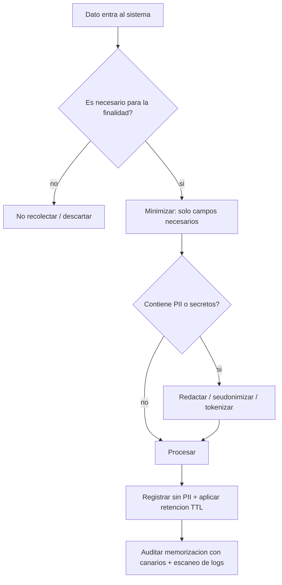

# 165 — Privacidad, secretos y minimización de datos

> [← Clase anterior](../../../classes/part-13-evaluation-safety-security-and-governance/164-seguridad-de-tools-mcp-y-supply-chain/README.md) · [Índice de la parte](../README.md) · [Clase siguiente →](../../../classes/part-13-evaluation-safety-security-and-governance/166-sesgo-fairness-y-grupos-afectados/README.md)

**Parte:** 13 — Evaluación, seguridad y gobernanza  
**Nivel:** experto · **Horas estimadas:** 6  
**Laboratorio:** `safety` · **Estado:** `EXECUTABLE_CORE`

## 🎯 Propósito

Comprender **privacidad, secretos y minimización de datos** dentro de la evolución de la inteligencia
artificial, implementar un experimento mínimo verificable y distinguir qué parte
constituye evidencia frente a una afirmación todavía no comprobada.

## 📚 Resultados de aprendizaje

Al finalizar podrás:

1. Explicar privacidad, secretos y minimización de datos usando los conceptos `privacy`, `secrets`, `minimization`, `retention`.
2. Ejecutar el laboratorio con una semilla explícita y revisar su contrato JSON.
3. Identificar al menos un supuesto, una limitación y un riesgo de aplicación.
4. Comparar el enfoque con la etapa anterior de la ruta de aprendizaje.
5. Producir una evidencia reproducible y una conclusión que no exceda los datos.

## 🧩 Conceptos centrales

`privacy`, `secrets`, `minimization`, `retention`

## 🗺️ Ubicación en el mapa de la IA

Los modelos aprenden de datos, y esos datos pueden contener información personal o secretos. Carlini
et al. (arXiv:2012.07805) demostraron en 2020 que un LLM puede *memorizar* y regurgitar cadenas
literales de su corpus —incluidos datos personales— con solo consultarlo. Esto convirtió la
privacidad de una nota legal en un problema técnico medible: qué recuerda un modelo, qué expone un
sistema de IA en contexto, y cómo minimizar ambos. Es la base técnica de la normativa (GDPR, EU AI
Act) que se verá en la clase 170.

## 📖 Fundamentos

### 🧠 Memorización y extracción

Un modelo **memoriza** cuando reproduce literalmente secuencias de su corpus en lugar de
generalizar patrones. Carlini et al. mostraron un **ataque de extracción de datos de
entrenamiento**: generando muchas muestras y puntuándolas por confianza del modelo, se recuperan
cadenas memorizadas (correos, teléfonos, claves) presentes una sola vez en el corpus. Hallazgos
clave:

- La memorización **crece con el tamaño del modelo** y con la **repetición** del dato en el corpus.
- Los datos únicos o poco frecuentes son los más *identificables* si se extraen: un secuencia
  singular apunta a una persona concreta.
- La memorización no es un bug ocasional: es una propiedad estadística esperable del entrenamiento.

Definición útil: una secuencia es **k-eidética memorizada** si el modelo la reproduce y aparecía en
≤ k documentos del corpus; cuanto menor k, mayor el riesgo de privacidad.

### 🔑 Secretos en el ciclo de vida de la IA

Los secretos (API keys, tokens, contraseñas, PII) pueden filtrarse en cuatro puntos:

```text
1. Entrenamiento/fine-tuning : el secreto está en el corpus -> memorización
2. Contexto/RAG              : se inyecta PII innecesaria en el prompt -> exposición en logs
3. Prompts y logs            : se registran entradas con datos sensibles -> fuga por observabilidad
4. Salida                    : el modelo repite un secreto que vio en contexto o memorizó
```

Un error frecuente es concentrarse solo en el punto 1; en la práctica los puntos 2 y 3 (logs de
prompts con PII) son la fuga más común y la más fácil de evitar.

### ✂️ Minimización de datos

**Minimización** es el principio de recolectar, procesar y retener el *mínimo* de datos personales
necesario para la finalidad. Se descompone en:

- **Minimización de recolección**: no pidas ni ingieras lo que no necesitas.
- **Minimización de propósito**: usa el dato solo para el fin declarado.
- **Minimización de retención**: bórralo cuando ya no sirve (política de retención con plazos).
- **Minimización en contexto**: pasa al modelo solo los campos necesarios de un registro, no el
  registro completo.

### 🛡️ Técnicas de protección

```text
Técnica                 Qué hace                                  Límite
Redacción/masking       elimina o sustituye PII antes de procesar depende de detectar toda la PII
Seudonimización         reemplaza identificadores por tokens      reversible si se guarda el mapa
Anonimización           rompe el vínculo con la persona           difícil de garantizar (re-identificación)
Tokenización de secretos vault + referencia, nunca el valor       requiere infraestructura
Privacidad diferencial  ruido calibrado con garantía (epsilon)    coste en utilidad; complejo
Retención y borrado     TTL y derecho de supresión                requiere trazabilidad del dato
```

La **privacidad diferencial (DP)** ofrece una garantía formal: un parámetro epsilon acota cuánto
puede cambiar la salida por incluir o excluir el dato de una persona; menor epsilon = más privacidad
y menos utilidad. Es la única técnica con garantía matemática, pero cuesta utilidad y es compleja de
aplicar bien.

### 📉 Medir la fuga

- **Tasa de memorización**: fracción de secuencias canario (insertadas a propósito) que el modelo
  reproduce. Los **canarios** son cadenas únicas plantadas en el corpus para auditar memorización.
- **Detección de PII en logs**: escaneo de prompts/salidas contra patrones y clasificadores.
- **Exposición en contexto**: cuántos campos sensibles innecesarios llegan al modelo por petición.

## 🧮 Ejemplo trabajado

Auditamos memorización con canarios en un modelo fine-tuneado.

1. **Diseño**: insertamos 100 canarios únicos (formato `CANARY-<uuid>-<número de 9 dígitos>`) en el
   corpus de fine-tuning, cada uno repetido un número controlado de veces: 40 aparecen 1 vez, 40
   aparecen 10 veces, 20 aparecen 100 veces.
2. **Prueba de extracción**: damos el prefijo `CANARY-<uuid>-` y medimos si el modelo completa los
   9 dígitos correctos (con muestreo).

```text
Repeticiones   canarios   completados correctamente   tasa
1x                40               2                    5.0 %
10x               40              14                   35.0 %
100x              20              17                   85.0 %
```

3. **Lectura**: la memorización crece fuerte con la repetición (5 % → 85 %), confirmando el
   hallazgo de Carlini. La minimización aquí sería deduplicar el corpus: bajar los datos sensibles a
   ≤ 1 aparición reduce drásticamente la extracción.
4. **Riesgo de privacidad**: los canarios 1x son los más peligrosos si fueran PII real —aunque su
   tasa es baja (5 %), cada acierto identifica a una persona única. Tasa baja ≠ riesgo bajo cuando el
   dato es identificable.
5. **Acción**: deduplicar y filtrar PII antes del entrenamiento, y —para datos que deben quedar—
   evaluar privacidad diferencial con un presupuesto epsilon; documentar la tasa residual, no ocultarla.

## 📊 Propiedades y comparación

| Punto de fuga | Probabilidad práctica | Coste de mitigación | Mitigación principal |
|---|---|---|---|
| Memorización (entrenamiento) | media | alto (re-entrenar) | dedup + filtrado PII + DP |
| PII innecesaria en contexto | alta | bajo | minimización en contexto |
| Logs de prompts con PII | muy alta | bajo | redacción antes de loguear + retención |
| Secreto repetido en salida | media | medio | no meter secretos en contexto, tokenizar |



## ⚠️ Errores conceptuales frecuentes

1. **"El modelo no puede filtrar lo que no entiende"**. Sí puede: reproduce cadenas literales
   memorizadas sin "comprenderlas"; la extracción no requiere razonamiento del modelo.
2. **"Solo importa lo que hay en el corpus de entrenamiento"**. Las fugas más frecuentes ocurren en
   contexto y logs (puntos 2 y 3), no en el entrenamiento; son también las más baratas de evitar.
3. **"Tasa de memorización baja = seguro"**. Un solo dato único extraído identifica a una persona;
   el riesgo depende de identificabilidad, no solo de la tasa.
4. **"Anonimizar es trivial"**. La re-identificación por combinación de cuasi-identificadores
   (código postal + edad + género) puede revertir una anonimización mal hecha.
5. **"La privacidad diferencial es gratis"**. Impone un coste de utilidad medible; un epsilon muy
   pequeño protege más pero degrada el modelo o las estadísticas.

## 🚀 Del aprendizaje a la operación

En operación: filtrado y deduplicación de PII antes del entrenamiento, redacción de PII antes de
loguear prompts, minimización estricta de campos que llegan al contexto, tokenización de secretos en
un vault (nunca en el prompt), políticas de retención con TTL y soporte del derecho de supresión,
auditoría periódica de memorización con canarios, y —cuando aplique— presupuesto de privacidad
diferencial documentado. La normativa (GDPR, EU AI Act; clase 170) convierte varias de estas
prácticas en obligación legal. Esta clase solo establece los conceptos y la medición manual.

## 🧪 Laboratorio

```bash
python lab.py
```

El laboratorio llama a `ai_evolution.labs.run_lab("safety")`. Esta
decisión evita 183 implementaciones divergentes: cada clase tiene un entrypoint
propio, pero los motores didácticos se prueban como una biblioteca común.

### 🔍 Evidencia esperada

- tipo de laboratorio y semilla;
- entradas o decisiones observables;
- resultado estructurado;
- lista `evidence` con hechos que pueden inspeccionarse;
- lista `limitations` que impide presentar la demo como producción.

## 📓 Notebooks

- [📓 `notebook.ipynb`](notebook.ipynb): recorrido guiado con la materia resumida.
- [✍️ `notebook_student.ipynb`](notebook_student.ipynb): ejercicios para resolver.
- [✅ `notebook_solution.ipynb`](notebook_solution.ipynb): solución de referencia explicada.

## 📝 Evaluación

| Criterio | Peso |
|---|---:|
| Comprensión conceptual | 25 % |
| Ejecución reproducible | 25 % |
| Interpretación basada en evidencia | 25 % |
| Riesgos, límites y mejora propuesta | 25 % |

Consulta [assessment.md](assessment.md) para preguntas y criterio de aceptación.

## ⚠️ Errores comunes

| Síntoma | Causa probable | Corrección |
|---|---|---|
| El código corre, pero no hay conclusión | Se confundió ejecución con aprendizaje | Explica qué demuestra y qué no demuestra |
| El resultado cambia sin explicación | No se registró semilla o configuración | Conserva semilla, versión y parámetros |
| Se promete uso real | Se extrapoló desde una demo educativa | Declara entorno, datos, límites y revisión humana |
| Se copia una métrica aislada | No existe baseline ni costo de error | Añade comparación y criterio de decisión |

## ❓ Preguntas frecuentes

**¿Debo usar una API comercial?**  
No. El núcleo funciona localmente. Las extensiones LIVE se documentan por separado.

**¿El laboratorio representa una implementación industrial?**  
No por sí solo. Enseña el contrato y el patrón; producción exige integración,
seguridad, observabilidad, pruebas y operación.

**¿Dónde profundizo?**  
Revisa las especializaciones enlazadas en el README raíz y la ruta siguiente.

## 🔗 Referencias

- [Carlini et al. (2021), *Extracting Training Data from Large Language Models*, arXiv:2012.07805](https://arxiv.org/abs/2012.07805) — uso: fuente primaria del mecanismo estudiado
- [Carlini et al. (2022), *Quantifying Memorization Across Neural Language Models*, arXiv:2202.07646](https://arxiv.org/abs/2202.07646) — uso: fuente primaria del mecanismo estudiado
- [Dwork & Roth (2014), *The Algorithmic Foundations of Differential Privacy* — DOI:10.1561/0400000042](https://www.cis.upenn.edu/~aaroth/Papers/privacybook.pdf) — uso: referencia consultada en su fuente original
- [Reglamento (UE) 2016/679 (GDPR) — art. 5: minimización de datos](https://eur-lex.europa.eu/eli/reg/2016/679/oj) — uso: marco normativo de referencia
- [OWASP Top 10 for LLM Applications — LLM06: Sensitive Information Disclosure](https://owasp.org/www-project-top-10-for-large-language-model-applications/) — uso: marco normativo de referencia

<!-- papers:inicio -->

---

## 📜 Papers que fundamentan esta clase

> Bloque generado por `python scripts/link_papers_to_classes.py`. La fuente es [`papers/catalog/papers.json`](../../../papers/catalog/papers.json).

| Paper | Año | Qué desbloqueó | Miniatura |
|---|---:|---|---|
| [P143 · Calibrar el ruido a la sensibilidad en el análisis privado de datos](../../../papers/foundational/P143_privacidad_diferencial/README.md) | 2006 | Da una definición formal de privacidad que no depende de qué sepa el atacante, y un mecanismo concreto para cumplirla. | [notebook](../../../notebooks/papers/P143_privacidad_diferencial.ipynb) |

Cada ficha explica el problema anterior, la matemática mínima, los límites y los errores de atribución más frecuentes. Para leerlas con método: [cómo leer un paper de IA](../../../papers/guides/COMO_LEER_UN_PAPER_DE_IA.md) · [anexos matemáticos](../../../papers/annexes/README.md).
<!-- papers:fin -->
---

## ⬅️ Clase anterior

[164 — Seguridad de tools, MCP y supply chain](../../part-13-evaluation-safety-security-and-governance/164-seguridad-de-tools-mcp-y-supply-chain/README.md)

## ➡️ Siguiente clase

[166 — Sesgo, fairness y grupos afectados](../../part-13-evaluation-safety-security-and-governance/166-sesgo-fairness-y-grupos-afectados/README.md)
