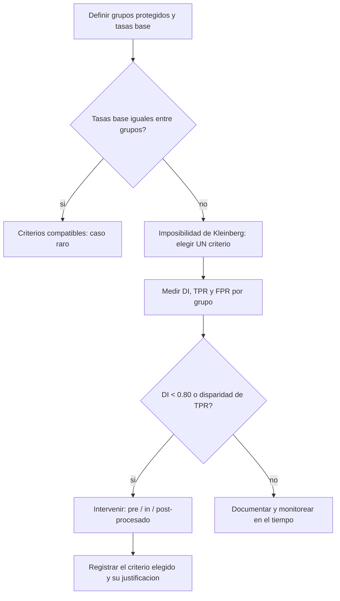

# 166 — Sesgo, fairness y grupos afectados

> [← Clase anterior](../../../classes/part-13-evaluation-safety-security-and-governance/165-privacidad-secretos-y-minimizacion-de-datos/README.md) · [Índice de la parte](../README.md) · [Clase siguiente →](../../../classes/part-13-evaluation-safety-security-and-governance/167-explicabilidad-incertidumbre-y-calibracion/README.md)

**Parte:** 13 — Evaluación, seguridad y gobernanza  
**Nivel:** experto · **Horas estimadas:** 6  
**Laboratorio:** `evaluation` · **Estado:** `EXECUTABLE_CORE`

## 🎯 Propósito

Comprender **sesgo, fairness y grupos afectados** dentro de la evolución de la inteligencia
artificial, implementar un experimento mínimo verificable y distinguir qué parte
constituye evidencia frente a una afirmación todavía no comprobada.

## 📚 Resultados de aprendizaje

Al finalizar podrás:

1. Explicar sesgo, fairness y grupos afectados usando los conceptos `bias`, `fairness`, `subgroups`, `harms`.
2. Ejecutar el laboratorio con una semilla explícita y revisar su contrato JSON.
3. Identificar al menos un supuesto, una limitación y un riesgo de aplicación.
4. Comparar el enfoque con la etapa anterior de la ruta de aprendizaje.
5. Producir una evidencia reproducible y una conclusión que no exceda los datos.

## 🧩 Conceptos centrales

`bias`, `fairness`, `subgroups`, `harms`

## 🗺️ Ubicación en el mapa de la IA

Cuando un modelo decide sobre personas —crédito, contratación, libertad condicional, moderación—
la pregunta deja de ser solo "¿acierta?" y pasa a "¿acierta de forma equitativa entre grupos?".
Kleinberg, Mullainathan y Raghavan (arXiv:1609.05807) demostraron en 2016 un resultado de
imposibilidad: varias definiciones intuitivas de "justo" no pueden satisfacerse a la vez salvo en
casos degenerados. La equidad, por tanto, no es un interruptor que se activa: es un conjunto de
criterios en tensión que exige elegir explícitamente cuál priorizar y por qué.

## 📖 Fundamentos

### ⚖️ Sesgo y sus fuentes

**Sesgo** (en el sentido de fairness) es una diferencia sistemática de comportamiento del modelo
entre grupos definidos por atributos protegidos (género, etnia, edad…). Fuentes:

- **Sesgo histórico**: los datos reflejan desigualdades del mundo real (menos préstamos aprobados a
  un grupo históricamente excluido). El modelo aprende y perpetúa el patrón.
- **Sesgo de representación**: un grupo está subrepresentado en el dataset; el modelo rinde peor con él.
- **Sesgo de medición**: la etiqueta o las features son proxies imperfectos y sesgados (usar
  "arrestos" como proxy de "delito" hereda el sesgo policial).
- **Sesgo de agregación**: un único modelo para grupos heterogéneos ajusta al grupo mayoritario.

### 📏 Definiciones de equidad (grupo)

Notación: `Y` = etiqueta real (1 = positivo), `Ŷ` = predicción, `A` = grupo protegido.

```text
Paridad demográfica     P(Ŷ=1 | A=a) igual para todo a
                        (misma tasa de resultado positivo entre grupos)
Igualdad de oportunidad P(Ŷ=1 | Y=1, A=a) igual para todo a
                        (mismo recall / TPR entre grupos)
Equalized odds          TPR y FPR iguales entre grupos
Calibración por grupo   P(Y=1 | score=s, A=a) igual para todo a
                        (un score significa lo mismo en cada grupo)
```

### 🚫 El teorema de imposibilidad (Kleinberg et al.)

Kleinberg et al. probaron que, salvo casos triviales (predicción perfecta o tasas base idénticas
entre grupos), **no se pueden satisfacer simultáneamente** tres condiciones deseables:
calibración por grupo, igualdad de la tasa de falsos positivos y de falsos negativos. Corolario
práctico: cuando las **tasas base** (`P(Y=1)`) difieren entre grupos —lo habitual—, hay que
elegir qué criterio de equidad priorizar; optimizar uno degrada otro. No existe el modelo "justo"
sin especificar *según qué definición*.

### 📊 Disparate impact

El **disparate impact** mide la desproporción de resultados positivos entre el grupo desfavorecido
y el favorecido:

```text
DI = P(Ŷ=1 | A = desfavorecido) / P(Ŷ=1 | A = favorecido)
```

La **regla del 80 %** (four-fifths rule, EEOC de EE. UU.) considera indicio de impacto adverso un
DI < 0.80. Es un umbral legal orientativo, no una garantía de equidad ni de su ausencia.

### 🔧 Dónde intervenir

```text
Pre-procesado   : reponderar/reetiquetar datos para equilibrar grupos
In-procesado    : añadir una restricción de equidad a la función objetivo
Post-procesado  : ajustar umbrales por grupo para igualar el criterio elegido
```

Cada punto tiene trade-offs: post-procesar por umbral distinto por grupo puede chocar con
requisitos legales de trato igual; el punto de intervención es también una decisión de gobernanza.

## 🧮 Ejemplo trabajado

Modelo de aprobación de crédito evaluado sobre dos grupos, A y B.

```text
Grupo A: 500 personas, aprobadas (Ŷ=1) = 200
Grupo B: 500 personas, aprobadas (Ŷ=1) = 120
```

1. **Tasas de resultado positivo**: A = 200/500 = 0.40; B = 120/500 = 0.24.
2. **Disparate impact** (B es el desfavorecido): DI = 0.24 / 0.40 = **0.60**.
3. **Regla del 80 %**: 0.60 < 0.80 → **indicio de impacto adverso** contra B.
4. **¿Es injusto?** Depende de la tasa base. Añadimos la etiqueta real (quién realmente paga):

```text
                aprobados   solvencia real (Y=1)   TPR = P(Ŷ=1|Y=1)
Grupo A            200            250 solventes      180/250 = 0.72
Grupo B            120            150 solventes       96/150 = 0.64
```

5. **Igualdad de oportunidad**: TPR_A = 0.72 vs TPR_B = 0.64 → el modelo aprueba a un solvente de B
   con menos frecuencia que a uno de A. Hay disparidad tanto en resultado (DI) como en oportunidad.
6. **Tensión**: si sube el umbral de aprobación para B a igualar TPR, cambia su FPR y puede romper
   calibración —exactamente la imposibilidad de Kleinberg. La decisión (qué criterio priorizar) es
   normativa, no técnica, y debe documentarse con las partes afectadas.

## 📊 Propiedades y comparación

| Criterio | Qué iguala | Cuándo es apropiado | Choca con |
|---|---|---|---|
| Paridad demográfica | tasa de positivos | reparto de un bien escaso | precisión si tasas base difieren |
| Igualdad de oportunidad | TPR (recall) | no perder verdaderos positivos | paridad demográfica |
| Equalized odds | TPR y FPR | costo simétrico de errores | calibración (Kleinberg) |
| Calibración por grupo | significado del score | scores usados como probabilidad | equalized odds (Kleinberg) |



## ⚠️ Errores conceptuales frecuentes

1. **"Quitar el atributo protegido hace justo al modelo"** (*fairness through unawareness*). Los
   proxies (código postal, nombre, historial) reconstruyen el atributo; ignorarlo no lo elimina.
2. **"Existe una métrica de equidad correcta"**. Kleinberg et al. prueban que las principales son
   incompatibles cuando difieren las tasas base; hay que elegir y justificar, no descubrir "la" justa.
3. **"DI ≥ 0.80 significa que el modelo es justo"**. La regla del 80 % es un umbral legal
   orientativo; puede cumplirse y aun así haber disparidad de oportunidad o calibración.
4. **"El sesgo está en el algoritmo"**. La mayor parte del sesgo entra por los *datos* (histórico,
   medición, representación); cambiar de modelo sin tocar los datos rara vez lo corrige.
5. **"Igualar tasas siempre es lo correcto"**. Igualar paridad demográfica cuando las tasas base
   difieren legítimamente puede introducir otros daños; el criterio se elige por contexto y valores.

## 🚀 Del aprendizaje a la operación

En operación: definir grupos protegidos y el criterio de equidad *priorizado* con las partes
afectadas y legal, medir DI/TPR/FPR/calibración por subgrupo de forma continua (no una vez),
auditar interseccionalidad (combinaciones de atributos), documentar la elección y sus trade-offs en
la model card (clase 170), y monitorear drift porque la equidad medida hoy puede degradarse mañana.
Esta clase solo establece las definiciones, el teorema de imposibilidad y el cálculo manual del
disparate impact.

## 🧪 Laboratorio

```bash
python lab.py
```

El laboratorio llama a `ai_evolution.labs.run_lab("evaluation")`. Esta
decisión evita 183 implementaciones divergentes: cada clase tiene un entrypoint
propio, pero los motores didácticos se prueban como una biblioteca común.

### 🔍 Evidencia esperada

- tipo de laboratorio y semilla;
- entradas o decisiones observables;
- resultado estructurado;
- lista `evidence` con hechos que pueden inspeccionarse;
- lista `limitations` que impide presentar la demo como producción.

## 📓 Notebooks

- [📓 `notebook.ipynb`](notebook.ipynb): recorrido guiado con la materia resumida.
- [✍️ `notebook_student.ipynb`](notebook_student.ipynb): ejercicios para resolver.
- [✅ `notebook_solution.ipynb`](notebook_solution.ipynb): solución de referencia explicada.

## 📝 Evaluación

| Criterio | Peso |
|---|---:|
| Comprensión conceptual | 25 % |
| Ejecución reproducible | 25 % |
| Interpretación basada en evidencia | 25 % |
| Riesgos, límites y mejora propuesta | 25 % |

Consulta [assessment.md](assessment.md) para preguntas y criterio de aceptación.

## ⚠️ Errores comunes

| Síntoma | Causa probable | Corrección |
|---|---|---|
| El código corre, pero no hay conclusión | Se confundió ejecución con aprendizaje | Explica qué demuestra y qué no demuestra |
| El resultado cambia sin explicación | No se registró semilla o configuración | Conserva semilla, versión y parámetros |
| Se promete uso real | Se extrapoló desde una demo educativa | Declara entorno, datos, límites y revisión humana |
| Se copia una métrica aislada | No existe baseline ni costo de error | Añade comparación y criterio de decisión |

## ❓ Preguntas frecuentes

**¿Debo usar una API comercial?**  
No. El núcleo funciona localmente. Las extensiones LIVE se documentan por separado.

**¿El laboratorio representa una implementación industrial?**  
No por sí solo. Enseña el contrato y el patrón; producción exige integración,
seguridad, observabilidad, pruebas y operación.

**¿Dónde profundizo?**  
Revisa las especializaciones enlazadas en el README raíz y la ruta siguiente.

## 🔗 Referencias

- [Kleinberg, Mullainathan & Raghavan (2016), *Inherent Trade-Offs in the Fair Determination of Risk Scores*, arXiv:1609.05807](https://arxiv.org/abs/1609.05807) — uso: fuente primaria del mecanismo estudiado
- [Hardt, Price & Srebro (2016), *Equality of Opportunity in Supervised Learning*, arXiv:1610.02413](https://arxiv.org/abs/1610.02413) — uso: fuente primaria del mecanismo estudiado
- [Barocas, Hardt & Narayanan, *Fairness and Machine Learning* (libro abierto)](https://fairmlbook.org/) — uso: referencia consultada en su fuente original
- [Mehrabi et al. (2021), *A Survey on Bias and Fairness in Machine Learning*, arXiv:1908.09635](https://arxiv.org/abs/1908.09635) — uso: fuente primaria del mecanismo estudiado
- [U.S. EEOC — Uniform Guidelines on Employee Selection Procedures (regla del 80 %)](https://www.eeoc.gov/laws/guidance/questions-and-answers-clarify-and-provide-common-interpretation-uniform-guidelines) — uso: referencia consultada en su fuente original

<!-- papers:inicio -->

---

## 📜 Papers que fundamentan esta clase

> Bloque generado por `python scripts/link_papers_to_classes.py`. La fuente es [`papers/catalog/papers.json`](../../../papers/catalog/papers.json).

| Paper | Año | Qué desbloqueó | Miniatura |
|---|---:|---|---|
| [P05 · Estimación eficiente de representaciones de palabras en un espacio vectorial](../../../papers/foundational/P05_word2vec/README.md) | 2013 | El significado distribucional se vuelve barato: vectores densos entrenables sobre miles de millones de palabras. | [notebook](../../../notebooks/papers/P05_word2vec.ipynb) |

Cada ficha explica el problema anterior, la matemática mínima, los límites y los errores de atribución más frecuentes. Para leerlas con método: [cómo leer un paper de IA](../../../papers/guides/COMO_LEER_UN_PAPER_DE_IA.md) · [anexos matemáticos](../../../papers/annexes/README.md).
<!-- papers:fin -->
<!-- bibliografia:inicio -->

---

## 📚 Bibliografía de apoyo

> Bloque generado por `python scripts/link_sources_to_classes.py`. Cada obra lleva su localizador verificado en [`sources/bibliography.json`](../../../sources/bibliography.json).

Los papers dicen **de dónde salió** el mecanismo. Estas obras lo **desarrollan** con el espacio que una clase no tiene: teoría completa, demostraciones y ejercicios.

| Obra | Edición | Localizador | Papel en esta clase |
|---|---|---|---|
| Huyen, Chip — *Designing Machine Learning Systems* | 2022 | [ISBN 9781098107956](https://openlibrary.org/isbn/9781098107956) · [web de la obra](https://www.oreilly.com/library/view/designing-machine-learning/9781098107956/) · _pendiente de confirmar en su catálogo_ | obra de referencia de la parte 13 · capítulos de evaluación y monitorización |
| Russell, Stuart J. y Norvig, Peter — *Artificial Intelligence: A Modern Approach* | 4.ª · 2020 | [ISBN 9780134610993](https://openlibrary.org/isbn/9780134610993) · [web de la obra](https://aima.cs.berkeley.edu/) | obra de referencia de la parte 13 · capítulo de filosofía, ética y seguridad de la IA |
<!-- bibliografia:fin -->

---

## ⬅️ Clase anterior

[165 — Privacidad, secretos y minimización de datos](../../part-13-evaluation-safety-security-and-governance/165-privacidad-secretos-y-minimizacion-de-datos/README.md)

## ➡️ Siguiente clase

[167 — Explicabilidad, incertidumbre y calibración](../../part-13-evaluation-safety-security-and-governance/167-explicabilidad-incertidumbre-y-calibracion/README.md)
