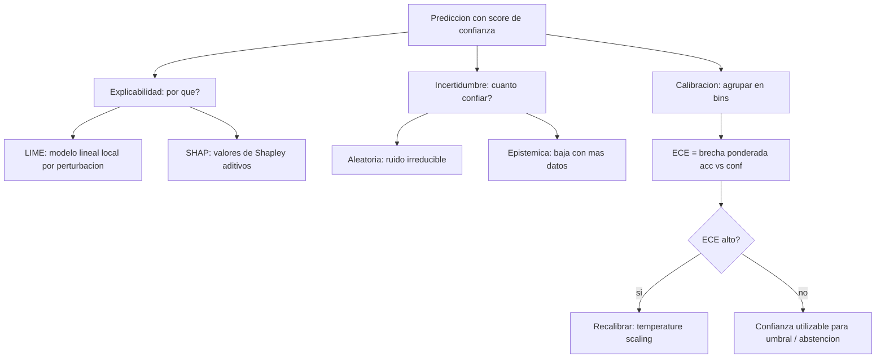

# 167 — Explicabilidad, incertidumbre y calibración

> [← Clase anterior](../../../classes/part-13-evaluation-safety-security-and-governance/166-sesgo-fairness-y-grupos-afectados/README.md) · [Índice de la parte](../README.md) · [Clase siguiente →](../../../classes/part-13-evaluation-safety-security-and-governance/168-alucinacion-grounding-y-abstencion/README.md)

**Parte:** 13 — Evaluación, seguridad y gobernanza  
**Nivel:** experto · **Horas estimadas:** 6  
**Laboratorio:** `evaluation` · **Estado:** `EXECUTABLE_CORE`

## 🎯 Propósito

Comprender **explicabilidad, incertidumbre y calibración** dentro de la evolución de la inteligencia
artificial, implementar un experimento mínimo verificable y distinguir qué parte
constituye evidencia frente a una afirmación todavía no comprobada.

## 📚 Resultados de aprendizaje

Al finalizar podrás:

1. Explicar explicabilidad, incertidumbre y calibración usando los conceptos `explainability`, `uncertainty`, `calibration`, `confidence`.
2. Ejecutar el laboratorio con una semilla explícita y revisar su contrato JSON.
3. Identificar al menos un supuesto, una limitación y un riesgo de aplicación.
4. Comparar el enfoque con la etapa anterior de la ruta de aprendizaje.
5. Producir una evidencia reproducible y una conclusión que no exceda los datos.

## 🧩 Conceptos centrales

`explainability`, `uncertainty`, `calibration`, `confidence`

## 🗺️ Ubicación en el mapa de la IA

Un modelo que decide sobre personas debe poder responder dos preguntas distintas: "¿por qué esta
predicción?" (explicabilidad) y "¿cuánto debo confiar en este número?" (incertidumbre y
calibración). La primera dio lugar a métodos como LIME (2016) y SHAP (2017); la segunda es clave
porque los modelos modernos suelen ser *sobreconfiados*: dicen 0.99 cuando aciertan el 0.80 de las
veces. Ambas son prerrequisito de la abstención (clase 168) y de la auditoría (clase 170): sin
saber cuándo el modelo no sabe, no se puede delegar con seguridad.

## 📖 Fundamentos

### 🔍 Explicabilidad: interpretabilidad global vs local

- **Interpretabilidad global**: cómo se comporta el modelo en general (qué features pesan más).
- **Explicación local**: por qué produjo *esta* predicción para *esta* entrada.

Dos familias de métodos post-hoc (aplicables a un modelo ya entrenado, sin abrirlo):

**LIME (Local Interpretable Model-agnostic Explanations)**: para explicar una predicción, perturba
la entrada, observa cómo cambia la salida del modelo caja negra, y ajusta un modelo lineal simple
en el vecindario del punto. Los coeficientes de ese modelo local son la explicación. Es local y
aproximada: vale cerca del punto, no globalmente.

**SHAP (SHapley Additive exPlanations)**: reparte la predicción entre las features usando los
**valores de Shapley** de teoría de juegos cooperativos: la contribución de una feature es su
aporte marginal promediado sobre todos los órdenes posibles de inclusión. Propiedad clave:
**aditividad** — las contribuciones suman exactamente la diferencia entre la predicción y el valor
base. Es más costoso pero con garantías teóricas (eficiencia, simetría, dummy).

```text
prediccion(x) = valor_base + suma_i( phi_i )
  phi_i = contribucion (valor de Shapley) de la feature i
```

Ambos son **explicaciones, no causas**: describen el comportamiento del modelo, no el mecanismo del
mundo. Una feature con alto SHAP puede ser un proxy espurio.

### 🎲 Incertidumbre: aleatoria vs epistémica

- **Incertidumbre aleatoria (aleatoric)**: ruido irreducible de los datos (dos entradas idénticas
  con etiquetas distintas). No baja con más datos.
- **Incertidumbre epistémica**: ignorancia del modelo por datos insuficientes; **sí** baja con más
  datos o mejor cobertura. Es la que dispara la abstención en zonas poco vistas.

### 📏 Calibración

Un modelo está **calibrado** si sus probabilidades declaradas coinciden con las frecuencias reales:
de todas las veces que dice 0.70, acierta el 70 %. Formalmente: `P(Y=1 | score=p) = p`.

La **calibración no es lo mismo que la exactitud**: un modelo puede acertar mucho y estar mal
calibrado (sobreconfiado), o acertar poco y estar bien calibrado.

**Expected Calibration Error (ECE)**: se agrupan las predicciones en M *bins* por su confianza y se
promedia, ponderado por tamaño, la brecha entre confianza media y accuracy real de cada bin:

```text
ECE = suma_m ( |B_m| / N ) * | acc(B_m) - conf(B_m) |
  B_m  : predicciones cuyo score cae en el bin m
  acc  : fracción realmente correcta en el bin
  conf : confianza media declarada en el bin
```

Un **diagrama de fiabilidad** grafica acc vs conf por bin: la diagonal es calibración perfecta;
por debajo = sobreconfianza. Técnicas de recalibración: **temperature scaling** (dividir los
logits por una temperatura T aprendida), Platt scaling e isotonic regression.

## 🧮 Ejemplo trabajado: ECE con 3 bins

Un clasificador binario produce 10 predicciones. Para cada una: confianza declarada y si acertó.

```text
#   conf   acierto        bin (por conf)
1   0.55     0            [0.5,0.7)
2   0.60     1            [0.5,0.7)
3   0.65     0            [0.5,0.7)
4   0.72     1            [0.7,0.9)
5   0.80     1            [0.7,0.9)
6   0.85     0            [0.7,0.9)
7   0.88     1            [0.7,0.9)
8   0.92     1            [0.9,1.0]
9   0.95     1            [0.9,1.0]
10  0.98     0            [0.9,1.0]
```

Agrupamos en 3 bins y calculamos accuracy y confianza media por bin:

```text
Bin        n   aciertos   acc     conf_media                    |acc-conf|
[0.5,0.7)  3      1       0.333   (0.55+0.60+0.65)/3 = 0.600     0.267
[0.7,0.9)  4      3       0.750   (0.72+0.80+0.85+0.88)/4=0.8125 0.0625
[0.9,1.0]  3      2       0.667   (0.92+0.95+0.98)/3 = 0.950     0.283
```

Ponderamos por tamaño de bin (N = 10):

```text
ECE = (3/10)*0.267 + (4/10)*0.0625 + (3/10)*0.283
    = 0.0801 + 0.0250 + 0.0850
    = 0.190
```

**Lectura**: ECE ≈ 0.19 es alto; el modelo está **sobreconfiado**, sobre todo en el bin [0.9,1.0]
donde declara 0.95 de confianza pero acierta solo 0.667. Un umbral de decisión basado en "confianza
> 0.9" sería engañoso. Recalibrar (p. ej. temperature scaling con T > 1) acercaría las confianzas a
las frecuencias reales sin cambiar el orden de las predicciones.

## 📊 Propiedades y comparación

| Método/concepto | Qué responde | Alcance | Coste | Límite |
|---|---|---|---|---|
| LIME | por qué esta predicción | local, aproximado | medio | inestable, solo cerca del punto |
| SHAP | aporte de cada feature | local + global | alto | costoso; explica el modelo, no el mundo |
| Incertidumbre epistémica | ¿el modelo conoce esta zona? | por predicción | variable | difícil de estimar bien |
| ECE / reliability | ¿las probabilidades son fiables? | global | bajo | sensible al número de bins |
| Temperature scaling | recalibrar confianzas | global | bajo | no arregla mal ranking |



## ⚠️ Errores conceptuales frecuentes

1. **"Alta confianza = correcto"**. Un modelo sobreconfiado declara 0.95 y acierta 0.67; sin
   medir calibración (ECE) la confianza no es interpretable como probabilidad.
2. **"SHAP/LIME dicen la causa"**. Son explicaciones del *modelo*, no del mundo; una feature con
   alto aporte puede ser un proxy espurio o una correlación, no una causa.
3. **"Exactitud y calibración son lo mismo"**. Son independientes: se puede ser exacto y descalibrado,
   o poco exacto y bien calibrado.
4. **"Recalibrar mejora la accuracy"**. Temperature scaling reescala confianzas pero no cambia el
   orden de las predicciones: mejora la fiabilidad de las probabilidades, no el acierto.
5. **"Toda la incertidumbre baja con más datos"**. Solo la epistémica; la aleatoria (ruido
   intrínseco) es irreducible por más datos que se añadan.

## 🚀 Del aprendizaje a la operación

En operación: reportar y monitorear ECE (y diagramas de fiabilidad) por segmento, recalibrar tras
cada reentrenamiento o cambio de distribución, exponer explicaciones (SHAP/LIME) para decisiones de
alto impacto con la advertencia de que explican el modelo y no la causa, distinguir incertidumbre
epistémica para alimentar la abstención (clase 168), y auditar que las explicaciones no filtren PII
ni induzcan gaming. Esta clase solo cubre los conceptos y el cálculo manual del ECE.

## 🧪 Laboratorio

```bash
python lab.py
```

El laboratorio llama a `ai_evolution.labs.run_lab("evaluation")`. Esta
decisión evita 183 implementaciones divergentes: cada clase tiene un entrypoint
propio, pero los motores didácticos se prueban como una biblioteca común.

### 🔍 Evidencia esperada

- tipo de laboratorio y semilla;
- entradas o decisiones observables;
- resultado estructurado;
- lista `evidence` con hechos que pueden inspeccionarse;
- lista `limitations` que impide presentar la demo como producción.

## 📓 Notebooks

- [📓 `notebook.ipynb`](notebook.ipynb): recorrido guiado con la materia resumida.
- [✍️ `notebook_student.ipynb`](notebook_student.ipynb): ejercicios para resolver.
- [✅ `notebook_solution.ipynb`](notebook_solution.ipynb): solución de referencia explicada.

## 📝 Evaluación

| Criterio | Peso |
|---|---:|
| Comprensión conceptual | 25 % |
| Ejecución reproducible | 25 % |
| Interpretación basada en evidencia | 25 % |
| Riesgos, límites y mejora propuesta | 25 % |

Consulta [assessment.md](assessment.md) para preguntas y criterio de aceptación.

## ⚠️ Errores comunes

| Síntoma | Causa probable | Corrección |
|---|---|---|
| El código corre, pero no hay conclusión | Se confundió ejecución con aprendizaje | Explica qué demuestra y qué no demuestra |
| El resultado cambia sin explicación | No se registró semilla o configuración | Conserva semilla, versión y parámetros |
| Se promete uso real | Se extrapoló desde una demo educativa | Declara entorno, datos, límites y revisión humana |
| Se copia una métrica aislada | No existe baseline ni costo de error | Añade comparación y criterio de decisión |

## ❓ Preguntas frecuentes

**¿Debo usar una API comercial?**  
No. El núcleo funciona localmente. Las extensiones LIVE se documentan por separado.

**¿El laboratorio representa una implementación industrial?**  
No por sí solo. Enseña el contrato y el patrón; producción exige integración,
seguridad, observabilidad, pruebas y operación.

**¿Dónde profundizo?**  
Revisa las especializaciones enlazadas en el README raíz y la ruta siguiente.

## 🔗 Referencias

- [Ribeiro, Singh & Guestrin (2016), *"Why Should I Trust You?": Explaining the Predictions of Any Classifier* (LIME), arXiv:1602.04938](https://arxiv.org/abs/1602.04938) — uso: fuente primaria del mecanismo estudiado
- [Lundberg & Lee (2017), *A Unified Approach to Interpreting Model Predictions* (SHAP), arXiv:1705.07874](https://arxiv.org/abs/1705.07874) — uso: fuente primaria del mecanismo estudiado
- [Guo et al. (2017), *On Calibration of Modern Neural Networks*, arXiv:1706.04599](https://arxiv.org/abs/1706.04599) — uso: fuente primaria del mecanismo estudiado
- [Molnar, *Interpretable Machine Learning* (libro abierto)](https://christophm.github.io/interpretable-ml-book/) — uso: referencia consultada en su fuente original
- [Kendall & Gal (2017), *What Uncertainties Do We Need in Bayesian Deep Learning?*, arXiv:1703.04977](https://arxiv.org/abs/1703.04977) — uso: fuente primaria del mecanismo estudiado

<!-- papers:inicio -->

---

## 📜 Papers que fundamentan esta clase

> Bloque generado por `python scripts/link_papers_to_classes.py`. La fuente es [`papers/catalog/papers.json`](../../../papers/catalog/papers.json).

| Paper | Año | Qué desbloqueó | Miniatura |
|---|---:|---|---|
| [P52 · Hacia la monosemanticidad: descomponer modelos de lenguaje con aprendizaje de diccionario](../../../papers/foundational/P52_superposition/README.md) | 2023 | Explica por qué una neurona no significa una cosa, y propone una forma de descomponer las activaciones en características interpretables. | [notebook](../../../notebooks/papers/P52_superposition.ipynb) |

Cada ficha explica el problema anterior, la matemática mínima, los límites y los errores de atribución más frecuentes. Para leerlas con método: [cómo leer un paper de IA](../../../papers/guides/COMO_LEER_UN_PAPER_DE_IA.md) · [anexos matemáticos](../../../papers/annexes/README.md).
<!-- papers:fin -->
<!-- bibliografia:inicio -->

---

## 📚 Bibliografía de apoyo

> Bloque generado por `python scripts/link_sources_to_classes.py`. Cada obra lleva su localizador verificado en [`sources/bibliography.json`](../../../sources/bibliography.json).

Los papers dicen **de dónde salió** el mecanismo. Estas obras lo **desarrollan** con el espacio que una clase no tiene: teoría completa, demostraciones y ejercicios.

| Obra | Edición | Localizador | Papel en esta clase |
|---|---|---|---|
| Huyen, Chip — *Designing Machine Learning Systems* | 2022 | [ISBN 9781098107956](https://openlibrary.org/isbn/9781098107956) · [web de la obra](https://www.oreilly.com/library/view/designing-machine-learning/9781098107956/) · _pendiente de confirmar en su catálogo_ | obra de referencia de la parte 13 · capítulos de evaluación y monitorización |
| Russell, Stuart J. y Norvig, Peter — *Artificial Intelligence: A Modern Approach* | 4.ª · 2020 | [ISBN 9780134610993](https://openlibrary.org/isbn/9780134610993) · [web de la obra](https://aima.cs.berkeley.edu/) | obra de referencia de la parte 13 · capítulo de filosofía, ética y seguridad de la IA |
<!-- bibliografia:fin -->

---

## ⬅️ Clase anterior

[166 — Sesgo, fairness y grupos afectados](../../part-13-evaluation-safety-security-and-governance/166-sesgo-fairness-y-grupos-afectados/README.md)

## ➡️ Siguiente clase

[168 — Alucinación, grounding y abstención](../../part-13-evaluation-safety-security-and-governance/168-alucinacion-grounding-y-abstencion/README.md)
