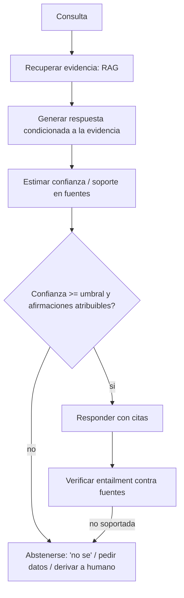

# 168 — Alucinación, grounding y abstención

> [← Clase anterior](../../../classes/part-13-evaluation-safety-security-and-governance/167-explicabilidad-incertidumbre-y-calibracion/README.md) · [Índice de la parte](../README.md) · [Clase siguiente →](../../../classes/part-13-evaluation-safety-security-and-governance/169-gobernanza-roles-y-gestion-de-riesgo/README.md)

**Parte:** 13 — Evaluación, seguridad y gobernanza  
**Nivel:** experto · **Horas estimadas:** 6  
**Laboratorio:** `evaluation` · **Estado:** `EXECUTABLE_CORE`

## 🎯 Propósito

Comprender **alucinación, grounding y abstención** dentro de la evolución de la inteligencia
artificial, implementar un experimento mínimo verificable y distinguir qué parte
constituye evidencia frente a una afirmación todavía no comprobada.

## 📚 Resultados de aprendizaje

Al finalizar podrás:

1. Explicar alucinación, grounding y abstención usando los conceptos `hallucination`, `grounding`, `abstention`, `evidence`.
2. Ejecutar el laboratorio con una semilla explícita y revisar su contrato JSON.
3. Identificar al menos un supuesto, una limitación y un riesgo de aplicación.
4. Comparar el enfoque con la etapa anterior de la ruta de aprendizaje.
5. Producir una evidencia reproducible y una conclusión que no exceda los datos.

## 🧩 Conceptos centrales

`hallucination`, `grounding`, `abstention`, `evidence`

## 🗺️ Ubicación en el mapa de la IA

La alucinación —afirmar con fluidez algo falso— es el fallo más característico de los LLM
generativos y el que más limita su uso en dominios de alto riesgo. Se combate con dos palancas:
**grounding** (anclar las respuestas en fuentes verificables, el motor del RAG de la parte 8) y
**abstención** (enseñar al sistema a decir "no sé" o a derivar). Esta clase cierra el bloque de
evaluación uniendo lo aprendido sobre calibración (clase 167): abstenerse bien exige saber cuándo
el modelo no sabe.

## 📖 Fundamentos

### 👻 Qué es una alucinación

Una **alucinación** es una salida presentada como factual que no está respaldada por la entrada,
el contexto ni el mundo. Tipologías útiles:

- **Intrínseca**: contradice la fuente provista (resume mal un documento dado).
- **Extrínseca**: añade información no verificable con la fuente (inventa una cita, un dato).
- **Factual vs de fidelidad**: factual = contradice el mundo; fidelidad (faithfulness) = contradice
  la fuente, aunque por casualidad sea cierta en el mundo.

Causa raíz: el objetivo de entrenamiento premia continuaciones plausibles, no verdaderas; el modelo
no tiene, por defecto, un mecanismo para separar "lo que sabe" de "lo que suena bien".

### 🔗 Grounding

**Grounding** es condicionar la respuesta en evidencia recuperada y exigir que cada afirmación sea
atribuible a esa evidencia. Componentes:

```text
1. Recuperar   : traer pasajes relevantes (RAG)
2. Condicionar : instruir al modelo a responder SOLO con lo recuperado
3. Atribuir    : cada afirmación cita el pasaje que la soporta
4. Verificar   : comprobar que la respuesta es "entailed" por las fuentes
```

El grounding no elimina la alucinación: reduce la extrínseca y hace *verificable* la respuesta, pero
el modelo aún puede tergiversar la fuente (alucinación intrínseca) o citar mal.

### 🛑 Abstención selectiva

La **abstención** (predicción selectiva) permite al sistema responder solo cuando su confianza
supera un umbral, y en caso contrario decir "no sé", pedir más información o derivar a un humano.
Se caracteriza por dos métricas en tensión:

```text
Cobertura (coverage) = fracción de casos en los que el sistema responde
Riesgo    (risk)     = tasa de error ENTRE los casos respondidos
```

La **curva riesgo-cobertura**: al subir el umbral de confianza, baja la cobertura y —si la confianza
está bien calibrada (clase 167)— baja el riesgo. Un sistema útil abstiene en su zona de baja
confianza para bajar el error donde sí responde. Si la confianza está *mal* calibrada, la abstención
no funciona: por eso calibración y abstención van juntas.

### 📏 Métricas medibles

```text
Tasa de alucinación       = respuestas no soportadas / respuestas totales
Tasa de abstención        = abstenciones / total de consultas
Cobertura                 = respondidas / total
Riesgo selectivo          = errores / respondidas
Attributable to Source    = fracción de afirmaciones respaldadas por una fuente citada
```

El error clásico es reportar solo accuracy global: un sistema que responde todo con 80 % de acierto
puede ser peor, en un dominio crítico, que uno que responde el 60 % con 98 % de acierto y abstiene
el resto.

## 🧮 Ejemplo trabajado: curva riesgo-cobertura

Un QA médico produce 20 respuestas, cada una con una confianza y si fue correcta. Evaluamos dos
umbrales de abstención.

```text
Datos (ordenados por confianza desc, C=correcta, X=error):
conf: 0.98 0.96 0.95 0.93 0.91 0.90 0.88 0.85 0.83 0.80 | 0.78 0.75 0.72 0.70 0.68 0.65 0.60 0.55 0.52 0.50
res :  C    C    C    C    X    C    C    C    C    X   |  X    C    X    C    X    X    X    X    X    X
```

De las 20: 10 correctas en total. Analizamos dos políticas:

1. **Sin abstención (umbral 0.0)**: responde las 20. Correctas = 10 → cobertura = 1.0, riesgo =
   10/20 = **0.50**. Inaceptable para medicina.
2. **Umbral 0.80** (responde solo conf ≥ 0.80, las 10 primeras): de esas 10, hay 2 errores
   (conf 0.91 y 0.80) → cobertura = 10/20 = **0.50**, riesgo = 2/10 = **0.20**.
3. **Umbral 0.90** (responde conf ≥ 0.90, las 6 primeras): 1 error (0.91) → cobertura = 6/20 =
   **0.30**, riesgo = 1/6 = **0.167**.

```text
Política     cobertura   riesgo
sin abstener   1.00       0.500
umbral 0.80    0.50       0.200
umbral 0.90    0.30       0.167
```

4. **Lectura**: subir el umbral baja la cobertura y el riesgo, como se espera con confianza
   razonablemente calibrada. La elección del umbral es una decisión de producto: cuánto error se
   tolera entre lo respondido vs cuántas consultas se derivan a un médico. El sistema que "responde
   todo" (riesgo 0.50) es el peor pese a tener la mayor cobertura.
5. **Grounding encima**: si además cada respuesta debe citar una guía clínica y se descartan las no
   atribuibles, la tasa de alucinación extrínseca cae más, a costa de más abstención.

## 📊 Propiedades y comparación

| Palanca | Qué ataca | Métrica clave | Coste | Límite |
|---|---|---|---|---|
| Grounding (RAG) | alucinación extrínseca | attributable-to-source | recuperación + latencia | no evita tergiversar la fuente |
| Abstención | error en zona incierta | riesgo-cobertura | menos cobertura | inútil si la confianza no está calibrada |
| Verificación de entailment | fidelidad | tasa no-soportada | segundo paso de cómputo | el verificador también falla |
| Citas obligatorias | verificabilidad | % con cita válida | fricción para el usuario | citas plausibles pero incorrectas |



## ⚠️ Errores conceptuales frecuentes

1. **"El RAG elimina las alucinaciones"**. Reduce las extrínsecas y las hace verificables, pero el
   modelo puede tergiversar o citar mal la fuente (alucinación intrínseca / de fidelidad).
2. **"Más cobertura siempre es mejor"**. En dominios críticos, abstenerse y derivar reduce el daño;
   la métrica correcta es el riesgo entre lo respondido, no cuánto responde.
3. **"Abstener es fácil: pon un umbral"**. Solo funciona si la confianza está calibrada (clase 167);
   con confianza sobreconfiada, el umbral deja pasar errores.
4. **"Si cita una fuente, es correcto"**. Los modelos generan citas plausibles pero inexistentes o
   que no soportan la afirmación; hay que verificar la atribución, no confiar en su presencia.
5. **"La alucinación es un bug que se parcheará"**. Es consecuencia del objetivo generativo; se
   gestiona con grounding, abstención y verificación, no se elimina con un ajuste puntual.

## 🚀 Del aprendizaje a la operación

En operación: instrumentar tasa de alucinación, cobertura y riesgo selectivo por dominio; calibrar
la confianza antes de fijar umbrales de abstención; exigir citas y verificar entailment en flujos de
alto riesgo; definir la política de derivación a humano y medir su carga; y monitorear drift porque
las tasas cambian con el contenido y el modelo. Nada de esto está en la demo: aquí se establecen las
definiciones, las métricas y el cálculo manual de la curva riesgo-cobertura.

## 🧪 Laboratorio

```bash
python lab.py
```

El laboratorio llama a `ai_evolution.labs.run_lab("evaluation")`. Esta
decisión evita 183 implementaciones divergentes: cada clase tiene un entrypoint
propio, pero los motores didácticos se prueban como una biblioteca común.

### 🔍 Evidencia esperada

- tipo de laboratorio y semilla;
- entradas o decisiones observables;
- resultado estructurado;
- lista `evidence` con hechos que pueden inspeccionarse;
- lista `limitations` que impide presentar la demo como producción.

## 📓 Notebooks

- [📓 `notebook.ipynb`](notebook.ipynb): recorrido guiado con la materia resumida.
- [✍️ `notebook_student.ipynb`](notebook_student.ipynb): ejercicios para resolver.
- [✅ `notebook_solution.ipynb`](notebook_solution.ipynb): solución de referencia explicada.

## 📝 Evaluación

| Criterio | Peso |
|---|---:|
| Comprensión conceptual | 25 % |
| Ejecución reproducible | 25 % |
| Interpretación basada en evidencia | 25 % |
| Riesgos, límites y mejora propuesta | 25 % |

Consulta [assessment.md](assessment.md) para preguntas y criterio de aceptación.

## ⚠️ Errores comunes

| Síntoma | Causa probable | Corrección |
|---|---|---|
| El código corre, pero no hay conclusión | Se confundió ejecución con aprendizaje | Explica qué demuestra y qué no demuestra |
| El resultado cambia sin explicación | No se registró semilla o configuración | Conserva semilla, versión y parámetros |
| Se promete uso real | Se extrapoló desde una demo educativa | Declara entorno, datos, límites y revisión humana |
| Se copia una métrica aislada | No existe baseline ni costo de error | Añade comparación y criterio de decisión |

## ❓ Preguntas frecuentes

**¿Debo usar una API comercial?**  
No. El núcleo funciona localmente. Las extensiones LIVE se documentan por separado.

**¿El laboratorio representa una implementación industrial?**  
No por sí solo. Enseña el contrato y el patrón; producción exige integración,
seguridad, observabilidad, pruebas y operación.

**¿Dónde profundizo?**  
Revisa las especializaciones enlazadas en el README raíz y la ruta siguiente.

## 🔗 Referencias

- [Ji et al. (2023), *Survey of Hallucination in Natural Language Generation*, arXiv:2202.03629](https://arxiv.org/abs/2202.03629) — uso: fuente primaria del mecanismo estudiado
- [Geifman & El-Yaniv (2017), *Selective Classification for Deep Neural Networks*, arXiv:1705.08500](https://arxiv.org/abs/1705.08500) — uso: fuente primaria del mecanismo estudiado
- [Rashkin et al. (2021), *Measuring Attribution in Natural Language Generation Models* (AIS), arXiv:2112.12870](https://arxiv.org/abs/2112.12870) — uso: fuente primaria del mecanismo estudiado
- [Lewis et al. (2020), *Retrieval-Augmented Generation for Knowledge-Intensive NLP Tasks*, arXiv:2005.11401](https://arxiv.org/abs/2005.11401) — uso: fuente primaria del mecanismo estudiado
- [OWASP Top 10 for LLM Applications — LLM09: Overreliance](https://owasp.org/www-project-top-10-for-large-language-model-applications/) — uso: marco normativo de referencia

<!-- papers:inicio -->

---

## 📜 Papers que fundamentan esta clase

> Bloque generado por `python scripts/link_papers_to_classes.py`. La fuente es [`papers/catalog/papers.json`](../../../papers/catalog/papers.json).

| Paper | Año | Qué desbloqueó | Miniatura |
|---|---:|---|---|
| [P11 · Generación aumentada por recuperación para tareas de PLN intensivas en conocimiento](../../../papers/foundational/P11_rag/README.md) | 2020 | Separa el conocimiento (índice consultable y actualizable) del razonamiento (parámetros del modelo). | [notebook](../../../notebooks/papers/P11_rag.ipynb) |

Cada ficha explica el problema anterior, la matemática mínima, los límites y los errores de atribución más frecuentes. Para leerlas con método: [cómo leer un paper de IA](../../../papers/guides/COMO_LEER_UN_PAPER_DE_IA.md) · [anexos matemáticos](../../../papers/annexes/README.md).
<!-- papers:fin -->
<!-- bibliografia:inicio -->

---

## 📚 Bibliografía de apoyo

> Bloque generado por `python scripts/link_sources_to_classes.py`. Cada obra lleva su localizador verificado en [`sources/bibliography.json`](../../../sources/bibliography.json).

Los papers dicen **de dónde salió** el mecanismo. Estas obras lo **desarrollan** con el espacio que una clase no tiene: teoría completa, demostraciones y ejercicios.

| Obra | Edición | Localizador | Papel en esta clase |
|---|---|---|---|
| Huyen, Chip — *Designing Machine Learning Systems* | 2022 | [ISBN 9781098107956](https://openlibrary.org/isbn/9781098107956) · [web de la obra](https://www.oreilly.com/library/view/designing-machine-learning/9781098107956/) · _pendiente de confirmar en su catálogo_ | obra de referencia de la parte 13 · capítulos de evaluación y monitorización |
| Russell, Stuart J. y Norvig, Peter — *Artificial Intelligence: A Modern Approach* | 4.ª · 2020 | [ISBN 9780134610993](https://openlibrary.org/isbn/9780134610993) · [web de la obra](https://aima.cs.berkeley.edu/) | obra de referencia de la parte 13 · capítulo de filosofía, ética y seguridad de la IA |

**Normas y documentación oficial que aplica esta clase:** [OWASP Top 10 for LLM Applications](https://owasp.org/www-project-top-10-for-large-language-model-applications/)
<!-- bibliografia:fin -->

---

## ⬅️ Clase anterior

[167 — Explicabilidad, incertidumbre y calibración](../../part-13-evaluation-safety-security-and-governance/167-explicabilidad-incertidumbre-y-calibracion/README.md)

## ➡️ Siguiente clase

[169 — Gobernanza, roles y gestión de riesgo](../../part-13-evaluation-safety-security-and-governance/169-gobernanza-roles-y-gestion-de-riesgo/README.md)
