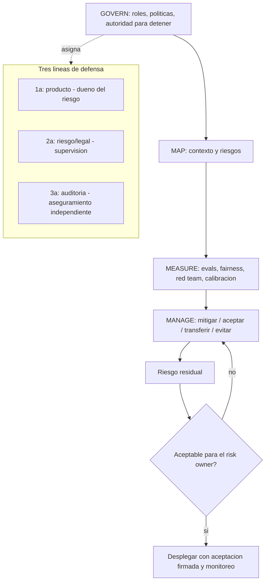

# 169 — Gobernanza, roles y gestión de riesgo

> [← Clase anterior](../../../classes/part-13-evaluation-safety-security-and-governance/168-alucinacion-grounding-y-abstencion/README.md) · [Índice de la parte](../README.md) · [Clase siguiente →](../../../classes/part-13-evaluation-safety-security-and-governance/170-normativa-auditoria-y-evidencia/README.md)

**Parte:** 13 — Evaluación, seguridad y gobernanza  
**Nivel:** experto · **Horas estimadas:** 6  
**Laboratorio:** `safety` · **Estado:** `EXECUTABLE_CORE`

## 🎯 Propósito

Comprender **gobernanza, roles y gestión de riesgo** dentro de la evolución de la inteligencia
artificial, implementar un experimento mínimo verificable y distinguir qué parte
constituye evidencia frente a una afirmación todavía no comprobada.

## 📚 Resultados de aprendizaje

Al finalizar podrás:

1. Explicar gobernanza, roles y gestión de riesgo usando los conceptos `governance`, `roles`, `risk`, `controls`.
2. Ejecutar el laboratorio con una semilla explícita y revisar su contrato JSON.
3. Identificar al menos un supuesto, una limitación y un riesgo de aplicación.
4. Comparar el enfoque con la etapa anterior de la ruta de aprendizaje.
5. Producir una evidencia reproducible y una conclusión que no exceda los datos.

## 🧩 Conceptos centrales

`governance`, `roles`, `risk`, `controls`

## 🗺️ Ubicación en el mapa de la IA

Las clases anteriores dieron técnicas (evaluar, red team, fairness, calibración); la gobernanza es
lo que convierte técnicas sueltas en un sistema de gestión con responsables, decisiones y evidencia.
El NIST AI Risk Management Framework (2023) y el modelo de las tres líneas de defensa —importado de
la gestión de riesgo financiero— son el andamiaje estándar para responder "¿quién responde por este
sistema y cómo se decide desplegarlo?". Es el puente entre ingeniería y cumplimiento (clase 170).

## 📖 Fundamentos

### 🏛️ Qué es la gobernanza de IA

**Gobernanza** es el conjunto de roles, procesos y decisiones que aseguran que un sistema de IA se
construye, despliega y opera de forma alineada con los valores, las políticas y la ley de la
organización. No es documentación: es *quién decide qué, con qué evidencia y con qué autoridad para
detener*. Sin poder de veto real, la gobernanza es teatro.

### 🧭 NIST AI RMF: las cuatro funciones

El NIST AI RMF organiza la gestión de riesgo en cuatro funciones continuas (no fases secuenciales):

```text
GOVERN   : cultura, roles, políticas y rendición de cuentas (la función transversal)
MAP      : contextualizar el sistema y sus riesgos (uso previsto, partes afectadas, impactos)
MEASURE  : evaluar y cuantificar los riesgos con métodos (evals, fairness, red team, calibración)
MANAGE   : priorizar, tratar y monitorear los riesgos (mitigar, aceptar, transferir, evitar)
```

GOVERN envuelve a las otras tres: define quién ejecuta MAP/MEASURE/MANAGE y quién rinde cuentas.
El RMF es voluntario y agnóstico de tecnología; su valor es dar un vocabulario común y trazable.

Complementa con las características de un sistema de IA *confiable* que el RMF nombra: válido y
fiable, seguro, seguro frente a ataques y resiliente, explicable e interpretable, con privacidad
mejorada, justo con sesgos gestionados, y responsable y transparente.

### 🛡️ Las tres líneas de defensa

Modelo de gobernanza que separa quién *asume* el riesgo de quién lo *vigila* y de quién lo *audita*:

```text
1ª línea: los DUEÑOS del riesgo       -> equipos de producto/ingeniería que construyen y operan
                                         (implementan controles y viven con el riesgo)
2ª línea: SUPERVISIÓN del riesgo      -> riesgo, seguridad, privacidad, ética, legal
                                         (define políticas, revisa, reta, no construye)
3ª línea: ASEGURAMIENTO independiente -> auditoría interna
                                         (verifica que 1ª y 2ª funcionan; reporta al órgano de gobierno)
```

La clave es la **independencia creciente**: la 2ª línea no depende de quien construye, y la 3ª no
depende de la 2ª. Un red team dentro del equipo de producto es 1ª línea; solo es aseguramiento si es
independiente. Confundir las líneas (que quien construye se autoaudite) anula el control.

### 📊 Gestión de riesgo: identificar, evaluar, tratar

```text
1. Identificar : catálogo de riesgos (daño, seguridad, sesgo, privacidad, legal, reputacional)
2. Evaluar     : probabilidad x impacto -> nivel de riesgo (matriz de riesgo)
3. Tratar      : mitigar / aceptar / transferir / evitar (las 4 respuestas)
4. Monitorear  : riesgo residual, indicadores, reevaluación periódica
```

El **riesgo residual** es el que queda tras las mitigaciones; se **acepta explícitamente** por
alguien con autoridad (risk owner), no se ignora. Un riesgo aceptado y documentado es gobernanza;
uno ignorado es negligencia.

## 🧮 Ejemplo trabajado: matriz de riesgo y decisión de despliegue

Sistema de scoring de CV. Catalogamos tres riesgos con probabilidad (P) e impacto (I) en escala 1-5.

```text
Riesgo                              P    I    P*I   nivel
R1 sesgo de género en el ranking    4    5     20   crítico
R2 alucinación en el resumen        3    2      6   medio
R3 fuga de PII del CV en logs       2    5     10   alto
```

1. **Priorización**: R1 (20) > R3 (10) > R2 (6). Se trata primero lo crítico.
2. **Tratamiento**:
   - R1 → *mitigar*: medir disparate impact por grupo (clase 166), umbral DI ≥ 0.8, revisión humana
     de los rankings. Riesgo residual tras mitigar: P baja de 4 a 2 → P*I = 10 (alto). No se elimina.
   - R3 → *mitigar*: redacción de PII antes de loguear (clase 165). Residual P*I = 5 (medio).
   - R2 → *aceptar*: bajo impacto; se documenta y monitorea.
3. **Asignación por líneas**: el equipo de producto (1ª) implementa las mitigaciones; riesgo/legal
   (2ª) define el umbral DI y revisa la evidencia; auditoría interna (3ª) verifica que la revisión
   humana realmente ocurre.
4. **Decisión de despliegue (GOVERN)**: el riesgo residual de R1 sigue siendo *alto*. El risk owner
   con autoridad decide: despliegue **condicionado** a revisión humana obligatoria y reevaluación a
   30 días, con aceptación firmada del riesgo residual. La decisión y su evidencia quedan registradas.
5. **Lectura honesta**: la gobernanza no hizo el sistema "seguro"; hizo la decisión *explícita,
   trazable y con un responsable* — que es lo auditable cuando algo falle (clase 171).

## 📊 Propiedades y comparación

| Elemento | Qué aporta | Riesgo si falta |
|---|---|---|
| GOVERN (NIST) | responsables y autoridad para detener | decisiones sin dueño |
| MAP/MEASURE/MANAGE | proceso repetible de riesgo | mitigaciones ad hoc |
| 3 líneas de defensa | separación construir/vigilar/auditar | autoauditoría, conflicto de interés |
| Matriz de riesgo | priorización trazable | tratar lo urgente, no lo importante |
| Aceptación de residual | responsabilidad explícita | riesgo ignorado = negligencia |



## ⚠️ Errores conceptuales frecuentes

1. **"Gobernanza = escribir políticas"**. Sin autoridad real para detener un despliegue, las
   políticas son teatro; la gobernanza se define por sus decisiones y su poder de veto.
2. **"Las cuatro funciones del NIST son fases secuenciales"**. Son continuas y GOVERN es
   transversal; MEASURE y MANAGE se repiten durante toda la vida del sistema.
3. **"El equipo que construye puede auditarse a sí mismo"**. Rompe la independencia de la 3ª línea;
   el aseguramiento debe ser independiente de quien asume y de quien supervisa el riesgo.
4. **"Un riesgo residual bajo significa cero riesgo"**. Siempre queda residual; la gobernanza exige
   *aceptarlo explícitamente* con un responsable, no declararlo inexistente.
5. **"El NIST AI RMF es obligatorio / certifica"**. Es un marco voluntario y agnóstico; da
   vocabulario y estructura, no una certificación ni cumplimiento legal por sí mismo (clase 170).

## 🚀 Del aprendizaje a la operación

En operación: definir roles y risk owners con autoridad para detener, instrumentar MAP/MEASURE/
MANAGE con las técnicas de las clases 160-168 como evidencia, separar las tres líneas con
independencia real, mantener un registro de riesgos con aceptaciones firmadas y reevaluación
periódica, y conectar la salida (riesgo residual, incidentes) con el cumplimiento normativo (clase
167) y la respuesta a incidentes (clase 171). Esta clase solo establece el marco y una decisión de
despliegue trabajada a mano.

## 🧪 Laboratorio

```bash
python lab.py
```

El laboratorio llama a `ai_evolution.labs.run_lab("safety")`. Esta
decisión evita 183 implementaciones divergentes: cada clase tiene un entrypoint
propio, pero los motores didácticos se prueban como una biblioteca común.

### 🔍 Evidencia esperada

- tipo de laboratorio y semilla;
- entradas o decisiones observables;
- resultado estructurado;
- lista `evidence` con hechos que pueden inspeccionarse;
- lista `limitations` que impide presentar la demo como producción.

## 📓 Notebooks

- [📓 `notebook.ipynb`](notebook.ipynb): recorrido guiado con la materia resumida.
- [✍️ `notebook_student.ipynb`](notebook_student.ipynb): ejercicios para resolver.
- [✅ `notebook_solution.ipynb`](notebook_solution.ipynb): solución de referencia explicada.

## 📝 Evaluación

| Criterio | Peso |
|---|---:|
| Comprensión conceptual | 25 % |
| Ejecución reproducible | 25 % |
| Interpretación basada en evidencia | 25 % |
| Riesgos, límites y mejora propuesta | 25 % |

Consulta [assessment.md](assessment.md) para preguntas y criterio de aceptación.

## ⚠️ Errores comunes

| Síntoma | Causa probable | Corrección |
|---|---|---|
| El código corre, pero no hay conclusión | Se confundió ejecución con aprendizaje | Explica qué demuestra y qué no demuestra |
| El resultado cambia sin explicación | No se registró semilla o configuración | Conserva semilla, versión y parámetros |
| Se promete uso real | Se extrapoló desde una demo educativa | Declara entorno, datos, límites y revisión humana |
| Se copia una métrica aislada | No existe baseline ni costo de error | Añade comparación y criterio de decisión |

## ❓ Preguntas frecuentes

**¿Debo usar una API comercial?**  
No. El núcleo funciona localmente. Las extensiones LIVE se documentan por separado.

**¿El laboratorio representa una implementación industrial?**  
No por sí solo. Enseña el contrato y el patrón; producción exige integración,
seguridad, observabilidad, pruebas y operación.

**¿Dónde profundizo?**  
Revisa las especializaciones enlazadas en el README raíz y la ruta siguiente.

## 🔗 Referencias

- [NIST AI Risk Management Framework (AI RMF 1.0)](https://www.nist.gov/itl/ai-risk-management-framework) — uso: marco normativo de referencia
- [NIST AI RMF 1.0 — documento completo (NIST AI 100-1, PDF)](https://nvlpubs.nist.gov/nistpubs/ai/NIST.AI.100-1.pdf) — uso: marco normativo de referencia
- [IIA (2020), *The IIA's Three Lines Model* (tres líneas de defensa)](https://www.theiia.org/en/content/position-papers/2020/the-iias-three-lines-model-an-update-of-the-three-lines-of-defense/) — uso: referencia consultada en su fuente original
- [ISO/IEC 23894:2023 — Gestión del riesgo de la IA](https://www.iso.org/standard/77304.html) — uso: marco normativo de referencia
- [ISO 31000:2018 — Gestión del riesgo (principios y directrices)](https://www.iso.org/standard/65694.html) — uso: marco normativo de referencia

<!-- papers:inicio -->

---

## 📜 Papers que fundamentan esta clase

> Bloque generado por `python scripts/link_papers_to_classes.py`. La fuente es [`papers/catalog/papers.json`](../../../papers/catalog/papers.json).

| Paper | Año | Qué desbloqueó | Miniatura |
|---|---:|---|---|
| [P148 · Cerrar la brecha de responsabilidad: un marco de auditoría algorítmica interna](../../../papers/foundational/P148_auditoria_interna/README.md) | 2020 | Convierte la auditoría de un examen final en un proceso con cinco etapas y artefactos obligatorios que se producen mientras el sistema se construye. | [notebook](../../../notebooks/papers/P148_auditoria_interna.ipynb) |

Cada ficha explica el problema anterior, la matemática mínima, los límites y los errores de atribución más frecuentes. Para leerlas con método: [cómo leer un paper de IA](../../../papers/guides/COMO_LEER_UN_PAPER_DE_IA.md) · [anexos matemáticos](../../../papers/annexes/README.md).
<!-- papers:fin -->
<!-- bibliografia:inicio -->

---

## 📚 Bibliografía de apoyo

> Bloque generado por `python scripts/link_sources_to_classes.py`. Cada obra lleva su localizador verificado en [`sources/bibliography.json`](../../../sources/bibliography.json).

Los papers dicen **de dónde salió** el mecanismo. Estas obras lo **desarrollan** con el espacio que una clase no tiene: teoría completa, demostraciones y ejercicios.

| Obra | Edición | Localizador | Papel en esta clase |
|---|---|---|---|
| Huyen, Chip — *Designing Machine Learning Systems* | 2022 | [ISBN 9781098107956](https://openlibrary.org/isbn/9781098107956) · [web de la obra](https://www.oreilly.com/library/view/designing-machine-learning/9781098107956/) · _pendiente de confirmar en su catálogo_ | obra de referencia de la parte 13 · capítulos de evaluación y monitorización |
| Russell, Stuart J. y Norvig, Peter — *Artificial Intelligence: A Modern Approach* | 4.ª · 2020 | [ISBN 9780134610993](https://openlibrary.org/isbn/9780134610993) · [web de la obra](https://aima.cs.berkeley.edu/) | obra de referencia de la parte 13 · capítulo de filosofía, ética y seguridad de la IA |

**Normas y documentación oficial que aplica esta clase:** [AI Risk Management Framework](https://www.nist.gov/itl/ai-risk-management-framework) · [NIST AI RMF 1.0](https://nvlpubs.nist.gov/nistpubs/ai/NIST.AI.100-1.pdf) · [ISO/IEC 23894:2023](https://www.iso.org/standard/77304.html) · [ISO 31000:2018](https://www.iso.org/standard/65694.html)
<!-- bibliografia:fin -->

---

## ⬅️ Clase anterior

[168 — Alucinación, grounding y abstención](../../part-13-evaluation-safety-security-and-governance/168-alucinacion-grounding-y-abstencion/README.md)

## ➡️ Siguiente clase

[170 — Normativa, auditoría y evidencia](../../part-13-evaluation-safety-security-and-governance/170-normativa-auditoria-y-evidencia/README.md)
