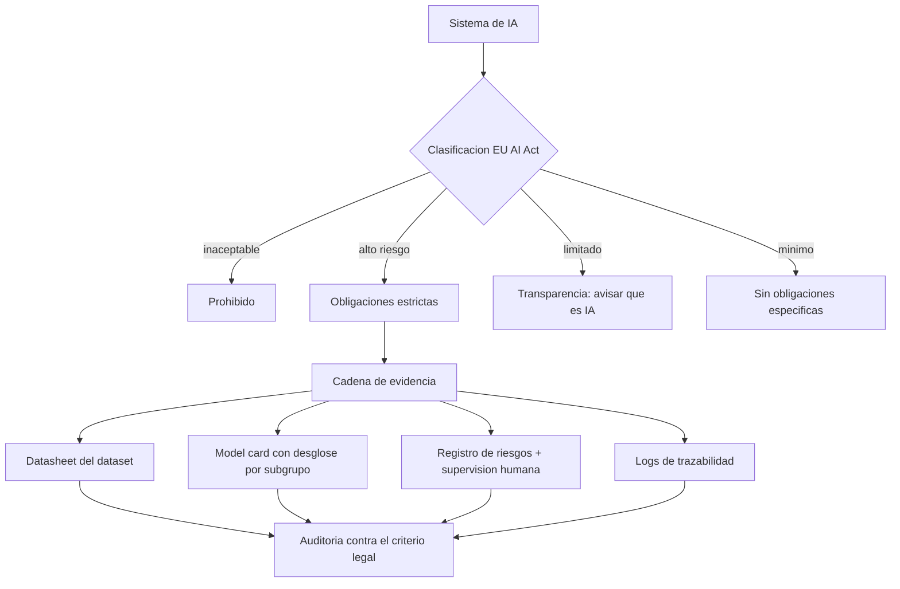

# 170 — Normativa, auditoría y evidencia

> [← Clase anterior](../../../classes/part-13-evaluation-safety-security-and-governance/169-gobernanza-roles-y-gestion-de-riesgo/README.md) · [Índice de la parte](../README.md) · [Clase siguiente →](../../../classes/part-13-evaluation-safety-security-and-governance/171-proyecto-respuesta-a-incidentes-de-ia/README.md)

**Parte:** 13 — Evaluación, seguridad y gobernanza  
**Nivel:** experto · **Horas estimadas:** 6  
**Laboratorio:** `safety` · **Estado:** `EXECUTABLE_CORE`

## 🎯 Propósito

Comprender **normativa, auditoría y evidencia** dentro de la evolución de la inteligencia
artificial, implementar un experimento mínimo verificable y distinguir qué parte
constituye evidencia frente a una afirmación todavía no comprobada.

## 📚 Resultados de aprendizaje

Al finalizar podrás:

1. Explicar normativa, auditoría y evidencia usando los conceptos `AI Act`, `audit`, `evidence`, `compliance`.
2. Ejecutar el laboratorio con una semilla explícita y revisar su contrato JSON.
3. Identificar al menos un supuesto, una limitación y un riesgo de aplicación.
4. Comparar el enfoque con la etapa anterior de la ruta de aprendizaje.
5. Producir una evidencia reproducible y una conclusión que no exceda los datos.

## 🧩 Conceptos centrales

`AI Act`, `audit`, `evidence`, `compliance`

## 🗺️ Ubicación en el mapa de la IA

La gobernanza interna (clase 169) se encuentra con la obligación externa: leyes que imponen qué
documentar y demostrar. El **Reglamento (UE) 2024/1689 (EU AI Act)**, primer marco legal horizontal
de IA del mundo, y los artefactos de transparencia nacidos en la investigación —**model cards**
(Mitchell et al., 2018) y **datasheets for datasets** (Gebru et al., 2018)— definen la evidencia
que un sistema de IA debe producir para ser auditable. Aquí la honestidad técnica de las clases
previas se vuelve requisito de cumplimiento.

## 📖 Fundamentos

### 📜 EU AI Act: enfoque basado en riesgo

El Reglamento (UE) 2024/1689 clasifica los sistemas de IA por nivel de riesgo y gradúa las
obligaciones:

```text
Nivel               Ejemplos                                   Régimen
Riesgo inaceptable  scoring social, manipulación subliminal    PROHIBIDO
Alto riesgo         empleo, crédito, biometría, salud, justicia obligaciones estrictas
Riesgo limitado     chatbots, deepfakes                        transparencia (informar que es IA)
Riesgo mínimo       filtros de spam, videojuegos               sin obligaciones específicas
```

Para los sistemas de **alto riesgo**, el Anexo del Reglamento exige, entre otros: sistema de gestión
de riesgos, gobernanza de datos, **documentación técnica**, registro de eventos (trazabilidad
mediante logs), transparencia e información al usuario, **supervisión humana** efectiva, y niveles
apropiados de exactitud, robustez y ciberseguridad. Los modelos de propósito general (GPAI) tienen
obligaciones propias, más estrictas si presentan riesgo sistémico.

### 🗓️ Aplicación escalonada

El Reglamento entró en vigor en 2024 y se aplica por fases: las prohibiciones primero, luego las
reglas de GPAI, y las obligaciones de alto riesgo con plazos posteriores. El detalle de fechas se
consulta en el texto oficial; lo relevante conceptualmente es que el cumplimiento es gradual y
exige preparar evidencia antes de la fecha aplicable.

### 🃏 Model cards

Una **model card** (Mitchell et al., arXiv:1810.03993) es una ficha estandarizada que documenta un
modelo para su uso responsable. Secciones canónicas:

```text
- Detalles del modelo    : versión, tipo, fecha, responsables, licencia
- Uso previsto           : casos soportados y usuarios objetivo
- Factores               : grupos, entornos e instrumentación relevantes
- Métricas               : medidas de desempeño y umbrales de decisión
- Datos de evaluación    : qué conjuntos, por qué
- Datos de entrenamiento : procedencia y limitaciones
- Análisis cuantitativo  : desempeño DESGLOSADO por subgrupo (conecta con clase 166)
- Consideraciones éticas : riesgos y mitigaciones
- Advertencias y usos NO recomendados
```

Su función central es declarar el **desempeño por subgrupo y los límites de uso**, no solo un número
agregado: una model card sin desglose ni "usos no recomendados" incumple su propósito.

### 📋 Datasheets for datasets

Una **datasheet** (Gebru et al., arXiv:1803.09010) documenta un *dataset* respondiendo a preguntas
sobre su ciclo de vida:

```text
- Motivación   : por qué y para quién se creó
- Composición  : qué representa cada instancia, PII, poblaciones
- Recolección  : cómo y de quién se obtuvo, consentimiento
- Preprocesado : limpieza, etiquetado, quién etiquetó
- Usos         : usos previstos y usos que deberían evitarse
- Distribución : licencia, restricciones
- Mantenimiento: quién lo mantiene, cómo se actualiza o retira
```

Modelo y dato tienen fichas distintas porque los sesgos y límites del dato (clase 165-163) preceden
y explican los del modelo; auditar solo el modelo sin datasheet deja ciega la mitad de la cadena.

### 🔍 Auditoría y cadena de evidencia

Una **auditoría** verifica, contra un criterio (ley, norma, política interna), que el sistema hace
lo que afirma. Requiere una **cadena de evidencia** trazable: qué se midió, con qué datos y
protocolo, quién lo aprobó y cuándo. La evidencia se produce *durante* el ciclo de vida (evals,
model card, datasheet, registro de riesgos, logs), no se fabrica al final. Auditoría sin evidencia
reproducible es opinión.

## 🧮 Ejemplo trabajado: clasificar y preparar evidencia

Una empresa lanza un sistema que **filtra candidatos** para entrevistas a partir de su CV.

1. **Clasificación EU AI Act**: la selección de personal para empleo está listada como **alto
   riesgo**. No es "riesgo limitado" por ser un chatbot: el uso (empleo) determina la categoría, no
   la tecnología.
2. **Obligaciones activadas** (alto riesgo): gestión de riesgos, gobernanza de datos, documentación
   técnica, trazabilidad por logs, transparencia, **supervisión humana** y niveles de exactitud/
   robustez/seguridad.
3. **Evidencia a producir**, mapeando a las clases previas:

```text
Obligación                     Artefacto/evidencia                         Clase de origen
gestión de riesgos             matriz de riesgo + aceptación de residual    166
gobernanza de datos            datasheet del dataset de CV                   167 (Gebru)
exactitud y robustez           evals con protocolo + golden set             157-158
no discriminación              disparate impact por grupo en la model card  163
supervisión humana             flujo de revisión + abstención               165
ciberseguridad                 red team + defensas de inyección/tools       159-161
transparencia                  model card publicada + aviso de uso de IA    167 (Mitchell)
```

4. **Model card mínima**: declara uso previsto (cribado inicial, NO decisión final de contratación),
   desempeño por grupo con su disparate impact, y en "usos no recomendados": decidir contratación sin
   revisión humana. Datasheet: procedencia de los CV, consentimiento, poblaciones representadas y
   sesgos conocidos.
5. **Lectura honesta**: cumplir no es "aprobar un examen" una vez; es mantener la evidencia viva
   (reevaluar, reentrenar, re-documentar) y demostrarla ante un auditor. La cadena de evidencia es
   el producto real de todo el bloque 157-166.

## 📊 Propiedades y comparación

| Artefacto | Documenta | Pregunta que responde | Origen |
|---|---|---|---|
| Model card | un modelo | ¿cómo rinde, para qué sirve y qué NO? | Mitchell et al. 2018 |
| Datasheet | un dataset | ¿de dónde viene y con qué límites? | Gebru et al. 2018 |
| Documentación técnica (AI Act) | el sistema de alto riesgo | ¿cumple las obligaciones legales? | Reg. UE 2024/1689 |
| Registro de riesgos | el proceso de gestión | ¿qué riesgos y quién los acepta? | NIST/clase 169 |
| Logs de trazabilidad | la operación | ¿qué pasó y cuándo? | AI Act / clase 171 |



## ⚠️ Errores conceptuales frecuentes

1. **"La tecnología define el nivel de riesgo"**. Lo define el **uso**: el mismo LLM es riesgo
   mínimo como filtro de spam y alto riesgo cribando candidatos.
2. **"Una model card es marketing"**. Su núcleo es el desempeño *por subgrupo* y los *usos no
   recomendados*; sin eso no cumple su función de transparencia ni de auditoría.
3. **"Basta documentar el modelo"**. Los límites del dato (datasheet) explican los del modelo;
   auditar sin datasheet deja ciega la mitad de la cadena.
4. **"El cumplimiento es un hito único"**. Es continuo: reevaluar, re-documentar y demostrar la
   evidencia viva ante auditoría; una model card de hace dos versiones no prueba nada del sistema actual.
5. **"El EU AI Act certifica que el sistema es seguro"**. Impone obligaciones y evidencia; el
   cumplimiento legal no equivale a ausencia de riesgo técnico (clase 169).

## 🚀 Del aprendizaje a la operación

En operación: clasificar cada sistema según el AI Act y activar las obligaciones correspondientes,
mantener model cards y datasheets versionadas junto al código, producir evidencia durante todo el
ciclo (no al final), instrumentar logs de trazabilidad y supervisión humana efectiva, y preparar la
cadena de evidencia para auditorías internas (3ª línea) y externas. La respuesta a incidentes
(clase 171) cierra el ciclo cuando la evidencia revela un fallo en producción. Esta clase solo
establece el marco legal, los artefactos y el mapeo de evidencia.

## 🧪 Laboratorio

```bash
python lab.py
```

El laboratorio llama a `ai_evolution.labs.run_lab("safety")`. Esta
decisión evita 183 implementaciones divergentes: cada clase tiene un entrypoint
propio, pero los motores didácticos se prueban como una biblioteca común.

### 🔍 Evidencia esperada

- tipo de laboratorio y semilla;
- entradas o decisiones observables;
- resultado estructurado;
- lista `evidence` con hechos que pueden inspeccionarse;
- lista `limitations` que impide presentar la demo como producción.

## 📓 Notebooks

- [📓 `notebook.ipynb`](notebook.ipynb): recorrido guiado con la materia resumida.
- [✍️ `notebook_student.ipynb`](notebook_student.ipynb): ejercicios para resolver.
- [✅ `notebook_solution.ipynb`](notebook_solution.ipynb): solución de referencia explicada.

## 📝 Evaluación

| Criterio | Peso |
|---|---:|
| Comprensión conceptual | 25 % |
| Ejecución reproducible | 25 % |
| Interpretación basada en evidencia | 25 % |
| Riesgos, límites y mejora propuesta | 25 % |

Consulta [assessment.md](assessment.md) para preguntas y criterio de aceptación.

## ⚠️ Errores comunes

| Síntoma | Causa probable | Corrección |
|---|---|---|
| El código corre, pero no hay conclusión | Se confundió ejecución con aprendizaje | Explica qué demuestra y qué no demuestra |
| El resultado cambia sin explicación | No se registró semilla o configuración | Conserva semilla, versión y parámetros |
| Se promete uso real | Se extrapoló desde una demo educativa | Declara entorno, datos, límites y revisión humana |
| Se copia una métrica aislada | No existe baseline ni costo de error | Añade comparación y criterio de decisión |

## ❓ Preguntas frecuentes

**¿Debo usar una API comercial?**  
No. El núcleo funciona localmente. Las extensiones LIVE se documentan por separado.

**¿El laboratorio representa una implementación industrial?**  
No por sí solo. Enseña el contrato y el patrón; producción exige integración,
seguridad, observabilidad, pruebas y operación.

**¿Dónde profundizo?**  
Revisa las especializaciones enlazadas en el README raíz y la ruta siguiente.

## 🔗 Referencias

- [Reglamento (UE) 2024/1689 — EU AI Act (texto oficial)](https://eur-lex.europa.eu/eli/reg/2024/1689/oj)
- [Mitchell et al. (2019), *Model Cards for Model Reporting*, arXiv:1810.03993](https://arxiv.org/abs/1810.03993)
- [Gebru et al. (2021), *Datasheets for Datasets*, arXiv:1803.09010](https://arxiv.org/abs/1803.09010)
- [NIST AI Risk Management Framework](https://www.nist.gov/itl/ai-risk-management-framework)
- [Comisión Europea — AI Act: información oficial y calendario de aplicación](https://digital-strategy.ec.europa.eu/en/policies/regulatory-framework-ai)

---

## ⬅️ Clase anterior

[169 — Gobernanza, roles y gestión de riesgo](../../part-13-evaluation-safety-security-and-governance/169-gobernanza-roles-y-gestion-de-riesgo/README.md)

## ➡️ Siguiente clase

[171 — Proyecto: respuesta a incidentes de IA](../../part-13-evaluation-safety-security-and-governance/171-proyecto-respuesta-a-incidentes-de-ia/README.md)
