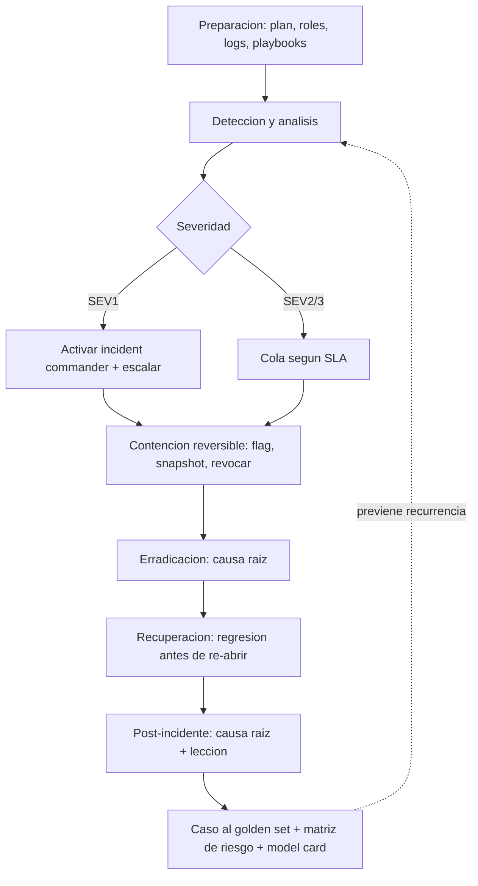

# 171 — Proyecto: respuesta a incidentes de IA

> [← Clase anterior](../../../classes/part-13-evaluation-safety-security-and-governance/170-normativa-auditoria-y-evidencia/README.md) · [Índice de la parte](../README.md) · [Clase siguiente →](../../../classes/part-14-frontier-research-and-capstones/172-ia-neuro-simbolica/README.md)

**Parte:** 13 — Evaluación, seguridad y gobernanza  
**Nivel:** experto · **Horas estimadas:** 10  
**Laboratorio:** `capstone` · **Estado:** `EXECUTABLE_CORE`

## 🎯 Propósito

Comprender **proyecto: respuesta a incidentes de ia** dentro de la evolución de la inteligencia
artificial, implementar un experimento mínimo verificable y distinguir qué parte
constituye evidencia frente a una afirmación todavía no comprobada.

## 📚 Resultados de aprendizaje

Al finalizar podrás:

1. Explicar proyecto: respuesta a incidentes de ia usando los conceptos `incident`, `containment`, `evidence`, `recovery`.
2. Ejecutar el laboratorio con una semilla explícita y revisar su contrato JSON.
3. Identificar al menos un supuesto, una limitación y un riesgo de aplicación.
4. Comparar el enfoque con la etapa anterior de la ruta de aprendizaje.
5. Producir una evidencia reproducible y una conclusión que no exceda los datos.

## 🧩 Conceptos centrales

`incident`, `containment`, `evidence`, `recovery`

## 🗺️ Ubicación en el mapa de la IA

Este proyecto cierra la parte 13 integrando todo lo anterior en el momento en que fallan: cuando un
sistema de IA en producción causa un daño, filtra datos o es explotado. La respuesta a incidentes
(IR) es una disciplina madura de ciberseguridad (NIST SP 800-61) que aquí se adapta a los fallos
propios de la IA —alucinación dañina, inyección exitosa, sesgo detectado, fuga por memorización— y
conecta la evidencia (clase 170) y la gobernanza (clase 169) con la acción bajo presión.

## 📖 Fundamentos

### 🚨 Qué es un incidente de IA

Un **incidente de IA** es un evento en el que el sistema causa o está a punto de causar un daño real:
una decisión discriminatoria a escala, una exfiltración por inyección indirecta, un consejo
peligroso no abstenido, una fuga de PII memorizada. Se distingue de un *bug* por su impacto sobre
personas o por su relevancia legal/regulatoria; muchos incidentes de IA son también reportables bajo
normativa (EU AI Act, protección de datos).

### 🔄 El ciclo de respuesta a incidentes

Adaptando el ciclo de NIST SP 800-61 a la IA:

```text
1. Preparación   : plan, roles, canales, playbooks, logs y evidencia YA instrumentados
2. Detección     : señales (monitoreo de métricas, reportes de usuarios, red team, alertas)
   y análisis    : confirmar, clasificar severidad, delimitar alcance
3. Contención    : detener el daño sin destruir evidencia (feature flag, rollback, rate-limit)
4. Erradicación  : eliminar la causa raíz (parche de prompt, filtro, revocar credencial, retirar dato)
5. Recuperación  : restaurar el servicio con validación (regresión antes de re-abrir)
6. Post-incidente: análisis de causa raíz, lecciones, y CONVERTIR el caso en regresión permanente
```

Preparación y post-incidente son las fases que más se descuidan y las que más reducen el daño futuro:
un incidente sin post-mortem se repetirá.

### ⚖️ Contención sin destruir evidencia

La tensión central: **detener el daño** rápido vs **preservar la evidencia** para entender qué pasó
y cumplir obligaciones legales. Borrar logs, reiniciar sin capturar estado o "arreglar en caliente"
sin registrar destruye la cadena de evidencia (clase 170). Regla: contener con acciones reversibles y
registradas (desactivar por flag, aislar, limitar tasa) antes que con acciones destructivas.

### 📊 Severidad y priorización

```text
Severidad = f(impacto en personas, alcance, reversibilidad, obligación legal)
SEV1 crítico : daño grave/masivo o dato sensible expuesto -> respuesta inmediata, escalar
SEV2 alto    : daño acotado o riesgo alto -> contener en horas
SEV3 medio   : impacto limitado -> siguiente ciclo
```

La severidad guía quién se activa (roles de la clase 169) y los tiempos objetivo (SLA de respuesta).

### 🧾 Roles y comunicación

Un IR necesita roles claros: **incident commander** (decide y coordina), técnicos (contienen y
erradican), comunicación (usuarios, reguladores), legal/privacidad (obligaciones de reporte). La
comunicación honesta y a tiempo —qué pasó, a quién afecta, qué se hace— es parte del control del daño,
no un extra. Ocultar un incidente reportable agrava la responsabilidad.

### 🔁 Cierre del ciclo con las clases previas

```text
Detección     <- monitoreo de alucinación/fairness/calibración (163-165) y red team (162)
Causa raíz    <- inyección/tools (160-161), memorización (165), datos/sesgo (166)
Evidencia     <- logs de trazabilidad y model card/datasheet (170)
Prevención    <- el caso se añade al golden set de regresión (161) y a la matriz de riesgo (169)
```

## 🧮 Ejemplo trabajado: exfiltración por inyección indirecta

Un asistente que resume correos empieza a reenviar información a un dominio externo. Aplicamos el ciclo.

1. **Detección/análisis**: una alerta de red detecta envíos a `externo@atacante.example`; se confirma
   que un correo contenía una instrucción incrustada (inyección indirecta, clase 163). Alcance: 3
   cuentas afectadas en 40 minutos. **Severidad SEV1** (dato sensible expuesto + posible reporte legal).
2. **Contención (reversible, preserva evidencia)**:
   - desactivar la tool `send_email` por feature flag (no borrar código ni logs);
   - snapshot de los logs de las últimas 2 horas antes de cualquier cambio;
   - revocar la credencial de envío. Todo registrado con hora y responsable.
3. **Erradicación**: causa raíz = la tool aceptaba destinatarios arbitrarios (confused deputy,
   clase 164) y no había separación de contenido no confiable. Parche: allowlist de destinatarios +
   marcado de contenido no confiable + aprobación humana para destinos nuevos.
4. **Recuperación**: antes de reactivar, correr la suite de regresión (clase 161) incluyendo el caso
   de inyección reproducido; solo se re-abre `send_email` cuando el caso falla en producir el envío.
5. **Post-incidente**: análisis de causa raíz documentado; el payload se convierte en **ítem
   permanente del golden set** con severidad alta; se actualiza la matriz de riesgo (clase 169) y la
   model card; se notifica a los afectados y, si aplica, a la autoridad de protección de datos.
6. **Lectura honesta**: la respuesta no "borró" el incidente; lo contuvo, lo explicó con evidencia y
   lo transformó en una defensa permanente. El valor del IR no es la velocidad sola, sino la
   contención sin pérdida de evidencia y el aprendizaje que impide la recurrencia.

## 📊 Propiedades y comparación

| Fase | Objetivo | Error típico | Buena práctica |
|---|---|---|---|
| Preparación | poder responder | no tener plan ni logs | playbooks + evidencia instrumentada |
| Detección | ver el daño pronto | depender solo de reportes | monitoreo de métricas de las clases 166-168 |
| Contención | parar sin romper | borrar logs, fix en caliente | acciones reversibles y registradas |
| Erradicación | quitar la causa raíz | tratar el síntoma | análisis de causa raíz real |
| Recuperación | volver seguro | re-abrir sin validar | regresión antes de restaurar |
| Post-incidente | no repetir | cerrar sin aprender | caso -> golden set + matriz de riesgo |



## ⚠️ Errores conceptuales frecuentes

1. **"La respuesta a incidentes empieza cuando ocurre el incidente"**. Empieza en la *preparación*:
   sin plan, roles y logs previos, la respuesta improvisa y pierde evidencia.
2. **"Contener es arreglar rápido en producción"**. El fix en caliente sin registro destruye la
   cadena de evidencia; se contiene con acciones reversibles y luego se erradica la causa raíz.
3. **"Reiniciar o borrar logs para 'limpiar'"**. Destruye la evidencia necesaria para el análisis y
   para cumplir obligaciones legales de reporte.
4. **"Recuperar es volver a encender el servicio"**. Sin correr la regresión que incluye el caso del
   incidente, se re-abre con el mismo fallo latente.
5. **"Cerrado el incidente, terminó"**. Sin post-mortem y sin convertir el caso en regresión y en
   riesgo catalogado, el incidente volverá; el aprendizaje es la mitad del valor del IR.

## 🚀 Del aprendizaje a la operación

En operación: mantener playbooks por tipo de incidente de IA, instrumentar detección sobre las
métricas de las clases 166-168, definir severidades y SLA con roles (clase 169), ensayar el plan
(simulacros), integrar la cadena de evidencia (clase 170) y las obligaciones de reporte legal, y
cerrar cada incidente convirtiéndolo en regresión (clase 161) y en un riesgo reevaluado. Este
proyecto integra el bloque 157-167 en un ciclo de respuesta trabajado a mano; llevarlo a producción
exige ensayo, herramientas de observabilidad y coordinación legal reales.

## 🧪 Laboratorio

```bash
python lab.py
```

El laboratorio llama a `ai_evolution.labs.run_lab("capstone")`. Esta
decisión evita 183 implementaciones divergentes: cada clase tiene un entrypoint
propio, pero los motores didácticos se prueban como una biblioteca común.

### 🔍 Evidencia esperada

- tipo de laboratorio y semilla;
- entradas o decisiones observables;
- resultado estructurado;
- lista `evidence` con hechos que pueden inspeccionarse;
- lista `limitations` que impide presentar la demo como producción.

## 📓 Notebooks

- [📓 `notebook.ipynb`](notebook.ipynb): recorrido guiado con la materia resumida.
- [✍️ `notebook_student.ipynb`](notebook_student.ipynb): ejercicios para resolver.
- [✅ `notebook_solution.ipynb`](notebook_solution.ipynb): solución de referencia explicada.

## 📝 Evaluación

| Criterio | Peso |
|---|---:|
| Comprensión conceptual | 25 % |
| Ejecución reproducible | 25 % |
| Interpretación basada en evidencia | 25 % |
| Riesgos, límites y mejora propuesta | 25 % |

Consulta [assessment.md](assessment.md) para preguntas y criterio de aceptación.

## ⚠️ Errores comunes

| Síntoma | Causa probable | Corrección |
|---|---|---|
| El código corre, pero no hay conclusión | Se confundió ejecución con aprendizaje | Explica qué demuestra y qué no demuestra |
| El resultado cambia sin explicación | No se registró semilla o configuración | Conserva semilla, versión y parámetros |
| Se promete uso real | Se extrapoló desde una demo educativa | Declara entorno, datos, límites y revisión humana |
| Se copia una métrica aislada | No existe baseline ni costo de error | Añade comparación y criterio de decisión |

## ❓ Preguntas frecuentes

**¿Debo usar una API comercial?**  
No. El núcleo funciona localmente. Las extensiones LIVE se documentan por separado.

**¿El laboratorio representa una implementación industrial?**  
No por sí solo. Enseña el contrato y el patrón; producción exige integración,
seguridad, observabilidad, pruebas y operación.

**¿Dónde profundizo?**  
Revisa las especializaciones enlazadas en el README raíz y la ruta siguiente.

## 🔗 Referencias

- [NIST SP 800-61 Rev. 2, *Computer Security Incident Handling Guide*](https://csrc.nist.gov/publications/detail/sp/800-61/rev-2/final) — uso: marco normativo de referencia
- [NIST AI Risk Management Framework](https://www.nist.gov/itl/ai-risk-management-framework) — uso: marco normativo de referencia
- [OWASP Top 10 for LLM Applications](https://owasp.org/www-project-top-10-for-large-language-model-applications/) — uso: marco normativo de referencia
- [Reglamento (UE) 2024/1689 — EU AI Act (obligaciones de reporte de incidentes graves)](https://eur-lex.europa.eu/eli/reg/2024/1689/oj) — uso: marco normativo de referencia
- [AI Incident Database — repositorio público de incidentes de IA](https://incidentdatabase.ai/) — uso: referencia consultada en su fuente original

<!-- bibliografia:inicio -->

---

## 📚 Bibliografía de apoyo

> Bloque generado por `python scripts/link_sources_to_classes.py`. Cada obra lleva su localizador verificado en [`sources/bibliography.json`](../../../sources/bibliography.json).

Los papers dicen **de dónde salió** el mecanismo. Estas obras lo **desarrollan** con el espacio que una clase no tiene: teoría completa, demostraciones y ejercicios.

| Obra | Edición | Localizador | Papel en esta clase |
|---|---|---|---|
| Huyen, Chip — *Designing Machine Learning Systems* | 2022 | [ISBN 9781098107956](https://openlibrary.org/isbn/9781098107956) · [web de la obra](https://www.oreilly.com/library/view/designing-machine-learning/9781098107956/) · _pendiente de confirmar en su catálogo_ | obra de referencia de la parte 13 · capítulos de evaluación y monitorización |
| Russell, Stuart J. y Norvig, Peter — *Artificial Intelligence: A Modern Approach* | 4.ª · 2020 | [ISBN 9780134610993](https://openlibrary.org/isbn/9780134610993) · [web de la obra](https://aima.cs.berkeley.edu/) | obra de referencia de la parte 13 · capítulo de filosofía, ética y seguridad de la IA |

**Normas y documentación oficial que aplica esta clase:** [Computer Security Incident Handling Guide](https://csrc.nist.gov/publications/detail/sp/800-61/rev-2/final) · [AI Risk Management Framework](https://www.nist.gov/itl/ai-risk-management-framework) · [OWASP Top 10 for LLM Applications](https://owasp.org/www-project-top-10-for-large-language-model-applications/) · [Reglamento (UE) 2024/1689](https://eur-lex.europa.eu/eli/reg/2024/1689/oj)
<!-- bibliografia:fin -->

---

## ⬅️ Clase anterior

[170 — Normativa, auditoría y evidencia](../../part-13-evaluation-safety-security-and-governance/170-normativa-auditoria-y-evidencia/README.md)

## ➡️ Siguiente clase

[172 — IA neuro-simbólica](../../part-14-frontier-research-and-capstones/172-ia-neuro-simbolica/README.md)
