# 🛡️ Parte 13 — Evaluación, seguridad y gobernanza

**Nivel:** experto · **Duración sugerida:** 6–7 semanas ·
**Clases:** 12

Evalúa capacidades y riesgos, protege herramientas y datos, responde incidentes y establece controles técnicos, humanos y regulatorios.

## 🧭 Secuencia de la parte

```mermaid
flowchart LR
    L160["160<br/>Diseño de evaluaciones<br/>y criterios de<br/>éxito"]
    L161["161<br/>Golden datasets, regresión<br/>y LLM-as-judge"]
    L162["162<br/>Red teaming y<br/>abuso"]
    L163["163<br/>Prompt injection e<br/>instrucciones no confiables"]
    L164["164<br/>Seguridad de tools,<br/>MCP y supply<br/>chain"]
    L165["165<br/>Privacidad, secretos y<br/>minimización de datos"]
    L166["166<br/>Sesgo, fairness y<br/>grupos afectados"]
    L167["167<br/>Explicabilidad, incertidumbre y<br/>calibración"]
    L168["168<br/>Alucinación, grounding y<br/>abstención"]
    L169["169<br/>Gobernanza, roles y<br/>gestión de riesgo"]
    L170["170<br/>Normativa, auditoría y<br/>evidencia"]
    L171["171<br/>Proyecto: respuesta a<br/>incidentes de IA"]
    L160 --> L161
    L161 --> L162
    L162 --> L163
    L163 --> L164
    L164 --> L165
    L165 --> L166
    L166 --> L167
    L167 --> L168
    L168 --> L169
    L169 --> L170
    L170 --> L171
```

## 📚 Clases

| ID | Tema | Laboratorio | Horas |
|---:|---|---|---:|
| 160 | [Diseño de evaluaciones y criterios de éxito](160-diseno-de-evaluaciones-y-criterios-de-exito/README.md) | `evaluation` | 6 |
| 161 | [Golden datasets, regresión y LLM-as-judge](161-golden-datasets-regresion-y-llm-as-judge/README.md) | `evaluation` | 6 |
| 162 | [Red teaming y abuso](162-red-teaming-y-abuso/README.md) | `safety` | 6 |
| 163 | [Prompt injection e instrucciones no confiables](163-prompt-injection-e-instrucciones-no-confiables/README.md) | `safety` | 6 |
| 164 | [Seguridad de tools, MCP y supply chain](164-seguridad-de-tools-mcp-y-supply-chain/README.md) | `safety` | 6 |
| 165 | [Privacidad, secretos y minimización de datos](165-privacidad-secretos-y-minimizacion-de-datos/README.md) | `safety` | 6 |
| 166 | [Sesgo, fairness y grupos afectados](166-sesgo-fairness-y-grupos-afectados/README.md) | `evaluation` | 6 |
| 167 | [Explicabilidad, incertidumbre y calibración](167-explicabilidad-incertidumbre-y-calibracion/README.md) | `evaluation` | 6 |
| 168 | [Alucinación, grounding y abstención](168-alucinacion-grounding-y-abstencion/README.md) | `evaluation` | 6 |
| 169 | [Gobernanza, roles y gestión de riesgo](169-gobernanza-roles-y-gestion-de-riesgo/README.md) | `safety` | 6 |
| 170 | [Normativa, auditoría y evidencia](170-normativa-auditoria-y-evidencia/README.md) | `safety` | 6 |
| 171 | [Proyecto: respuesta a incidentes de IA](171-proyecto-respuesta-a-incidentes-de-ia/README.md) | `capstone` | 10 |

## 📝 Evaluación de la parte

- 40 % laboratorios y notebooks.
- 25 % explicaciones y comparación de enfoques.
- 20 % evaluación de riesgos y limitaciones.
- 15 % mini-proyecto o integración.

[⬅️ Parte 12 — Ingeniería de IA, MLOps, LLMOps y AgentOps](../part-12-ai-engineering-mlops-llmops-and-agentops/README.md) · [🏠 Volver al programa](../../README.md) · [➡️ Parte 14 — Frontera, investigación y proyectos integradores](../part-14-frontier-research-and-capstones/README.md)
