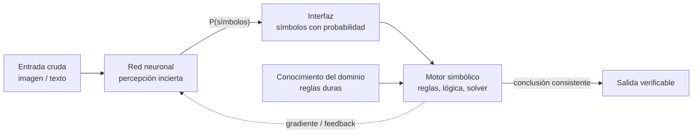

# 172 — IA neuro-simbólica

> [← Clase anterior](../../../classes/part-13-evaluation-safety-security-and-governance/171-proyecto-respuesta-a-incidentes-de-ia/README.md) · [Índice de la parte](../README.md) · [Clase siguiente →](../../../classes/part-14-frontier-research-and-capstones/173-causal-ai-y-descubrimiento-cientifico/README.md)

**Parte:** 14 — Frontera, investigación y proyectos integradores  
**Nivel:** frontera · **Horas estimadas:** 6  
**Laboratorio:** `frontier` · **Estado:** `EXECUTABLE_CORE`

## 🎯 Propósito

Comprender **ia neuro-simbólica** dentro de la evolución de la inteligencia
artificial, implementar un experimento mínimo verificable y distinguir qué parte
constituye evidencia frente a una afirmación todavía no comprobada.

## 📚 Resultados de aprendizaje

Al finalizar podrás:

1. Explicar ia neuro-simbólica usando los conceptos `neuro-symbolic`, `logic`, `neural`, `reasoning`.
2. Ejecutar el laboratorio con una semilla explícita y revisar su contrato JSON.
3. Identificar al menos un supuesto, una limitación y un riesgo de aplicación.
4. Comparar el enfoque con la etapa anterior de la ruta de aprendizaje.
5. Producir una evidencia reproducible y una conclusión que no exceda los datos.

## 🧩 Conceptos centrales

`neuro-symbolic`, `logic`, `neural`, `reasoning`

## 🗺️ Ubicación en el mapa de la IA

La IA neuro-simbólica intenta cerrar el ciclo histórico del programa: une la IA
simbólica de las Partes 1-2 (lógica, búsqueda, planificación) con el aprendizaje
profundo de las Partes 4-6 (representaciones aprendidas desde datos). Ninguna de las
dos tradiciones resolvió sola el problema completo: las redes perciben pero no
garantizan consistencia lógica; los sistemas simbólicos razonan pero no perciben.
Esta clase abre la Parte 14 porque los sistemas híbridos —LLM + solver, agente +
verificador formal— son hoy una de las direcciones de frontera más activas y ya los
usaste sin nombrarlos: un agente que llama a una calculadora o a un motor de reglas
es, según la taxonomía de Kautz, un sistema Neuro[Symbolic].

## 📖 Fundamentos

### 🧱 Qué aporta cada tradición

| Capacidad | Simbólico (lógica, reglas) | Neural (aprendizaje profundo) |
|---|---|---|
| Percepción (imagen, audio, texto crudo) | Débil: requiere features a mano | Fuerte: aprende representaciones |
| Razonamiento composicional exacto | Fuerte: deducción correcta por construcción | Débil: errores en cadenas largas |
| Garantías y verificabilidad | Prueba formal inspeccionable | Solo evaluación empírica |
| Datos necesarios | Pocos (conocimiento experto) | Muchos ejemplos |
| Robustez ante ruido | Frágil (matching exacto) | Tolerante (interpolación) |

La tesis neuro-simbólica: **usar la red donde el problema es percepción y el
símbolo donde el problema es deducción**, con una interfaz explícita entre ambos.

### 🗂️ Taxonomía de Kautz (2020-2022)

Henry Kautz propuso en su conferencia AAAI 2020 (publicada en *AI Magazine*, 2022)
seis patrones de integración que siguen siendo el vocabulario estándar:

```text
1. Symbolic Neuro symbolic   entrada y salida simbólicas, red en el medio.
                             Ej.: un LLM que recibe texto y produce texto.
2. Symbolic[Neuro]           sistema simbólico que invoca una subrutina neural.
                             Ej.: AlphaGo — búsqueda MCTS (simbólica) que consulta
                             una red para evaluar posiciones.
3. Neuro | Symbolic          red y razonador cooperan como co-rutinas acopladas.
                             Ej.: Neuro-Symbolic Concept Learner (percepción
                             neural + programa simbólico sobre la escena).
4. Neuro: Symbolic -> Neuro  conocimiento simbólico compilado en el entrenamiento
                             de la red (reglas como pérdida o restricción).
5. Neuro_{Symbolic}          el razonamiento simbólico se tensoriza dentro de la
                             red. Ej.: Logic Tensor Networks.
6. Neuro[Symbolic]           una red que decide invocar un motor simbólico.
                             Ej.: un LLM agéntico que llama a un solver, a una
                             calculadora o a un verificador de pruebas.
```

### ⚙️ Mecanismo típico: percepción probabilística + restricción lógica

El patrón que implementan sistemas como DeepProbLog (Manhaeve et al., 2018) es:

```text
1. La red neuronal produce distribuciones sobre símbolos:
   P(simbolo_i | entrada_i)   — percepción incierta.
2. Un programa lógico define qué combinaciones de símbolos son válidas
   o qué se deduce de ellas (regla dura, sin aprender).
3. La probabilidad de una conclusión = suma de probabilidades de todas
   las asignaciones de símbolos que la hacen verdadera
   (weighted model counting).
4. El gradiente atraviesa el paso lógico, así la restricción simbólica
   supervisa a la red sin etiquetas intermedias.
```

Ejemplos actuales del patrón híbrido: **AlphaGeometry** (Trinh et al., *Nature*
2024) alterna un modelo de lenguaje que propone construcciones auxiliares con un
motor de deducción simbólica que verifica; resolvió 25 de 30 problemas de geometría
de olimpiada. **PAL / program-aided LMs**: el LLM escribe un programa y un
intérprete de Python lo ejecuta — la aritmética la garantiza el intérprete, no la
red. Tu propio uso de *tool calling* en la Parte 9 es la forma industrial del tipo 6.

### 🔍 Conexión con el laboratorio

`run_lab("frontier")` no entrena una red: aplica una **regla simbólica dura** sobre
afirmaciones de frontera (si no hay evidencia → `unverified` → fuera del currículo).
Ilustra el valor del componente simbólico: la decisión es inspeccionable, correcta
por construcción y no depende de datos de entrenamiento.

## 🧮 Ejemplo trabajado

Percepción neural incierta + regla simbólica, al estilo DeepProbLog, a mano.

Dos imágenes de dígitos pasan por un clasificador:

```text
Imagen A: P(3) = 0.7   P(5) = 0.3
Imagen B: P(2) = 0.6   P(7) = 0.4
```

Sin restricción, la lectura más probable es (3, 2) con 0.7 × 0.6 = 0.42.
Ahora el conocimiento simbólico dice: "la suma es 10" (regla del dominio, cierta).

Probabilidad de cada mundo (asumiendo independencia):

```text
(3,2) -> suma 5    p = 0.7 × 0.6 = 0.42   viola la regla
(3,7) -> suma 10   p = 0.7 × 0.4 = 0.28   cumple
(5,2) -> suma 7    p = 0.3 × 0.6 = 0.18   viola
(5,7) -> suma 12   p = 0.3 × 0.4 = 0.12   viola
```

Condicionando a la regla (renormalizar sobre los mundos válidos):
P((3,7) | suma=10) = 0.28 / 0.28 = **1.0**. La regla simbólica corrigió la lectura
neural: la hipótesis globalmente más probable (3,2) era inconsistente. Con más de
un mundo válido, la renormalización repartiría la masa entre ellos — así el
componente lógico convierte percepción ruidosa en conclusiones coherentes.

## 📊 Propiedades y comparación

| Enfoque | Percepción | Garantía deductiva | Datos | Ejemplo actual |
|---|---|---|---|---|
| Solo simbólico | Manual | Sí (prueba) | Mínimos | Solvers SAT/SMT |
| Solo neural | Aprendida | No | Masivos | LLM puro |
| Symbolic[Neuro] | Delegada a la red | En el marco simbólico | Medios | AlphaGo |
| Neuro[Symbolic] | En la red | En el motor invocado | Masivos + motor | LLM + solver, PAL |
| Compilación (tipo 4-5) | Aprendida | Aproximada (soft constraint) | Menos que puro neural | Logic Tensor Networks |



## ⚠️ Errores conceptuales frecuentes

1. **"Neuro-simbólico = poner un if después de la red"**. El punto es la interfaz
   probabilística: la incertidumbre de la red debe propagarse al razonador (model
   counting, renormalización), no descartarse con un argmax prematuro.
2. **"Los LLM ya razonan, lo simbólico es obsoleto"**. Los LLM fallan en cadenas
   deductivas largas y aritmética exacta; AlphaGeometry y el tool calling existen
   precisamente porque delegar la deducción a un motor exacto mejora el resultado.
3. **"Lo simbólico no escala"**. Los solvers SAT/SMT modernos resuelven instancias
   industriales con millones de cláusulas; lo que no escala es codificar percepción
   a mano — por eso la división de trabajo.
4. **"La taxonomía de Kautz es exclusiva"**. Un sistema real combina varios tipos:
   un agente LLM (tipo 1 en su núcleo) que llama a un verificador (tipo 6) dentro
   de un orquestador con reglas (tipo 2).
5. **"La regla dura siempre gana"**. Si la regla del dominio es errónea o la
   percepción está mal calibrada, condicionar sobre ella amplifica el error con
   total confianza — la calidad del conocimiento simbólico es un supuesto crítico.

## 🚀 Del aprendizaje a la operación

Entre este núcleo y un sistema real faltan: entrenar de verdad la parte neural con
la pérdida que atraviesa la lógica (diferenciación sobre model counting, costosa y
con técnicas propias); ingeniería del conocimiento para escribir y mantener las
reglas del dominio; decidir qué hace el sistema cuando la percepción y la regla se
contradicen con alta confianza (¿abstenerse, escalar a humano?); y evaluación
separada de cada componente además del sistema conjunto, porque un error puede
originarse en la red, en la regla o en la interfaz.

## 🧪 Laboratorio

```bash
python lab.py
```

El laboratorio llama a `ai_evolution.labs.run_lab("frontier")`. Esta
decisión evita 183 implementaciones divergentes: cada clase tiene un entrypoint
propio, pero los motores didácticos se prueban como una biblioteca común.

### 🔍 Evidencia esperada

- tipo de laboratorio y semilla;
- entradas o decisiones observables;
- resultado estructurado;
- lista `evidence` con hechos que pueden inspeccionarse;
- lista `limitations` que impide presentar la demo como producción.

## 📓 Notebooks

- [📓 `notebook.ipynb`](notebook.ipynb): recorrido guiado con la materia resumida.
- [✍️ `notebook_student.ipynb`](notebook_student.ipynb): ejercicios para resolver.
- [✅ `notebook_solution.ipynb`](notebook_solution.ipynb): solución de referencia explicada.

## 📝 Evaluación

| Criterio | Peso |
|---|---:|
| Comprensión conceptual | 25 % |
| Ejecución reproducible | 25 % |
| Interpretación basada en evidencia | 25 % |
| Riesgos, límites y mejora propuesta | 25 % |

Consulta [assessment.md](assessment.md) para preguntas y criterio de aceptación.

## ⚠️ Errores comunes

| Síntoma | Causa probable | Corrección |
|---|---|---|
| El código corre, pero no hay conclusión | Se confundió ejecución con aprendizaje | Explica qué demuestra y qué no demuestra |
| El resultado cambia sin explicación | No se registró semilla o configuración | Conserva semilla, versión y parámetros |
| Se promete uso real | Se extrapoló desde una demo educativa | Declara entorno, datos, límites y revisión humana |
| Se copia una métrica aislada | No existe baseline ni costo de error | Añade comparación y criterio de decisión |

## ❓ Preguntas frecuentes

**¿Debo usar una API comercial?**  
No. El núcleo funciona localmente. Las extensiones LIVE se documentan por separado.

**¿El laboratorio representa una implementación industrial?**  
No por sí solo. Enseña el contrato y el patrón; producción exige integración,
seguridad, observabilidad, pruebas y operación.

**¿Dónde profundizo?**  
Revisa las especializaciones enlazadas en el README raíz y la ruta siguiente.

## 🔗 Referencias

- Kautz, H. (2022). *The Third AI Summer: AAAI Robert S. Engelmore Memorial Lecture*. AI Magazine, 43(1). [doi:10.1002/aaai.12036](https://doi.org/10.1002/aaai.12036) — uso: fuente primaria del mecanismo estudiado
- Manhaeve, R. et al. (2018). *DeepProbLog: Neural Probabilistic Logic Programming*. NeurIPS 2018. [arXiv:1805.10872](https://arxiv.org/abs/1805.10872) — uso: fuente primaria del mecanismo estudiado
- Mao, J. et al. (2019). *The Neuro-Symbolic Concept Learner*. ICLR 2019. [arXiv:1904.12584](https://arxiv.org/abs/1904.12584) — uso: fuente primaria del mecanismo estudiado
- Trinh, T. et al. (2024). *Solving olympiad geometry without human demonstrations* (AlphaGeometry). Nature 625. [doi:10.1038/s41586-023-06747-5](https://doi.org/10.1038/s41586-023-06747-5) — uso: fuente primaria del mecanismo estudiado
- Garcez, A. & Lamb, L. (2020). *Neurosymbolic AI: The 3rd Wave*. [arXiv:2012.05876](https://arxiv.org/abs/2012.05876) — uso: fuente primaria del mecanismo estudiado
- Russell, S. & Norvig, P. *Artificial Intelligence: A Modern Approach* (4.ª ed.), caps. 7-10 (lógica) como base simbólica. [Sitio oficial](https://aima.cs.berkeley.edu/) — uso: desarrollo extendido del tema

<!-- papers:inicio -->

---

## 📜 Papers que fundamentan esta clase

> Bloque generado por `python scripts/link_papers_to_classes.py`. La fuente es [`papers/catalog/papers.json`](../../../papers/catalog/papers.json).

| Paper | Año | Qué desbloqueó | Miniatura |
|---|---:|---|---|
| [P27 · Dominar el go con redes neuronales profundas y búsqueda en árbol](../../../papers/foundational/P27_alphago/README.md) | 2016 | Une las dos tradiciones de la IA: la búsqueda simbólica de la parte 01 y el aprendizaje profundo de la parte 04, en un solo sistema. | [notebook](../../../notebooks/papers/P27_alphago.ipynb) |

Cada ficha explica el problema anterior, la matemática mínima, los límites y los errores de atribución más frecuentes. Para leerlas con método: [cómo leer un paper de IA](../../../papers/guides/COMO_LEER_UN_PAPER_DE_IA.md) · [anexos matemáticos](../../../papers/annexes/README.md).
<!-- papers:fin -->
---

## ⬅️ Clase anterior

[171 — Proyecto: respuesta a incidentes de IA](../../part-13-evaluation-safety-security-and-governance/171-proyecto-respuesta-a-incidentes-de-ia/README.md)

## ➡️ Siguiente clase

[173 — Causal AI y descubrimiento científico](../../part-14-frontier-research-and-capstones/173-causal-ai-y-descubrimiento-cientifico/README.md)
