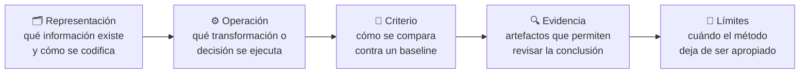

# Teoría — Razonamiento y cómputo en tiempo de inferencia

## 🗺️ Ubicación en el mapa de la IA

Esta clase pertenece a **Frontera, investigación y proyectos integradores**. Integra todo el programa y mantiene una zona explícita para temas emergentes, distinguiendo evidencia consolidada de prototipos y expectativas.

## 🧠 Modelo mental

`Razonamiento y cómputo en tiempo de inferencia` se estudia como un sistema con:

1. **representación:** qué información existe y cómo se codifica;
2. **operación:** qué transformación, inferencia o decisión se ejecuta;
3. **criterio:** cómo se determina si el resultado es mejor que un baseline;
4. **evidencia:** qué artefactos permiten revisar la conclusión;
5. **límites:** cuándo el método deja de ser apropiado.

Conceptos guía: **reasoning, test-time compute, verification, search**.

## 🔧 Preguntas técnicas

- ¿Cuál es el estado o entrada mínima?
- ¿Qué decisiones son deterministas y cuáles dependen de datos o modelo?
- ¿Qué información podría filtrarse o perderse?
- ¿Qué baseline permite saber si el aumento de complejidad aporta valor?
- ¿Cómo se interrumpe, revierte o audita el proceso?

## 🚀 Del aprendizaje a la operación

El laboratorio demuestra un mecanismo reducido. Para elevarlo a una aplicación
real deben añadirse contratos de entrada y salida, validación de datos, manejo de
errores, permisos, trazas, evaluación de regresión y revisión humana proporcional
al riesgo.

## 🔗 Referencias primarias o técnicas

- [Papers with Code](https://paperswithcode.com/)
- [Stanford AI Index](https://aiindex.stanford.edu/report/)
- [arXiv Artificial Intelligence](https://arxiv.org/list/cs.AI/recent)

---

> [⬅️ Volver a la clase](README.md) · [📝 Evaluación](assessment.md) · [📚 Índice de la parte](../README.md)
