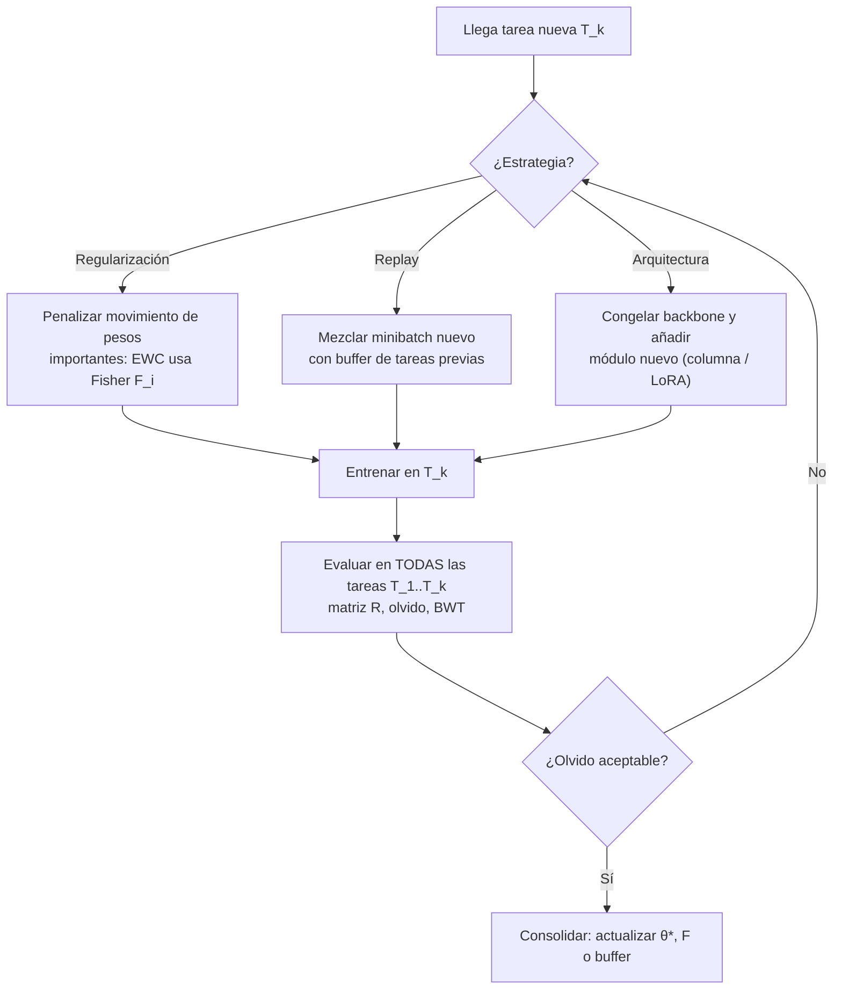

# 173 — Aprendizaje continuo y adaptación

> [← Clase anterior](../../../classes/part-14-frontier-research-and-capstones/172-razonamiento-y-computo-en-tiempo-de-inferencia/README.md) · [Índice de la parte](../README.md) · [Clase siguiente →](../../../classes/part-14-frontier-research-and-capstones/174-privacidad-diferencial-y-aprendizaje-federado/README.md)

**Parte:** 14 — Frontera, investigación y proyectos integradores  
**Nivel:** frontera · **Horas estimadas:** 6  
**Laboratorio:** `frontier` · **Estado:** `EXECUTABLE_CORE`

## 🎯 Propósito

Comprender **aprendizaje continuo y adaptación** dentro de la evolución de la inteligencia
artificial, implementar un experimento mínimo verificable y distinguir qué parte
constituye evidencia frente a una afirmación todavía no comprobada.

## 📚 Resultados de aprendizaje

Al finalizar podrás:

1. Explicar aprendizaje continuo y adaptación usando los conceptos `continual learning`, `adaptation`, `forgetting`, `memory`.
2. Ejecutar el laboratorio con una semilla explícita y revisar su contrato JSON.
3. Identificar al menos un supuesto, una limitación y un riesgo de aplicación.
4. Comparar el enfoque con la etapa anterior de la ruta de aprendizaje.
5. Producir una evidencia reproducible y una conclusión que no exceda los datos.

## 🧩 Conceptos centrales

`continual learning`, `adaptation`, `forgetting`, `memory`

## 🗺️ Ubicación en el mapa de la IA

El aprendizaje continuo ataca una limitación estructural del deep learning clásico:
las redes se entrenan una vez sobre un dataset fijo y, si luego se ajustan a una tarea
nueva, tienden a destruir lo aprendido antes (*catastrophic forgetting*). Hereda
directamente de los fundamentos de optimización por gradiente (partes 3-4) y del
fine-tuning de modelos (parte 7), y habilita la visión de agentes que operan durante
meses acumulando experiencia sin reentrenar desde cero, un requisito de los sistemas
evolutivos que integra el capstone de esta parte.

## 📖 Fundamentos

### 🧠 El problema: catastrophic forgetting

Una red entrenada por descenso de gradiente ajusta **todos** sus pesos para minimizar
la pérdida de la tarea actual. Si tras dominar la tarea A se entrena en la tarea B con
el mismo procedimiento, los gradientes de B mueven los pesos sin ninguna restricción
que proteja lo que era importante para A. El resultado empírico, documentado desde
McCloskey y Cohen (1989), es que el rendimiento en A puede colapsar a niveles de azar
tras pocas épocas de B. No es un fallo de capacidad —la red podría representar ambas
tareas— sino de **interferencia**: ambas tareas compiten por los mismos parámetros.

Definiciones precisas:

- **Aprendizaje continuo (continual/lifelong learning)**: entrenar un modelo sobre una
  secuencia de tareas `T1, T2, …, Tn` viendo los datos de cada tarea solo durante su
  fase, y evaluando al final sobre *todas* las tareas.
- **Olvido (forgetting)**: caída de rendimiento en `Ti` medida después de entrenar en
  `Tj` con `j > i`, respecto al rendimiento justo al terminar `Ti`.
- **Transferencia hacia atrás/adelante (backward/forward transfer)**: efecto (positivo
  o negativo) de aprender una tarea nueva sobre tareas anteriores/posteriores.
- **Estabilidad vs plasticidad**: el dilema central. Máxima estabilidad = congelar
  pesos (no olvida, no aprende); máxima plasticidad = fine-tuning ingenuo (aprende,
  olvida). Todo método de aprendizaje continuo es un punto en ese espectro.

### 🧊 Familia 1: regularización — Elastic Weight Consolidation (EWC)

EWC (Kirkpatrick et al., 2017, arXiv:1612.00796) formaliza una intuición bayesiana:
tras aprender A, la posterior sobre los pesos indica cuáles son importantes. Al
entrenar B, se penaliza mover los pesos importantes para A:

```text
L(θ) = L_B(θ) + (λ/2) · Σ_i F_i · (θ_i − θ*_{A,i})²

θ*_A : pesos óptimos al terminar la tarea A
F_i  : información de Fisher diagonal ≈ E[(∂ log p(y|x,θ)/∂θ_i)²]
       (qué tan sensible es la predicción al peso i → su "importancia")
λ    : cuánto pesa la memoria de A frente al aprendizaje de B
```

Un peso con `F_i` alto queda anclado (resorte rígido); uno con `F_i ≈ 0` queda libre
para adaptarse a B. Con `λ → 0` se recupera el fine-tuning ingenuo; con `λ → ∞` el
modelo se congela.

### 🔁 Familia 2: repetición (replay)

En lugar de restringir los pesos, se restringen los **datos**: se guarda un buffer
pequeño de ejemplos de tareas anteriores (o un modelo generativo que los sintetiza) y
cada minibatch de la tarea nueva se mezcla con ejemplos antiguos. GEM (Lopez-Paz y
Ranzato, 2017) además proyecta el gradiente para que no aumente la pérdida sobre el
buffer. El replay suele ser el método más robusto en la práctica, al costo de memoria
y de posibles problemas de privacidad (retener datos crudos).

### 🏗️ Familia 3: arquitectura

Asignar capacidad nueva por tarea: Progressive Networks añaden columnas congelando las
anteriores; los adaptadores/LoRA por tarea entrenan módulos pequeños dejando el
backbone intacto. Eliminan el olvido por construcción, pero el modelo crece con cada
tarea y exige saber qué tarea se está resolviendo en inferencia.

### 📏 Cómo se mide

Con la matriz `R ∈ ℝ^{n×n}` donde `R[i][j]` = rendimiento en la tarea `j` tras
entrenar hasta la tarea `i`: precisión media final = `mean_j R[n][j]`; olvido de `j` =
`max_i R[i][j] − R[n][j]`; BWT (backward transfer) = media de `R[n][j] − R[j][j]`.

## 🧮 Ejemplo trabajado

Modelo de juguete con dos pesos. Tras la tarea A: `θ*_A = (2.0, −1.0)` con Fisher
diagonal `F = (5.0, 0.1)` — el peso 1 es crítico para A, el peso 2 casi no importa.
La tarea B, por sí sola, preferiría `θ_B = (0.0, 3.0)`, con
`L_B(θ) = (θ₁ − 0)² + (θ₂ − 3)²`. Tomamos `λ = 2`.

```text
L(θ) = (θ₁)² + (θ₂ − 3)² + (2/2)·[5.0·(θ₁ − 2)² + 0.1·(θ₂ + 1)²]

∂L/∂θ₁ = 2θ₁ + 10(θ₁ − 2)      = 0  →  12θ₁ = 20  →  θ₁ = 1.67
∂L/∂θ₂ = 2(θ₂ − 3) + 0.2(θ₂+1) = 0  →  2.2θ₂ = 5.8 →  θ₂ = 2.64
```

Lectura: el peso 1 (importante para A, `F=5`) se queda cerca de A (1.67 frente al 0.0
que pediría B); el peso 2 (irrelevante para A, `F=0.1`) se mueve casi hasta lo que
pide B (2.64 frente a 3.0). Con fine-tuning ingenuo (`λ=0`) ambos irían a (0, 3) y A
quedaría destruida. Ese es todo el mecanismo de EWC: resortes con rigidez proporcional
a la importancia.

## 📊 Propiedades y comparación

| Método | Memoria extra | ¿Crece el modelo? | ¿Necesita datos viejos? | Olvido | Límite principal |
|---|---|---|---|---|---|
| Fine-tuning ingenuo | Ninguna | No | No | Severo | Destruye tareas previas |
| EWC (regularización) | O(2·params) (θ*, F) | No | No | Moderado | F diagonal es aproximación; se degrada con muchas tareas |
| Replay con buffer | Buffer de ejemplos | No | Sí (muestra) | Bajo | Privacidad y tamaño del buffer |
| GEM | Buffer + proyección | No | Sí | Bajo | Costo de resolver la proyección por paso |
| Progressive / LoRA por tarea | Módulos por tarea | Sí | No | Nulo por construcción | Crecimiento lineal; requiere identidad de tarea |



## ⚠️ Errores conceptuales frecuentes

1. **"El olvido se arregla con más épocas o más datos de la tarea nueva."** Al
   contrario: más optimización sobre B sin protección aumenta la interferencia sobre A.
2. **"EWC guarda los datos de la tarea anterior."** No: guarda solo `θ*_A` y `F`
   (estadísticos de los pesos). Eso es precisamente su ventaja de privacidad frente al
   replay, y también su debilidad (la aproximación diagonal pierde correlaciones).
3. **"Evaluar solo la última tarea basta."** La métrica del aprendizaje continuo es la
   matriz completa: un método puede ganar en `Tn` habiendo arrasado `T1..Tn−1`.
4. **"Los LLM con RAG ya hacen aprendizaje continuo."** Añadir contexto recuperado no
   modifica los pesos: es memoria externa, no consolidación. Resuelve otro problema
   (conocimiento actualizado) sin tocar el dilema estabilidad-plasticidad.
5. **"Congelar el modelo elimina el problema."** Lo elimina junto con la adaptación:
   un sistema congelado se degrada frente a *distribution shift*, que es la razón por
   la que se quería aprender continuamente.

## 🚀 Del aprendizaje a la operación

El laboratorio ilustra el contrato con un escenario determinista; un sistema real
necesita: detección de *drift* que dispare la adaptación (no reentrenar por
calendario ciego), un conjunto de regresión congelado por cada capacidad antigua que
actúe como prueba de no-olvido antes de promover pesos nuevos, política explícita de
retención de datos si se usa replay (privacidad, GDPR), y un plan de rollback: en
producción, el peor olvido no es el del modelo sino el del equipo que no versionó el
checkpoint anterior.

## 🧪 Laboratorio

```bash
python lab.py
```

El laboratorio llama a `ai_evolution.labs.run_lab("frontier")`. Esta
decisión evita 180 implementaciones divergentes: cada clase tiene un entrypoint
propio, pero los motores didácticos se prueban como una biblioteca común.

### 🔍 Evidencia esperada

- tipo de laboratorio y semilla;
- entradas o decisiones observables;
- resultado estructurado;
- lista `evidence` con hechos que pueden inspeccionarse;
- lista `limitations` que impide presentar la demo como producción.

## 📓 Notebooks

- [📓 `notebook.ipynb`](notebook.ipynb): recorrido guiado con la materia resumida.
- [✍️ `notebook_student.ipynb`](notebook_student.ipynb): ejercicios para resolver.
- [✅ `notebook_solution.ipynb`](notebook_solution.ipynb): solución de referencia explicada.

## 📝 Evaluación

| Criterio | Peso |
|---|---:|
| Comprensión conceptual | 25 % |
| Ejecución reproducible | 25 % |
| Interpretación basada en evidencia | 25 % |
| Riesgos, límites y mejora propuesta | 25 % |

Consulta [assessment.md](assessment.md) para preguntas y criterio de aceptación.

## ⚠️ Errores comunes

| Síntoma | Causa probable | Corrección |
|---|---|---|
| El código corre, pero no hay conclusión | Se confundió ejecución con aprendizaje | Explica qué demuestra y qué no demuestra |
| El resultado cambia sin explicación | No se registró semilla o configuración | Conserva semilla, versión y parámetros |
| Se promete uso real | Se extrapoló desde una demo educativa | Declara entorno, datos, límites y revisión humana |
| Se copia una métrica aislada | No existe baseline ni costo de error | Añade comparación y criterio de decisión |

## ❓ Preguntas frecuentes

**¿Debo usar una API comercial?**  
No. El núcleo funciona localmente. Las extensiones LIVE se documentan por separado.

**¿El laboratorio representa una implementación industrial?**  
No por sí solo. Enseña el contrato y el patrón; producción exige integración,
seguridad, observabilidad, pruebas y operación.

**¿Dónde profundizo?**  
Revisa las especializaciones enlazadas en el README raíz y la ruta siguiente.

## 🔗 Referencias

- Kirkpatrick, J. et al. (2017). *Overcoming catastrophic forgetting in neural networks*. PNAS 114(13). [DOI 10.1073/pnas.1611835114](https://doi.org/10.1073/pnas.1611835114) · [arXiv:1612.00796](https://arxiv.org/abs/1612.00796)
- Parisi, G. I. et al. (2019). *Continual Lifelong Learning with Neural Networks: A Review*. Neural Networks 113. [arXiv:1802.07569](https://arxiv.org/abs/1802.07569)
- Goodfellow, I. J. et al. (2013). *An Empirical Investigation of Catastrophic Forgetting in Gradient-Based Neural Networks*. [arXiv:1312.6211](https://arxiv.org/abs/1312.6211)
- Lopez-Paz, D. y Ranzato, M. (2017). *Gradient Episodic Memory for Continual Learning*. NeurIPS 2017. [arXiv:1706.08840](https://arxiv.org/abs/1706.08840)
- Goodfellow, I., Bengio, Y. y Courville, A. (2016). *Deep Learning*, cap. 8 (optimización). [deeplearningbook.org](https://www.deeplearningbook.org/)

---

## ⬅️ Clase anterior

[172 — Razonamiento y cómputo en tiempo de inferencia](../../part-14-frontier-research-and-capstones/172-razonamiento-y-computo-en-tiempo-de-inferencia/README.md)

## ➡️ Siguiente clase

[174 — Privacidad diferencial y aprendizaje federado](../../part-14-frontier-research-and-capstones/174-privacidad-diferencial-y-aprendizaje-federado/README.md)
