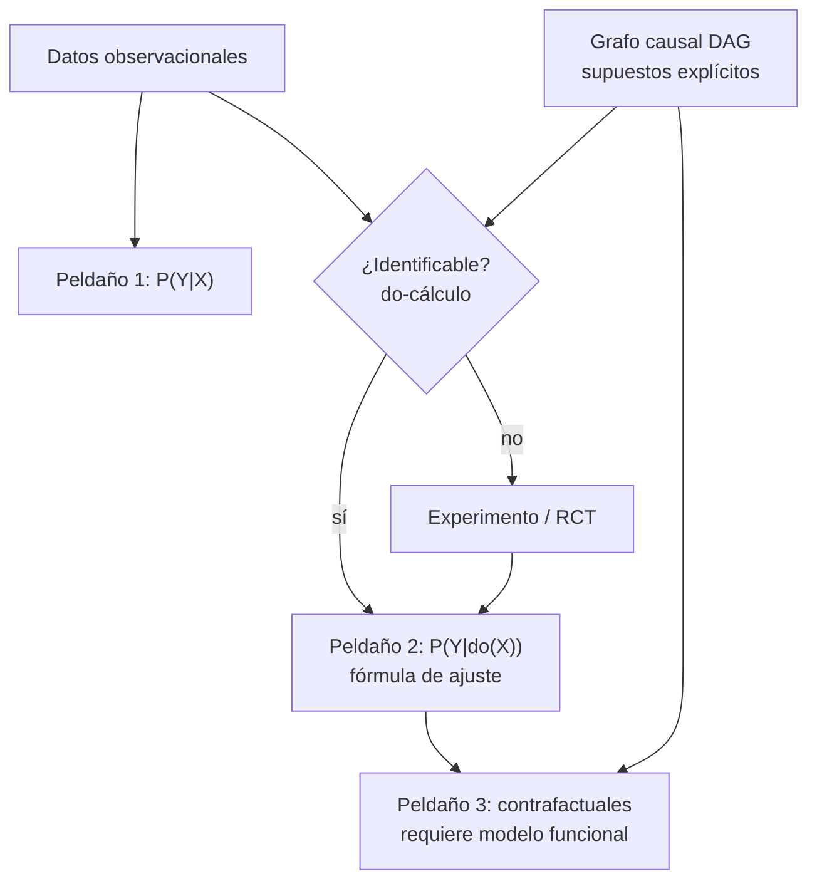

# 173 — Causal AI y descubrimiento científico

> [← Clase anterior](../../../classes/part-14-frontier-research-and-capstones/172-ia-neuro-simbolica/README.md) · [Índice de la parte](../README.md) · [Clase siguiente →](../../../classes/part-14-frontier-research-and-capstones/174-world-models-y-simulacion-interna/README.md)

**Parte:** 14 — Frontera, investigación y proyectos integradores  
**Nivel:** frontera · **Horas estimadas:** 6  
**Laboratorio:** `probability` · **Estado:** `EXECUTABLE_CORE`

## 🎯 Propósito

Comprender **causal ai y descubrimiento científico** dentro de la evolución de la inteligencia
artificial, implementar un experimento mínimo verificable y distinguir qué parte
constituye evidencia frente a una afirmación todavía no comprobada.

## 📚 Resultados de aprendizaje

Al finalizar podrás:

1. Explicar causal ai y descubrimiento científico usando los conceptos `causal`, `interventions`, `science`, `discovery`.
2. Ejecutar el laboratorio con una semilla explícita y revisar su contrato JSON.
3. Identificar al menos un supuesto, una limitación y un riesgo de aplicación.
4. Comparar el enfoque con la etapa anterior de la ruta de aprendizaje.
5. Producir una evidencia reproducible y una conclusión que no exceda los datos.

## 🧩 Conceptos centrales

`causal`, `interventions`, `science`, `discovery`

## 🗺️ Ubicación en el mapa de la IA

Toda la estadística y el machine learning de las Partes 2-3 operan en el nivel de
la **asociación**: P(Y|X), lo que se observa. La IA causal añade los niveles que la
correlación no puede alcanzar: predecir el efecto de una **intervención** y razonar
sobre **contrafactuales**. Es frontera porque el aprendizaje profundo actual —
incluidos los LLM— aprende asociaciones, y las preguntas que importan en ciencia,
medicina y política pública ("¿qué pasa si administro el fármaco?") son causales.
El descubrimiento científico asistido por IA depende de esta distinción: generar
hipótesis causales verificables, no solo patrones.

## 📖 Fundamentos

### 🪜 La escalera de la causalidad (Pearl)

| Peldaño | Pregunta | Operación | Ejemplo |
|---|---|---|---|
| 1. Asociación | ¿Qué veo? | P(Y \| X) | pacientes que toman X se recuperan más |
| 2. Intervención | ¿Qué pasa si hago? | P(Y \| do(X)) | si *administro* X a todos, ¿cuántos se recuperan? |
| 3. Contrafactual | ¿Qué habría pasado? | P(Y_x \| X', Y') | este paciente no tomó X y murió; ¿habría vivido con X? |

La diferencia central: **condicionar no es intervenir**. P(Y | X=x) filtra la
población observada (con todos sus sesgos de selección); P(Y | do(X=x)) describe
una población donde X se fija desde fuera, cortando las causas naturales de X.
Ningún ajuste de curvas sobre datos observacionales puede, por sí solo, subir un
peldaño: hace falta un **modelo causal** (un grafo dirigido acíclico, DAG, con
supuestos explícitos) o un experimento aleatorizado.

### 🔧 do-cálculo y el criterio de puerta trasera

Un DAG causal codifica qué variables causan qué. El problema de identificación:
¿puede escribirse P(Y|do(X)) solo con probabilidades observacionales? El
**criterio de puerta trasera** da la respuesta más usada: si un conjunto Z bloquea
todos los caminos "de puerta trasera" entre X e Y (caminos con flecha entrando a
X) y no contiene descendientes de X, entonces:

```text
P(Y | do(X=x)) = Σ_z  P(Y | X=x, Z=z) · P(Z=z)      (fórmula de ajuste)
```

El do-cálculo de Pearl (tres reglas de reescritura sobre el grafo) generaliza
esto: es **completo** — si una cantidad causal es identificable desde datos
observacionales y el grafo, las reglas la derivan; si no lo es, ninguna cantidad
de datos la estima sin más supuestos.

### 🔬 Descubrimiento causal

Ir de datos al grafo (no del grafo a la estimación). Tres familias:

```text
1. Basados en restricciones (PC, FCI): prueban independencias condicionales
   X ⊥ Y | Z en los datos y descartan grafos incompatibles. Devuelven una
   clase de equivalencia, no un grafo único.
2. Basados en puntuación (GES): buscan el DAG que maximiza un score
   (BIC) sobre los datos.
3. Modelos causales funcionales (LiNGAM, mecanismos aditivos): usan
   asimetrías de las distribuciones (no-gaussianidad, no-linealidad) para
   orientar aristas que las independencias dejan ambiguas.
```

Límites duros: sin supuestos (suficiencia causal —no hay confusores ocultos—,
fidelidad), los datos observacionales solo identifican el grafo **hasta su clase
de equivalencia de Markov**: X→Y y X←Y suelen ser indistinguibles. Las
intervenciones (experimentos) rompen la simetría — por eso el laboratorio
automatizado (ciclo hipótesis → experimento → actualización) es la forma que toma
el descubrimiento científico con IA.

### 🔍 Conexión con el laboratorio

`run_lab("probability")` calcula un posterior bayesiano: eso es peldaño 1,
asociación pura. La clase pide notar qué le falta a ese cálculo para responder
una pregunta causal: un grafo, supuestos de intervención, o un experimento.

## 🧮 Ejemplo trabajado

Confusión clásica. Un tratamiento X, recuperación Y, y gravedad del caso Z que
causa ambas (los médicos dan el tratamiento a los graves). Datos observacionales:

```text
P(Z=grave) = 0.5
P(X=1 | grave) = 0.8      P(X=1 | leve) = 0.2
P(Y=1 | X=1, grave) = 0.6   P(Y=1 | X=0, grave) = 0.4
P(Y=1 | X=1, leve)  = 0.9   P(Y=1 | X=0, leve)  = 0.8
```

**Asociación** (peldaño 1): P(Y=1|X=1) mezcla graves y leves según quién recibió
el tratamiento. P(grave|X=1) = 0.8·0.5 / (0.8·0.5 + 0.2·0.5) = 0.8. Entonces
P(Y=1|X=1) = 0.8·0.6 + 0.2·0.9 = **0.66**. Análogo: P(grave|X=0) = 0.2, y
P(Y=1|X=0) = 0.2·0.4 + 0.8·0.8 = **0.72**. ¡El tratamiento parece dañino!
(0.66 < 0.72).

**Intervención** (peldaño 2): Z satisface la puerta trasera (Z→X, Z→Y). Ajuste:

```text
P(Y=1 | do(X=1)) = 0.6·0.5 + 0.9·0.5 = 0.75
P(Y=1 | do(X=0)) = 0.4·0.5 + 0.8·0.5 = 0.60
```

El efecto causal es **+0.15 a favor del tratamiento**. La asociación tenía el
signo invertido porque los graves recibían más tratamiento (paradoja de Simpson).
Mismos datos, conclusión opuesta: lo que cambió fue el modelo causal, no los números.

## 📊 Propiedades y comparación

| Enfoque | Pregunta que responde | Requiere | Riesgo principal |
|---|---|---|---|
| Correlación / ML predictivo | P(Y\|X) | Solo datos | Confundir predicción con efecto |
| Ajuste por puerta trasera | P(Y\|do(X)) | DAG correcto + Z observado | Grafo mal especificado |
| Experimento aleatorizado (RCT) | P(Y\|do(X)) | Poder intervenir | Coste, ética, validez externa |
| Descubrimiento causal (PC/GES) | Estructura del grafo | Independencias fieles, sin confusores ocultos | Clase de equivalencia, no grafo único |
| Contrafactuales (SCM) | P(Y_x\|evidencia) | Modelo funcional completo | Supuestos no verificables |



## ⚠️ Errores conceptuales frecuentes

1. **"Con suficientes datos, la correlación se vuelve causalidad"**. No: la
   identificación causal es un problema de supuestos, no de tamaño muestral. El
   ejemplo trabajado invierte el signo con probabilidades exactas (n = ∞).
2. **"Condicionar por todo lo posible siempre ayuda"**. Condicionar por un
   **colisionador** (X→W←Y) o un descendiente de X *abre* sesgos que no existían.
   El criterio de puerta trasera dice qué ajustar y qué no.
3. **"El DAG se aprende de los datos y listo"**. Los algoritmos de descubrimiento
   devuelven clases de equivalencia bajo supuestos fuertes (sin confusores
   ocultos); el grafo final incorpora conocimiento del dominio y es refutable.
4. **"do(X) es lo mismo que ver X"**. do(X) borra las flechas que llegan a X;
   condicionar las conserva. La paradoja de Simpson vive en esa diferencia.
5. **"Los contrafactuales son verificables"**. El peldaño 3 nunca es observable
   directamente (no se puede rebobinar al paciente); se apoya en un modelo
   funcional cuyos supuestos hay que declarar y defender.

## 🚀 Del aprendizaje a la operación

Para usar esto de verdad faltan: construir el DAG con expertos del dominio y
someterlo a refutación (pruebas de independencia, análisis de sensibilidad ante
confusores no observados); estimadores robustos con muestras finitas (ponderación
por propensity, doble robustez) en lugar de las probabilidades exactas del
ejemplo; y en descubrimiento científico, cerrar el ciclo con experimentos reales
—la IA propone el grafo y el experimento que mejor lo discrimina, el laboratorio
lo ejecuta— con registro de versiones de hipótesis igual que se versiona código.

## 🧪 Laboratorio

```bash
python lab.py
```

El laboratorio llama a `ai_evolution.labs.run_lab("probability")`. Esta
decisión evita 183 implementaciones divergentes: cada clase tiene un entrypoint
propio, pero los motores didácticos se prueban como una biblioteca común.

### 🔍 Evidencia esperada

- tipo de laboratorio y semilla;
- entradas o decisiones observables;
- resultado estructurado;
- lista `evidence` con hechos que pueden inspeccionarse;
- lista `limitations` que impide presentar la demo como producción.

## 📓 Notebooks

- [📓 `notebook.ipynb`](notebook.ipynb): recorrido guiado con la materia resumida.
- [✍️ `notebook_student.ipynb`](notebook_student.ipynb): ejercicios para resolver.
- [✅ `notebook_solution.ipynb`](notebook_solution.ipynb): solución de referencia explicada.

## 📝 Evaluación

| Criterio | Peso |
|---|---:|
| Comprensión conceptual | 25 % |
| Ejecución reproducible | 25 % |
| Interpretación basada en evidencia | 25 % |
| Riesgos, límites y mejora propuesta | 25 % |

Consulta [assessment.md](assessment.md) para preguntas y criterio de aceptación.

## ⚠️ Errores comunes

| Síntoma | Causa probable | Corrección |
|---|---|---|
| El código corre, pero no hay conclusión | Se confundió ejecución con aprendizaje | Explica qué demuestra y qué no demuestra |
| El resultado cambia sin explicación | No se registró semilla o configuración | Conserva semilla, versión y parámetros |
| Se promete uso real | Se extrapoló desde una demo educativa | Declara entorno, datos, límites y revisión humana |
| Se copia una métrica aislada | No existe baseline ni costo de error | Añade comparación y criterio de decisión |

## ❓ Preguntas frecuentes

**¿Debo usar una API comercial?**  
No. El núcleo funciona localmente. Las extensiones LIVE se documentan por separado.

**¿El laboratorio representa una implementación industrial?**  
No por sí solo. Enseña el contrato y el patrón; producción exige integración,
seguridad, observabilidad, pruebas y operación.

**¿Dónde profundizo?**  
Revisa las especializaciones enlazadas en el README raíz y la ruta siguiente.

## 🔗 Referencias

- Pearl, J. & Mackenzie, D. (2018). *The Book of Why: The New Science of Cause and Effect*. Basic Books. — uso: desarrollo extendido del tema
- Pearl, J. (2009). *Causality: Models, Reasoning, and Inference* (2.ª ed.). Cambridge University Press. — uso: referencia consultada en su fuente original
- Pearl, J. (2009). *Causal inference in statistics: An overview*. Statistics Surveys 3. [doi:10.1214/09-SS057](https://doi.org/10.1214/09-SS057) — uso: fuente primaria del mecanismo estudiado
- Peters, J., Janzing, D. & Schölkopf, B. (2017). *Elements of Causal Inference*. MIT Press (acceso abierto). [Página oficial](https://mitpress.mit.edu/9780262037310/elements-of-causal-inference/) — uso: referencia consultada en su fuente original
- Schölkopf, B. et al. (2021). *Toward Causal Representation Learning*. Proceedings of the IEEE. [arXiv:2102.11107](https://arxiv.org/abs/2102.11107) — uso: fuente primaria del mecanismo estudiado
- Spirtes, P., Glymour, C. & Scheines, R. (2000). *Causation, Prediction, and Search* (2.ª ed.). MIT Press. — uso: desarrollo extendido del tema

<!-- papers:inicio -->

---

## 📜 Papers que fundamentan esta clase

> Bloque generado por `python scripts/link_papers_to_classes.py`. La fuente es [`papers/catalog/papers.json`](../../../papers/catalog/papers.json).

| Paper | Año | Qué desbloqueó | Miniatura |
|---|---:|---|---|
| [P47 · Predicción de estructura de proteínas de alta precisión con AlphaFold](../../../papers/foundational/P47_alphafold/README.md) | 2021 | Resuelve en la práctica un problema abierto de cincuenta años en biología, y demuestra que la IA puede producir conocimiento científico, no solo productos. | [notebook](../../../notebooks/papers/P47_alphafold.ipynb) |

Cada ficha explica el problema anterior, la matemática mínima, los límites y los errores de atribución más frecuentes. Para leerlas con método: [cómo leer un paper de IA](../../../papers/guides/COMO_LEER_UN_PAPER_DE_IA.md) · [anexos matemáticos](../../../papers/annexes/README.md).
<!-- papers:fin -->
---

## ⬅️ Clase anterior

[172 — IA neuro-simbólica](../../part-14-frontier-research-and-capstones/172-ia-neuro-simbolica/README.md)

## ➡️ Siguiente clase

[174 — World models y simulación interna](../../part-14-frontier-research-and-capstones/174-world-models-y-simulacion-interna/README.md)
