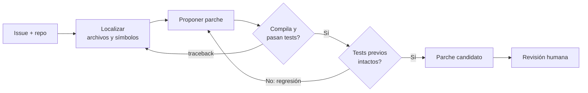

# 175 — IA para programación y modernización

> [← Clase anterior](../../../classes/part-14-frontier-research-and-capstones/174-privacidad-diferencial-y-aprendizaje-federado/README.md) · [Índice de la parte](../README.md) · [Clase siguiente →](../../../classes/part-14-frontier-research-and-capstones/176-ia-para-ciberseguridad-y-defensa/README.md)

**Parte:** 14 — Frontera, investigación y proyectos integradores  
**Nivel:** frontera · **Horas estimadas:** 6  
**Laboratorio:** `agent` · **Estado:** `EXECUTABLE_CORE`

## 🎯 Propósito

Comprender **ia para programación y modernización** dentro de la evolución de la inteligencia
artificial, implementar un experimento mínimo verificable y distinguir qué parte
constituye evidencia frente a una afirmación todavía no comprobada.

## 📚 Resultados de aprendizaje

Al finalizar podrás:

1. Explicar ia para programación y modernización usando los conceptos `coding agents`, `tests`, `migration`, `legacy`.
2. Ejecutar el laboratorio con una semilla explícita y revisar su contrato JSON.
3. Identificar al menos un supuesto, una limitación y un riesgo de aplicación.
4. Comparar el enfoque con la etapa anterior de la ruta de aprendizaje.
5. Producir una evidencia reproducible y una conclusión que no exceda los datos.

## 🧩 Conceptos centrales

`coding agents`, `tests`, `migration`, `legacy`

## 🗺️ Ubicación en el mapa de la IA

La programación es el dominio donde los LLM encontraron antes su encaje económico:
el código tiene un verificador natural (compilar, ejecutar tests) que convierte la
generación probabilística en un bucle con señal de corrección. Hereda de los LLM y
el fine-tuning (partes 6-7) y de la agentica con herramientas (parte 9), y es el
banco de pruebas de la computación en tiempo de inferencia (clase 172): muestrear
muchas soluciones y filtrar por tests es test-time compute aplicado. La
modernización de sistemas legados es su frontera económicamente más pesada.

## 📖 Fundamentos

### 🤖 De autocompletar a agente

Tres generaciones con contratos distintos:

1. **Autocompletado (Codex, 2021, arXiv:2107.03374)**: dado un prefijo (docstring,
   firma), el modelo genera la continuación. Evaluación: funciones aisladas
   (HumanEval: 164 problemas con tests unitarios ocultos).
2. **Chat/instrucción**: el modelo dialoga sobre código, explica y refactoriza; el
   humano integra. La evaluación se vuelve difusa (no hay harness automático).
3. **Agente de código (SWE-bench, 2023, arXiv:2310.06770)**: dado un *issue* real de
   GitHub y el repositorio completo, el agente debe localizar los archivos, editar,
   ejecutar tests y producir un parche. Se acepta si pasan los tests de la corrección
   real (`FAIL_TO_PASS`) sin romper los existentes (`PASS_TO_PASS`).

El salto de 1→3 cambia la dificultad: HumanEval mide síntesis local de ~10 líneas;
SWE-bench exige navegación de repos de cientos de miles de líneas, comprensión de
convenciones y edición multiarchivo. Los primeros sistemas puntuaban <2 % en
SWE-bench cuando ya superaban 90 % en HumanEval.

### 📐 La métrica pass@k

Con generación estocástica, "¿funciona?" es una probabilidad. **pass@k** = P(al menos
1 de k muestras pasa todos los tests). El estimador insesgado (Chen et al., 2021):
se generan `n ≥ k` muestras, `c` de ellas correctas, y

```text
pass@k = 1 − C(n−c, k) / C(n, k)
```

(elegir k muestras y que ninguna sea correcta, complementado). Calcular ingenuamente
`1 − (1 − c/n)^k` sesga el resultado; la fórmula combinatoria es exacta.

### 🔁 El bucle del agente de código

```text
repetir hasta presupuesto:
  1. LOCALIZAR   buscar archivos/símbolos relevantes al issue (grep, mapa del repo)
  2. PROPONER    editar código (parche mínimo, no reescritura)
  3. VERIFICAR   compilar + ejecutar tests (los previos y los del issue)
  4. LEER SEÑAL  traceback/diff → siguiente iteración
aceptar solo si: tests nuevos pasan Y tests previos siguen pasando
```

La calidad del sistema depende menos del modelo que del **harness**: qué contexto se
recupera, qué tests existen, cómo se limita el radio de la edición. Sin tests, el
bucle degenera en "parece correcto", que es precisamente lo que no se puede auditar.

### 🏚️ Modernización de legado

El caso económico dominante: migrar COBOL/Java 6/Python 2 a plataformas mantenibles.
El principio (Feathers): *legacy code = código sin tests*. El flujo asistido por IA:

1. **Tests de caracterización**: generar tests que fijan el comportamiento ACTUAL
   (incluidos bugs), no el deseado — son la red antes de tocar nada.
2. **Traducción por unidades pequeñas** con equivalencia verificada contra esos tests.
3. **Revisión humana** de todo lo que toque I/O, dinero, fechas o concurrencia, donde
   la equivalencia semántica entre lenguajes es más traicionera.

La IA acelera los pasos 1-2; el riesgo es traducir "lo que parece que hace" en lugar
de "lo que hace": una migración sin tests de caracterización no es modernización,
es reescritura con esperanza.

## 🧮 Ejemplo trabajado

Un modelo genera `n = 5` soluciones para un problema; `c = 2` pasan los tests.

```text
pass@1 = 1 − C(3,1)/C(5,1) = 1 − 3/5 = 0.40
pass@3 = 1 − C(3,3)/C(5,3) = 1 − 1/10 = 0.90

comprobación ingenua para k=3: 1 − (1 − 0.4)³ = 1 − 0.216 = 0.784  ≠ 0.90
```

La fórmula ingenua subestima porque muestrea "con reemplazo" soluciones que en
realidad son un conjunto fijo. Lectura práctica: con 40 % de aciertos por muestra,
basta muestrear 3 veces y filtrar por tests para llegar al 90 % — **si y solo si**
existen tests que hagan de filtro. Ese "si" es todo el asunto.

## 📊 Propiedades y comparación

| Nivel | Benchmark típico | Unidad de trabajo | Verificación | Falla característica |
|---|---|---|---|---|
| Autocompletado | HumanEval (pass@k) | Función aislada | Tests unitarios ocultos | Memorizar el benchmark |
| Chat de código | Evaluación humana | Fragmento/explicación | Juicio del programador | Plausible pero incorrecto |
| Agente de repo | SWE-bench (% resuelto) | Issue real + repo | FAIL_TO_PASS + PASS_TO_PASS | Parche que sobreajusta al test |
| Migración legado | Suites de caracterización | Módulo/sistema | Equivalencia conductual | Traducir la intención, no el comportamiento |



## ⚠️ Errores conceptuales frecuentes

1. **"90 % en HumanEval ≈ 90 % de un programador."** HumanEval mide funciones
   aisladas de decenas de líneas; los mismos modelos puntuaban <2 % en SWE-bench.
   El benchmark define qué se midió; extrapolar entre niveles no es válido.
2. **"pass@k se calcula como 1−(1−c/n)^k."** El estimador correcto es el
   combinatorio `1 − C(n−c,k)/C(n,k)`; el ingenuo está sesgado (ver ejemplo).
3. **"Si los tests pasan, el parche es correcto."** Los tests son una muestra del
   contrato: un agente puede sobreajustar al test (hardcodear el caso) o romper
   comportamiento no cubierto. De ahí PASS_TO_PASS y la revisión humana.
4. **"La IA puede migrar el sistema legado leyendo el código."** Sin tests de
   caracterización no hay definición ejecutable de 'equivalente'; la traducción
   plausible es el modo de fallo más caro de la modernización.
5. **"La contaminación no importa si el benchmark es público."** Al contrario:
   repos y soluciones públicos entran al pretraining; por eso existen variantes
   verificadas y con corte temporal (p. ej. SWE-bench Verified) y hay que mirar la
   fecha de los issues frente al corte del modelo.

## 🚀 Del aprendizaje a la operación

Para operar un asistente/agente de código real faltan: sandbox de ejecución aislado
(el agente ejecuta código arbitrario), política de secretos (el repo contiene
credenciales que no deben llegar al contexto), telemetría de tasa de aceptación y de
regresiones post-merge (la métrica que importa no es pass@k sino "parches revertidos
por 100 fusionados"), y límites de radio: un agente que puede editar CI/CD o
dependencias necesita revisión obligatoria — el bucle editar-testear no cubre ataques
de cadena de suministro.

## 🧪 Laboratorio

```bash
python lab.py
```

El laboratorio llama a `ai_evolution.labs.run_lab("agent")`. Esta
decisión evita 180 implementaciones divergentes: cada clase tiene un entrypoint
propio, pero los motores didácticos se prueban como una biblioteca común.

### 🔍 Evidencia esperada

- tipo de laboratorio y semilla;
- entradas o decisiones observables;
- resultado estructurado;
- lista `evidence` con hechos que pueden inspeccionarse;
- lista `limitations` que impide presentar la demo como producción.

## 📓 Notebooks

- [📓 `notebook.ipynb`](notebook.ipynb): recorrido guiado con la materia resumida.
- [✍️ `notebook_student.ipynb`](notebook_student.ipynb): ejercicios para resolver.
- [✅ `notebook_solution.ipynb`](notebook_solution.ipynb): solución de referencia explicada.

## 📝 Evaluación

| Criterio | Peso |
|---|---:|
| Comprensión conceptual | 25 % |
| Ejecución reproducible | 25 % |
| Interpretación basada en evidencia | 25 % |
| Riesgos, límites y mejora propuesta | 25 % |

Consulta [assessment.md](assessment.md) para preguntas y criterio de aceptación.

## ⚠️ Errores comunes

| Síntoma | Causa probable | Corrección |
|---|---|---|
| El código corre, pero no hay conclusión | Se confundió ejecución con aprendizaje | Explica qué demuestra y qué no demuestra |
| El resultado cambia sin explicación | No se registró semilla o configuración | Conserva semilla, versión y parámetros |
| Se promete uso real | Se extrapoló desde una demo educativa | Declara entorno, datos, límites y revisión humana |
| Se copia una métrica aislada | No existe baseline ni costo de error | Añade comparación y criterio de decisión |

## ❓ Preguntas frecuentes

**¿Debo usar una API comercial?**  
No. El núcleo funciona localmente. Las extensiones LIVE se documentan por separado.

**¿El laboratorio representa una implementación industrial?**  
No por sí solo. Enseña el contrato y el patrón; producción exige integración,
seguridad, observabilidad, pruebas y operación.

**¿Dónde profundizo?**  
Revisa las especializaciones enlazadas en el README raíz y la ruta siguiente.

## 🔗 Referencias

- Chen, M. et al. (2021). *Evaluating Large Language Models Trained on Code* (Codex, HumanEval, pass@k). [arXiv:2107.03374](https://arxiv.org/abs/2107.03374)
- Jimenez, C. E. et al. (2024). *SWE-bench: Can Language Models Resolve Real-World GitHub Issues?* ICLR 2024. [arXiv:2310.06770](https://arxiv.org/abs/2310.06770) · [swebench.com](https://www.swebench.com/)
- Li, Y. et al. (2022). *Competition-level code generation with AlphaCode*. Science 378(6624). [DOI 10.1126/science.abq1158](https://doi.org/10.1126/science.abq1158)
- Feathers, M. (2004). *Working Effectively with Legacy Code*. Prentice Hall. [Ficha editorial](https://www.oreilly.com/library/view/working-effectively-with/0131177052/)
- Austin, J. et al. (2021). *Program Synthesis with Large Language Models* (MBPP). [arXiv:2108.07732](https://arxiv.org/abs/2108.07732)

---

## ⬅️ Clase anterior

[174 — Privacidad diferencial y aprendizaje federado](../../part-14-frontier-research-and-capstones/174-privacidad-diferencial-y-aprendizaje-federado/README.md)

## ➡️ Siguiente clase

[176 — IA para ciberseguridad y defensa](../../part-14-frontier-research-and-capstones/176-ia-para-ciberseguridad-y-defensa/README.md)
