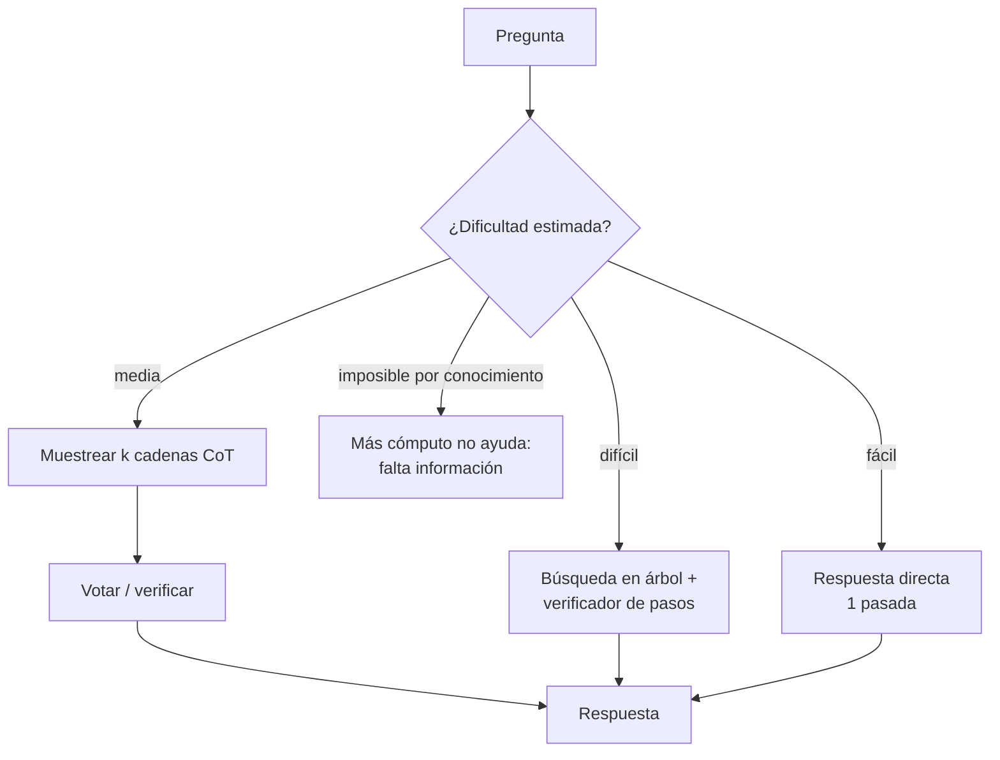

# 175 — Razonamiento y cómputo en tiempo de inferencia

> [← Clase anterior](../../../classes/part-14-frontier-research-and-capstones/174-world-models-y-simulacion-interna/README.md) · [Índice de la parte](../README.md) · [Clase siguiente →](../../../classes/part-14-frontier-research-and-capstones/176-aprendizaje-continuo-y-adaptacion/README.md)

**Parte:** 14 — Frontera, investigación y proyectos integradores  
**Nivel:** frontera · **Horas estimadas:** 6  
**Laboratorio:** `frontier` · **Estado:** `EXECUTABLE_CORE`

## 🎯 Propósito

Comprender **razonamiento y cómputo en tiempo de inferencia** dentro de la evolución de la inteligencia
artificial, implementar un experimento mínimo verificable y distinguir qué parte
constituye evidencia frente a una afirmación todavía no comprobada.

## 📚 Resultados de aprendizaje

Al finalizar podrás:

1. Explicar razonamiento y cómputo en tiempo de inferencia usando los conceptos `reasoning`, `test-time compute`, `verification`, `search`.
2. Ejecutar el laboratorio con una semilla explícita y revisar su contrato JSON.
3. Identificar al menos un supuesto, una limitación y un riesgo de aplicación.
4. Comparar el enfoque con la etapa anterior de la ruta de aprendizaje.
5. Producir una evidencia reproducible y una conclusión que no exceda los datos.

## 🧩 Conceptos centrales

`reasoning`, `test-time compute`, `verification`, `search`

## 🗺️ Ubicación en el mapa de la IA

Las leyes de escalado de la Parte 6 gobernaban el *entrenamiento*: más datos y
parámetros, mejor modelo. Esta clase estudia el segundo eje, descubierto después:
escalar el **cómputo en el momento de responder** — pensar más tiempo, muestrear
varias soluciones, verificar antes de contestar. Es la base de los modelos
razonadores tipo o1/R1 y de patrones que ya usaste en agentes (Parte 9): un
agente que planifica, critica y reintenta está gastando test-time compute. La
pregunta de frontera: ¿cuándo un token de "pensamiento" rinde más que un
parámetro adicional?

## 📖 Fundamentos

### 🔗 Chain-of-thought: hacer visible el cómputo intermedio

Wei et al. (2022, arXiv:2201.11903) mostraron que pedir al modelo pasos
intermedios ("pensemos paso a paso") mejora drásticamente tareas aritméticas y
de razonamiento, y que el efecto **emerge con la escala** (poco o nada en modelos
pequeños). Mecánicamente: cada token generado es un paso de cómputo adicional
condicionado en los anteriores; la cadena externaliza estado intermedio que no
cabe en una sola pasada. Advertencia empírica posterior: la cadena verbalizada
no siempre refleja el proceso interno real (no es una explicación fiel por
construcción).

### 🗳️ Self-consistency: muestrear y votar

Wang et al. (2022, arXiv:2203.11171) sustituyen la decodificación voraz por:

```text
1. Muestrear k cadenas de razonamiento con temperatura > 0.
2. Extraer la respuesta final de cada cadena.
3. Elegir la respuesta más frecuente (voto por mayoría marginal:
   se marginaliza sobre los caminos de razonamiento).
```

Intuición estadística: hay muchas formas de razonar bien que llegan a la misma
respuesta, y muchas de razonar mal que llegan a respuestas distintas. Si cada
muestra acierta con probabilidad p > 0.5 y los errores están repartidos, la
mayoría amplifica p (ver ejemplo trabajado). Coste: k× la inferencia.

### 🌲 Buscar y verificar: best-of-N, árboles y verificadores

Generalizaciones del mismo principio "generar varios candidatos + seleccionar":

- **Best-of-N con verificador**: generar N soluciones y puntuar con un modelo
  de recompensa (outcome-based ORM o process-based PRM, que puntúa paso a paso).
- **Tree-of-Thoughts** (arXiv:2305.10601): explorar deliberadamente un árbol de
  pensamientos parciales con retroceso — búsqueda clásica (Parte 1) sobre
  estados generados por el LLM.
- **Revisión iterativa**: el modelo critica y corrige su propio borrador.

Snell et al. (2024, arXiv:2408.03314) muestran que asignar el cómputo de
inferencia de forma **adaptativa a la dificultad** puede superar a un modelo
~14× más grande respondiendo de un tiro: para preguntas fáciles casi no hay
ganancia; para intermedias, buscar más compensa; para las muy difíciles por
falta de conocimiento, ningún tiempo de pensamiento alcanza.

### 📈 Escalado tipo o1: entrenar a pensar

Los modelos razonadores (o1 de OpenAI, 2024; DeepSeek-R1, arXiv:2501.12948)
cierran el círculo: se entrenan con **RL sobre trazas largas de razonamiento**
premiando la respuesta final verificable (matemática, código). Resultado: el
rendimiento crece suavemente con el logaritmo del cómputo de inferencia
permitido — una "ley de escalado" del pensamiento. R1 mostró además que la
conducta de auto-corrección puede emerger con RL puro sobre recompensas
verificables. Límite clave: exige dominios donde verificar sea barato y fiable;
donde no hay verificador, el beneficio se diluye y aparece el riesgo de
*reward hacking* del juez.

### 🔍 Conexión con el laboratorio

`run_lab("frontier")` separa afirmaciones por madurez. El test-time compute es
terreno fértil para afirmaciones infladas ("el modelo razona como un humano");
la disciplina es la misma: pedir la curva cómputo-precisión y el verificador
usado antes de aceptar la claim.

## 🧮 Ejemplo trabajado

Self-consistency a mano. Un modelo resuelve un problema de aritmética con
probabilidad p = 0.6 por muestra (independientes, errores repartidos entre
respuestas distintas). Muestreamos k = 5 cadenas:

```text
P(mayoría correcta) = P(≥3 aciertos de 5)
 = C(5,3)·0.6³·0.4² + C(5,4)·0.6⁴·0.4 + C(5,5)·0.6⁵
 = 10·0.216·0.16  +  5·0.1296·0.4  +  0.0778
 = 0.3456 + 0.2592 + 0.0778 = 0.683
```

Una sola muestra: 60 %. Votando 5: **68.3 %**. Con k = 11: ≈ 75.3 %. La curva
crece con rendimientos decrecientes y coste lineal en k.

Contraste crítico: si p = 0.4 (el modelo se equivoca *sistemáticamente* hacia la
misma respuesta errónea), la mayoría de 5 acierta solo el 31.7 % — votar
**amplifica el sesgo**. Self-consistency mejora cuando los errores son diversos
y la señal correcta es el modo; no arregla un modelo sesgado.

## 📊 Propiedades y comparación

| Técnica | Coste (× inferencia) | Requiere | Cuándo gana | Límite |
|---|---|---|---|---|
| CoT (1 cadena) | ~1-3× tokens | Nada extra | Tareas multipaso | Cadena infiel, un solo camino |
| Self-consistency | k× | Respuesta extraíble | Errores diversos, p > 0.5 | Amplifica sesgos sistemáticos |
| Best-of-N + verificador | N× + juez | Verificador fiable | Dominios verificables | Reward hacking del juez |
| Tree-of-Thoughts | Variable (poda) | Evaluador de estados | Problemas con estructura de búsqueda | Coste y diseño ad hoc |
| Modelo razonador (o1/R1) | Tokens de pensamiento | Entrenamiento RL previo | Matemática, código | Dominios sin verificador |



## ⚠️ Errores conceptuales frecuentes

1. **"La cadena de pensamiento explica cómo el modelo llegó a la respuesta"**.
   Es texto generado, no una traza del cómputo interno; puede racionalizar a
   posteriori. Para auditoría se necesita más que leer el CoT.
2. **"Votar siempre mejora"**. Solo si los aciertos concentran el modo. Con
   error sistemático (p < 0.5 hacia una misma respuesta), la mayoría empeora
   la precisión — ver el ejemplo trabajado.
3. **"Más tokens de pensamiento = mejor, siempre"**. La ganancia es
   logarítmica y depende de la dificultad; en preguntas fáciles se paga
   latencia por nada, y en las imposibles por falta de conocimiento tampoco
   ayuda (Snell et al.).
4. **"El verificador es neutral"**. Best-of-N optimiza contra el juez: si el
   juez tiene sesgos explotables, el sistema selecciona precisamente las
   respuestas que los explotan.
5. **"o1 demuestra razonamiento general humano"**. Demuestra escalado en
   dominios con verificación barata (matemática, código); la transferencia a
   dominios sin verificador es una claim que exige evidencia separada.

## 🚀 Del aprendizaje a la operación

En producción, el test-time compute es una decisión de **presupuesto**: fijar
k/N por consulta según valor y latencia tolerable; enrutar por dificultad
estimada (la mayor parte del tráfico no necesita razonar); cachear respuestas
verificadas; medir la curva coste-precisión propia en lugar de asumir la de los
papers; y vigilar el modo de fallo silencioso — un sistema que vota o se
auto-verifica puede estar amplificando un sesgo sistemático con total confianza.

## 🧪 Laboratorio

```bash
python lab.py
```

El laboratorio llama a `ai_evolution.labs.run_lab("frontier")`. Esta
decisión evita 183 implementaciones divergentes: cada clase tiene un entrypoint
propio, pero los motores didácticos se prueban como una biblioteca común.

### 🔍 Evidencia esperada

- tipo de laboratorio y semilla;
- entradas o decisiones observables;
- resultado estructurado;
- lista `evidence` con hechos que pueden inspeccionarse;
- lista `limitations` que impide presentar la demo como producción.

## 📓 Notebooks

- [📓 `notebook.ipynb`](notebook.ipynb): recorrido guiado con la materia resumida.
- [✍️ `notebook_student.ipynb`](notebook_student.ipynb): ejercicios para resolver.
- [✅ `notebook_solution.ipynb`](notebook_solution.ipynb): solución de referencia explicada.

## 📝 Evaluación

| Criterio | Peso |
|---|---:|
| Comprensión conceptual | 25 % |
| Ejecución reproducible | 25 % |
| Interpretación basada en evidencia | 25 % |
| Riesgos, límites y mejora propuesta | 25 % |

Consulta [assessment.md](assessment.md) para preguntas y criterio de aceptación.

## ⚠️ Errores comunes

| Síntoma | Causa probable | Corrección |
|---|---|---|
| El código corre, pero no hay conclusión | Se confundió ejecución con aprendizaje | Explica qué demuestra y qué no demuestra |
| El resultado cambia sin explicación | No se registró semilla o configuración | Conserva semilla, versión y parámetros |
| Se promete uso real | Se extrapoló desde una demo educativa | Declara entorno, datos, límites y revisión humana |
| Se copia una métrica aislada | No existe baseline ni costo de error | Añade comparación y criterio de decisión |

## ❓ Preguntas frecuentes

**¿Debo usar una API comercial?**  
No. El núcleo funciona localmente. Las extensiones LIVE se documentan por separado.

**¿El laboratorio representa una implementación industrial?**  
No por sí solo. Enseña el contrato y el patrón; producción exige integración,
seguridad, observabilidad, pruebas y operación.

**¿Dónde profundizo?**  
Revisa las especializaciones enlazadas en el README raíz y la ruta siguiente.

## 🔗 Referencias

- Wei, J. et al. (2022). *Chain-of-Thought Prompting Elicits Reasoning in Large Language Models*. NeurIPS 2022. [arXiv:2201.11903](https://arxiv.org/abs/2201.11903)
- Wang, X. et al. (2022). *Self-Consistency Improves Chain of Thought Reasoning in Language Models*. ICLR 2023. [arXiv:2203.11171](https://arxiv.org/abs/2203.11171)
- Yao, S. et al. (2023). *Tree of Thoughts: Deliberate Problem Solving with Large Language Models*. NeurIPS 2023. [arXiv:2305.10601](https://arxiv.org/abs/2305.10601)
- Snell, C. et al. (2024). *Scaling LLM Test-Time Compute Optimally can be More Effective than Scaling Model Parameters*. [arXiv:2408.03314](https://arxiv.org/abs/2408.03314)
- DeepSeek-AI (2025). *DeepSeek-R1: Incentivizing Reasoning Capability in LLMs via Reinforcement Learning*. [arXiv:2501.12948](https://arxiv.org/abs/2501.12948)
- OpenAI (2024). *Learning to reason with LLMs* (o1). [Blog oficial](https://openai.com/index/learning-to-reason-with-llms/)

<!-- papers:inicio -->

---

## 📜 Papers que fundamentan esta clase

> Bloque generado por `python scripts/link_papers_to_classes.py`. La fuente es [`papers/catalog/papers.json`](../../../papers/catalog/papers.json).

| Paper | Año | Qué desbloqueó | Miniatura |
|---|---:|---|---|
| [P22 · DeepSeek-R1: incentivar la capacidad de razonamiento mediante aprendizaje por refuerzo](../../../papers/foundational/P22_deepseek_r1/README.md) | 2025 | El razonamiento se incentiva con refuerzo puro, sin trazas humanas anotadas; y es el primer LLM de pesos abiertos publicado tras revisión por pares. | [notebook](../../../notebooks/papers/P22_deepseek_r1.ipynb) |
| [P28 · El prompting de cadena de pensamiento provoca razonamiento en modelos de lenguaje grandes](../../../papers/foundational/P28_chain_of_thought/README.md) | 2022 | Descomponer en pasos intermedios desbloquea tareas que el mismo modelo fallaba respondiendo de una vez. | [notebook](../../../notebooks/papers/P28_chain_of_thought.ipynb) |
| [P29 · Árbol de pensamientos: resolución deliberada de problemas con modelos de lenguaje grandes](../../../papers/foundational/P29_tree_of_thoughts/README.md) | 2023 | Devuelve la búsqueda clásica al razonamiento: explorar varias ramas, evaluarlas y poder retroceder. | [notebook](../../../notebooks/papers/P29_tree_of_thoughts.ipynb) |

Cada ficha explica el problema anterior, la matemática mínima, los límites y los errores de atribución más frecuentes. Para leerlas con método: [cómo leer un paper de IA](../../../papers/guides/COMO_LEER_UN_PAPER_DE_IA.md) · [anexos matemáticos](../../../papers/annexes/README.md).
<!-- papers:fin -->
---

## ⬅️ Clase anterior

[174 — World models y simulación interna](../../part-14-frontier-research-and-capstones/174-world-models-y-simulacion-interna/README.md)

## ➡️ Siguiente clase

[176 — Aprendizaje continuo y adaptación](../../part-14-frontier-research-and-capstones/176-aprendizaje-continuo-y-adaptacion/README.md)
