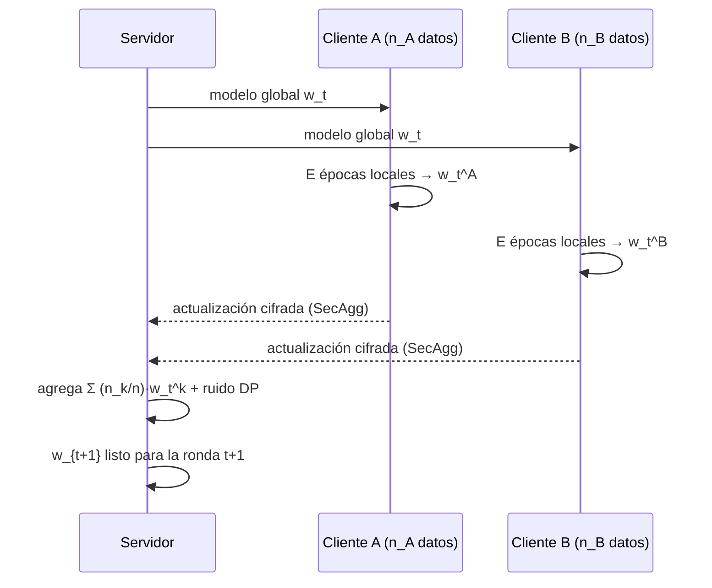

# 177 — Privacidad diferencial y aprendizaje federado

> [← Clase anterior](../../../classes/part-14-frontier-research-and-capstones/176-aprendizaje-continuo-y-adaptacion/README.md) · [Índice de la parte](../README.md) · [Clase siguiente →](../../../classes/part-14-frontier-research-and-capstones/178-ia-para-programacion-y-modernizacion/README.md)

**Parte:** 14 — Frontera, investigación y proyectos integradores  
**Nivel:** frontera · **Horas estimadas:** 6  
**Laboratorio:** `safety` · **Estado:** `EXECUTABLE_CORE`

## 🎯 Propósito

Comprender **privacidad diferencial y aprendizaje federado** dentro de la evolución de la inteligencia
artificial, implementar un experimento mínimo verificable y distinguir qué parte
constituye evidencia frente a una afirmación todavía no comprobada.

## 📚 Resultados de aprendizaje

Al finalizar podrás:

1. Explicar privacidad diferencial y aprendizaje federado usando los conceptos `differential privacy`, `federated`, `secure aggregation`, `leakage`.
2. Ejecutar el laboratorio con una semilla explícita y revisar su contrato JSON.
3. Identificar al menos un supuesto, una limitación y un riesgo de aplicación.
4. Comparar el enfoque con la etapa anterior de la ruta de aprendizaje.
5. Producir una evidencia reproducible y una conclusión que no exceda los datos.

## 🧩 Conceptos centrales

`differential privacy`, `federated`, `secure aggregation`, `leakage`

## 🗺️ Ubicación en el mapa de la IA

La privacidad diferencial y el aprendizaje federado responden a la misma pregunta
desde extremos opuestos: ¿cómo aprender de datos que no deberían exponerse? La
primera da una **garantía matemática** sobre lo que la salida revela de un individuo;
el segundo es una **arquitectura** donde los datos nunca abandonan el dispositivo.
Heredan de la estadística y la optimización distribuida, y son condición de entrada
para IA en salud, banca y móviles (Gboard entrena federado desde 2017). Sin estas
técnicas, gran parte de los datos del mundo queda legalmente fuera del alcance del
aprendizaje automático.

## 📖 Fundamentos

### 🔐 Privacidad diferencial (ε-DP)

Definición (Dwork, 2006): un mecanismo aleatorizado `M` satisface **ε-privacidad
diferencial** si para todo par de datasets vecinos `D, D'` (difieren en un individuo)
y todo conjunto de salidas `S`:

```text
Pr[M(D) ∈ S] ≤ e^ε · Pr[M(D') ∈ S]
```

Lectura: la presencia o ausencia de *cualquier* persona cambia la distribución de la
salida a lo sumo en un factor `e^ε`. Con `ε = 0.1`, `e^ε ≈ 1.105`: un observador casi
no puede distinguir si estás en los datos. La garantía es del **mecanismo**, no de los
datos: vale contra cualquier atacante, con cualquier conocimiento auxiliar, hoy y en
el futuro. Eso la diferencia de la anonimización clásica (k-anonimato), rota una y
otra vez por ataques de re-identificación con datos auxiliares (caso Netflix Prize).

### 🎲 Mecanismo de Laplace

Para una consulta numérica `f(D)` se define la **sensibilidad global**
`Δf = max_{D,D'} |f(D) − f(D')|` (cuánto puede cambiar la respuesta por culpa de una
sola persona). El mecanismo publica:

```text
M(D) = f(D) + Lap(b)     con  b = Δf / ε
```

donde `Lap(b)` es ruido Laplace con densidad `(1/2b)·exp(−|x|/b)`. Ejemplo: un conteo
("¿cuántos pacientes tienen diabetes?") tiene `Δf = 1`; con `ε = 0.5` se suma ruido
de escala `b = 2`. Propiedades clave:

- **Composición**: responder `k` consultas con `ε` cada una consume `k·ε` en total
  (el "presupuesto de privacidad" se gasta; no es renovable).
- **Post-procesamiento**: cualquier función de una salida ε-DP sigue siendo ε-DP.
- **(ε, δ)-DP**: relajación usada en deep learning (DP-SGD, Abadi et al. 2016):
  recorte de gradientes por ejemplo + ruido gaussiano + contabilidad del presupuesto.

### 📱 Aprendizaje federado — FedAvg

FedAvg (McMahan et al., 2017, arXiv:1602.05629) entrena un modelo global sin
centralizar datos:

```text
Servidor: inicializa w_0
Por ronda t = 1..T:
  1. Selecciona una fracción C de los K clientes
  2. Envía w_t a cada cliente seleccionado
  3. Cada cliente k entrena E épocas locales sobre sus n_k ejemplos → w_t^k
  4. Servidor agrega:  w_{t+1} = Σ_k (n_k / n) · w_t^k    (media ponderada)
```

Desafíos propios: datos **no-IID** (cada cliente tiene una distribución distinta, lo
que sesga y desestabiliza la media), clientes intermitentes, y costo de comunicación
(por eso `E > 1` épocas locales: menos rondas, más cómputo local).

### 🕳️ Federado NO implica privado

Los gradientes filtran información: los ataques de **inversión de gradientes** (Zhu
et al., 2019, "Deep Leakage from Gradients") reconstruyen imágenes y textos de
entrenamiento a partir de las actualizaciones. Por eso el sistema completo combina:
federado (los datos no viajan) + **agregación segura** (el servidor solo ve la suma
cifrada de actualizaciones, Bonawitz et al. 2017) + **DP** (ruido sobre la
actualización agregada, garantía formal). Cada pieza cubre un ataque distinto.

## 🧮 Ejemplo trabajado

Un hospital publica el conteo de pacientes con cierta condición: `f(D) = 42`.
Consulta de conteo → `Δf = 1`. Presupuesto elegido: `ε = 0.5`.

```text
Escala del ruido:  b = Δf / ε = 1 / 0.5 = 2
Mecanismo:         M(D) = 42 + Lap(2)

Garantía sobre un individuo (D' sin la persona X, f(D') = 41):
para cualquier salida s, la densidad cumple
p_D(s) / p_D'(s) = exp((|s−41| − |s−42|)/2) ≤ exp(1/2) = e^0.5 ≈ 1.65

Ruido esperado: E|Lap(2)| = b = 2  →  error típico de ±2 sobre 42 (≈5 %)
Tres consultas iguales con ε=0.5 cada una → presupuesto total gastado: ε=1.5
  (promediar las tres respuestas reduce el ruido... y por eso mismo triplica ε)
```

La tensión es visible con números: más precisión (b pequeño) exige más ε (menos
privacidad), y repetir consultas gasta presupuesto aunque "parezcan inocentes".

## 📊 Propiedades y comparación

| Enfoque | ¿Datos salen del origen? | Garantía formal | Contra qué protege | Costo principal |
|---|---|---|---|---|
| Anonimización clásica (k-anon) | Sí (transformados) | No | Ataques ingenuos | Re-identificación con datos auxiliares |
| DP central | Sí (al curador confiable) | ε-DP en la salida | Inferencia sobre individuos | Ruido ↔ utilidad; requiere confiar en el curador |
| DP local | No (se perturba en el dispositivo) | ε-DP por envío | Curador deshonesto | Mucho más ruido para igual utilidad |
| Federado (FedAvg solo) | No (viajan gradientes) | No | Centralización de datos crudos | Fuga por inversión de gradientes |
| Federado + SecAgg + DP | No | (ε,δ)-DP | Servidor curioso e inferencia | Comunicación, cripto, ruido |



## ⚠️ Errores conceptuales frecuentes

1. **"Federado ya es privado."** No: los gradientes filtran datos (deep leakage). La
   privacidad formal la aportan SecAgg + DP encima de la arquitectura federada.
2. **"ε-DP protege el secreto del dataset entero."** Protege la contribución de
   *individuos*; estadísticas poblacionales (que fumar causa cáncer) se aprenden
   igual — ese es justamente el objetivo.
3. **"Anonimizar quitando nombres equivale a DP."** El caso Netflix/IMDb demostró que
   los datos auxiliares re-identifican; DP es una propiedad del mecanismo que resiste
   cualquier dato auxiliar, presente o futuro.
4. **"El presupuesto ε se renueva por consulta."** Se **compone**: k consultas de ε
   gastan k·ε sobre los mismos datos. Ignorarlo anula la garantía en la práctica.
5. **"Más ruido siempre es más seguro."** Sin calibrar a Δf y sin contabilidad, el
   ruido puede ser a la vez insuficiente para la garantía y excesivo para la utilidad;
   la calibración `b = Δf/ε` es exacta, no heurística.

## 🚀 Del aprendizaje a la operación

Entre este núcleo y un despliegue real faltan: la **contabilidad de presupuesto**
sobre todo el ciclo de vida (cada release del modelo gasta ε; Apple y el US Census
publican los suyos), infraestructura federada tolerante a clientes que se caen a
mitad de ronda, evaluación de utilidad por subgrupos (el ruido DP degrada más a las
minorías del dataset), y revisión legal: DP con ε alto puede ser teatro de
privacidad — el número exacto de ε importa y debe publicarse.

## 🧪 Laboratorio

```bash
python lab.py
```

El laboratorio llama a `ai_evolution.labs.run_lab("safety")`. Esta
decisión evita 183 implementaciones divergentes: cada clase tiene un entrypoint
propio, pero los motores didácticos se prueban como una biblioteca común.

### 🔍 Evidencia esperada

- tipo de laboratorio y semilla;
- entradas o decisiones observables;
- resultado estructurado;
- lista `evidence` con hechos que pueden inspeccionarse;
- lista `limitations` que impide presentar la demo como producción.

## 📓 Notebooks

- [📓 `notebook.ipynb`](notebook.ipynb): recorrido guiado con la materia resumida.
- [✍️ `notebook_student.ipynb`](notebook_student.ipynb): ejercicios para resolver.
- [✅ `notebook_solution.ipynb`](notebook_solution.ipynb): solución de referencia explicada.

## 📝 Evaluación

| Criterio | Peso |
|---|---:|
| Comprensión conceptual | 25 % |
| Ejecución reproducible | 25 % |
| Interpretación basada en evidencia | 25 % |
| Riesgos, límites y mejora propuesta | 25 % |

Consulta [assessment.md](assessment.md) para preguntas y criterio de aceptación.

## ⚠️ Errores comunes

| Síntoma | Causa probable | Corrección |
|---|---|---|
| El código corre, pero no hay conclusión | Se confundió ejecución con aprendizaje | Explica qué demuestra y qué no demuestra |
| El resultado cambia sin explicación | No se registró semilla o configuración | Conserva semilla, versión y parámetros |
| Se promete uso real | Se extrapoló desde una demo educativa | Declara entorno, datos, límites y revisión humana |
| Se copia una métrica aislada | No existe baseline ni costo de error | Añade comparación y criterio de decisión |

## ❓ Preguntas frecuentes

**¿Debo usar una API comercial?**  
No. El núcleo funciona localmente. Las extensiones LIVE se documentan por separado.

**¿El laboratorio representa una implementación industrial?**  
No por sí solo. Enseña el contrato y el patrón; producción exige integración,
seguridad, observabilidad, pruebas y operación.

**¿Dónde profundizo?**  
Revisa las especializaciones enlazadas en el README raíz y la ruta siguiente.

## 🔗 Referencias

- Dwork, C., McSherry, F., Nissim, K. y Smith, A. (2006). *Calibrating Noise to Sensitivity in Private Data Analysis*. TCC 2006. [DOI 10.1007/11681878_14](https://doi.org/10.1007/11681878_14)
- Dwork, C. y Roth, A. (2014). *The Algorithmic Foundations of Differential Privacy*. [PDF oficial](https://www.cis.upenn.edu/~aaroth/Papers/privacybook.pdf)
- McMahan, H. B. et al. (2017). *Communication-Efficient Learning of Deep Networks from Decentralized Data* (FedAvg). AISTATS 2017. [arXiv:1602.05629](https://arxiv.org/abs/1602.05629)
- Abadi, M. et al. (2016). *Deep Learning with Differential Privacy* (DP-SGD). CCS 2016. [arXiv:1607.00133](https://arxiv.org/abs/1607.00133)
- Bonawitz, K. et al. (2017). *Practical Secure Aggregation for Privacy-Preserving Machine Learning*. CCS 2017. [DOI 10.1145/3133956.3133982](https://doi.org/10.1145/3133956.3133982)
- Zhu, L., Liu, Z. y Han, S. (2019). *Deep Leakage from Gradients*. NeurIPS 2019. [arXiv:1906.08935](https://arxiv.org/abs/1906.08935)

<!-- papers:inicio -->

---

## 📜 Papers que fundamentan esta clase

> Bloque generado por `python scripts/link_papers_to_classes.py`. La fuente es [`papers/catalog/papers.json`](../../../papers/catalog/papers.json).

| Paper | Año | Qué desbloqueó | Miniatura |
|---|---:|---|---|
| [P143 · Calibrar el ruido a la sensibilidad en el análisis privado de datos](../../../papers/foundational/P143_privacidad_diferencial/README.md) | 2006 | Da una definición formal de privacidad que no depende de qué sepa el atacante, y un mecanismo concreto para cumplirla. | [notebook](../../../notebooks/papers/P143_privacidad_diferencial.ipynb) |
| [P146 · Aprendizaje eficiente en comunicación de redes profundas con datos descentralizados](../../../papers/foundational/P146_federado/README.md) | 2017 | Entrena un modelo compartido sin que los datos salgan del dispositivo, promediando modelos en vez de recoger registros. | [notebook](../../../notebooks/papers/P146_federado.ipynb) |

Cada ficha explica el problema anterior, la matemática mínima, los límites y los errores de atribución más frecuentes. Para leerlas con método: [cómo leer un paper de IA](../../../papers/guides/COMO_LEER_UN_PAPER_DE_IA.md) · [anexos matemáticos](../../../papers/annexes/README.md).
<!-- papers:fin -->
---

## ⬅️ Clase anterior

[176 — Aprendizaje continuo y adaptación](../../part-14-frontier-research-and-capstones/176-aprendizaje-continuo-y-adaptacion/README.md)

## ➡️ Siguiente clase

[178 — IA para programación y modernización](../../part-14-frontier-research-and-capstones/178-ia-para-programacion-y-modernizacion/README.md)
