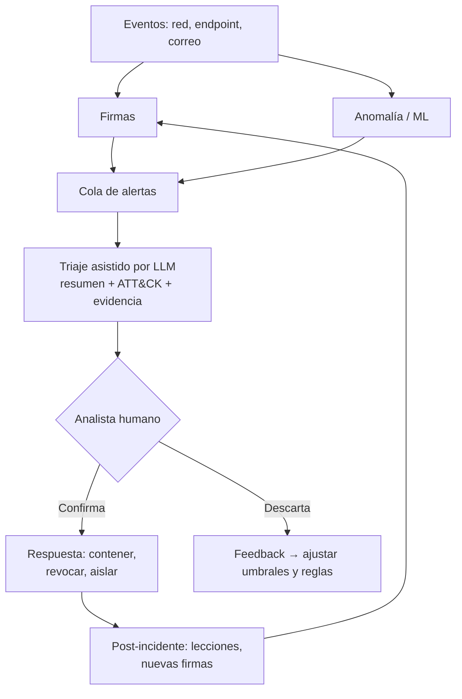

# 179 — IA para ciberseguridad y defensa

> [← Clase anterior](../../../classes/part-14-frontier-research-and-capstones/178-ia-para-programacion-y-modernizacion/README.md) · [Índice de la parte](../README.md) · [Clase siguiente →](../../../classes/part-14-frontier-research-and-capstones/180-ia-para-educacion-y-aprendizaje-adaptativo/README.md)

**Parte:** 14 — Frontera, investigación y proyectos integradores  
**Nivel:** frontera · **Horas estimadas:** 6  
**Laboratorio:** `safety` · **Estado:** `EXECUTABLE_CORE`

## 🎯 Propósito

Comprender **ia para ciberseguridad y defensa** dentro de la evolución de la inteligencia
artificial, implementar un experimento mínimo verificable y distinguir qué parte
constituye evidencia frente a una afirmación todavía no comprobada.

## 📚 Resultados de aprendizaje

Al finalizar podrás:

1. Explicar ia para ciberseguridad y defensa usando los conceptos `cybersecurity`, `detection`, `response`, `dual-use`.
2. Ejecutar el laboratorio con una semilla explícita y revisar su contrato JSON.
3. Identificar al menos un supuesto, una limitación y un riesgo de aplicación.
4. Comparar el enfoque con la etapa anterior de la ruta de aprendizaje.
5. Producir una evidencia reproducible y una conclusión que no exceda los datos.

## 🧩 Conceptos centrales

`cybersecurity`, `detection`, `response`, `dual-use`

## 🗺️ Ubicación en el mapa de la IA

La ciberseguridad es un dominio adversarial por definición: a diferencia de la visión
o el clima, aquí el fenómeno a modelar **responde** a las defensas y las evade. La IA
defensiva hereda de la clasificación y detección de anomalías (partes 3-4) y de los
agentes con herramientas (parte 9), y a la vez alimenta la seguridad de la propia IA
(clases de la parte 13): los mismos LLM que ayudan a triar alertas son superficie de
ataque por inyección de prompts. Es también el caso de estudio canónico del problema
de doble uso.

## 📖 Fundamentos

### 🛡️ Dónde encaja la IA en la defensa

Cuatro funciones con madurez muy distinta:

- **Detección**: clasificar eventos (tráfico, procesos, correos) como benignos o
  maliciosos. Por firma (patrones conocidos, precisión alta, ciego a lo nuevo) o por
  anomalía (desviación de un perfil normal, cubre lo nuevo, inunda de falsos
  positivos).
- **Triaje**: priorizar las miles de alertas diarias de un SOC (centro de operaciones
  de seguridad); es hoy el uso más efectivo de los LLM — resumir, correlacionar,
  enriquecer contexto — porque el humano permanece en la decisión.
- **Respuesta**: contener (aislar host, revocar credenciales). La automatización aquí
  es delicada: una respuesta automática equivocada es un autoataque de denegación de
  servicio.
- **Inteligencia**: mapear observaciones a tácticas y técnicas conocidas (el marco
  MITRE ATT&CK es la taxonomía estándar de comportamientos adversarios).

### 📉 La falacia de la tasa base (el resultado central)

El resultado más importante para detección es de Axelsson (1999): en detección de
intrusiones, la utilidad la domina la **prevalencia**, no la precisión del modelo.
Con eventos maliciosos rarísimos, incluso un detector excelente produce casi solo
falsas alarmas:

```text
P(intrusión | alerta) =  TPR·p / (TPR·p + FPR·(1−p))      (Bayes)

TPR: tasa de detección    FPR: tasa de falsa alarma    p: prevalencia
```

Si `p ≈ 10⁻⁵..10⁻⁴` (realista en tráfico de red), el término `FPR·(1−p)` aplasta al
numerador salvo que FPR sea astronómicamente bajo. Conclusión operativa: **reducir
FPR vale más que aumentar TPR**, y la métrica que importa es la precisión de la cola
de alertas que un analista puede revisar, no el AUC global.

### ⚔️ Asimetría ataque/defensa

- El atacante necesita **una** vía; el defensor debe cubrir **todas**.
- El atacante puede probar contra la defensa hasta evadirla (los clasificadores de
  malware sufren evasión adversarial dirigida); el defensor no elige la distribución
  de los datos, que además es no estacionaria (*concept drift*: el malware de este
  año no se parece al del dataset de entrenamiento).
- Sommer y Paxson (2010) explican por qué el ML "que funciona en el paper" fracasa en
  detección operativa: la anomalía no implica malicia, los costos de error son
  asimétricos y los datasets de laboratorio no representan redes reales.

La IA también es **dual**: los mismos modelos generan phishing convincente, buscan
vulnerabilidades y automatizan reconocimiento. La política defensiva no puede asumir
un adversario sin IA.

### 🧭 LLM en el SOC: contrato seguro

```text
Entrada:  alerta + contexto (logs, activo, historial) — SANITIZADOS
Tarea:    resumir, correlacionar con ATT&CK, proponer hipótesis y pasos
Salida:   recomendación con evidencia citada, NUNCA acción directa
Guardia:  el contenido del atacante (correos, payloads) es DATOS, no
          instrucciones → riesgo de prompt injection si se pega crudo al LLM
```

## 🧮 Ejemplo trabajado

Un IDS analiza 1,000,000 de eventos/día; 100 son realmente maliciosos
(prevalencia p = 10⁻⁴). El detector tiene TPR = 0.99 y FPR = 0.01 ("99 % de
precisión" en el folleto).

```text
Verdaderos positivos: 0.99 × 100        =      99 alertas correctas
Falsos positivos:     0.01 × 999,900    =   9,999 falsas alarmas

P(malicioso | alerta) = 99 / (99 + 9,999) = 99/10,098 ≈ 0.0098  →  ≈ 1 %
```

El "detector del 99 %" produce 10,098 alertas diarias de las cuales el 99 % son
falsas. Un equipo que revisa 200 alertas/día encontraría ~2 incidentes reales.
Repetir el cálculo con FPR = 0.001 da 99/(99+1,000) ≈ 9 %: **bajar FPR ×10 ayuda
~×9; subir TPR a 0.999 ayuda un 1 %**. Esa es la falacia de la tasa base en números.

## 📊 Propiedades y comparación

| Enfoque | Detecta lo nuevo | FPR típico | Explicabilidad | Evasión por el atacante |
|---|---|---|---|---|
| Firmas/reglas | No | Muy bajo | Alta (regla exacta) | Trivial (mutar el patrón) |
| Anomalía estadística | Sí (desviaciones) | Alto | Media | Envenenar el perfil "normal" lentamente |
| Clasificador ML supervisado | Parcial (generaliza) | Medio | Baja | Ejemplos adversariales, drift |
| LLM de triaje | n/a (no detecta: prioriza) | n/a | Alta (narrativa) | Prompt injection en el contenido |



## ⚠️ Errores conceptuales frecuentes

1. **"99 % de exactitud = detector utilizable."** Con prevalencia 10⁻⁴, ese detector
   entrega ~1 % de precisión por alerta (ejemplo trabajado). La exactitud global es
   la métrica equivocada en clases raras.
2. **"Anómalo = malicioso."** La mayoría de las anomalías son administradores
   haciendo cosas raras legítimas; la anomalía es una pista, no un veredicto.
3. **"Automatizar la respuesta ahorra el analista."** Una contención automática con
   falsos positivos es un ataque de denegación de servicio autoinfligido; la
   automatización segura empieza por el triaje, no por la respuesta.
4. **"El modelo se entrena una vez."** El adversario se adapta al detector (evasión
   dirigida) y el tráfico cambia (drift): la detección es un proceso, no un artefacto.
5. **"El LLM puede leer el correo del atacante sin riesgo."** El contenido controlado
   por el adversario puede contener instrucciones (prompt injection); debe tratarse
   como datos con sanitización y sin capacidad de acción directa.

## 🚀 Del aprendizaje a la operación

Un despliegue real añade: medición continua de la precisión de la cola de alertas
(no del AUC offline), presupuesto explícito de alertas/día por analista, playbooks
donde el LLM propone y el humano ejecuta (separación de privilegios), red team
periódico que ataque también al propio pipeline de IA (evasión y prompt injection),
y trazabilidad completa: en un incidente legal, "el modelo lo marcó" sin evidencia
citable no sostiene ninguna decisión.

## 🧪 Laboratorio

```bash
python lab.py
```

El laboratorio llama a `ai_evolution.labs.run_lab("safety")`. Esta
decisión evita 183 implementaciones divergentes: cada clase tiene un entrypoint
propio, pero los motores didácticos se prueban como una biblioteca común.

### 🔍 Evidencia esperada

- tipo de laboratorio y semilla;
- entradas o decisiones observables;
- resultado estructurado;
- lista `evidence` con hechos que pueden inspeccionarse;
- lista `limitations` que impide presentar la demo como producción.

## 📓 Notebooks

- [📓 `notebook.ipynb`](notebook.ipynb): recorrido guiado con la materia resumida.
- [✍️ `notebook_student.ipynb`](notebook_student.ipynb): ejercicios para resolver.
- [✅ `notebook_solution.ipynb`](notebook_solution.ipynb): solución de referencia explicada.

## 📝 Evaluación

| Criterio | Peso |
|---|---:|
| Comprensión conceptual | 25 % |
| Ejecución reproducible | 25 % |
| Interpretación basada en evidencia | 25 % |
| Riesgos, límites y mejora propuesta | 25 % |

Consulta [assessment.md](assessment.md) para preguntas y criterio de aceptación.

## ⚠️ Errores comunes

| Síntoma | Causa probable | Corrección |
|---|---|---|
| El código corre, pero no hay conclusión | Se confundió ejecución con aprendizaje | Explica qué demuestra y qué no demuestra |
| El resultado cambia sin explicación | No se registró semilla o configuración | Conserva semilla, versión y parámetros |
| Se promete uso real | Se extrapoló desde una demo educativa | Declara entorno, datos, límites y revisión humana |
| Se copia una métrica aislada | No existe baseline ni costo de error | Añade comparación y criterio de decisión |

## ❓ Preguntas frecuentes

**¿Debo usar una API comercial?**  
No. El núcleo funciona localmente. Las extensiones LIVE se documentan por separado.

**¿El laboratorio representa una implementación industrial?**  
No por sí solo. Enseña el contrato y el patrón; producción exige integración,
seguridad, observabilidad, pruebas y operación.

**¿Dónde profundizo?**  
Revisa las especializaciones enlazadas en el README raíz y la ruta siguiente.

## 🔗 Referencias

- Axelsson, S. (2000). *The base-rate fallacy and the difficulty of intrusion detection*. ACM TISSEC 3(3). [DOI 10.1145/357830.357849](https://doi.org/10.1145/357830.357849)
- Sommer, R. y Paxson, V. (2010). *Outside the Closed World: On Using Machine Learning for Network Intrusion Detection*. IEEE S&P 2010. [DOI 10.1109/SP.2010.25](https://doi.org/10.1109/SP.2010.25)
- MITRE ATT&CK — base de conocimiento de tácticas y técnicas adversarias. [attack.mitre.org](https://attack.mitre.org/)
- NIST Cybersecurity Framework 2.0 (2024). [nist.gov/cyberframework](https://www.nist.gov/cyberframework)
- Apruzzese, G. et al. (2023). *The Role of Machine Learning in Cybersecurity*. ACM Digital Threats 4(1). [DOI 10.1145/3545574](https://doi.org/10.1145/3545574)

---

## ⬅️ Clase anterior

[178 — IA para programación y modernización](../../part-14-frontier-research-and-capstones/178-ia-para-programacion-y-modernizacion/README.md)

## ➡️ Siguiente clase

[180 — IA para educación y aprendizaje adaptativo](../../part-14-frontier-research-and-capstones/180-ia-para-educacion-y-aprendizaje-adaptativo/README.md)
