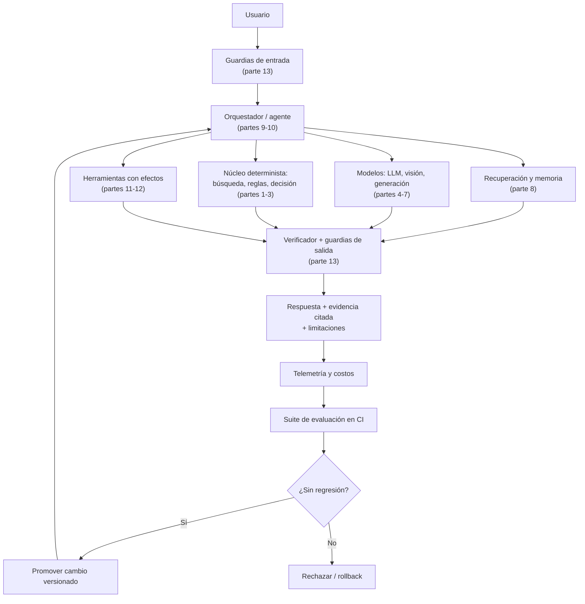

# 180 — Capstone final: sistema de IA evolutivo

> [← Clase anterior](../../../classes/part-14-frontier-research-and-capstones/179-como-vigilar-la-frontera-sin-perseguir-modas/README.md) · [Índice de la parte](../README.md) · Fin del programa

**Parte:** 14 — Frontera, investigación y proyectos integradores  
**Nivel:** frontera · **Horas estimadas:** 10  
**Laboratorio:** `capstone` · **Estado:** `EXECUTABLE_CORE`

## 🎯 Propósito

Comprender **capstone final: sistema de ia evolutivo** dentro de la evolución de la inteligencia
artificial, implementar un experimento mínimo verificable y distinguir qué parte
constituye evidencia frente a una afirmación todavía no comprobada.

## 📚 Resultados de aprendizaje

Al finalizar podrás:

1. Explicar capstone final: sistema de ia evolutivo usando los conceptos `portfolio`, `system`, `agents`, `safety`, `operations`.
2. Ejecutar el laboratorio con una semilla explícita y revisar su contrato JSON.
3. Identificar al menos un supuesto, una limitación y un riesgo de aplicación.
4. Comparar el enfoque con la etapa anterior de la ruta de aprendizaje.
5. Producir una evidencia reproducible y una conclusión que no exceda los datos.

## 🧩 Conceptos centrales

`portfolio`, `system`, `agents`, `safety`, `operations`

## 🗺️ Ubicación en el mapa de la IA

Esta clase cierra el programa integrando las 15 partes en un solo sistema. No
introduce una técnica nueva: obliga a componer las que ya conoces bajo restricciones
reales —evidencia, seguridad, costo, operación— y a defender cada decisión. Un
"sistema de IA evolutivo" es aquel que puede mejorar con el uso sin degradarse en
silencio: combina un núcleo determinista auditable, componentes aprendidos, memoria
y recuperación, agentes con herramientas, evaluación continua y un proceso de
gobierno del cambio. Es el punto donde el programa deja de enseñar piezas y empieza
a exigir arquitectura.

## 📖 Fundamentos

### 🧭 Qué significa "evolutivo"

Tres propiedades, en orden de dificultad:

1. **Mejorable**: existe un canal por el que la experiencia se convierte en cambio
   (datos etiquetados por el uso, prompts versionados, políticas ajustadas, índices
   actualizados).
2. **Verificable**: cada cambio se acepta o rechaza contra una suite de evaluación
   antes de llegar a los usuarios. Sin esto, "evolutivo" significa "deriva".
3. **Reversible**: todo cambio tiene un artefacto versionado y un camino de rollback.
   La capacidad de deshacer es lo que hace segura la capacidad de cambiar.

### 🏗️ Arquitectura de referencia (mapa de las 15 partes)

```text
[Entrada del usuario]
   ↓
GUARDIAS DE ENTRADA          ← parte 13: validación, política, datos ≠ instrucciones
   ↓
ORQUESTADOR / AGENTE         ← partes 9-10: planificar, llamar herramientas, delegar
   ├─ RECUPERACIÓN + MEMORIA ← parte 8: índice, contexto, citas verificables
   ├─ MODELO(S)              ← partes 4-7: LLM, visión, generación; ajuste y prompting
   ├─ NÚCLEO DETERMINISTA    ← partes 1-3: búsqueda, reglas, probabilidad, decisión
   └─ HERRAMIENTAS           ← partes 11-12: efectos en el mundo, APIs, ejecución
   ↓
GUARDIAS DE SALIDA           ← parte 13: verificación de afirmaciones, límites, PII
   ↓
[Respuesta + evidencia citada]        →  TELEMETRÍA → EVALUACIÓN → cambio versionado
                                                        ↑ partes 12-13 (bucle evolutivo)
```

La regla de composición más importante: **cuanto más determinista sea la parte que
toma la decisión final, más auditable es el sistema**. Los componentes aprendidos
proponen; el núcleo determinista y el humano disponen, y ambos dejan traza.

### 📋 El contrato de evidencia

Todo el programa se apoya en un patrón único, visible en cada laboratorio: un
resultado no es un texto, es una estructura con `kind` (qué se ejecutó), `evidence`
(hechos inspeccionables) y `limitations` (lo que este resultado NO permite concluir),
más la semilla y la configuración que lo hacen reproducible. Un capstone que produce
una demo impresionante sin ese contrato no es un sistema: es una anécdota.

### ⚖️ Los cuatro trade-offs que estructuran el diseño

```text
Autonomía  ↔  Control        más pasos autónomos = más valor y más radio de daño
Capacidad  ↔  Costo          test-time compute mejora resultados y multiplica el gasto
Recuerdo   ↔  Privacidad     memoria útil = datos retenidos = superficie regulatoria
Novedad    ↔  Estabilidad    adoptar lo nuevo vs mantener lo que ya está validado
```

Ninguno tiene solución óptima general: el diseño consiste en elegir un punto,
declararlo y medirlo. Un capstone se evalúa por la calidad de esas decisiones
declaradas, no por la ausencia de compromisos.

### 🚨 Qué convierte un prototipo en sistema

- **Un caso de uso acotado** con un desenlace medible (no "asistente de todo").
- **Baseline no-IA**: qué haría una regla, una búsqueda o un humano; sin él no se
  puede afirmar mejora.
- **Suite de evaluación** con casos de éxito, casos límite y casos adversariales,
  ejecutable en CI.
- **Límites explícitos** y un plan de qué hacer cuando el sistema no sabe (rechazar
  y escalar es una respuesta válida y frecuentemente la correcta).
- **Operación**: telemetría, costos, alertas de regresión y dueño responsable.

## 🧮 Ejemplo trabajado

Diseño mínimo de un capstone: *asistente de consultas sobre la normativa interna de
una empresa*. Se recorre el mapa decidiendo y declarando:

```text
1. CASO Y DESENLACE
   Responder preguntas de normativa con cita al documento fuente.
   Métrica: % de respuestas con cita correcta verificada por muestreo humano.
   Baseline no-IA: buscador por palabras clave sobre el mismo corpus.

2. COMPOSICIÓN
   Recuperación (parte 8) → LLM que responde SOLO con lo recuperado (parte 6)
   → verificador determinista: si la respuesta no cita un documento del índice,
     se rechaza y devuelve "no encontrado" (partes 1-3, decisión final determinista).

3. GUARDIAS
   Entrada: el texto del usuario nunca se interpreta como instrucción de sistema.
   Salida: se bloquea toda respuesta sin cita y toda que incluya datos personales.

4. EVALUACIÓN (suite en CI)
   30 preguntas con respuesta conocida  → exactitud y cita correcta
   10 preguntas fuera del corpus        → debe responder "no encontrado" (¡clave!)
   10 intentos de inyección de prompt   → no debe cambiar de rol ni filtrar el prompt

5. CONTRATO DE SALIDA
   {kind, answer, evidence: [doc_id, sección, fragmento], limitations, seed, version}

6. TRADE-OFFS DECLARADOS
   Autonomía baja (no ejecuta acciones, solo responde) · costo acotado (1 llamada +
   recuperación) · sin memoria de usuario (privacidad sobre personalización) ·
   modelo fijado por versión (estabilidad sobre novedad).

7. EVOLUCIÓN
   Cada pregunta con cita marcada como incorrecta entra al conjunto de evaluación.
   Un cambio de prompt, índice o modelo se promueve solo si la suite no regresa.
```

Ese documento de siete puntos —no el código— es el entregable que distingue un
capstone evaluable de una demo.

## 📊 Propiedades y comparación

| Nivel de madurez del capstone | Qué demuestra | Evidencia mínima | Riesgo dominante |
|---|---|---|---|
| Demo | Que algo corre | Captura o video | Confundir "funciona una vez" con "funciona" |
| Prototipo reproducible | Que corre igual mañana | Semilla, versión, contrato JSON | Sin baseline: no se sabe si aporta |
| Sistema evaluado | Que es mejor que el baseline | Suite de evaluación + comparación | Sobreajuste a la propia suite |
| Sistema operable | Que puede vivir en producción | Telemetría, costos, rollback, dueño | Degradación silenciosa por drift |



## ⚠️ Errores conceptuales frecuentes

1. **"El capstone es el código."** El entregable central es el documento de
   decisiones: caso acotado, baseline, composición, guardias, suite y límites. El
   código sin ese marco no es evaluable.
2. **"Más componentes = mejor sistema."** Cada componente aprendido añade una fuente
   de error y de costo. La arquitectura fuerte usa el componente determinista más
   simple que resuelva cada subproblema.
3. **"Evolutivo significa que se reentrena solo."** Significa que existe un canal de
   mejora **verificada y reversible**. Sin suite de evaluación y rollback, la
   automejora automática es deriva no supervisada.
4. **"Si la demo impresiona, el sistema funciona."** La demo se elige entre los casos
   que salieron bien (survivorship bias). Lo que informa es el comportamiento en
   casos límite: fuera de corpus, entradas adversariales, y el caso de "no sé".
5. **"Rechazar responder es un fallo."** Es una capacidad: un sistema que reconoce
   sus límites y escala al humano es más útil y mucho más seguro que uno que siempre
   responde con confianza uniforme.

## 🚀 Del aprendizaje a la operación

Lo que separa este capstone de un sistema real y debes declarar explícitamente:
datos reales con su gobernanza (permisos, retención, PII), pruebas con usuarios que
no lo construyeron, presupuesto y alertas de costo por consulta, monitoreo de
regresiones y de drift tras cada cambio, un plan de incidentes con dueño y camino de
rollback, y revisión legal si el dominio está regulado. La conclusión honesta de un
capstone termina con "esto es lo que demostré" y "esto es exactamente lo que faltaría
para producción" — y esa segunda lista es la que prueba que aprendiste el programa.

## 🧪 Laboratorio

```bash
python lab.py
```

El laboratorio llama a `ai_evolution.labs.run_lab("capstone")`. Esta
decisión evita 180 implementaciones divergentes: cada clase tiene un entrypoint
propio, pero los motores didácticos se prueban como una biblioteca común.

### 🔍 Evidencia esperada

- tipo de laboratorio y semilla;
- entradas o decisiones observables;
- resultado estructurado;
- lista `evidence` con hechos que pueden inspeccionarse;
- lista `limitations` que impide presentar la demo como producción.

## 📓 Notebooks

- [📓 `notebook.ipynb`](notebook.ipynb): recorrido guiado con la materia resumida.
- [✍️ `notebook_student.ipynb`](notebook_student.ipynb): ejercicios para resolver.
- [✅ `notebook_solution.ipynb`](notebook_solution.ipynb): solución de referencia explicada.

## 📝 Evaluación

| Criterio | Peso |
|---|---:|
| Comprensión conceptual | 25 % |
| Ejecución reproducible | 25 % |
| Interpretación basada en evidencia | 25 % |
| Riesgos, límites y mejora propuesta | 25 % |

Consulta [assessment.md](assessment.md) para preguntas y criterio de aceptación.

## ⚠️ Errores comunes

| Síntoma | Causa probable | Corrección |
|---|---|---|
| El código corre, pero no hay conclusión | Se confundió ejecución con aprendizaje | Explica qué demuestra y qué no demuestra |
| El resultado cambia sin explicación | No se registró semilla o configuración | Conserva semilla, versión y parámetros |
| Se promete uso real | Se extrapoló desde una demo educativa | Declara entorno, datos, límites y revisión humana |
| Se copia una métrica aislada | No existe baseline ni costo de error | Añade comparación y criterio de decisión |

## ❓ Preguntas frecuentes

**¿Debo usar una API comercial?**  
No. El núcleo funciona localmente. Las extensiones LIVE se documentan por separado.

**¿El laboratorio representa una implementación industrial?**  
No por sí solo. Enseña el contrato y el patrón; producción exige integración,
seguridad, observabilidad, pruebas y operación.

**¿Dónde profundizo?**  
Revisa las especializaciones enlazadas en el README raíz y la ruta siguiente.

## 🔗 Referencias

- Sculley, D. et al. (2015). *Hidden Technical Debt in Machine Learning Systems*. NeurIPS 2015. [PDF NeurIPS](https://papers.nips.cc/paper_files/paper/2015/hash/86df7dcfd896fcaf2674f757a2463eba-Abstract.html)
- Russell, S. y Norvig, P. (2020). *Artificial Intelligence: A Modern Approach*, 4.ª ed., cap. 2 (agentes y entornos) y cap. 27 (futuro de la IA). [aima.cs.berkeley.edu](https://aima.cs.berkeley.edu/)
- NIST (2023). *AI Risk Management Framework 1.0* — funciones Govern, Map, Measure, Manage. [DOI 10.6028/NIST.AI.100-1](https://doi.org/10.6028/NIST.AI.100-1)
- Breck, E. et al. (2017). *The ML Test Score: A Rubric for ML Production Readiness*. IEEE Big Data 2017. [DOI 10.1109/BigData.2017.8258038](https://doi.org/10.1109/BigData.2017.8258038)
- Model Context Protocol — especificación oficial de conexión entre aplicaciones de IA y herramientas. [modelcontextprotocol.io](https://modelcontextprotocol.io/)
- Amershi, S. et al. (2019). *Software Engineering for Machine Learning: A Case Study*. ICSE-SEIP 2019. [DOI 10.1109/ICSE-SEIP.2019.00042](https://doi.org/10.1109/ICSE-SEIP.2019.00042)

---

## ⬅️ Clase anterior

[179 — Cómo vigilar la frontera sin perseguir modas](../../part-14-frontier-research-and-capstones/179-como-vigilar-la-frontera-sin-perseguir-modas/README.md)

## ➡️ Siguiente clase

🏁 Has completado el programa. [Volver al inicio](../../../README.md)
