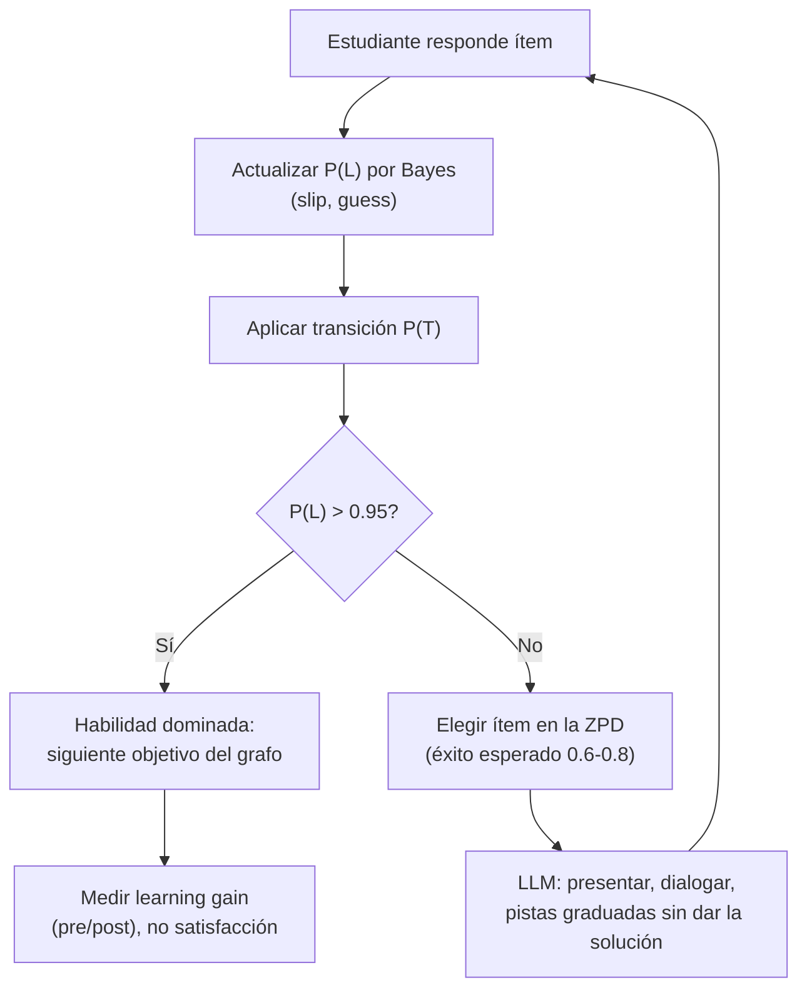

# 180 — IA para educación y aprendizaje adaptativo

> [← Clase anterior](../../../classes/part-14-frontier-research-and-capstones/179-ia-para-ciberseguridad-y-defensa/README.md) · [Índice de la parte](../README.md) · [Clase siguiente →](../../../classes/part-14-frontier-research-and-capstones/181-ia-para-ciencia-clima-y-salud-responsable/README.md)

**Parte:** 14 — Frontera, investigación y proyectos integradores  
**Nivel:** frontera · **Horas estimadas:** 6  
**Laboratorio:** `agent` · **Estado:** `EXECUTABLE_CORE`

## 🎯 Propósito

Comprender **ia para educación y aprendizaje adaptativo** dentro de la evolución de la inteligencia
artificial, implementar un experimento mínimo verificable y distinguir qué parte
constituye evidencia frente a una afirmación todavía no comprobada.

## 📚 Resultados de aprendizaje

Al finalizar podrás:

1. Explicar ia para educación y aprendizaje adaptativo usando los conceptos `education`, `tutoring`, `assessment`, `pedagogy`.
2. Ejecutar el laboratorio con una semilla explícita y revisar su contrato JSON.
3. Identificar al menos un supuesto, una limitación y un riesgo de aplicación.
4. Comparar el enfoque con la etapa anterior de la ruta de aprendizaje.
5. Producir una evidencia reproducible y una conclusión que no exceda los datos.

## 🧩 Conceptos centrales

`education`, `tutoring`, `assessment`, `pedagogy`

## 🗺️ Ubicación en el mapa de la IA

La educación fue uno de los primeros sueños de la IA aplicada (los "sistemas tutores
inteligentes" datan de los años 70) y el hallazgo que la motiva sigue vigente: Bloom
(1984) midió que la tutoría individual mejora el rendimiento ~2 desviaciones estándar
sobre la clase tradicional — el "problema 2 sigma": lograr ese efecto a un costo
escalable. Esta clase hereda de la inferencia bayesiana (parte 3) y de los LLM
conversacionales (partes 6-7), y conecta con la evaluación de sistemas (parte 13):
un tutor que no mide lo que el estudiante sabe no es adaptativo, es un PDF con chat.

## 📖 Fundamentos

### 🎓 Los tres problemas del tutor adaptativo

1. **Modelar al estudiante**: estimar qué sabe (knowledge tracing).
2. **Elegir la siguiente actividad**: ni trivial ni imposible (la zona de desarrollo
   próximo, ZPD, de Vygotsky: lo que el estudiante puede hacer con ayuda pero no
   solo; ahí ocurre el aprendizaje).
3. **Dar retroalimentación**: pistas graduadas en lugar de la solución (la tutoría
   eficaz, VanLehn 2011, funciona por andamiaje, no por explicación magistral).

### 📈 Bayesian Knowledge Tracing (BKT)

El modelo clásico (Corbett y Anderson, 1995) trata cada habilidad como una variable
binaria latente L (dominada / no dominada) y actualiza P(L) con cada respuesta.
Cuatro parámetros por habilidad:

```text
P(L0)  probabilidad inicial de dominio
P(T)   transición: aprender la habilidad tras una oportunidad de práctica
P(S)   slip: fallar aunque se domina        ("resbalón")
P(G)   guess: acertar sin dominar            (adivinar)

Observación correcta:
  P(L | correcto) = P(L)(1−P(S)) / [ P(L)(1−P(S)) + (1−P(L))P(G) ]
Observación incorrecta:
  P(L | error)    = P(L)P(S)     / [ P(L)P(S)     + (1−P(L))(1−P(G)) ]
Después, en ambos casos, oportunidad de aprender:
  P(L') = P(L|obs) + (1 − P(L|obs))·P(T)
```

Es un filtro bayesiano de dos estados (un HMM): actualización por evidencia + deriva
por aprendizaje. Con P(L) > umbral (típico 0.95) se declara "dominio" y se avanza.

**Deep Knowledge Tracing** (Piech et al., 2015) sustituye el modelo por habilidad
por una RNN sobre la secuencia completa de interacciones: captura correlaciones
entre habilidades y prerequisitos implícitos, a cambio de perder la
interpretabilidad de los 4 parámetros (¿por qué el modelo cree que no domino
fracciones?) y de necesitar muchos más datos.

### 🎯 Elegir actividad: ZPD como regla de decisión

Con el modelo de estudiante en la mano, la política clásica es mantener la
probabilidad de éxito de la siguiente tarea en una banda intermedia (≈ 0.6-0.8):
demasiado fácil no enseña, demasiado difícil frustra y no da señal utilizable. Esto
convierte la ZPD en un criterio computable: elegir el ítem cuya dificultad estimada
(vía IRT o histórico) cruce con el P(L) actual dentro de la banda.

### 🤖 LLM como tutores: promesa y trampa

Los LLM aportan lo que los sistemas clásicos no tenían: diálogo abierto, explicación
a demanda y generación de ejercicios. Sus modos de fallo son específicos del
dominio: **complacencia** (dar la solución cuando el estudiante la pide, destruyendo
la práctica), **alucinación pedagógica** (explicaciones seguras e incorrectas, graves
justo porque el estudiante no puede detectarlas) y **ausencia de modelo de
estudiante** (sin memoria estructurada de qué domina cada quien, el "tutor" repite
nivel genérico). Los diseños serios acoplan LLM (interacción) + knowledge tracing
(estado) + política de pistas graduadas (pedagogía), y evalúan con
**learning gain** (pre/post test), no con satisfacción del usuario.

## 🧮 Ejemplo trabajado

Habilidad "resta con llevadas": P(L)=0.40, P(S)=0.10, P(G)=0.20, P(T)=0.15.
El estudiante responde **correctamente** un ejercicio:

```text
Paso 1 — evidencia:
  numerador   = 0.40 × (1−0.10) = 0.36
  denominador = 0.36 + 0.60 × 0.20 = 0.36 + 0.12 = 0.48
  P(L | correcto) = 0.36/0.48 = 0.75

Paso 2 — oportunidad de aprender:
  P(L') = 0.75 + 0.25 × 0.15 = 0.7875
```

Una sola respuesta correcta subió el dominio estimado de 0.40 a 0.79 — mucho, porque
P(G)=0.20 hace poco plausible acertar adivinando. Si en cambio hubiera fallado:
`P(L|error) = 0.40×0.10 / (0.04 + 0.60×0.80) = 0.04/0.52 ≈ 0.077`, y con la
transición `P(L') ≈ 0.077 + 0.923×0.15 ≈ 0.216`. Nótese la asimetría: el error es
evidencia fuerte (fallar dominando es raro, P(S)=0.10). Todavía lejos del umbral
0.95: el tutor daría más práctica, no avanzaría de tema.

## 📊 Propiedades y comparación

| Modelo de estudiante | Parámetros | Interpretable | Datos necesarios | Captura prerequisitos | Límite principal |
|---|---|---|---|---|---|
| BKT | 4 por habilidad | Sí | Pocos | No (habilidades independientes) | Supone habilidad binaria |
| IRT | Dificultad/discriminación por ítem + habilidad continua | Sí | Medios | No | Estático (no modela aprender) |
| DKT (RNN) | Miles-millones | No | Muchos | Sí (implícito) | Caja negra; sobreajusta con poco dato |
| LLM sin estado | — | Narrativa | Cero (pretrained) | Solo en el diálogo | No hay modelo persistente del estudiante |



## ⚠️ Errores conceptuales frecuentes

1. **"Acertó, así que sabe."** Con P(G)=0.25 (opción múltiple de 4), un acierto es
   evidencia débil; BKT existe precisamente para pesar slip y guess en vez de contar
   aciertos.
2. **"Personalizar = dejar que el LLM converse."** Sin estado persistente de dominio
   por habilidad no hay adaptación: la dificultad no cambia con lo aprendido y el
   tutor repite nivel genérico.
3. **"Cuanta más ayuda, mejor tutor."** Dar la solución elimina la práctica
   recuperativa; la tutoría eficaz andamia (pistas mínimas crecientes) y tolera el
   error productivo dentro de la ZPD.
4. **"El learning gain se mide con encuestas de satisfacción."** Los estudiantes
   prefieren tutores complacientes; el efecto de Bloom se midió con pre/post test.
   Satisfacción y aprendizaje pueden anticorrelacionar.
5. **"DKT es mejor porque es deep."** Con pocos datos por habilidad, BKT/IRT rinden
   igual o mejor y son auditables ante estudiantes, docentes y reguladores — en
   educación la explicabilidad es requisito, no lujo.

## 🚀 Del aprendizaje a la operación

Un tutor real exige además: un grafo de prerequisitos curado por docentes (la IA no
lo inventa sola), calibración de P(S)/P(G) por ítem con datos reales, evaluación con
grupos de control y pre/post test antes de afirmar mejora, protección de datos de
menores (los historiales de aprendizaje son datos sensibles bajo GDPR/COPPA), y un
canal docente: el sistema informa y sugiere, pero la decisión pedagógica de alto
impacto (retener, avanzar, derivar) queda en humanos.

## 🧪 Laboratorio

```bash
python lab.py
```

El laboratorio llama a `ai_evolution.labs.run_lab("agent")`. Esta
decisión evita 183 implementaciones divergentes: cada clase tiene un entrypoint
propio, pero los motores didácticos se prueban como una biblioteca común.

### 🔍 Evidencia esperada

- tipo de laboratorio y semilla;
- entradas o decisiones observables;
- resultado estructurado;
- lista `evidence` con hechos que pueden inspeccionarse;
- lista `limitations` que impide presentar la demo como producción.

## 📓 Notebooks

- [📓 `notebook.ipynb`](notebook.ipynb): recorrido guiado con la materia resumida.
- [✍️ `notebook_student.ipynb`](notebook_student.ipynb): ejercicios para resolver.
- [✅ `notebook_solution.ipynb`](notebook_solution.ipynb): solución de referencia explicada.

## 📝 Evaluación

| Criterio | Peso |
|---|---:|
| Comprensión conceptual | 25 % |
| Ejecución reproducible | 25 % |
| Interpretación basada en evidencia | 25 % |
| Riesgos, límites y mejora propuesta | 25 % |

Consulta [assessment.md](assessment.md) para preguntas y criterio de aceptación.

## ⚠️ Errores comunes

| Síntoma | Causa probable | Corrección |
|---|---|---|
| El código corre, pero no hay conclusión | Se confundió ejecución con aprendizaje | Explica qué demuestra y qué no demuestra |
| El resultado cambia sin explicación | No se registró semilla o configuración | Conserva semilla, versión y parámetros |
| Se promete uso real | Se extrapoló desde una demo educativa | Declara entorno, datos, límites y revisión humana |
| Se copia una métrica aislada | No existe baseline ni costo de error | Añade comparación y criterio de decisión |

## ❓ Preguntas frecuentes

**¿Debo usar una API comercial?**  
No. El núcleo funciona localmente. Las extensiones LIVE se documentan por separado.

**¿El laboratorio representa una implementación industrial?**  
No por sí solo. Enseña el contrato y el patrón; producción exige integración,
seguridad, observabilidad, pruebas y operación.

**¿Dónde profundizo?**  
Revisa las especializaciones enlazadas en el README raíz y la ruta siguiente.

## 🔗 Referencias

- Corbett, A. T. y Anderson, J. R. (1995). *Knowledge tracing: Modeling the acquisition of procedural knowledge*. UMUAI 4. [DOI 10.1007/BF01099821](https://doi.org/10.1007/BF01099821) — uso: fuente primaria del mecanismo estudiado
- Bloom, B. S. (1984). *The 2 Sigma Problem: The Search for Methods of Group Instruction as Effective as One-to-One Tutoring*. Educational Researcher 13(6). [DOI 10.3102/0013189X013006004](https://doi.org/10.3102/0013189X013006004) — uso: fuente primaria del mecanismo estudiado
- Piech, C. et al. (2015). *Deep Knowledge Tracing*. NeurIPS 2015. [arXiv:1506.05908](https://arxiv.org/abs/1506.05908) — uso: fuente primaria del mecanismo estudiado
- VanLehn, K. (2011). *The Relative Effectiveness of Human Tutoring, Intelligent Tutoring Systems, and Other Tutoring Systems*. Educational Psychologist 46(4). [DOI 10.1080/00461520.2011.611369](https://doi.org/10.1080/00461520.2011.611369) — uso: fuente primaria del mecanismo estudiado
- Vygotsky, L. S. (1978). *Mind in Society* (zona de desarrollo próximo). Harvard University Press. [Ficha editorial](https://www.hup.harvard.edu/books/9780674576292) — uso: referencia consultada en su fuente original

<!-- papers:inicio -->

---

## 📜 Papers que fundamentan esta clase

> Bloque generado por `python scripts/link_papers_to_classes.py`. La fuente es [`papers/catalog/papers.json`](../../../papers/catalog/papers.json).

| Paper | Año | Qué desbloqueó | Miniatura |
|---|---:|---|---|
| [P141 · El problema de las dos sigmas: buscar instrucción grupal tan eficaz como la tutoría individual](../../../papers/foundational/P141_dos_sigma/README.md) | 1984 | Cuantifica en desviaciones típicas cuánto mejora la tutoría individual sobre la clase convencional, y convierte esa cifra en un problema de ingeniería educativa. | [notebook](../../../notebooks/papers/P141_dos_sigma.ipynb) |

Cada ficha explica el problema anterior, la matemática mínima, los límites y los errores de atribución más frecuentes. Para leerlas con método: [cómo leer un paper de IA](../../../papers/guides/COMO_LEER_UN_PAPER_DE_IA.md) · [anexos matemáticos](../../../papers/annexes/README.md).
<!-- papers:fin -->
---

## ⬅️ Clase anterior

[179 — IA para ciberseguridad y defensa](../../part-14-frontier-research-and-capstones/179-ia-para-ciberseguridad-y-defensa/README.md)

## ➡️ Siguiente clase

[181 — IA para ciencia, clima y salud responsable](../../part-14-frontier-research-and-capstones/181-ia-para-ciencia-clima-y-salud-responsable/README.md)
