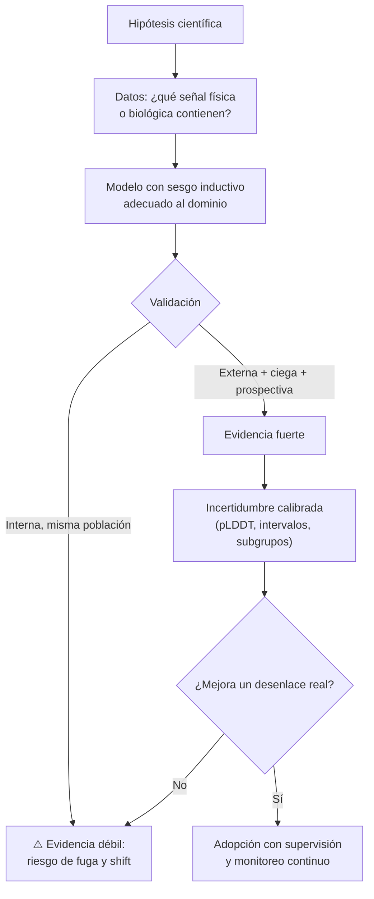

# 181 — IA para ciencia, clima y salud responsable

> [← Clase anterior](../../../classes/part-14-frontier-research-and-capstones/180-ia-para-educacion-y-aprendizaje-adaptativo/README.md) · [Índice de la parte](../README.md) · [Clase siguiente →](../../../classes/part-14-frontier-research-and-capstones/182-como-vigilar-la-frontera-sin-perseguir-modas/README.md)

**Parte:** 14 — Frontera, investigación y proyectos integradores  
**Nivel:** frontera · **Horas estimadas:** 6  
**Laboratorio:** `evaluation` · **Estado:** `EXECUTABLE_CORE`

## 🎯 Propósito

Comprender **ia para ciencia, clima y salud responsable** dentro de la evolución de la inteligencia
artificial, implementar un experimento mínimo verificable y distinguir qué parte
constituye evidencia frente a una afirmación todavía no comprobada.

## 📚 Resultados de aprendizaje

Al finalizar podrás:

1. Explicar ia para ciencia, clima y salud responsable usando los conceptos `science`, `climate`, `health`, `validation`.
2. Ejecutar el laboratorio con una semilla explícita y revisar su contrato JSON.
3. Identificar al menos un supuesto, una limitación y un riesgo de aplicación.
4. Comparar el enfoque con la etapa anterior de la ruta de aprendizaje.
5. Producir una evidencia reproducible y una conclusión que no exceda los datos.

## 🧩 Conceptos centrales

`science`, `climate`, `health`, `validation`

## 🗺️ Ubicación en el mapa de la IA

Aquí la IA deja de ser producto y vuelve a ser instrumento científico. Tres casos
marcan la diferencia entre promesa y resultado: **AlphaFold 2** (2021) resolvió con
precisión experimental un problema abierto de 50 años, la predicción de estructura
de proteínas; **GraphCast** (2023) superó al modelo determinista operativo del ECMWF
en la mayoría de variables meteorológicas a 10 días, en un minuto de cómputo; y la
IA clínica acumula, en cambio, una larga lista de modelos publicados que nunca
sirvieron a un paciente. Esta clase hereda de aprendizaje profundo, GNN y
transformers (partes 4-6) y de la evaluación rigurosa (parte 13): lo que distingue
los tres casos no es la arquitectura sino el **régimen de validación**.

## 📖 Fundamentos

### 🧬 AlphaFold: por qué funcionó

El problema: dada una secuencia de aminoácidos, predecir la estructura 3D de la
proteína. Ingredientes del salto (Jumper et al., 2021, DOI 10.1038/s41586-021-03819-2):

- **Señal evolutiva**: los alineamientos múltiples de secuencias (MSA) contienen
  co-evolución — residuos que mutan juntos suelen estar en contacto espacial. Es
  información física escondida en bases de datos públicas.
- **Sesgo inductivo geométrico**: el módulo Evoformer razona sobre pares de residuos
  y el módulo de estructura predice rotaciones/traslaciones respetando la
  equivarianza (la física no cambia si giras la molécula).
- **Benchmark ciego**: CASP evalúa contra estructuras experimentales aún no
  publicadas. AlphaFold 2 alcanzó GDT_TS mediano ~92 en CASP14 (≈ precisión
  experimental). Ningún resultado autoevaluado habría tenido ese valor probatorio.
- **Incertidumbre calibrada**: pLDDT por residuo indica dónde confiar. Un biólogo
  usa las regiones con pLDDT alto y descarta las bajas.

### 🌍 GraphCast y el clima

Los modelos numéricos (NWP) resuelven ecuaciones diferenciales de la atmósfera en
supercomputadores. GraphCast (Lam et al., 2023, Science) entrena una GNN sobre 40
años de reanálisis ERA5 para predecir el estado siguiente (paso de 6 h) y se itera
autorregresivamente hasta 10 días. Resultado: mejor que HRES del ECMWF en la mayoría
de variables/plazos, con inferencia en ~1 minuto en una TPU frente a horas en
supercomputador. Matices que la divulgación suele omitir:

- Aprende de **ERA5**, que a su vez es producto de la asimilación de datos del modelo
  físico: la IA no reemplaza la observación ni la asimilación, se apoya en ellas.
- Es predicción meteorológica (días), **no proyección climática** (décadas bajo
  escenarios de emisiones): son problemas distintos; extrapolar fuera de la
  distribución de entrenamiento es exactamente lo que un modelo aprendido no
  garantiza.
- Los eventos extremos son la cola escasa del dataset: donde más importa acertar es
  donde menos ejemplos hay.

### 🏥 Salud: por qué se atasca

La revisión sistemática de Wynants et al. (BMJ 2020) sobre modelos COVID-19 evaluó
más de 200 modelos publicados y concluyó que casi todos tenían alto riesgo de sesgo
y ninguno era recomendable para uso clínico. Causas recurrentes:

```text
1. Fuga de datos / atajos:  el modelo aprende el marcador del hospital o el tipo de
   equipo en la radiografía, no la patología (Zech et al. 2018).
2. Sin validación externa:  entrenar y validar en la misma población; el rendimiento
   cae al cambiar de hospital (distribution shift).
3. Métrica equivocada:  AUC alto con prevalencia baja → precisión inútil (misma
   falacia de tasa base de la clase 179).
4. Sin efecto en desenlaces:  clasificar bien ≠ mejorar la salud del paciente; hace
   falta ensayo prospectivo del sistema sociotécnico completo, no del modelo.
5. Sesgo distribucional:  peor rendimiento en subgrupos poco representados;
   la métrica agregada lo oculta.
```

Marcos como TRIPOD+AI (reporte de modelos predictivos) y SPIRIT/CONSORT-AI (ensayos
clínicos con IA) existen porque la comunidad médica ya recorrió este ciclo.

### 🔬 El patrón común

Los tres dominios comparten el criterio que separa ciencia de demo: **evaluación
ciega, prospectiva y externa**, incertidumbre reportada, y un desenlace que le
importe a alguien fuera del paper.

## 🧮 Ejemplo trabajado

Un modelo de cribado detecta una condición con prevalencia 1 % en la población
cribada. Sensibilidad 95 %, especificidad 90 % ("AUC 0.96" en el paper).
Sobre 10,000 personas:

```text
Enfermos: 100      Sanos: 9,900
Verdaderos positivos = 0.95 × 100   =    95
Falsos positivos     = 0.10 × 9,900 =   990
Falsos negativos     =                    5

VPP = 95 / (95 + 990) = 95/1,085 ≈ 8.8 %
VPN = 8,910 / (8,910 + 5) ≈ 99.94 %
```

De cada 100 personas con resultado positivo, ~9 tienen la condición y ~91 pasan por
pruebas confirmatorias, costo y ansiedad. El modelo puede ser útil (el VPN altísimo
sirve para descartar) pero la decisión clínica depende del **costo relativo** de los
dos errores y de si existe una prueba confirmatoria barata — nada de eso está en el
AUC. Si además el 990 se concentra en un subgrupo demográfico, el daño no es
uniforme aunque la métrica agregada no cambie.

## 📊 Propiedades y comparación

| Caso | Señal que explota | Validación decisiva | Estado | Límite honesto |
|---|---|---|---|---|
| AlphaFold 2 | Co-evolución en MSA + geometría | CASP14 (ciego, estructuras no publicadas) | Adoptado; base de datos pública | Estructura estática; complejos, dinámica y efecto de mutaciones siguen abiertos |
| GraphCast | 40 años de ERA5, GNN autorregresiva | Contra HRES/ECMWF en años retenidos | Operativo como complemento | Depende de ERA5; extremos escasos; no es proyección climática |
| Cribado clínico típico | Correlaciones en historia clínica/imagen | Rara vez externa o prospectiva | Mayoría no llega a la clínica | Fuga, shift, VPP bajo, sin efecto en desenlaces |



## ⚠️ Errores conceptuales frecuentes

1. **"AlphaFold resolvió la biología estructural."** Resolvió la predicción de
   estructura estática monomérica con precisión útil; dinámica conformacional,
   complejos y efecto de mutaciones puntuales siguen siendo problemas abiertos.
2. **"Los modelos de IA reemplazan al modelo numérico del clima."** GraphCast se
   entrena sobre ERA5, producto de la asimilación de datos del sistema físico:
   coexisten y se necesitan.
3. **"Predecir el tiempo a 10 días valida proyecciones climáticas a 2100."** Son
   problemas distintos; el segundo exige extrapolar a estados no vistos, justo donde
   un modelo aprendido no ofrece garantías.
4. **"AUC 0.96 significa que sirve en la clínica."** Con prevalencia 1 %, el VPP
   puede ser ~9 % (ejemplo trabajado): la utilidad depende de prevalencia, costos
   asimétricos y prueba confirmatoria.
5. **"Validar en otro conjunto del mismo hospital es validación externa."** No lo
   es: la fuga por marcadores de equipo y protocolo sobrevive a esa partición; hace
   falta otra institución y, mejor, otro periodo temporal.

## 🚀 Del aprendizaje a la operación

Para pasar de este núcleo a un uso real en ciencia, clima o salud faltan: validación
externa multi-sitio y prospectiva, reporte según TRIPOD+AI o CONSORT-AI, evaluación
desagregada por subgrupos con la métrica que importa clínicamente (VPP/VPN, no solo
AUC), monitoreo de *drift* tras el despliegue (los protocolos y equipos cambian), y
gobernanza: en salud y clima el modelo informa a un profesional responsable, que es
quien decide — la trazabilidad de esa decisión es parte del sistema, no un extra.

## 🧪 Laboratorio

```bash
python lab.py
```

El laboratorio llama a `ai_evolution.labs.run_lab("evaluation")`. Esta
decisión evita 183 implementaciones divergentes: cada clase tiene un entrypoint
propio, pero los motores didácticos se prueban como una biblioteca común.

### 🔍 Evidencia esperada

- tipo de laboratorio y semilla;
- entradas o decisiones observables;
- resultado estructurado;
- lista `evidence` con hechos que pueden inspeccionarse;
- lista `limitations` que impide presentar la demo como producción.

## 📓 Notebooks

- [📓 `notebook.ipynb`](notebook.ipynb): recorrido guiado con la materia resumida.
- [✍️ `notebook_student.ipynb`](notebook_student.ipynb): ejercicios para resolver.
- [✅ `notebook_solution.ipynb`](notebook_solution.ipynb): solución de referencia explicada.

## 📝 Evaluación

| Criterio | Peso |
|---|---:|
| Comprensión conceptual | 25 % |
| Ejecución reproducible | 25 % |
| Interpretación basada en evidencia | 25 % |
| Riesgos, límites y mejora propuesta | 25 % |

Consulta [assessment.md](assessment.md) para preguntas y criterio de aceptación.

## ⚠️ Errores comunes

| Síntoma | Causa probable | Corrección |
|---|---|---|
| El código corre, pero no hay conclusión | Se confundió ejecución con aprendizaje | Explica qué demuestra y qué no demuestra |
| El resultado cambia sin explicación | No se registró semilla o configuración | Conserva semilla, versión y parámetros |
| Se promete uso real | Se extrapoló desde una demo educativa | Declara entorno, datos, límites y revisión humana |
| Se copia una métrica aislada | No existe baseline ni costo de error | Añade comparación y criterio de decisión |

## ❓ Preguntas frecuentes

**¿Debo usar una API comercial?**  
No. El núcleo funciona localmente. Las extensiones LIVE se documentan por separado.

**¿El laboratorio representa una implementación industrial?**  
No por sí solo. Enseña el contrato y el patrón; producción exige integración,
seguridad, observabilidad, pruebas y operación.

**¿Dónde profundizo?**  
Revisa las especializaciones enlazadas en el README raíz y la ruta siguiente.

## 🔗 Referencias

- Jumper, J. et al. (2021). *Highly accurate protein structure prediction with AlphaFold*. Nature 596. [DOI 10.1038/s41586-021-03819-2](https://doi.org/10.1038/s41586-021-03819-2) — uso: fuente primaria del mecanismo estudiado
- Lam, R. et al. (2023). *Learning skillful medium-range global weather forecasting* (GraphCast). Science 382(6677). [DOI 10.1126/science.adi2336](https://doi.org/10.1126/science.adi2336) — uso: fuente primaria del mecanismo estudiado
- Wynants, L. et al. (2020). *Prediction models for diagnosis and prognosis of covid-19: systematic review and critical appraisal*. BMJ 369:m1328. [DOI 10.1136/bmj.m1328](https://doi.org/10.1136/bmj.m1328) — uso: fuente primaria del mecanismo estudiado
- Zech, J. R. et al. (2018). *Variable generalization performance of a deep learning model to detect pneumonia in chest radiographs*. PLOS Medicine 15(11). [DOI 10.1371/journal.pmed.1002683](https://doi.org/10.1371/journal.pmed.1002683) — uso: fuente primaria del mecanismo estudiado
- Collins, G. S. et al. (2024). *TRIPOD+AI statement: updated guidance for reporting clinical prediction models*. BMJ 385:e078378. [DOI 10.1136/bmj-2023-078378](https://doi.org/10.1136/bmj-2023-078378) — uso: fuente primaria del mecanismo estudiado

<!-- papers:inicio -->

---

## 📜 Papers que fundamentan esta clase

> Bloque generado por `python scripts/link_papers_to_classes.py`. La fuente es [`papers/catalog/papers.json`](../../../papers/catalog/papers.json).

| Paper | Año | Qué desbloqueó | Miniatura |
|---|---:|---|---|
| [P47 · Predicción de estructura de proteínas de alta precisión con AlphaFold](../../../papers/foundational/P47_alphafold/README.md) | 2021 | Resuelve en la práctica un problema abierto de cincuenta años en biología, y demuestra que la IA puede producir conocimiento científico, no solo productos. | [notebook](../../../notebooks/papers/P47_alphafold.ipynb) |

Cada ficha explica el problema anterior, la matemática mínima, los límites y los errores de atribución más frecuentes. Para leerlas con método: [cómo leer un paper de IA](../../../papers/guides/COMO_LEER_UN_PAPER_DE_IA.md) · [anexos matemáticos](../../../papers/annexes/README.md).
<!-- papers:fin -->
<!-- bibliografia:inicio -->

---

## 📚 Bibliografía de apoyo

> Bloque generado por `python scripts/link_sources_to_classes.py`. Cada obra lleva su localizador verificado en [`sources/bibliography.json`](../../../sources/bibliography.json).

Los papers dicen **de dónde salió** el mecanismo. Estas obras lo **desarrollan** con el espacio que una clase no tiene: teoría completa, demostraciones y ejercicios.

| Obra | Edición | Localizador | Papel en esta clase |
|---|---|---|---|
| Russell, Stuart J. y Norvig, Peter — *Artificial Intelligence: A Modern Approach* | 4.ª · 2020 | [ISBN 9780134610993](https://openlibrary.org/isbn/9780134610993) · [web de la obra](https://aima.cs.berkeley.edu/) | obra de referencia de la parte 14 · capítulo sobre el futuro de la IA |
| Goodfellow, Ian, Bengio, Yoshua y Courville, Aaron — *Deep Learning* | 2016 | [ISBN 9780262035613](https://openlibrary.org/isbn/9780262035613) · [web de la obra](https://www.deeplearningbook.org/) | obra de referencia de la parte 14 · límites de los métodos actuales |
<!-- bibliografia:fin -->

---

## ⬅️ Clase anterior

[180 — IA para educación y aprendizaje adaptativo](../../part-14-frontier-research-and-capstones/180-ia-para-educacion-y-aprendizaje-adaptativo/README.md)

## ➡️ Siguiente clase

[182 — Cómo vigilar la frontera sin perseguir modas](../../part-14-frontier-research-and-capstones/182-como-vigilar-la-frontera-sin-perseguir-modas/README.md)
