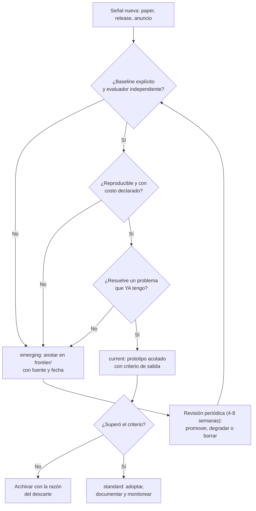

# 182 — Cómo vigilar la frontera sin perseguir modas

> [← Clase anterior](../../../classes/part-14-frontier-research-and-capstones/181-ia-para-ciencia-clima-y-salud-responsable/README.md) · [Índice de la parte](../README.md) · [Clase siguiente →](../../../classes/part-14-frontier-research-and-capstones/183-capstone-final-sistema-de-ia-evolutivo/README.md)

**Parte:** 14 — Frontera, investigación y proyectos integradores  
**Nivel:** frontera · **Horas estimadas:** 6  
**Laboratorio:** `evaluation` · **Estado:** `EXECUTABLE_CORE`

## 🎯 Propósito

Comprender **cómo vigilar la frontera sin perseguir modas** dentro de la evolución de la inteligencia
artificial, implementar un experimento mínimo verificable y distinguir qué parte
constituye evidencia frente a una afirmación todavía no comprobada.

## 📚 Resultados de aprendizaje

Al finalizar podrás:

1. Explicar cómo vigilar la frontera sin perseguir modas usando los conceptos `frontier`, `evidence`, `maturity`, `hype`.
2. Ejecutar el laboratorio con una semilla explícita y revisar su contrato JSON.
3. Identificar al menos un supuesto, una limitación y un riesgo de aplicación.
4. Comparar el enfoque con la etapa anterior de la ruta de aprendizaje.
5. Producir una evidencia reproducible y una conclusión que no exceda los datos.

## 🧩 Conceptos centrales

`frontier`, `evidence`, `maturity`, `hype`

## 🗺️ Ubicación en el mapa de la IA

Esta clase no añade una técnica: añade el método para decidir qué técnicas merecen tu
tiempo. Después de 181 clases, el riesgo profesional ya no es no saber, sino gastar
atención en lo que caducará en seis meses mientras se descuida lo que lleva décadas
siendo cierto (álgebra lineal, probabilidad, búsqueda, evaluación). Es la
contrapartida metodológica de todo el programa y el prerequisito del capstone: un
sistema evolutivo necesita un criterio explícito de qué incorporar y cuándo.

## 📖 Fundamentos

### 🧱 Núcleo estable vs frontera

Divide todo lo que aprendes en dos capas con vidas medias distintas:

```text
NÚCLEO ESTABLE (vida media: décadas)
  probabilidad y estadística · optimización · complejidad · búsqueda
  teoría del aprendizaje · evaluación experimental · ingeniería de software

FRONTERA (vida media: meses-años)
  APIs concretas · nombres de modelos · frameworks de agentes · benchmarks de moda
```

Regla de asignación de tiempo: el núcleo se estudia en profundidad porque se
amortiza; la frontera se **vigila** con un proceso barato y se adopta solo cuando
cruza un umbral. Invertir al revés es la definición operativa de perseguir modas.

### 📏 Criterios de madurez

Un tema puede clasificarse con evidencia observable, no con entusiasmo:

| Nivel | Señales objetivas | Qué hacer |
|---|---|---|
| `emerging` | 1-2 papers o un anuncio; sin implementaciones independientes; sin evaluación externa | Anotar y esperar; leer el abstract, no reescribir tu stack |
| `current` | Implementaciones múltiples, uso reportado fuera de la organización que lo creó, evaluaciones de terceros | Prototipo acotado con criterio de salida |
| `standard` | Especificación pública estable, adopción multi-proveedor, herramientas y documentación maduras | Adoptar si resuelve un problema que tienes |
| `deprecated` | Sustituido, sin mantenimiento, o refutado | Migrar y documentar por qué |

### 🔍 Señal vs ruido: preguntas de filtrado

Ante cualquier anuncio, cinco preguntas ordenadas por poder de descarte:

1. **¿Contra qué se comparó?** Sin baseline explícito y fuerte, no hay resultado.
2. **¿Quién evaluó?** Autoevaluación del proveedor ≠ evaluación independiente ≠
   benchmark ciego (CASP, competiciones con test oculto). Cada escalón vale más.
3. **¿Hay contaminación?** Si el benchmark es público y anterior al corte de
   entrenamiento, la métrica puede estar memorizada.
4. **¿Es reproducible?** Pesos, código, datos y semilla, o al menos una receta que
   un tercero haya seguido con éxito.
5. **¿Qué costo tiene?** Un resultado que exige 1000× el cómputo por 2 % de mejora
   es un resultado sobre escalado, no sobre el método.

Sesgos que atacan estas preguntas: **survivorship bias** (solo se publican los
éxitos), **publicación selectiva de demos** (el video muestra el caso que funcionó),
y el ciclo de expectativas: la novedad se sobreestima a corto plazo y su efecto real
se subestima a largo plazo.

### 🗂️ Vigilancia como proceso (el caso de este repositorio)

El propio repositorio implementa el patrón: el directorio `frontier/` mantiene
`current-topics.yaml`, un registro donde cada tema declara `id`, `name`, `category`,
`maturity`, `reviewed` (fecha) y `source` (enlace verificable) más una `reason` de
por qué está ahí. El diseño tiene tres propiedades importantes:

- **Separación física**: la frontera vive fuera de las 183 clases, así que su
  caducidad no contamina el núcleo. El README de `frontier/` lo dice explícitamente:
  no sustituyen el núcleo estable.
- **Fecha de revisión obligatoria**: un tema sin `reviewed` reciente es una
  afirmación sin respaldo temporal; el campo convierte la obsolescencia en algo
  detectable por script.
- **Fuente obligatoria**: cada entrada apunta a documentación primaria, de modo que
  actualizar un tema es re-leer la fuente, no recordar el rumor.

Un ciclo de vigilancia razonable: revisar el registro cada 4-8 semanas, mover temas
entre niveles con justificación escrita, y borrar los que no sobrevivieron —
mantener un registro honesto de lo que NO cuajó es tan valioso como la lista de lo
adoptado.

## 🧮 Ejemplo trabajado

Llegan cuatro anuncios la misma semana. Aplicamos la rúbrica (2 puntos por criterio
cumplido, 1 parcial, 0 ausente) sobre: baseline, evaluador independiente,
reproducibilidad, costo declarado.

```text
Tema                          base  indep  repro  costo   total  → nivel
A. Protocolo con spec pública
   y 3 implementaciones          2     2      2      2      8/8  → standard (adoptar si aplica)
B. Modelo con +2 % en un
   benchmark público, autoeval   1     0      1      0      2/8  → emerging (anotar)
C. Framework de agentes nuevo,
   usado por 2 empresas ajenas,
   sin evaluación comparativa    0     1      2      1      4/8  → current (prototipo acotado)
D. Resultado con 1000× cómputo
   y +2 %, código cerrado        2     1      0      2      5/8  → current, pero el
                                                                  hallazgo es sobre escalado
```

Decisión: adoptar A si resuelve un problema existente; prototipar C con criterio de
salida escrito ("si en 2 semanas no reduce X, se descarta"); anotar B con fecha y
revisarlo en 8 semanas; archivar D como evidencia de que la mejora depende del
presupuesto, no del método. Ninguna de las cuatro decisiones exige haber leído los
cuatro papers completos: el filtro es barato por diseño.

## 📊 Propiedades y comparación

| Estrategia de vigilancia | Costo de atención | Riesgo de perder algo importante | Riesgo de perseguir modas |
|---|---|---|---|
| Ignorar la frontera | Nulo | Alto (obsolescencia silenciosa) | Nulo |
| Leer todo el feed diario | Muy alto | Bajo | Muy alto |
| Adoptar lo que hace el competidor | Bajo | Medio | Alto (copias su error también) |
| Registro con madurez + revisión periódica | Bajo-medio | Bajo | Bajo |



## ⚠️ Errores conceptuales frecuentes

1. **"Estar al día = leer todo lo que sale."** El feed crece más rápido que
   cualquier atención humana; sin criterio de descarte, leer más produce menos
   decisiones buenas, no más.
2. **"Si un laboratorio grande lo publica, está validado."** El prestigio del emisor
   no sustituye baseline, evaluación independiente ni reproducibilidad; son
   preguntas sobre el resultado, no sobre quién lo firma.
3. **"Un benchmark superado significa capacidad general."** El benchmark define lo
   que se midió; la contaminación y el sobreajuste al test son la norma, no la
   excepción, cuando el conjunto es público.
4. **"Adoptar temprano da ventaja."** Da ventaja *si* el tema sobrevive; el costo
   esperado incluye las migraciones de todo lo que no sobrevivió. Por eso el
   prototipo acotado con criterio de salida domina a la adopción entusiasta.
5. **"La frontera y el núcleo compiten por el mismo tiempo."** Compiten solo si se
   estudian igual: el núcleo se aprende en profundidad, la frontera se registra en
   minutos. Confundir los dos modos es lo que produce la sensación de no llegar a
   nada.

## 🚀 Del aprendizaje a la operación

Llevar esto a un equipo real exige: un dueño del registro (si es de todos, no se
revisa), una cadencia agendada de revisión, un formato con campos obligatorios
—fuente, fecha, madurez, razón— que haga detectable la obsolescencia por script, un
presupuesto explícito de experimentación (p. ej. 10 % del tiempo) con criterios de
salida escritos ANTES de empezar, y la disciplina de registrar también los descartes:
sin memoria de lo que no funcionó, el equipo repetirá el mismo prototipo cada dos
años con otro nombre.

## 🧪 Laboratorio

```bash
python lab.py
```

El laboratorio llama a `ai_evolution.labs.run_lab("evaluation")`. Esta
decisión evita 183 implementaciones divergentes: cada clase tiene un entrypoint
propio, pero los motores didácticos se prueban como una biblioteca común.

### 🔍 Evidencia esperada

- tipo de laboratorio y semilla;
- entradas o decisiones observables;
- resultado estructurado;
- lista `evidence` con hechos que pueden inspeccionarse;
- lista `limitations` que impide presentar la demo como producción.

## 📓 Notebooks

- [📓 `notebook.ipynb`](notebook.ipynb): recorrido guiado con la materia resumida.
- [✍️ `notebook_student.ipynb`](notebook_student.ipynb): ejercicios para resolver.
- [✅ `notebook_solution.ipynb`](notebook_solution.ipynb): solución de referencia explicada.

## 📝 Evaluación

| Criterio | Peso |
|---|---:|
| Comprensión conceptual | 25 % |
| Ejecución reproducible | 25 % |
| Interpretación basada en evidencia | 25 % |
| Riesgos, límites y mejora propuesta | 25 % |

Consulta [assessment.md](assessment.md) para preguntas y criterio de aceptación.

## ⚠️ Errores comunes

| Síntoma | Causa probable | Corrección |
|---|---|---|
| El código corre, pero no hay conclusión | Se confundió ejecución con aprendizaje | Explica qué demuestra y qué no demuestra |
| El resultado cambia sin explicación | No se registró semilla o configuración | Conserva semilla, versión y parámetros |
| Se promete uso real | Se extrapoló desde una demo educativa | Declara entorno, datos, límites y revisión humana |
| Se copia una métrica aislada | No existe baseline ni costo de error | Añade comparación y criterio de decisión |

## ❓ Preguntas frecuentes

**¿Debo usar una API comercial?**  
No. El núcleo funciona localmente. Las extensiones LIVE se documentan por separado.

**¿El laboratorio representa una implementación industrial?**  
No por sí solo. Enseña el contrato y el patrón; producción exige integración,
seguridad, observabilidad, pruebas y operación.

**¿Dónde profundizo?**  
Revisa las especializaciones enlazadas en el README raíz y la ruta siguiente.

## 🔗 Referencias

- Directorio `frontier/` de este repositorio: [`frontier/README.md`](../../../frontier/README.md) y [`frontier/current-topics.yaml`](../../../frontier/current-topics.yaml) — registro con `maturity`, `reviewed` y `source` por tema.
- Stanford HAI (anual). *AI Index Report* — datos longitudinales sobre capacidades, cómputo y adopción. [aiindex.stanford.edu](https://aiindex.stanford.edu/report/)
- Sculley, D. et al. (2015). *Hidden Technical Debt in Machine Learning Systems*. NeurIPS 2015. [PDF NeurIPS](https://papers.nips.cc/paper_files/paper/2015/hash/86df7dcfd896fcaf2674f757a2463eba-Abstract.html)
- Lipton, Z. C. y Steinhardt, J. (2019). *Troubling Trends in Machine Learning Scholarship*. [arXiv:1807.03341](https://arxiv.org/abs/1807.03341)
- Ioannidis, J. P. A. (2005). *Why Most Published Research Findings Are False*. PLOS Medicine 2(8). [DOI 10.1371/journal.pmed.0020124](https://doi.org/10.1371/journal.pmed.0020124)
- Kapoor, S. y Narayanan, A. (2023). *Leakage and the reproducibility crisis in machine-learning-based science*. Patterns 4(9). [DOI 10.1016/j.patter.2023.100804](https://doi.org/10.1016/j.patter.2023.100804)

---

## ⬅️ Clase anterior

[181 — IA para ciencia, clima y salud responsable](../../part-14-frontier-research-and-capstones/181-ia-para-ciencia-clima-y-salud-responsable/README.md)

## ➡️ Siguiente clase

[183 — Capstone final: sistema de IA evolutivo](../../part-14-frontier-research-and-capstones/183-capstone-final-sistema-de-ia-evolutivo/README.md)
