# 🔭 Parte 14 — Frontera, investigación y proyectos integradores

**Nivel:** frontera · **Duración sugerida:** 8–12 semanas ·
**Clases:** 12

Integra todo el programa y mantiene una zona explícita para temas emergentes, distinguiendo evidencia consolidada de prototipos y expectativas.

## 🧭 Secuencia de la parte

```mermaid
flowchart LR
    L169["169<br/>IA neuro-simbólica"]
    L170["170<br/>Causal AI y<br/>descubrimiento científico"]
    L171["171<br/>World models y<br/>simulación interna"]
    L172["172<br/>Razonamiento y cómputo<br/>en tiempo de<br/>inferencia"]
    L173["173<br/>Aprendizaje continuo y<br/>adaptación"]
    L174["174<br/>Privacidad diferencial y<br/>aprendizaje federado"]
    L175["175<br/>IA para programación<br/>y modernización"]
    L176["176<br/>IA para ciberseguridad<br/>y defensa"]
    L177["177<br/>IA para educación<br/>y aprendizaje adaptativo"]
    L178["178<br/>IA para ciencia,<br/>clima y salud<br/>responsable"]
    L179["179<br/>Cómo vigilar la<br/>frontera sin perseguir<br/>modas"]
    L180["180<br/>Capstone final: sistema<br/>de IA evolutivo"]
    L169 --> L170
    L170 --> L171
    L171 --> L172
    L172 --> L173
    L173 --> L174
    L174 --> L175
    L175 --> L176
    L176 --> L177
    L177 --> L178
    L178 --> L179
    L179 --> L180
```

## 📚 Clases

| ID | Tema | Laboratorio | Horas |
|---:|---|---|---:|
| 169 | [IA neuro-simbólica](169-ia-neuro-simbolica/README.md) | `frontier` | 6 |
| 170 | [Causal AI y descubrimiento científico](170-causal-ai-y-descubrimiento-cientifico/README.md) | `probability` | 6 |
| 171 | [World models y simulación interna](171-world-models-y-simulacion-interna/README.md) | `frontier` | 6 |
| 172 | [Razonamiento y cómputo en tiempo de inferencia](172-razonamiento-y-computo-en-tiempo-de-inferencia/README.md) | `frontier` | 6 |
| 173 | [Aprendizaje continuo y adaptación](173-aprendizaje-continuo-y-adaptacion/README.md) | `frontier` | 6 |
| 174 | [Privacidad diferencial y aprendizaje federado](174-privacidad-diferencial-y-aprendizaje-federado/README.md) | `safety` | 6 |
| 175 | [IA para programación y modernización](175-ia-para-programacion-y-modernizacion/README.md) | `agent` | 6 |
| 176 | [IA para ciberseguridad y defensa](176-ia-para-ciberseguridad-y-defensa/README.md) | `safety` | 6 |
| 177 | [IA para educación y aprendizaje adaptativo](177-ia-para-educacion-y-aprendizaje-adaptativo/README.md) | `agent` | 6 |
| 178 | [IA para ciencia, clima y salud responsable](178-ia-para-ciencia-clima-y-salud-responsable/README.md) | `evaluation` | 6 |
| 179 | [Cómo vigilar la frontera sin perseguir modas](179-como-vigilar-la-frontera-sin-perseguir-modas/README.md) | `evaluation` | 6 |
| 180 | [Capstone final: sistema de IA evolutivo](180-capstone-final-sistema-de-ia-evolutivo/README.md) | `capstone` | 10 |

## 📝 Evaluación de la parte

- 40 % laboratorios y notebooks.
- 25 % explicaciones y comparación de enfoques.
- 20 % evaluación de riesgos y limitaciones.
- 15 % mini-proyecto o integración.

[⬅️ Parte 13 — Evaluación, seguridad y gobernanza](../part-13-evaluation-safety-security-and-governance/README.md) · [🏠 Volver al programa](../../README.md)
