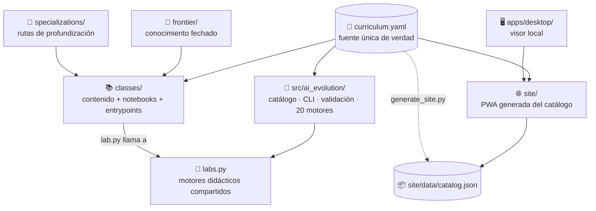

# 🏗️ Arquitectura

## 🗺️ Vista general



## 🧱 Capas

```text
curriculum.yaml
      │
      ├── classes/                  contenido humano + notebooks + entrypoints
      ├── src/ai_evolution/        catálogo, CLI, validación y motores
      ├── site/                    PWA generada desde el catálogo
      ├── apps/desktop/            visor local
      ├── frontier/                conocimiento cambiante y fechado
      └── specializations/         enlaces versionables a programas profundos
```

## ⚖️ Decisiones

1. `curriculum.yaml` es la fuente única de conteos y rutas.
2. Cada clase es autocontenida, pero no duplica algoritmos centrales.
3. Los 20 motores didácticos viven en `src/ai_evolution/labs.py`.
4. Cada `lab.py` es un entrypoint específico y reproducible.
5. Los notebooks reutilizan el mismo código que CLI y tests.
6. El sitio consume `site/data/catalog.json`, derivado del currículo.
7. La frontera se revisa por fecha y no modifica hechos históricos.

## 🗺️ Frontera entre repositorios

- Este programa enseña el mapa completo.
- Python Data Science profundiza datos, estadística y ML.
- Neural Network Training Labs profundiza entrenamiento de redes.
- LangGraph Realworld demuestra casos de orquestación.
- Claude Skills Toolkit contiene skills operativos, no clases.
