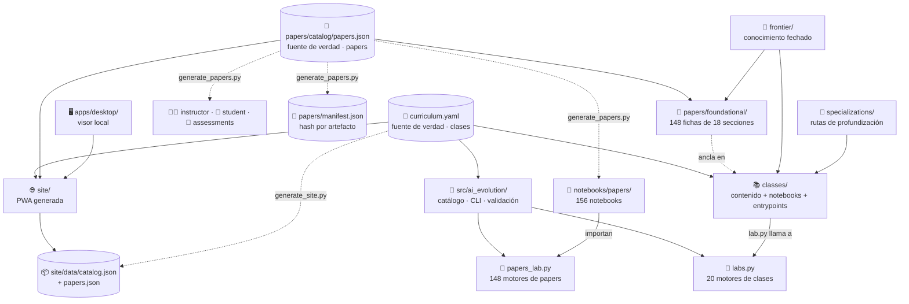

# 🏗️ Arquitectura

## 🗺️ Vista general

El repositorio tiene **dos fuentes de verdad**, una por eje: `curriculum.yaml`
para las clases y `papers/catalog/papers.json` para los papers fundacionales.
Todo lo demás se deriva de ellas.



## 🧱 Capas

```text
curriculum.yaml                    fuente de verdad del eje de clases
      │
      ├── classes/                 contenido humano + notebooks + entrypoints
      ├── src/ai_evolution/        catálogo, CLI, validación y motores
      │      ├── labs.py           20 motores de clases
      │      ├── papers.py         contrato y validación del eje de papers
      │      └── papers_lab.py     148 motores de papers
      ├── site/                    PWA generada
      ├── apps/desktop/            visor local
      ├── frontier/                conocimiento cambiante y fechado
      └── specializations/         enlaces versionables a programas profundos

papers/catalog/papers.json         fuente de verdad del eje de papers
      │
      ├── papers/foundational/     148 fichas escritas a mano (18 secciones)
      ├── papers/guides/           5 guías de lectura crítica
      ├── notebooks/papers/        156 notebooks   ← generados
      ├── instructor/papers/       plan de sesión  ← generados
      ├── student/papers/          ficha de estudio ← generados
      ├── assessments/papers/      evaluaciones    ← generados
      └── papers/manifest.json     hash por artefacto ← generado
```

## ⚖️ Decisiones

1. `curriculum.yaml` es la fuente única de conteos y rutas del eje de clases;
   `papers/catalog/papers.json` lo es del eje de papers.
2. Cada clase es autocontenida, pero no duplica algoritmos centrales.
3. Los 20 motores de clases viven en `src/ai_evolution/labs.py` y los 148 motores
   de papers en `src/ai_evolution/papers_lab.py`. Ambos son deterministas, de
   Python estándar y devuelven el mismo contrato: `result`, `evidence` y
   `limitations`.
4. Cada `lab.py` es un entrypoint específico y reproducible.
5. Los notebooks reutilizan el mismo código que CLI y tests.
6. El sitio consume `site/data/catalog.json` y `site/data/papers.json`, ambos
   derivados de sus respectivas fuentes de verdad.
7. La frontera se revisa por fecha y no modifica hechos históricos. Un paper solo
   asciende de `frontier/` a `papers/foundational/` cuando cumple los criterios
   de `prompts/VIGILANCIA_DE_FRONTERA.md`.
8. **Lo generado no se edita a mano.** `scripts/generate_papers.py --check` falla
   en CI si un artefacto derivado se tocó fuera del generador.
9. Los hashes del manifiesto se calculan sobre el contenido con saltos de línea
   normalizados a LF (`sha256_lf`), para que el contrato no dependa del sistema
   operativo donde se generó.
10. **La red no entra en CI.** El registro de fuentes tiene dos capas: la
    comprobación offline y determinista (`verify-sources`, que bloquea) y la
    resolución en red (`refresh-sources`, manual). Si la red entrara en CI, el CI
    se volvería inestable y se acabaría ignorando.
11. **Lo que no resuelve se marca, no se borra.** Una fuente sin localizador
    verificable queda `pendiente` con su motivo en
    [`sources/bibliography.json`](../sources/bibliography.json).

## 🔁 Generadores

| Script | Qué produce | Verificación |
|---|---|---|
| `scripts/generate_papers.py` | índice, 156 notebooks, aula y manifiesto del eje | `--check` en CI |
| `scripts/generate_site.py` | PWA: 198 páginas de clase + 66 de papers + los dos JSON | `pages.yml` |
| `scripts/generate_pdfs.py` | 165 PDFs: 17 del programa + 148 por paper (`--papers` / `--clases` / `--por-paper` para acotar) | tamaño mínimo del PDF |
| `scripts/generate_assets.py` | recursos derivados | — |
| `scripts/validate_repository.py` | contrato completo de ambos ejes | `--strict` en CI |
| `scripts/build_sources.py` | registro general de fuentes desde lo que citan las clases | `--check` en CI |
| `scripts/annotate_class_sources.py` | uso declarado de cada fuente en su clase | `--check` en CI |
| `scripts/verify-sources` | esquema, localizadores, cobertura y cifras del README del registro | offline, **bloquea CI** |
| `scripts/refresh-sources` | resolución en red del registro (ISBN, DOI, URL) | manual, **nunca en CI** |

## 🗺️ Frontera entre repositorios

- Este programa enseña el mapa completo.
- Python Data Science profundiza datos, estadística y ML.
- Neural Network Training Labs profundiza entrenamiento de redes.
- LangGraph Realworld demuestra casos de orquestación.
- Claude Skills Toolkit contiene skills operativos, no clases.
