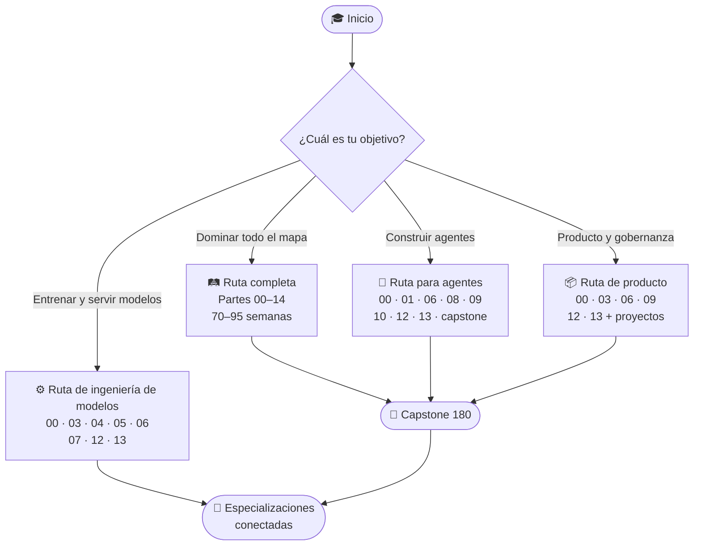

# 🧭 Ruta de aprendizaje

## 🛤️ Ruta completa

Sigue las partes 00 a 14. Dedica entre 70 y 95 semanas a ritmo de dos clases
por semana, incluyendo proyectos.

## 🤖 Ruta para agentes

1. Parte 00: clases 001, 004, 008 y 011.
2. Parte 01: búsqueda, reglas y planificación.
3. Parte 06: prompting, resultados estructurados y tool calling.
4. Parte 08: RAG, memoria y evaluación de atribución.
5. Parte 09 completa.
6. Parte 10 completa.
7. Parte 12: observabilidad, AgentOps, costos y resiliencia.
8. Parte 13: seguridad, evals y gobernanza.
9. Capstone 180.

## ⚙️ Ruta para ingeniería de modelos

Partes 00, 03, 04, 05, 06, 07, 12 y 13; después profundiza en los dos
repositorios especializados.

## 📦 Ruta para producto y gobernanza

Partes 00, 03, 06, 09, 12, 13 y los proyectos de cada parte.
