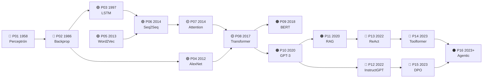

<div align="center">

# 📜 Eje de papers fundacionales

## **16 hitos · 24 notebooks ejecutables · de Rosenblatt (1958) a los sistemas agentic**

**La historia de la IA contada por los papers que la movieron —
no como una colección de PDFs, sino como una cadena de problemas resueltos
que cada estudiante puede ejecutar, romper e interpretar.**

[📇 Índice de papers](catalog/PAPERS_INDEX.md) ·
[🗺️ Ruta y niveles](ROADMAP.md) ·
[🌐 Fuentes y venues](guides/FUENTES_Y_VENUES.md) ·
[📖 Cómo leer un paper](guides/COMO_LEER_UN_PAPER_DE_IA.md) ·
[🔁 5 pasadas](guides/METODO_DE_LECTURA_EN_5_PASADAS.md) ·
[📚 Glosario](guides/GLOSARIO_PAPERS_IA.md)

| 📄 Papers | 📓 Notebooks | 🧪 Motores | 🎓 Niveles | 🔗 Clases enlazadas |
|:---:|:---:|:---:|:---:|:---:|
| **16** | **24** | **16** | **L0–L5** | **22** |

</div>

---

## 💡 La idea

Un paper leído es una anécdota. Un paper **ejecutado, roto e interpretado** es conocimiento.

Este eje convierte cada hito en una experiencia con la misma secuencia siempre:

```text
problema histórico → propuesta → intuición → matemática mínima →
implementación → experimento → interpretación → limitaciones → siguiente hito
```

La última flecha es la importante. **Cada paper existe porque el anterior dejó algo sin
resolver.** El perceptrón no separa XOR → backpropagation entrena capas ocultas → el
gradiente se desvanece en secuencias largas → la LSTM lo controla → un vector fijo no
sostiene frases largas → la atención lo elimina → si la atención basta, sobra la recurrencia
→ Transformer. Estudiado así, no hay nada que memorizar: hay una cadena que se sigue.

> [!IMPORTANT]
> Este eje **no redistribuye papers**. Enlaza a la fuente primaria de cada uno, con autoría,
> año, venue, URL y fecha de consulta. Los notebooks implementan **miniaturas** del mecanismo
> en Python estándar: no reproducen los experimentos originales y lo declaran en cada salida.

## 🧭 La ruta mínima



| # | Paper | Año | Nivel | Lo que desbloqueó |
|---|---|---:|:---:|---|
| [P01](foundational/P01_perceptron/README.md) | Perceptrón | 1958 | L1 | Una máquina ajusta sus pesos con ejemplos |
| [P02](foundational/P02_backpropagation/README.md) | Backpropagation | 1986 | L2 | Se pueden entrenar capas ocultas |
| [P03](foundational/P03_lstm/README.md) | LSTM | 1997 | L2 | Memoria a través de cientos de pasos |
| [P04](foundational/P04_alexnet/README.md) | AlexNet | 2012 | L3 | El deep learning se vuelve corriente principal |
| [P05](foundational/P05_word2vec/README.md) | Word2Vec | 2013 | L2 | Las palabras tienen geometría |
| [P06](foundational/P06_seq2seq/README.md) | Seq2Seq | 2014 | L3 | Secuencia variable → secuencia variable |
| [P07](foundational/P07_attention_bahdanau/README.md) | Attention (Bahdanau) | 2014 | L3 | Muere el cuello de botella del vector fijo |
| [P08](foundational/P08_transformer/README.md) | **Transformer** | 2017 | L4 | Se elimina la recurrencia; todo paraleliza |
| [P09](foundational/P09_bert/README.md) | BERT | 2018 | L3 | Preentrenar y ajustar como norma |
| [P10](foundational/P10_gpt3/README.md) | GPT-3 | 2020 | L3 | Aprendizaje en contexto sin tocar pesos |
| [P11](foundational/P11_rag/README.md) | RAG | 2020 | L3 | Conocimiento actualizable y citable |
| [P12](foundational/P12_instructgpt_rlhf/README.md) | InstructGPT / RLHF | 2022 | L3 | De completar texto a seguir instrucciones |
| [P13](foundational/P13_react/README.md) | ReAct | 2022 | L2 | El modelo controla un bucle que observa y actúa |
| [P14](foundational/P14_toolformer/README.md) | Toolformer | 2023 | L3 | El uso de herramientas se autosupervisa |
| [P15](foundational/P15_dpo/README.md) | DPO | 2023 | L4 | Alineación sin modelo de recompensa ni RL |
| [P16](foundational/P16_agentic_systems/README.md) | Sistemas agentic | 2023+ | L5 | El agente pasa de bucle a sistema |

## 🔬 Tratamiento especial: *Attention Is All You Need*

El paper que sostiene casi todo lo que vino después se desmonta pieza por pieza en ocho
miniaturas independientes, además de su ficha completa:

| Miniatura | Qué aísla |
|---|---|
| [T01](../notebooks/papers/T01_recurrencia_vs_paralelismo.ipynb) | Por qué había que quitar la recurrencia |
| [T02](../notebooks/papers/T02_qkv_scaled_dot_product.ipynb) | Q, K, V y el producto escalar escalado |
| [T03](../notebooks/papers/T03_softmax_y_temperatura.ipynb) | Softmax, escala √d_k y saturación |
| [T04](../notebooks/papers/T04_self_attention_y_mascara_causal.ipynb) | Self-attention y máscara causal |
| [T05](../notebooks/papers/T05_multi_head_attention.ipynb) | Multi-head attention |
| [T06](../notebooks/papers/T06_positional_encoding.ipynb) | Codificación posicional |
| [T07](../notebooks/papers/T07_residual_layernorm_ffn.ipynb) | Residual, layer norm y feed-forward |
| [T08](../notebooks/papers/T08_encoder_decoder_y_limites.ipynb) | Encoder–decoder, complejidad y qué **no** dice el título |

## 🚀 Cómo se usa

```bash
pip install -e .

ai-evolution papers                 # catálogo del eje
ai-evolution paper P08              # ficha resumida de un paper
ai-evolution paper-lab P08 --seed 7 # ejecuta la miniatura
python scripts/generate_papers.py   # regenera índice, notebooks y manifiesto
```

Con los notebooks:

```bash
jupyter lab notebooks/papers/
```

Sin código: el eje también se lee en el
[sitio del programa](https://vladimiracunadev-create.github.io/artificial-intelligence-evolution-program/papers/)
o en el [PDF imprimible de 155 páginas](../docs/pdf/papers-fundacionales.pdf)
(`python scripts/generate_pdfs.py --papers`).

Empieza por [`P01_perceptron.ipynb`](../notebooks/papers/P01_perceptron.ipynb) y sigue el
orden de la ruta. **Antes de ejecutar cada celda, escribe tu predicción** en la sección 7 —
ese paso no es decorativo: es lo que se evalúa.

## 📦 Estructura del eje

```text
papers/
├── README.md                    ← este archivo
├── ROADMAP.md                   ← niveles L0–L5 y plan de estudio
├── manifest.json                ← inventario con SHA-256 (generado)
├── guides/                      ← cómo leer, 5 pasadas, plantilla, glosario, fuentes
├── catalog/
│   ├── papers.json              ← fuente de verdad estructurada
│   ├── sources.yaml             ← venues y repositorios primarios
│   └── PAPERS_INDEX.md          ← índice legible (generado)
└── foundational/PXX_slug/       ← una ficha de 18 secciones por paper

notebooks/papers/                ← 16 + 8 notebooks (generados)
instructor/papers/               ← plan de sesión por paper (generado)
student/papers/                  ← ficha de estudio y bitácora (generado)
assessments/papers/              ← evaluación con rúbrica por paper (generado)
prompts/                         ← prompts reutilizables del eje
```

## 🔗 Cómo se conecta con el resto del programa

El eje **no sustituye** a las 183 clases: las ancla en su origen documental.

| Este eje | Clases del programa |
|---|---|
| P01, P02 | [049 Perceptrón](../classes/part-04-neural-networks-and-deep-learning/049-perceptron-y-limites-de-separabilidad/README.md) · [050 MLP y backpropagation](../classes/part-04-neural-networks-and-deep-learning/050-mlp-y-backpropagation/README.md) |
| P03, P06 | [054 RNN, LSTM y secuencias](../classes/part-04-neural-networks-and-deep-learning/054-rnn-lstm-y-secuencias/README.md) |
| P04 | [053 CNN y aprendizaje espacial](../classes/part-04-neural-networks-and-deep-learning/053-cnn-y-aprendizaje-espacial/README.md) |
| P05 | [066 Embeddings semánticos](../classes/part-05-language-vision-audio-and-multimodal-ai/066-embeddings-semanticos-y-similitud/README.md) |
| P07, P08 | [055 Atención y arquitectura Transformer](../classes/part-04-neural-networks-and-deep-learning/055-atencion-y-arquitectura-transformer/README.md) |
| P09, P10 | [074 Objetivos de preentrenamiento](../classes/part-06-foundation-models-and-llm-engineering/074-objetivos-de-preentrenamiento/README.md) |
| P11 | [105 RAG básico con citas](../classes/part-08-retrieval-context-memory-and-knowledge/105-rag-basico-con-citas/README.md) |
| P12, P15 | [078 RLHF, RLAIF y DPO](../classes/part-06-foundation-models-and-llm-engineering/078-rlhf-rlaif-y-dpo/README.md) |
| P13, P14 | [114 Ciclo ReAct](../classes/part-09-ai-agent-engineering/114-ciclo-react-y-observacion-del-entorno/README.md) · [080 Tool calling](../classes/part-06-foundation-models-and-llm-engineering/080-tool-calling-y-ejecucion-controlada/README.md) |
| P16 | [124 Workflow, subagente y multiagente](../classes/part-10-multi-agent-systems-and-interoperability/124-workflow-subagente-y-sistema-multiagente/README.md) · [132 MCP](../classes/part-10-multi-agent-systems-and-interoperability/132-mcp-tools-resources-y-prompts/README.md) |

Y con la clase que enseña precisamente esta competencia:
[010 · Cómo leer papers, benchmarks y claims de IA](../classes/part-00-foundations-history-and-scientific-method/010-como-leer-papers-benchmarks-y-claims-de-ia/README.md).

## ⚖️ Reglas del eje (verificadas automáticamente)

1. **Contexto antes que tecnicismo.** Nadie ve una ecuación antes de saber qué problema resuelve.
2. **Progresión antes que saturación.** Un hito por vez, en orden.
3. **Interpretación antes que ejecución mecánica.** Predecir, ejecutar, explicar.
4. **Implementación pequeña y explicable** antes que frameworks.
5. **Nunca atribuir al paper ideas posteriores.** Sección 11 de cada ficha.
6. **Nunca inventar** autores, fechas, datasets, métricas ni citas.
7. **Siempre distinguir** hecho documentado, simplificación didáctica, inferencia y práctica moderna.
8. **Siempre registrar** URL, autoría, año, venue y fecha de consulta.
9. **Sin APIs pagadas** como requisito de aprendizaje.
10. **Sin redistribuir** material con restricciones de copyright.

## ✅ Verificación

```bash
python scripts/generate_papers.py --check
python -m unittest tests.test_papers -v
python scripts/validate_repository.py --strict
```

Se comprueba: JSON y YAML válidos, las 18 secciones de cada ficha en orden, los 17 momentos
de cada notebook, `nbformat` correcto, que cada motor exista y sea determinista, que las
clases enlazadas existan, ausencia de rutas absolutas y coherencia de los SHA-256 del
manifiesto.

---

<div align="center">

[⬅️ Programa completo](../README.md) ·
[🗺️ Ruta del eje](ROADMAP.md) ·
[📇 Índice](catalog/PAPERS_INDEX.md) ·
[👩‍🏫 Guías docentes](../instructor/papers/README.md) ·
[🎒 Fichas de estudio](../student/papers/README.md) ·
[📝 Evaluaciones](../assessments/papers/README.md) ·
[🧰 Prompts](../prompts/README.md)

</div>
