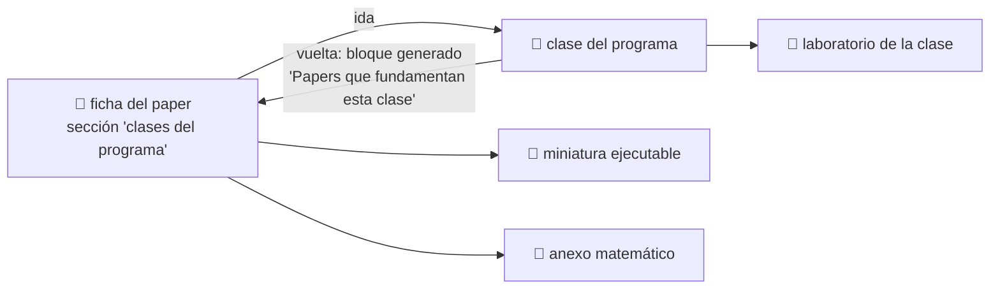

<div align="center">

# 📜 Eje de papers fundacionales

## **148 hitos · 156 notebooks ejecutables · 5 anexos matemáticos · de Pearson (1901) a 2025**

**La historia de la IA contada por los papers que la movieron —
no como una colección de PDFs, sino como una cadena de problemas resueltos
que cada estudiante puede ejecutar, romper e interpretar.**

[📇 Índice de papers](catalog/PAPERS_INDEX.md) ·
[🔁 Matriz clase ↔ paper](catalog/MATRIZ_CLASES_PAPERS.md) ·
[🗺️ Ruta y niveles](ROADMAP.md) ·
[🧮 Anexos matemáticos](annexes/README.md) ·
[🌐 Fuentes y venues](guides/FUENTES_Y_VENUES.md) ·
[📖 Cómo leer un paper](guides/COMO_LEER_UN_PAPER_DE_IA.md) ·
[🔁 5 pasadas](guides/METODO_DE_LECTURA_EN_5_PASADAS.md) ·
[📚 Glosario](guides/GLOSARIO_PAPERS_IA.md)

<!-- stats:inicio -->
| 📄 Papers | 📓 Notebooks | 🧪 Motores | 🧮 Anexos | 🎓 Niveles | 🔗 Clases enlazadas |
|:---:|:---:|:---:|:---:|:---:|:---:|
| **148** | **156** | **148** | **5** | **L0–L5** | **171** |
<!-- stats:fin -->

</div>

---

## 💡 La idea

Un paper leído es una anécdota. Un paper **ejecutado, roto e interpretado** es conocimiento.

Este eje convierte cada hito en una experiencia con la misma secuencia siempre:

```text
problema histórico → propuesta → intuición → matemática mínima →
implementación → experimento → interpretación → limitaciones → siguiente hito
```

La última flecha es la importante. **Cada paper existe porque el anterior dejó algo sin
resolver.** El perceptrón no separa XOR → backpropagation entrena capas ocultas → el gradiente
se desvanece en secuencias largas → la LSTM lo controla → un vector fijo no sostiene frases
largas → la atención lo elimina → si la atención basta, sobra la recurrencia → Transformer →
…y la atención cuesta O(n²), que es de donde arranca Mamba doce años después.

> [!IMPORTANT]
> Este eje **no redistribuye papers**. Enlaza a la fuente primaria de cada uno, con autoría,
> año, venue, URL y fecha de consulta. Los notebooks implementan **miniaturas** del mecanismo
> en Python estándar: no reproducen los experimentos originales y lo declaran en cada salida.

<!-- rutas:inicio -->
## 🧭 17 rutas · 148 papers

El eje tiene 17 bloques con propósitos distintos. **No se estudian igual.**
Dentro de cada uno, los papers van **en orden cronológico**; entre bloques no hay orden,
porque responden a preguntas diferentes.

```mermaid
flowchart TD
    R1["🔗 cadena<br/>P01–P16 · 16 papers<br/>1958–2023"]
    R2["📚 ampliada<br/>P17–P22 · 6 papers<br/>2020–2025"]
    R3["🔤 representación<br/>P23–P25 · 3 papers<br/>2014–2019"]
    R4["🤖 agentes<br/>P26–P33 · 8 papers<br/>2015–2023"]
    R5["🧠 memoria<br/>P34–P37 · 4 papers<br/>2021–2023"]
    R6["🏗️ arquitectura<br/>P38–P49 · 12 papers<br/>2013–2023"]
    R7["🛡️ evaluación<br/>P50–P52 · 3 papers<br/>2022–2023"]
    R8["🧭 fundamentos<br/>P53–P63 · 11 papers<br/>1901–2021"]
    R9["♟️ simbólica<br/>P64–P72 · 9 papers<br/>1959–2020"]
    R10["📈 clásica<br/>P73–P86 · 14 papers<br/>1982–2018"]
    R11["ruta_probabilistica<br/>P87–P95 · 9 papers<br/>1763–2019"]
    R12["ruta_encarnada<br/>P96–P106 · 11 papers<br/>1960–2024"]
    R13["ruta_operacion<br/>P107–P117 · 11 papers<br/>2010–2023"]
    R14["ruta_percepcion<br/>P118–P126 · 9 papers<br/>2016–2022"]
    R15["ruta_medios<br/>P127–P133 · 7 papers<br/>2020–2024"]
    R16["ruta_agentes_operativos<br/>P134–P140 · 7 papers<br/>1975–2004"]
    R17["ruta_gobernanza<br/>P141–P148 · 8 papers<br/>1984–2020"]
    R1 -.->|"se estudia primero,<br/>en orden"| R2
```



### 🔗 Ruta mínima — la cadena canónica

P01–P16: la cadena canónica donde cada paper resuelve lo que el anterior dejó abierto. Se estudia en orden.

| # | Paper | Año | Nivel | Lo que aportó |
|---|---|---:|:---:|---|
| [P01](foundational/P01_perceptron/README.md) | El perceptrón | 1958 | L1 | Primera máquina que aprende sus propios pesos a partir de ejemplos en lugar de ejecutar reglas escritas por una persona. |
| [P02](foundational/P02_backpropagation/README.md) | Backpropagation | 1986 | L2 | Un procedimiento práctico para entrenar capas ocultas: la red descubre representaciones intermedias que nadie diseñó. |
| [P03](foundational/P03_lstm/README.md) | LSTM | 1997 | L2 | Primera arquitectura recurrente capaz de mantener información a través de cientos de pasos sin que el gradiente se desvanezca. |
| [P04](foundational/P04_alexnet/README.md) | AlexNet | 2012 | L3 | El resultado que convirtió el deep learning en la corriente principal: margen amplio sobre los métodos de visión hechos a mano. |
| [P05](foundational/P05_word2vec/README.md) | Word2Vec | 2013 | L2 | El significado distribucional se vuelve barato: vectores densos entrenables sobre miles de millones de palabras. |
| [P06](foundational/P06_seq2seq/README.md) | Seq2Seq | 2014 | L3 | Una única red aprende a mapear secuencias de longitud variable a secuencias de longitud variable, de extremo a extremo. |
| [P07](foundational/P07_attention_bahdanau/README.md) | Atención (Bahdanau) | 2014 | L3 | Nace la atención: el decodificador deja de depender de un único vector y consulta toda la entrada en cada paso. |
| [P08](foundational/P08_transformer/README.md) | Transformer · *Attention Is All You Need* | 2017 | L4 | Elimina la recurrencia y la convolución del modelado de secuencias: todo el cómputo de una capa se paraleliza. |
| [P09](foundational/P09_bert/README.md) | BERT | 2018 | L3 | Consolida el patrón preentrenar-y-ajustar: un mismo modelo base sirve para muchas tareas con un ajuste pequeño. |
| [P10](foundational/P10_gpt3/README.md) | GPT-3 y el aprendizaje en contexto | 2020 | L3 | El aprendizaje en contexto: la tarea se especifica en el prompt y el modelo se adapta sin actualizar ningún peso. |
| [P11](foundational/P11_rag/README.md) | RAG | 2020 | L3 | Separa el conocimiento (índice consultable y actualizable) del razonamiento (parámetros del modelo). |
| [P12](foundational/P12_instructgpt_rlhf/README.md) | InstructGPT y RLHF | 2022 | L3 | El salto de «modelo que completa texto» a «asistente que sigue instrucciones»: alineación con preferencias humanas. |
| [P13](foundational/P13_react/README.md) | ReAct | 2022 | L2 | El modelo deja de ser solo un generador de texto y pasa a ser el controlador de un bucle que observa y actúa. |
| [P14](foundational/P14_toolformer/README.md) | Toolformer | 2023 | L3 | El uso de herramientas se aprende de forma autosupervisada: el criterio de utilidad es la propia pérdida del modelo. |
| [P15](foundational/P15_dpo/README.md) | DPO | 2023 | L4 | Alinear un modelo con preferencias humanas sin modelo de recompensa explícito ni bucle de aprendizaje por refuerzo. |
| [P16](foundational/P16_agentic_systems/README.md) | Sistemas agentic contemporáneos | 2023 | L5 | El agente deja de ser un bucle y pasa a ser un sistema: memoria, reflexión, planificación, presupuesto, múltiples agentes y protocolos de interoperabilidad. |

### 📚 Ruta ampliada — lo que la cadena mínima no cubre

P17–P22: cobertura que la cadena mínima no da (generativa, multimodal, escalado) y continuación hasta 2025. Ordenada por año.

| # | Paper | Año | Nivel | Lo que aportó |
|---|---|---:|:---:|---|
| [P17](foundational/P17_diffusion/README.md) | Difusión (DDPM) | 2020 | L3 | La generación deja de ser un salto en la oscuridad: se aprende a deshacer, paso a paso, un proceso de ruido conocido. |
| [P18](foundational/P18_clip/README.md) | CLIP | 2021 | L3 | El texto se convierte en la etiqueta: un solo modelo clasifica categorías que nadie anotó, describiéndolas con palabras. |
| [P19](foundational/P19_scaling_laws/README.md) | Leyes de escalado con cómputo óptimo (Chinchilla) | 2022 | L4 | Corrige la carrera por el tamaño: a cómputo fijo, los modelos de la época estaban infraentrenados en datos. |
| [P20](foundational/P20_mamba/README.md) | Mamba | 2023 | L4 | El primer competidor serio del Transformer en lenguaje: tiempo lineal y estado de tamaño fijo, sin atención. |
| [P21](foundational/P21_moe/README.md) | Mixtral (mezcla dispersa de expertos) | 2024 | L3 | Desacopla capacidad de cómputo: 47 000 millones de parámetros totales, 13 000 millones activos por token. |
| [P22](foundational/P22_deepseek_r1/README.md) | DeepSeek-R1 | 2025 | L5 | El razonamiento se incentiva con refuerzo puro, sin trazas humanas anotadas; y es el primer LLM de pesos abiertos publicado tras revisión por pares. |

### 🔤 Ruta de representación — cómo el lenguaje llegó a un formato único

P23–P25: cómo el lenguaje pasó de vectores estáticos a representaciones contextuales y de ahí a un formato único texto → texto. Ordenada por año.

| # | Paper | Año | Nivel | Lo que aportó |
|---|---|---:|:---:|---|
| [P23](foundational/P23_glove/README.md) | GloVe | 2014 | L2 | Unifica las dos familias de embeddings: factorizar estadísticas globales de co-ocurrencia con la ventaja de los métodos predictivos. |
| [P24](foundational/P24_elmo/README.md) | ELMo | 2018 | L3 | Un vector por APARICIÓN y no por palabra: la polisemia deja de colapsar en un único punto del espacio. |
| [P25](foundational/P25_t5/README.md) | T5 | 2019 | L3 | Todo problema de texto se reescribe como texto → texto: un solo modelo, una sola pérdida, cero cabezas específicas. |

### 🤖 Ruta de agentes — decisión secuencial, razonamiento y multiagente

P26–P33: decisión secuencial y agentes. Empieza en el refuerzo profundo y la búsqueda guiada —de donde viene la idea de agente— y llega al razonamiento deliberado, la memoria, las habilidades reutilizables y el multiagente. Ordenada por año.

| # | Paper | Año | Nivel | Lo que aportó |
|---|---|---:|:---:|---|
| [P26](foundational/P26_dqn/README.md) | DQN | 2015 | L3 | El primer agente que aprende a actuar directamente desde píxeles, con la misma arquitectura y los mismos hiperparámetros en decenas de juegos. |
| [P27](foundational/P27_alphago/README.md) | AlphaGo | 2016 | L4 | Une las dos tradiciones de la IA: la búsqueda simbólica de la parte 01 y el aprendizaje profundo de la parte 04, en un solo sistema. |
| [P28](foundational/P28_chain_of_thought/README.md) | Chain-of-Thought | 2022 | L2 | Descomponer en pasos intermedios desbloquea tareas que el mismo modelo fallaba respondiendo de una vez. |
| [P29](foundational/P29_tree_of_thoughts/README.md) | Tree of Thoughts | 2023 | L3 | Devuelve la búsqueda clásica al razonamiento: explorar varias ramas, evaluarlas y poder retroceder. |
| [P30](foundational/P30_reflexion/README.md) | Reflexion | 2023 | L2 | El agente aprende entre intentos sin tocar un solo peso: el refuerzo ocurre en el contexto, en lenguaje natural. |
| [P31](foundational/P31_generative_agents/README.md) | Generative Agents | 2023 | L3 | Resuelve la memoria de un agente que vive mucho tiempo: qué recordar, cuándo y por qué, cuando el contexto no da para todo. |
| [P32](foundational/P32_voyager/README.md) | Voyager | 2023 | L3 | El agente acumula habilidades reutilizables en vez de contexto: memoria procedimental que no se borra al terminar la tarea. |
| [P33](foundational/P33_autogen/README.md) | AutoGen | 2023 | L4 | El multiagente deja de ser una metáfora y pasa a ser un patrón de programación: agentes con rol que conversan hasta converger. |

### 🧠 Ruta de memoria y contexto — qué recuerda el modelo y cómo

P34–P37: cómo se codifica la posición, por qué el contexto largo es viable, por qué tenerlo no basta y cómo se gestiona como memoria jerárquica.

| # | Paper | Año | Nivel | Lo que aportó |
|---|---|---:|:---:|---|
| [P34](foundational/P34_rope/README.md) | RoPE | 2021 | L3 | La posición se codifica rotando, y la atención pasa a depender solo de la distancia relativa. |
| [P35](foundational/P35_flashattention/README.md) | FlashAttention | 2022 | L4 | El cuello de botella de la atención no eran los FLOPs sino las lecturas y escrituras a memoria. |
| [P36](foundational/P36_lost_in_middle/README.md) | Lost in the Middle | 2023 | L3 | Tener contexto largo no es usarlo: el rendimiento cae en forma de U cuando el dato relevante está en el medio. |
| [P37](foundational/P37_memgpt/README.md) | MemGPT | 2023 | L3 | Aplica al contexto la idea de memoria virtual: una jerarquía que da la ilusión de memoria grande sobre una pequeña y rápida. |

### 🏗️ Ruta de arquitectura y entrenamiento — el andamiaje de todo lo demás

P38–P49: el andamiaje que hace entrenable todo lo demás — generativa clásica, regularización, optimización, robustez, normalización, profundidad, compresión, visión con Transformer, ciencia aplicada y adaptación eficiente.

| # | Paper | Año | Nivel | Lo que aportó |
|---|---|---:|:---:|---|
| [P38](foundational/P38_vae/README.md) | VAE | 2013 | L3 | Hace entrenable un modelo generativo latente: el truco de reparametrización deja pasar el gradiente a través del muestreo. |
| [P39](foundational/P39_gan/README.md) | GAN | 2014 | L3 | Convierte la generación en un juego: dos redes compiten y ninguna necesita una verosimilitud explícita. |
| [P40](foundational/P40_dropout/README.md) | Dropout | 2014 | L2 | Apagar unidades al azar durante el entrenamiento equivale a entrenar un ensamblado exponencial de subredes que comparten pesos. |
| [P41](foundational/P41_adam/README.md) | Adam | 2014 | L2 | Un paso de aprendizaje por dimensión, adaptado a la escala de su propio gradiente. |
| [P42](foundational/P42_adversarial/README.md) | Ejemplos adversarios | 2014 | L3 | Una perturbación imperceptible cambia la predicción. |
| [P43](foundational/P43_batchnorm/README.md) | Batch Normalization | 2015 | L2 | Normalizar las activaciones dentro de la red permite tasas de aprendizaje mucho mayores y hace el entrenamiento profundo mucho menos frágil. |
| [P44](foundational/P44_resnet/README.md) | ResNet | 2015 | L3 | El atajo identidad hace apilables cientos de capas. |
| [P45](foundational/P45_distillation/README.md) | Destilación de conocimiento | 2015 | L2 | Las probabilidades del maestro contienen más información que la etiqueta correcta: el modelo pequeño aprende de esa estructura. |
| [P46](foundational/P46_vit/README.md) | Vision Transformer | 2020 | L3 | Trata la imagen como una secuencia de parches y aplica un Transformer puro: la convolución deja de ser imprescindible en visión. |
| [P47](foundational/P47_alphafold/README.md) | AlphaFold 2 | 2021 | L4 | Resuelve en la práctica un problema abierto de cincuenta años en biología, y demuestra que la IA puede producir conocimiento científico, no solo productos. |
| [P48](foundational/P48_lora/README.md) | LoRA | 2021 | L3 | Ajustar un modelo enorme entrenando una fracción diminuta de parámetros, sin coste añadido en inferencia. |
| [P49](foundational/P49_qlora/README.md) | QLoRA y cuantización | 2023 | L3 | Pone el ajuste fino de un modelo muy grande al alcance de una sola GPU de consumo. |

### 🛡️ Ruta de evaluación y seguridad — cómo se decide que un modelo sirve

P50–P52: cómo se decide que un modelo es aceptable — principios explícitos, criterios de evaluación verificables e interpretabilidad de lo que hay dentro.

| # | Paper | Año | Nivel | Lo que aportó |
|---|---|---:|:---:|---|
| [P50](foundational/P50_constitutional_ai/README.md) | IA constitucional | 2022 | L4 | Sustituye parte del juicio humano por un conjunto de principios explícitos y auditables, y por la autocrítica del modelo. |
| [P51](foundational/P51_swebench/README.md) | SWE-bench | 2023 | L3 | Cambia el criterio de evaluación: no si el código parece bien, sino si los tests del repositorio real pasan. |
| [P52](foundational/P52_superposition/README.md) | Superposición y autoencoders dispersos | 2023 | L5 | Explica por qué una neurona no significa una cosa, y propone una forma de descomponer las activaciones en características interpretables. |

### 🧭 Ruta de fundamentos — de dónde sale el campo y con qué método se juzga

P53–P63: de dónde sale el campo y con qué método se juzga. No es la cadena técnica: es el suelo —geometría, información, computabilidad, agencia— y el criterio con el que se lee todo lo demás (valor predictivo, validez de benchmark, reproducibilidad). Ordenada por año.

| # | Paper | Año | Nivel | Lo que aportó |
|---|---|---:|:---:|---|
| [P53](foundational/P53_pca/README.md) | PCA | 1901 | L2 | La primera respuesta al problema de resumir una nube de puntos con menos dimensiones sin privilegiar ninguna variable. |
| [P54](foundational/P54_mcculloch_pitts/README.md) | Neurona lógica | 1943 | L1 | Establece que una red de neuronas de umbral puede calcular cualquier función lógica: el puente entre biología y computación. |
| [P55](foundational/P55_shannon/README.md) | Teoría de la información | 1948 | L2 | Define la información como reducción de incertidumbre y le pone unidad, cota y límite: el bit, la entropía y la capacidad del canal. |
| [P56](foundational/P56_turing/README.md) | Juego de imitación | 1950 | L1 | Cambia una pregunta metafísica —¿pueden pensar las máquinas?— por un procedimiento que se puede ejecutar y discutir. |
| [P57](foundational/P57_dartmouth/README.md) | Propuesta de Dartmouth | 1955 | L1 | Bautiza el campo y fija su agenda: siete temas que aún organizan buena parte de la investigación. |
| [P58](foundational/P58_simbolos_y_busqueda/README.md) | Símbolos y búsqueda | 1976 | L2 | Enuncia las dos hipótesis que resumen veinte años de IA simbólica: el sistema de símbolos físicos y la búsqueda heurística. |
| [P59](foundational/P59_agente_racional/README.md) | Agentes inteligentes | 1995 | L2 | Fija qué es un agente y qué propiedades lo definen, y separa la teoría de las arquitecturas y de los lenguajes que la implementan. |
| [P60](foundational/P60_valor_predictivo/README.md) | Valor predictivo | 2005 | L3 | Muestra con un modelo explícito que la probabilidad de que un hallazgo publicado sea cierto depende del diseño y de los incentivos, no del valor p. |
| [P61](foundational/P61_stochastic_parrots/README.md) | Loros estocásticos | 2021 | L1 | Pone por escrito el coste de la carrera por el tamaño: quién paga, quién queda representado y qué se afirma de más sobre la comprensión. |
| [P62](foundational/P62_benchmark_validez/README.md) | Validez de benchmarks | 2021 | L3 | Traslada al campo el concepto de validez de constructo: un número alto no prueba la capacidad que el benchmark dice medir. |
| [P63](foundational/P63_reproducibilidad/README.md) | Reproducibilidad | 2021 | L3 | Convierte la reproducibilidad en un requisito operativo del proceso de publicación, con checklist, código y revisión. |

### ♟️ Ruta simbólica — buscar, deducir, planificar y acordar

P64–P72: la tradición que dominó el campo durante treinta años. Del análisis medios-fines a la planificación, pasando por la búsqueda con garantía, las dos lógicas, las restricciones y las ontologías; cierra con el intento de reconciliarla con el aprendizaje. Ordenada por año.

| # | Paper | Año | Nivel | Lo que aportó |
|---|---|---:|:---:|---|
| [P64](foundational/P64_gps/README.md) | General Problem Solver | 1959 | L2 | Separa por primera vez el método de resolución del dominio concreto: el análisis medios-fines elige el operador por la diferencia que reduce. |
| [P65](foundational/P65_dpll/README.md) | DPLL | 1962 | L2 | El algoritmo que sigue siendo el esqueleto de todo solucionador SAT moderno: propagar primero, ramificar solo cuando no queda deducción por hacer. |
| [P66](foundational/P66_resolucion/README.md) | Resolución | 1965 | L3 | Reduce toda la inferencia de primer orden a una sola regla, y hace la unificación computable con el unificador más general. |
| [P67](foundational/P67_a_estrella/README.md) | A* | 1968 | L3 | Convierte la heurística de recurso práctico en garantía demostrable: si nunca sobrestima, el camino encontrado es óptimo. |
| [P68](foundational/P68_strips/README.md) | STRIPS | 1971 | L2 | Da a la planificación su representación duradera —precondición, añadir, borrar— y con ella una respuesta práctica al problema del marco. |
| [P69](foundational/P69_mycin/README.md) | Factores de certeza | 1975 | L2 | El motor de MYCIN: razonar con grados de creencia y explicar cada conclusión por las reglas que la sostienen. |
| [P70](foundational/P70_arco_consistencia/README.md) | Consistencia de arco | 1977 | L3 | Convierte la propagación de restricciones en un preproceso con nombre y algoritmo: podar dominios antes de buscar, no mientras se busca. |
| [P71](foundational/P71_ontologia/README.md) | Ontologías | 1993 | L1 | Da la definición que se sigue citando —una ontología es una especificación explícita de una conceptualización— y cinco criterios para juzgarla. |
| [P72](foundational/P72_neurosimbolico/README.md) | Neuro-simbólico | 2020 | L5 | Ordena la agenda de integrar aprendizaje y razonamiento en vez de elegir uno de los dos. |

### 📈 Ruta clásica — aprender la regla de los datos, y medirla bien

P73–P86: aprender la regla de los datos en vez de escribirla. Agrupar, dividir, separar con margen, regularizar, combinar modelos débiles y —tan importante como todo lo anterior— medir bien: estimadores, calibración, selección de variables y evaluación fuera de muestra. Ordenada por año.

| # | Paper | Año | Nivel | Lo que aportó |
|---|---|---:|:---:|---|
| [P73](foundational/P73_kmeans/README.md) | k-medias | 1982 | L2 | El algoritmo de agrupamiento más usado del mundo, con la demostración de que converge —y de que converge a un óptimo local, no al global. |
| [P74](foundational/P74_id3/README.md) | Árboles de decisión | 1986 | L2 | Aprende un modelo que una persona puede leer, eligiendo cada pregunta por cuánta incertidumbre elimina. |
| [P75](foundational/P75_svm/README.md) | Vectores soporte | 1995 | L3 | Convierte la elección entre clasificadores que aciertan igual en un criterio con justificación teórica: el margen. |
| [P76](foundational/P76_validacion_cruzada/README.md) | Validación cruzada | 1995 | L3 | Fija la práctica estándar de evaluación —diez pliegues estratificados— con evidencia empírica en lugar de costumbre. |
| [P77](foundational/P77_lasso/README.md) | Lasso | 1996 | L3 | Una penalización que estima y selecciona a la vez: pone coeficientes exactamente en cero. |
| [P78](foundational/P78_adaboost/README.md) | AdaBoost | 1997 | L3 | Demuestra que muchos clasificadores apenas mejores que el azar se combinan en uno arbitrariamente bueno, y da el algoritmo que lo hace. |
| [P79](foundational/P79_random_forest/README.md) | Bosques aleatorios | 2001 | L3 | Demuestra que el error de un conjunto depende de la fuerza de sus miembros Y de su correlación, y que empeorarlos a propósito puede mejorarlo. |
| [P80](foundational/P80_dos_culturas/README.md) | Las dos culturas | 2001 | L1 | Nombra la división que organiza el campo: suponer un mecanismo generador frente a medir la capacidad de predecir. |
| [P81](foundational/P81_seleccion_de_caracteristicas/README.md) | Selección de variables | 2003 | L3 | Ordena el problema de elegir variables y demuestra por qué el ranking de una en una falla en las dos direcciones. |
| [P82](foundational/P82_calibracion/README.md) | Calibración | 2005 | L3 | Separa dos cosas que se confundían: ordenar bien los ejemplos y estimar bien la probabilidad de cada uno. |
| [P83](foundational/P83_tsne/README.md) | t-SNE | 2008 | L3 | Hace visibles las estructuras locales de datos de alta dimensión, y con ello se convierte en la figura por defecto de media década de artículos. |
| [P84](foundational/P84_isolation_forest/README.md) | Bosque de aislamiento | 2008 | L2 | Invierte el planteamiento de la detección de anomalías: en vez de modelar lo normal, mide lo fácil que es aislar cada punto. |
| [P85](foundational/P85_factorizacion_matricial/README.md) | Factorización matricial | 2009 | L3 | El método que ganó el Netflix Prize, explicado con lo que de verdad importa: los sesgos antes que los gustos. |
| [P86](foundational/P86_m4/README.md) | Competición M4 | 2018 | L3 | Cien mil series y sesenta y un métodos para responder empíricamente qué funciona al predecir series temporales — y la respuesta incomoda a todo el mundo. |

### ruta_probabilistica

P87–P95: decidir sin certeza. Por qué la probabilidad es la única extensión coherente de la lógica, cómo se actualiza una creencia, qué hace tratable la conjunta, y las dos familias que buscan sin gradiente. Cierra con la distinción que el aprendizaje automático no resuelve: asociar no es intervenir. Ordenada por año.

| # | Paper | Año | Nivel | Lo que aportó |
|---|---|---:|:---:|---|
| [P87](foundational/P87_bayes/README.md) | Teorema de Bayes | 1763 | L2 | La regla que invierte el condicional: pasar de «qué esperaría ver si la hipótesis fuese cierta» a «cuán probable es la hipótesis dado lo que he visto». |
| [P88](foundational/P88_cox/README.md) | Teorema de Cox | 1946 | L3 | Demuestra que la probabilidad no es una convención entre varias: es la única forma consistente de extender la lógica a grados de creencia. |
| [P89](foundational/P89_fuzzy/README.md) | Conjuntos difusos | 1965 | L2 | Permite que un elemento pertenezca parcialmente a un conjunto, y con eso da tratamiento formal a la vaguedad de los predicados del lenguaje. |
| [P90](foundational/P90_algoritmos_geneticos/README.md) | Algoritmos genéticos | 1973 | L2 | Conecta la evolución artificial con un problema de decisión clásico: cómo repartir ensayos entre alternativas cuando explorar cuesta. |
| [P91](foundational/P91_redes_bayesianas/README.md) | Redes bayesianas | 1986 | L3 | Hace tratable la probabilidad en IA: la estructura del grafo dice qué hay que almacenar y qué se puede propagar localmente. |
| [P92](foundational/P92_pso/README.md) | Enjambre de partículas | 1995 | L2 | Optimiza sin gradiente con dos únicas memorias: lo mejor que ha encontrado cada individuo y lo mejor que ha encontrado el grupo. |
| [P93](foundational/P93_aco/README.md) | Colonia de hormigas | 1996 | L2 | La solución no está en ningún agente: está en el rastro que dejan en el entorno y que se refuerza y se evapora. |
| [P94](foundational/P94_programacion_probabilistica/README.md) | Programación probabilística | 2017 | L3 | Separa declarar el modelo de calcular la inferencia: se escribe qué se supone del mundo y el motor devuelve la posterior. |
| [P95](foundational/P95_causalidad/README.md) | Herramientas causales | 2019 | L3 | Ordena en tres peldaños lo que un sistema puede responder —asociación, intervención y contrafáctico— y muestra que subir de peldaño exige supuestos que los datos no contienen. |

### ruta_encarnada

P96–P106: cuando el sistema sale de la pantalla y equivocarse tiene consecuencias que no se deshacen. Estimar dónde se está, moverse sin chocar, aprender a controlar, cruzar el hueco entre simulación y realidad, y no hacer daño. Cierra con la vuelta a la pantalla ajena: agentes que operan navegadores y escritorios. Ordenada por año.

| # | Paper | Año | Nivel | Lo que aportó |
|---|---|---:|:---:|---|
| [P96](foundational/P96_kalman/README.md) | Filtro de Kalman | 1960 | L3 | Fusiona un modelo del movimiento con un sensor ruidoso ponderando cada fuente por su propia incertidumbre, y lo hace de forma recursiva. |
| [P97](foundational/P97_subsuncion/README.md) | Subsunción | 1986 | L2 | Demuestra que un robot puede comportarse de forma competente sin modelo del mundo, sin planificador y sin representación central. |
| [P98](foundational/P98_rrt/README.md) | RRT | 2000 | L3 | Planifica en espacios continuos de muchas dimensiones sin discretizarlos, creciendo un árbol hacia muestras aleatorias. |
| [P99](foundational/P99_slam/README.md) | SLAM | 2006 | L3 | Formaliza el problema circular de la robótica móvil: no se puede localizar sin mapa ni mapear sin localización, y hay que resolver ambos a la vez. |
| [P100](foundational/P100_seguridad_fisica/README.md) | Seguridad física | 2009 | L2 | Sustituye la intuición sobre seguridad robótica por mediciones de impacto con maniquíes y criterios de lesión validados. |
| [P101](foundational/P101_dagger/README.md) | DAgger | 2011 | L3 | Explica por qué la clonación de comportamiento se degrada con el horizonte, y da un algoritmo que reduce el error de orden T² a orden T. |
| [P102](foundational/P102_ppo/README.md) | PPO | 2017 | L3 | Consigue la estabilidad de TRPO con una función objetivo que se implementa en unas líneas y se optimiza con descenso de gradiente corriente. |
| [P103](foundational/P103_domain_randomization/README.md) | Aleatorización de dominio | 2017 | L2 | Invierte el objetivo del simulador: en vez de buscar fidelidad, busca que la realidad sea una variación más dentro del rango de entrenamiento. |
| [P104](foundational/P104_webarena/README.md) | WebArena | 2023 | L3 | Evalúa agentes de navegador comprobando el ESTADO del sitio al terminar, no lo que el agente dice haber hecho. |
| [P105](foundational/P105_seeclick/README.md) | SeeClick | 2024 | L2 | Aísla el anclaje —de una instrucción a unas coordenadas— como la capacidad que separa describir una pantalla de poder operarla. |
| [P106](foundational/P106_osworld/README.md) | OSWorld | 2024 | L3 | Lleva la evaluación de agentes al escritorio completo, con tareas que cruzan aplicaciones y un verificador por tarea que inspecciona el sistema real. |

### ruta_operacion

P107–P117: lo que sostiene un sistema en producción y no aparece en ningún artículo de modelos. Ver qué pasa dentro, decidir qué se sacrifica cuando la red se parte, sobrevivir a la cola de latencia, detectar que el mundo cambió, y documentar datos y modelos para que alguien más pueda auditarlos. Cierra con la evaluación de agentes por trayectoria. Ordenada por año.

| # | Paper | Año | Nivel | Lo que aportó |
|---|---|---:|:---:|---|
| [P107](foundational/P107_dapper/README.md) | Dapper | 2010 | L2 | Hace observable una petición que atraviesa decenas de servicios, con un identificador que viaja con ella y un muestreo que la hace asequible. |
| [P108](foundational/P108_cap/README.md) | CAP doce años después | 2012 | L2 | Corrige la lectura simplista de su propio teorema: no se eligen dos de tres, se elige por operación y solo mientras dura la partición. |
| [P109](foundational/P109_cola_larga/README.md) | La cola a escala | 2013 | L2 | Muestra que con abanico grande la latencia de cola de cada componente se convierte en la latencia típica del sistema completo. |
| [P110](foundational/P110_deriva/README.md) | Deriva de concepto | 2014 | L3 | Ordena el problema de que el mundo cambie después de entrenar, y separa detectar de adaptarse. |
| [P111](foundational/P111_deuda_tecnica/README.md) | Deuda técnica en ML | 2015 | L1 | Nombra el hecho incómodo del área: el código del modelo es una fracción diminuta del sistema, y el resto acumula una deuda que ninguna herramienta detecta. |
| [P112](foundational/P112_ml_test_score/README.md) | ML Test Score | 2017 | L2 | Convierte «¿está listo para producción?» en una rúbrica de 28 pruebas concretas, puntuada por su categoría más débil. |
| [P113](foundational/P113_trazabilidad/README.md) | Aprendizaje por refuerzo que importa | 2018 | L3 | Demuestra empíricamente que con pocas semillas el ranking entre algoritmos es una moneda al aire, y que muchas mejoras publicadas no sobreviven a la comprobación. |
| [P114](foundational/P114_tarjetas_de_modelo/README.md) | Tarjetas de modelo | 2019 | L1 | Propone un documento corto y estandarizado que acompaña a cada modelo, con evaluación **desagregada** por subgrupo y usos fuera de alcance declarados. |
| [P115](foundational/P115_hojas_de_datos/README.md) | Hojas de datos | 2021 | L1 | Traslada a los conjuntos de datos la hoja de características que acompaña a cualquier componente electrónico: qué es, cómo se hizo y para qué no sirve. |
| [P116](foundational/P116_gestion_de_prompts/README.md) | Por qué Johnny no sabe hacer prompts | 2023 | L2 | Documenta con usuarios reales que iterar prompts sin conjunto de evaluación produce mejoras imaginarias, y por qué la intuición falla sistemáticamente. |
| [P117](foundational/P117_agentops/README.md) | AgentBench | 2023 | L3 | Evalúa agentes en ocho entornos distintos y hace visible que la tasa agregada esconde dónde y cómo fallan. |

### ruta_percepcion

P118–P126: cómo entra el mundo en el modelo cuando no es texto limpio. Partir la palabra en unidades que siempre existen, modelar la forma de onda, aprender sobre grafos, caber en un dispositivo pequeño y leer un documento donde la posición es parte del significado. Ordenada por año.

| # | Paper | Año | Nivel | Lo que aportó |
|---|---|---:|:---:|---|
| [P118](foundational/P118_bpe/README.md) | Unidades de subpalabra | 2016 | L2 | Elimina el problema de la palabra desconocida haciendo que la unidad de vocabulario sea más pequeña que la palabra, con un algoritmo que la frecuencia decide sola. |
| [P119](foundational/P119_wavenet/README.md) | WaveNet | 2016 | L3 | Genera la forma de onda muestra a muestra con convoluciones causales dilatadas, y cierra la brecha de naturalidad que arrastraba la síntesis de voz. |
| [P120](foundational/P120_gcn/README.md) | Redes convolucionales de grafo | 2017 | L2 | Reduce la convolución sobre grafos a una regla de propagación de una línea, y con ella clasifica con una fracción mínima de nodos etiquetados. |
| [P121](foundational/P121_mobilenets/README.md) | MobileNets | 2017 | L2 | Descompone la convolución en dos pasos y convierte el compromiso entre precisión y coste en dos perillas explícitas que el ingeniero elige. |
| [P122](foundational/P122_tacotron/README.md) | Tacotron 2 | 2018 | L2 | Parte la síntesis en dos etapas con el espectrograma mel como interfaz, y alcanza naturalidad indistinguible de una grabación en la escala de opinión media. |
| [P123](foundational/P123_sentencepiece/README.md) | SentencePiece | 2018 | L2 | Elimina la pretokenización por espacios y hace la detokenización exacta, lo que convierte al tokenizador en una pieza reproducible e independiente del idioma. |
| [P124](foundational/P124_gat/README.md) | Redes de atención sobre grafos | 2018 | L3 | Sustituye el promedio uniforme sobre los vecinos por pesos aprendidos por pareja, sin necesitar conocer la estructura global del grafo. |
| [P125](foundational/P125_layoutlm/README.md) | LayoutLM | 2020 | L2 | Añade la posición en la página como una incrustación más, y con eso convierte un modelo de lenguaje en un lector de formularios y facturas. |
| [P126](foundational/P126_donut/README.md) | Donut | 2022 | L3 | Va de la imagen del documento a la salida estructurada sin pasar por OCR, y con ello elimina una fuente de error que la etapa siguiente no podía corregir. |

### ruta_medios

P127–P133: generar medios y el problema que eso crea. Música con estructura, escenas 3D que no se modelan a mano, voces que se copian con tres segundos. Cierra con las dos consecuencias inevitables: cómo saber qué se generó y qué le pasa a un corpus que se alimenta de sí mismo. Ordenada por año.

| # | Paper | Año | Nivel | Lo que aportó |
|---|---|---:|:---:|---|
| [P127](foundational/P127_jukebox/README.md) | Jukebox | 2020 | L3 | Genera canciones con voz cantada reconocible modelando códigos discretos en tres escalas temporales, en vez de la forma de onda directamente. |
| [P128](foundational/P128_nerf/README.md) | NeRF | 2020 | L3 | Sustituye la escena explícita por una función continua que un perceptrón representa, y sintetiza vistas nuevas con una fidelidad que no se había visto. |
| [P129](foundational/P129_musiclm/README.md) | MusicLM | 2023 | L3 | Genera música coherente de varios minutos desde una descripción en lenguaje natural, y publica MusicCaps para que la tarea se pueda evaluar. |
| [P130](foundational/P130_vall_e/README.md) | VALL-E | 2023 | L3 | Convierte la síntesis de voz en modelado de lenguaje sobre códigos de audio, y clona una voz con tres segundos de muestra sin entrenar nada. |
| [P131](foundational/P131_marcas_de_agua/README.md) | Una marca de agua | 2023 | L2 | Deja una firma estadística verificable en el texto generado sesgando qué tokens se eligen, sin degradar apreciablemente la calidad ni necesitar el modelo para detectarla. |
| [P132](foundational/P132_gaussian_splatting/README.md) | Splatting de gaussianas | 2023 | L3 | Alcanza calidad de campo de radiancia a velocidad de tiempo real cambiando la función continua por millones de primitivas explícitas que se rasterizan. |
| [P133](foundational/P133_colapso_de_modelo/README.md) | Colapso de modelo | 2024 | L2 | Demuestra que entrenar generación tras generación con datos sintéticos estrecha la distribución de forma irreversible, sin que ningún modelo cometa error alguno. |

### ruta_agentes_operativos

P134–P140: lo que hace falta para que un agente opere de verdad, y que se resolvió décadas antes de que hubiera agentes. Qué permisos darle, cómo coordinar varios sin un jefe que lo sepa todo, cuánto dejarle pensar, en qué idioma hablan entre ellos, cuánto dejar decidir a la máquina y cómo repartir el trabajo. Ordenada por año.

| # | Paper | Año | Nivel | Lo que aportó |
|---|---|---:|:---:|---|
| [P134](foundational/P134_minimo_privilegio/README.md) | La protección de la información | 1975 | L1 | Enuncia los ocho principios de diseño de protección que siguen siendo la base de cualquier discusión sobre permisos, cincuenta años después. |
| [P135](foundational/P135_pizarra/README.md) | Hearsay-II | 1980 | L2 | Introduce la arquitectura de pizarra: fuentes de conocimiento independientes que publican hipótesis en una estructura compartida, sin llamarse entre sí. |
| [P136](foundational/P136_red_de_contratos/README.md) | El protocolo de red de contratos | 1980 | L2 | Reparte tareas por anuncio, oferta y adjudicación, sin que nadie mantenga una lista de quién sabe hacer qué. |
| [P137](foundational/P137_metarrazonamiento/README.md) | Principios del metarrazonamiento | 1991 | L3 | Convierte «cuánto pensar» en una decisión que se toma con el mismo criterio que cualquier otra: comparando el valor esperado de deliberar con lo que deliberar cuesta. |
| [P138](foundational/P138_kqml/README.md) | KQML | 1994 | L2 | Separa qué se dice de qué se pretende al decirlo, y con esa capa común convierte N×M integraciones punto a punto en N+M. |
| [P139](foundational/P139_niveles_de_automatizacion/README.md) | Niveles de automatización | 2000 | L2 | Descompone la automatización en cuatro etapas con diez niveles cada una, y documenta que subir de nivel deja al humano fuera del bucle justo cuando más falta hace. |
| [P140](foundational/P140_mapreduce/README.md) | MapReduce | 2004 | L1 | Reduce el procesamiento distribuido a dos funciones puras y esconde el reparto, la tolerancia a fallos y la recogida de resultados detrás de ellas. |

### ruta_gobernanza

P141–P148: lo que hay que poder responder cuando alguien pregunta por qué el sistema hizo lo que hizo, y qué límites tiene aprender de datos que son de personas. Enseñar, olvidar y recordar, proteger, defender, aprender sin centralizar, imaginar el mundo y rendir cuentas. Cierra el eje con la pregunta de quién responde. Ordenada por año.

| # | Paper | Año | Nivel | Lo que aportó |
|---|---|---:|:---:|---|
| [P141](foundational/P141_dos_sigma/README.md) | El problema de las dos sigmas | 1984 | L1 | Cuantifica en desviaciones típicas cuánto mejora la tutoría individual sobre la clase convencional, y convierte esa cifra en un problema de ingeniería educativa. |
| [P142](foundational/P142_olvido_catastrofico/README.md) | Interferencia catastrófica | 1989 | L2 | Documenta que aprender una tarea nueva borra la anterior de golpe, y que no es una degradación gradual sino un colapso. |
| [P143](foundational/P143_privacidad_diferencial/README.md) | Calibrar el ruido a la sensibilidad | 2006 | L3 | Da una definición formal de privacidad que no depende de qué sepa el atacante, y un mecanismo concreto para cumplirla. |
| [P144](foundational/P144_ml_en_seguridad/README.md) | Fuera del mundo cerrado | 2010 | L2 | Explica por qué el aprendizaje automático funciona peor en seguridad que en cualquier otro dominio, y por qué la culpa no es del modelo. |
| [P145](foundational/P145_ewc/README.md) | Superar el olvido catastrófico | 2017 | L3 | Frena selectivamente los pesos que importaban para las tareas anteriores y deja libres los demás, con una penalización derivada de la información de Fisher. |
| [P146](foundational/P146_federado/README.md) | Aprendizaje federado | 2017 | L2 | Entrena un modelo compartido sin que los datos salgan del dispositivo, promediando modelos en vez de recoger registros. |
| [P147](foundational/P147_world_models/README.md) | Modelos del mundo | 2018 | L3 | Entrena la política **dentro** de un modelo del entorno aprendido, y demuestra que la política resultante funciona en el entorno real. |
| [P148](foundational/P148_auditoria_interna/README.md) | Cerrar la brecha de responsabilidad | 2020 | L1 | Convierte la auditoría de un examen final en un proceso con cinco etapas y artefactos obligatorios que se producen mientras el sistema se construye. |
<!-- rutas:fin -->

## ⏳ ¿Por qué el eje no llega a 2026?

Porque el propio eje se lo prohíbe. El
[criterio de ascenso](../prompts/VIGILANCIA_DE_FRONTERA.md) exige, entre otras cosas, **12 meses
desde la publicación** y evidencia de que otros trabajos han construido encima. Con fecha de
revisión **2026-08-16**, eso admite hasta mediados de 2025 — y ahí termina P22.

Lo posterior no se omite: vive en [`frontier/current-topics.yaml`](../frontier/current-topics.yaml)
con fecha y fuente, y asciende a `foundational/` cuando cumple los criterios. Un paper de hace
tres meses puede ser excelente y aun así no tener todavía lo que hace falta para enseñarlo como
hito: réplicas, consecuencias y errores comunes documentados.

## 🔬 Tratamiento especial: *Attention Is All You Need*

El paper que sostiene casi todo lo que vino después se desmonta pieza por pieza en ocho
miniaturas independientes, además de su ficha completa:

| Miniatura | Qué aísla |
|---|---|
| [T01](../notebooks/papers/T01_recurrencia_vs_paralelismo.ipynb) | Por qué había que quitar la recurrencia |
| [T02](../notebooks/papers/T02_qkv_scaled_dot_product.ipynb) | Q, K, V y el producto escalar escalado |
| [T03](../notebooks/papers/T03_softmax_y_temperatura.ipynb) | Softmax, escala √d_k y saturación |
| [T04](../notebooks/papers/T04_self_attention_y_mascara_causal.ipynb) | Self-attention y máscara causal |
| [T05](../notebooks/papers/T05_multi_head_attention.ipynb) | Multi-head attention |
| [T06](../notebooks/papers/T06_positional_encoding.ipynb) | Codificación posicional |
| [T07](../notebooks/papers/T07_residual_layernorm_ffn.ipynb) | Residual, layer norm y feed-forward |
| [T08](../notebooks/papers/T08_encoder_decoder_y_limites.ipynb) | Encoder–decoder, complejidad y qué **no** dice el título |

Y la ecuación 1 está desarrollada **con números, paso a paso**, en el
[anexo A04](annexes/A04_ATENCION_PASO_A_PASO.md).

## 🧮 Anexos matemáticos

La sección 5 de cada ficha es deliberadamente corta: solo la matemática de **ese** paper. Las
herramientas que reaparecen en todos se explican una vez, en un sitio, con ejemplo resuelto a
mano y su error común:

| Anexo | Cubre |
|---|---|
| [A01 · Álgebra y geometría](annexes/A01_ALGEBRA_Y_GEOMETRIA.md) | Producto escalar, norma, coseno, hiperplanos, matrices |
| [A02 · Probabilidad y verosimilitud](annexes/A02_PROBABILIDAD_Y_VEROSIMILITUD.md) | Softmax, entropía, KL, Bradley-Terry, gaussianas |
| [A03 · Cálculo y gradientes](annexes/A03_CALCULO_Y_GRADIENTES.md) | Regla de la cadena, retropropagación, gradiente de política |
| [A04 · La atención, paso a paso](annexes/A04_ATENCION_PASO_A_PASO.md) | La ecuación 1 con números, máscara, multi-cabeza |
| [A05 · Complejidad, coste y escalado](annexes/A05_COMPLEJIDAD_Y_COSTE.md) | O(), memoria, FLOPs, 6ND, coste de inferencia |

## 🔁 Ida y vuelta con las clases

El circuito está cerrado en los dos sentidos:



Las **171 clases** enlazadas llevan un bloque generado por
[`scripts/link_papers_to_classes.py`](../scripts/link_papers_to_classes.py) que lista sus
papers, el año, qué desbloqueó cada uno y su notebook. Se regenera desde `papers.json`, así que
no puede desincronizarse: `--check` lo verifica en CI.

## 🚀 Cómo se usa

```bash
pip install -e .

ai-evolution papers                 # catálogo del eje
ai-evolution paper P08              # ficha resumida de un paper
ai-evolution paper-lab P08 --seed 7 # ejecuta la miniatura
python scripts/generate_papers.py   # regenera índice, notebooks y manifiesto
```

Con los notebooks:

```bash
jupyter lab notebooks/papers/
```

Sin código: el eje también se lee en el
[sitio del programa](https://vladimiracunadev-create.github.io/artificial-intelligence-evolution-program/papers/)
o en el [PDF imprimible](../docs/pdf/papers-fundacionales.pdf)
(`python scripts/generate_pdfs.py --papers`).

Empieza por [`P01_perceptron.ipynb`](../notebooks/papers/P01_perceptron.ipynb) y sigue el orden
de la ruta mínima. **Antes de ejecutar cada celda, escribe tu predicción** en la sección 7 — ese
paso no es decorativo: es lo que se evalúa.

## 📦 Estructura del eje

```text
papers/
├── README.md                    ← este archivo
├── ROADMAP.md                   ← niveles L0–L5 y plan de estudio
├── manifest.json                ← inventario con hash por artefacto (generado)
├── guides/                      ← cómo leer, 5 pasadas, plantilla, glosario, fuentes
├── annexes/                     ← 5 anexos matemáticos con ejemplos resueltos
├── catalog/
│   ├── papers.json              ← fuente de verdad estructurada
│   ├── sources.yaml             ← venues y repositorios primarios
│   └── PAPERS_INDEX.md          ← índice legible (generado)
└── foundational/PXX_slug/       ← una ficha de 18 secciones por paper

notebooks/papers/                ← 38 + 8 notebooks (generados)
instructor/papers/               ← plan de sesión por paper (generado)
student/papers/                  ← ficha de estudio y bitácora (generado)
assessments/papers/              ← evaluación con rúbrica por paper (generado)
prompts/                         ← prompts reutilizables del eje
```

## ⚖️ Reglas del eje (verificadas automáticamente)

1. **Contexto antes que tecnicismo.** Nadie ve una ecuación antes de saber qué problema resuelve.
2. **Progresión antes que saturación.** Un hito por vez, en orden.
3. **Interpretación antes que ejecución mecánica.** Predecir, ejecutar, explicar.
4. **Implementación pequeña y explicable** antes que frameworks.
5. **Nunca atribuir al paper ideas posteriores.** Sección 11 de cada ficha.
6. **Nunca inventar** autores, fechas, datasets, métricas ni citas.
7. **Siempre distinguir** hecho documentado, simplificación didáctica, inferencia y práctica moderna.
8. **Siempre registrar** URL, autoría, año, venue y fecha de consulta.
9. **Sin APIs pagadas** como requisito de aprendizaje.
10. **Sin redistribuir** material con copyright.

## ✅ Verificación

```bash
python scripts/generate_papers.py --check
python scripts/link_papers_to_classes.py --check
python -m unittest tests.test_papers -v
python scripts/validate_repository.py --strict
```

Se comprueba: JSON y YAML válidos, las 18 secciones de cada ficha en orden, los 17 momentos de
cada notebook, `nbformat` correcto, que cada motor exista y sea determinista, que las clases
enlazadas existan **y enlacen de vuelta**, ausencia de rutas absolutas y coherencia de los hashes
del manifiesto en cualquier sistema operativo.

---

<div align="center">

[⬅️ Programa completo](../README.md) ·
[🗺️ Ruta del eje](ROADMAP.md) ·
[📇 Índice](catalog/PAPERS_INDEX.md) ·
[🧮 Anexos](annexes/README.md) ·
[👩‍🏫 Guías docentes](../instructor/papers/README.md) ·
[🎒 Fichas de estudio](../student/papers/README.md) ·
[📝 Evaluaciones](../assessments/papers/README.md) ·
[🧰 Prompts](../prompts/README.md)

</div>
