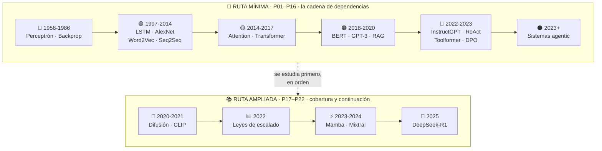
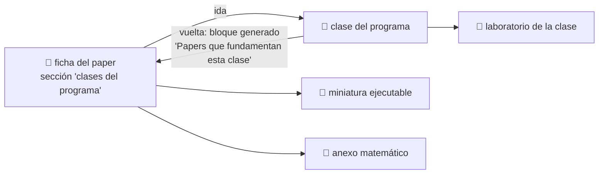

<div align="center">

# 📜 Eje de papers fundacionales

## **38 hitos · 46 notebooks ejecutables · 5 anexos matemáticos · de Rosenblatt (1958) a 2025**

**La historia de la IA contada por los papers que la movieron —
no como una colección de PDFs, sino como una cadena de problemas resueltos
que cada estudiante puede ejecutar, romper e interpretar.**

[📇 Índice de papers](catalog/PAPERS_INDEX.md) ·
[🗺️ Ruta y niveles](ROADMAP.md) ·
[🧮 Anexos matemáticos](annexes/README.md) ·
[🌐 Fuentes y venues](guides/FUENTES_Y_VENUES.md) ·
[📖 Cómo leer un paper](guides/COMO_LEER_UN_PAPER_DE_IA.md) ·
[🔁 5 pasadas](guides/METODO_DE_LECTURA_EN_5_PASADAS.md) ·
[📚 Glosario](guides/GLOSARIO_PAPERS_IA.md)

| 📄 Papers | 📓 Notebooks | 🧪 Motores | 🧮 Anexos | 🎓 Niveles | 🔗 Clases enlazadas |
|:---:|:---:|:---:|:---:|:---:|:---:|
| **38** | **46** | **38** | **5** | **L0–L5** | **42** |

</div>

---

## 💡 La idea

Un paper leído es una anécdota. Un paper **ejecutado, roto e interpretado** es conocimiento.

Este eje convierte cada hito en una experiencia con la misma secuencia siempre:

```text
problema histórico → propuesta → intuición → matemática mínima →
implementación → experimento → interpretación → limitaciones → siguiente hito
```

La última flecha es la importante. **Cada paper existe porque el anterior dejó algo sin
resolver.** El perceptrón no separa XOR → backpropagation entrena capas ocultas → el gradiente
se desvanece en secuencias largas → la LSTM lo controla → un vector fijo no sostiene frases
largas → la atención lo elimina → si la atención basta, sobra la recurrencia → Transformer →
…y la atención cuesta O(n²), que es de donde arranca Mamba doce años después.

> [!IMPORTANT]
> Este eje **no redistribuye papers**. Enlaza a la fuente primaria de cada uno, con autoría,
> año, venue, URL y fecha de consulta. Los notebooks implementan **miniaturas** del mecanismo
> en Python estándar: no reproducen los experimentos originales y lo declaran en cada salida.

## 🧭 Seis rutas

El eje tiene seis bloques con propósitos distintos. **No se estudian igual.**



### 🔗 Ruta mínima — la cadena canónica

Se estudia **en orden**: cada paper resuelve lo que el anterior dejó abierto.

| # | Paper | Año | Nivel | Lo que desbloqueó |
|---|---|---:|:---:|---|
| [P01](foundational/P01_perceptron/README.md) | Perceptrón | 1958 | L1 | Una máquina ajusta sus pesos con ejemplos |
| [P02](foundational/P02_backpropagation/README.md) | Backpropagation | 1986 | L2 | Se pueden entrenar capas ocultas |
| [P03](foundational/P03_lstm/README.md) | LSTM | 1997 | L2 | Memoria a través de cientos de pasos |
| [P04](foundational/P04_alexnet/README.md) | AlexNet | 2012 | L3 | El deep learning se vuelve corriente principal |
| [P05](foundational/P05_word2vec/README.md) | Word2Vec | 2013 | L2 | Las palabras tienen geometría |
| [P06](foundational/P06_seq2seq/README.md) | Seq2Seq | 2014 | L3 | Secuencia variable → secuencia variable |
| [P07](foundational/P07_attention_bahdanau/README.md) | Attention (Bahdanau) | 2014 | L3 | Muere el cuello de botella del vector fijo |
| [P08](foundational/P08_transformer/README.md) | **Transformer** | 2017 | L4 | Se elimina la recurrencia; todo paraleliza |
| [P09](foundational/P09_bert/README.md) | BERT | 2018 | L3 | Preentrenar y ajustar como norma |
| [P10](foundational/P10_gpt3/README.md) | GPT-3 | 2020 | L3 | Aprendizaje en contexto sin tocar pesos |
| [P11](foundational/P11_rag/README.md) | RAG | 2020 | L3 | Conocimiento actualizable y citable |
| [P12](foundational/P12_instructgpt_rlhf/README.md) | InstructGPT / RLHF | 2022 | L3 | De completar texto a seguir instrucciones |
| [P13](foundational/P13_react/README.md) | ReAct | 2022 | L2 | El modelo controla un bucle que observa y actúa |
| [P14](foundational/P14_toolformer/README.md) | Toolformer | 2023 | L3 | El uso de herramientas se autosupervisa |
| [P15](foundational/P15_dpo/README.md) | DPO | 2023 | L4 | Alineación sin modelo de recompensa ni RL |
| [P16](foundational/P16_agentic_systems/README.md) | Sistemas agentic | 2023+ | L5 | El agente pasa de bucle a sistema |

### 📚 Ruta ampliada — lo que la cadena mínima no cubre

Ordenada por año. Aporta **generativa, multimodal y escalado** —que la cadena canónica no
toca— y continúa la historia hasta 2025.

| # | Paper | Año | Nivel | Lo que aportó |
|---|---|---:|:---:|---|
| [P17](foundational/P17_diffusion/README.md) | Difusión (DDPM) | 2020 | L3 | Generar es aprender a deshacer un ruido conocido |
| [P18](foundational/P18_clip/README.md) | CLIP | 2021 | L3 | El texto se convierte en la etiqueta |
| [P19](foundational/P19_scaling_laws/README.md) | Leyes de escalado (Chinchilla) | 2022 | L4 | A cómputo fijo hay un reparto óptimo |
| [P20](foundational/P20_mamba/README.md) | Mamba | 2023 | L4 | Tiempo lineal y estado fijo, sin atención |
| [P21](foundational/P21_moe/README.md) | Mixtral (MoE) | 2024 | L3 | Capacidad y cómputo se desacoplan |
| [P22](foundational/P22_deepseek_r1/README.md) | DeepSeek-R1 | 2025 | L5 | El razonamiento se incentiva con refuerzo verificable |

### 📚 Ruta de representación — cómo el lenguaje llegó a un formato único

| # | Paper | Año | Nivel | Lo que aportó |
|---|---|---:|:---:|---|
| [P23](foundational/P23_glove/README.md) | GloVe | 2014 | L2 | Factorizar estadísticas globales con estructura lineal |
| [P24](foundational/P24_elmo/README.md) | ELMo | 2018 | L3 | Un vector por aparición: la polisemia deja de colapsar |
| [P25](foundational/P25_t5/README.md) | T5 | 2019 | L3 | Todo problema de texto es texto → texto |

### 🤖 Ruta de agentes — decisión secuencial, razonamiento y multiagente

Empieza donde de verdad empieza la idea de agente —el refuerzo y la búsqueda— y llega al
multiagente. Es el bloque que responde a «¿dónde están los papers de agentes?».

| # | Paper | Año | Nivel | Lo que aportó |
|---|---|---:|:---:|---|
| [P26](foundational/P26_dqn/README.md) | DQN | 2015 | L3 | Aprender a actuar desde píxeles, de forma estable |
| [P27](foundational/P27_alphago/README.md) | AlphaGo | 2016 | L4 | Búsqueda y aprendizaje se potencian |
| [P28](foundational/P28_chain_of_thought/README.md) | Chain-of-Thought | 2022 | L2 | Descomponer desbloquea lo que fallaba de una vez |
| [P29](foundational/P29_tree_of_thoughts/README.md) | Tree of Thoughts | 2023 | L3 | Explorar ramas y poder retroceder |
| [P30](foundational/P30_reflexion/README.md) | Reflexion | 2023 | L2 | Aprender entre intentos sin tocar pesos |
| [P31](foundational/P31_generative_agents/README.md) | Generative Agents | 2023 | L3 | Memoria episódica con recuperación puntuada |
| [P32](foundational/P32_voyager/README.md) | Voyager | 2023 | L3 | Habilidades reutilizables, no contexto |
| [P33](foundational/P33_autogen/README.md) | AutoGen | 2023 | L4 | Multiagente como patrón de programación |

## ⏳ ¿Por qué el eje no llega a 2026?

Porque el propio eje se lo prohíbe. El
[criterio de ascenso](../prompts/VIGILANCIA_DE_FRONTERA.md) exige, entre otras cosas, **12 meses
desde la publicación** y evidencia de que otros trabajos han construido encima. Con fecha de
revisión **2026-08-16**, eso admite hasta mediados de 2025 — y ahí termina P22.

Lo posterior no se omite: vive en [`frontier/current-topics.yaml`](../frontier/current-topics.yaml)
con fecha y fuente, y asciende a `foundational/` cuando cumple los criterios. Un paper de hace
tres meses puede ser excelente y aun así no tener todavía lo que hace falta para enseñarlo como
hito: réplicas, consecuencias y errores comunes documentados.

## 🔬 Tratamiento especial: *Attention Is All You Need*

El paper que sostiene casi todo lo que vino después se desmonta pieza por pieza en ocho
miniaturas independientes, además de su ficha completa:

| Miniatura | Qué aísla |
|---|---|
| [T01](../notebooks/papers/T01_recurrencia_vs_paralelismo.ipynb) | Por qué había que quitar la recurrencia |
| [T02](../notebooks/papers/T02_qkv_scaled_dot_product.ipynb) | Q, K, V y el producto escalar escalado |
| [T03](../notebooks/papers/T03_softmax_y_temperatura.ipynb) | Softmax, escala √d_k y saturación |
| [T04](../notebooks/papers/T04_self_attention_y_mascara_causal.ipynb) | Self-attention y máscara causal |
| [T05](../notebooks/papers/T05_multi_head_attention.ipynb) | Multi-head attention |
| [T06](../notebooks/papers/T06_positional_encoding.ipynb) | Codificación posicional |
| [T07](../notebooks/papers/T07_residual_layernorm_ffn.ipynb) | Residual, layer norm y feed-forward |
| [T08](../notebooks/papers/T08_encoder_decoder_y_limites.ipynb) | Encoder–decoder, complejidad y qué **no** dice el título |

Y la ecuación 1 está desarrollada **con números, paso a paso**, en el
[anexo A04](annexes/A04_ATENCION_PASO_A_PASO.md).

## 🧮 Anexos matemáticos

La sección 5 de cada ficha es deliberadamente corta: solo la matemática de **ese** paper. Las
herramientas que reaparecen en todos se explican una vez, en un sitio, con ejemplo resuelto a
mano y su error común:

| Anexo | Cubre |
|---|---|
| [A01 · Álgebra y geometría](annexes/A01_ALGEBRA_Y_GEOMETRIA.md) | Producto escalar, norma, coseno, hiperplanos, matrices |
| [A02 · Probabilidad y verosimilitud](annexes/A02_PROBABILIDAD_Y_VEROSIMILITUD.md) | Softmax, entropía, KL, Bradley-Terry, gaussianas |
| [A03 · Cálculo y gradientes](annexes/A03_CALCULO_Y_GRADIENTES.md) | Regla de la cadena, retropropagación, gradiente de política |
| [A04 · La atención, paso a paso](annexes/A04_ATENCION_PASO_A_PASO.md) | La ecuación 1 con números, máscara, multi-cabeza |
| [A05 · Complejidad, coste y escalado](annexes/A05_COMPLEJIDAD_Y_COSTE.md) | O(), memoria, FLOPs, 6ND, coste de inferencia |

## 🔁 Ida y vuelta con las clases

El circuito está cerrado en los dos sentidos:



Las **42 clases** enlazadas llevan un bloque generado por
[`scripts/link_papers_to_classes.py`](../scripts/link_papers_to_classes.py) que lista sus
papers, el año, qué desbloqueó cada uno y su notebook. Se regenera desde `papers.json`, así que
no puede desincronizarse: `--check` lo verifica en CI.

## 🚀 Cómo se usa

```bash
pip install -e .

ai-evolution papers                 # catálogo del eje
ai-evolution paper P08              # ficha resumida de un paper
ai-evolution paper-lab P08 --seed 7 # ejecuta la miniatura
python scripts/generate_papers.py   # regenera índice, notebooks y manifiesto
```

Con los notebooks:

```bash
jupyter lab notebooks/papers/
```

Sin código: el eje también se lee en el
[sitio del programa](https://vladimiracunadev-create.github.io/artificial-intelligence-evolution-program/papers/)
o en el [PDF imprimible](../docs/pdf/papers-fundacionales.pdf)
(`python scripts/generate_pdfs.py --papers`).

Empieza por [`P01_perceptron.ipynb`](../notebooks/papers/P01_perceptron.ipynb) y sigue el orden
de la ruta mínima. **Antes de ejecutar cada celda, escribe tu predicción** en la sección 7 — ese
paso no es decorativo: es lo que se evalúa.

## 📦 Estructura del eje

```text
papers/
├── README.md                    ← este archivo
├── ROADMAP.md                   ← niveles L0–L5 y plan de estudio
├── manifest.json                ← inventario con hash por artefacto (generado)
├── guides/                      ← cómo leer, 5 pasadas, plantilla, glosario, fuentes
├── annexes/                     ← 5 anexos matemáticos con ejemplos resueltos
├── catalog/
│   ├── papers.json              ← fuente de verdad estructurada
│   ├── sources.yaml             ← venues y repositorios primarios
│   └── PAPERS_INDEX.md          ← índice legible (generado)
└── foundational/PXX_slug/       ← una ficha de 18 secciones por paper

notebooks/papers/                ← 38 + 8 notebooks (generados)
instructor/papers/               ← plan de sesión por paper (generado)
student/papers/                  ← ficha de estudio y bitácora (generado)
assessments/papers/              ← evaluación con rúbrica por paper (generado)
prompts/                         ← prompts reutilizables del eje
```

## ⚖️ Reglas del eje (verificadas automáticamente)

1. **Contexto antes que tecnicismo.** Nadie ve una ecuación antes de saber qué problema resuelve.
2. **Progresión antes que saturación.** Un hito por vez, en orden.
3. **Interpretación antes que ejecución mecánica.** Predecir, ejecutar, explicar.
4. **Implementación pequeña y explicable** antes que frameworks.
5. **Nunca atribuir al paper ideas posteriores.** Sección 11 de cada ficha.
6. **Nunca inventar** autores, fechas, datasets, métricas ni citas.
7. **Siempre distinguir** hecho documentado, simplificación didáctica, inferencia y práctica moderna.
8. **Siempre registrar** URL, autoría, año, venue y fecha de consulta.
9. **Sin APIs pagadas** como requisito de aprendizaje.
10. **Sin redistribuir** material con copyright.

## ✅ Verificación

```bash
python scripts/generate_papers.py --check
python scripts/link_papers_to_classes.py --check
python -m unittest tests.test_papers -v
python scripts/validate_repository.py --strict
```

Se comprueba: JSON y YAML válidos, las 18 secciones de cada ficha en orden, los 17 momentos de
cada notebook, `nbformat` correcto, que cada motor exista y sea determinista, que las clases
enlazadas existan **y enlacen de vuelta**, ausencia de rutas absolutas y coherencia de los hashes
del manifiesto en cualquier sistema operativo.

---

<div align="center">

[⬅️ Programa completo](../README.md) ·
[🗺️ Ruta del eje](ROADMAP.md) ·
[📇 Índice](catalog/PAPERS_INDEX.md) ·
[🧮 Anexos](annexes/README.md) ·
[👩‍🏫 Guías docentes](../instructor/papers/README.md) ·
[🎒 Fichas de estudio](../student/papers/README.md) ·
[📝 Evaluaciones](../assessments/papers/README.md) ·
[🧰 Prompts](../prompts/README.md)

</div>
