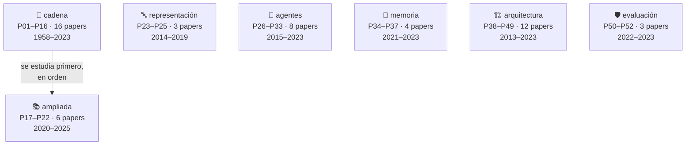
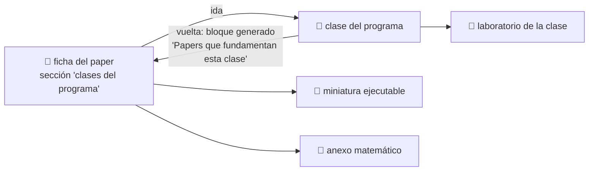

<div align="center">

# 📜 Eje de papers fundacionales

## **52 hitos · 60 notebooks ejecutables · 5 anexos matemáticos · de Rosenblatt (1958) a 2025**

**La historia de la IA contada por los papers que la movieron —
no como una colección de PDFs, sino como una cadena de problemas resueltos
que cada estudiante puede ejecutar, romper e interpretar.**

[📇 Índice de papers](catalog/PAPERS_INDEX.md) ·
[🗺️ Ruta y niveles](ROADMAP.md) ·
[🧮 Anexos matemáticos](annexes/README.md) ·
[🌐 Fuentes y venues](guides/FUENTES_Y_VENUES.md) ·
[📖 Cómo leer un paper](guides/COMO_LEER_UN_PAPER_DE_IA.md) ·
[🔁 5 pasadas](guides/METODO_DE_LECTURA_EN_5_PASADAS.md) ·
[📚 Glosario](guides/GLOSARIO_PAPERS_IA.md)

<!-- stats:inicio -->
| 📄 Papers | 📓 Notebooks | 🧪 Motores | 🧮 Anexos | 🎓 Niveles | 🔗 Clases enlazadas |
|:---:|:---:|:---:|:---:|:---:|:---:|
| **52** | **60** | **52** | **5** | **L0–L5** | **50** |
<!-- stats:fin -->

</div>

---

## 💡 La idea

Un paper leído es una anécdota. Un paper **ejecutado, roto e interpretado** es conocimiento.

Este eje convierte cada hito en una experiencia con la misma secuencia siempre:

```text
problema histórico → propuesta → intuición → matemática mínima →
implementación → experimento → interpretación → limitaciones → siguiente hito
```

La última flecha es la importante. **Cada paper existe porque el anterior dejó algo sin
resolver.** El perceptrón no separa XOR → backpropagation entrena capas ocultas → el gradiente
se desvanece en secuencias largas → la LSTM lo controla → un vector fijo no sostiene frases
largas → la atención lo elimina → si la atención basta, sobra la recurrencia → Transformer →
…y la atención cuesta O(n²), que es de donde arranca Mamba doce años después.

> [!IMPORTANT]
> Este eje **no redistribuye papers**. Enlaza a la fuente primaria de cada uno, con autoría,
> año, venue, URL y fecha de consulta. Los notebooks implementan **miniaturas** del mecanismo
> en Python estándar: no reproducen los experimentos originales y lo declaran en cada salida.

<!-- rutas:inicio -->
## 🧭 Siete rutas · 52 papers

El eje tiene 7 bloques con propósitos distintos. **No se estudian igual.**
Dentro de cada uno, los papers van **en orden cronológico**; entre bloques no hay orden,
porque responden a preguntas diferentes.



### 🔗 Ruta mínima — la cadena canónica

P01–P16: la cadena canónica donde cada paper resuelve lo que el anterior dejó abierto. Se estudia en orden.

| # | Paper | Año | Nivel | Lo que aportó |
|---|---|---:|:---:|---|
| [P01](foundational/P01_perceptron/README.md) | El perceptrón | 1958 | L1 | Primera máquina que aprende sus propios pesos a partir de ejemplos en lugar de ejecutar reglas escritas por una persona. |
| [P02](foundational/P02_backpropagation/README.md) | Backpropagation | 1986 | L2 | Un procedimiento práctico para entrenar capas ocultas: la red descubre representaciones intermedias que nadie diseñó. |
| [P03](foundational/P03_lstm/README.md) | LSTM | 1997 | L2 | Primera arquitectura recurrente capaz de mantener información a través de cientos de pasos sin que el gradiente se desvanezca. |
| [P04](foundational/P04_alexnet/README.md) | AlexNet | 2012 | L3 | El resultado que convirtió el deep learning en la corriente principal: margen amplio sobre los métodos de visión hechos a mano. |
| [P05](foundational/P05_word2vec/README.md) | Word2Vec | 2013 | L2 | El significado distribucional se vuelve barato: vectores densos entrenables sobre miles de millones de palabras. |
| [P06](foundational/P06_seq2seq/README.md) | Seq2Seq | 2014 | L3 | Una única red aprende a mapear secuencias de longitud variable a secuencias de longitud variable, de extremo a extremo. |
| [P07](foundational/P07_attention_bahdanau/README.md) | Atención (Bahdanau) | 2014 | L3 | Nace la atención: el decodificador deja de depender de un único vector y consulta toda la entrada en cada paso. |
| [P08](foundational/P08_transformer/README.md) | Transformer · *Attention Is All You Need* | 2017 | L4 | Elimina la recurrencia y la convolución del modelado de secuencias: todo el cómputo de una capa se paraleliza. |
| [P09](foundational/P09_bert/README.md) | BERT | 2018 | L3 | Consolida el patrón preentrenar-y-ajustar: un mismo modelo base sirve para muchas tareas con un ajuste pequeño. |
| [P10](foundational/P10_gpt3/README.md) | GPT-3 y el aprendizaje en contexto | 2020 | L3 | El aprendizaje en contexto: la tarea se especifica en el prompt y el modelo se adapta sin actualizar ningún peso. |
| [P11](foundational/P11_rag/README.md) | RAG | 2020 | L3 | Separa el conocimiento (índice consultable y actualizable) del razonamiento (parámetros del modelo). |
| [P12](foundational/P12_instructgpt_rlhf/README.md) | InstructGPT y RLHF | 2022 | L3 | El salto de «modelo que completa texto» a «asistente que sigue instrucciones»: alineación con preferencias humanas. |
| [P13](foundational/P13_react/README.md) | ReAct | 2022 | L2 | El modelo deja de ser solo un generador de texto y pasa a ser el controlador de un bucle que observa y actúa. |
| [P14](foundational/P14_toolformer/README.md) | Toolformer | 2023 | L3 | El uso de herramientas se aprende de forma autosupervisada: el criterio de utilidad es la propia pérdida del modelo. |
| [P15](foundational/P15_dpo/README.md) | DPO | 2023 | L4 | Alinear un modelo con preferencias humanas sin modelo de recompensa explícito ni bucle de aprendizaje por refuerzo. |
| [P16](foundational/P16_agentic_systems/README.md) | Sistemas agentic contemporáneos | 2023 | L5 | El agente deja de ser un bucle y pasa a ser un sistema: memoria, reflexión, planificación, presupuesto, múltiples agentes y protocolos de interoperabilidad. |

### 📚 Ruta ampliada — lo que la cadena mínima no cubre

P17–P22: cobertura que la cadena mínima no da (generativa, multimodal, escalado) y continuación hasta 2025. Ordenada por año.

| # | Paper | Año | Nivel | Lo que aportó |
|---|---|---:|:---:|---|
| [P17](foundational/P17_diffusion/README.md) | Difusión (DDPM) | 2020 | L3 | La generación deja de ser un salto en la oscuridad: se aprende a deshacer, paso a paso, un proceso de ruido conocido. |
| [P18](foundational/P18_clip/README.md) | CLIP | 2021 | L3 | El texto se convierte en la etiqueta: un solo modelo clasifica categorías que nadie anotó, describiéndolas con palabras. |
| [P19](foundational/P19_scaling_laws/README.md) | Leyes de escalado con cómputo óptimo (Chinchilla) | 2022 | L4 | Corrige la carrera por el tamaño: a cómputo fijo, los modelos de la época estaban infraentrenados en datos. |
| [P20](foundational/P20_mamba/README.md) | Mamba | 2023 | L4 | El primer competidor serio del Transformer en lenguaje: tiempo lineal y estado de tamaño fijo, sin atención. |
| [P21](foundational/P21_moe/README.md) | Mixtral (mezcla dispersa de expertos) | 2024 | L3 | Desacopla capacidad de cómputo: 47 000 millones de parámetros totales, 13 000 millones activos por token. |
| [P22](foundational/P22_deepseek_r1/README.md) | DeepSeek-R1 | 2025 | L5 | El razonamiento se incentiva con refuerzo puro, sin trazas humanas anotadas; y es el primer LLM de pesos abiertos publicado tras revisión por pares. |

### 🔤 Ruta de representación — cómo el lenguaje llegó a un formato único

P23–P25: cómo el lenguaje pasó de vectores estáticos a representaciones contextuales y de ahí a un formato único texto → texto. Ordenada por año.

| # | Paper | Año | Nivel | Lo que aportó |
|---|---|---:|:---:|---|
| [P23](foundational/P23_glove/README.md) | GloVe | 2014 | L2 | Unifica las dos familias de embeddings: factorizar estadísticas globales de co-ocurrencia con la ventaja de los métodos predictivos. |
| [P24](foundational/P24_elmo/README.md) | ELMo | 2018 | L3 | Un vector por APARICIÓN y no por palabra: la polisemia deja de colapsar en un único punto del espacio. |
| [P25](foundational/P25_t5/README.md) | T5 | 2019 | L3 | Todo problema de texto se reescribe como texto → texto: un solo modelo, una sola pérdida, cero cabezas específicas. |

### 🤖 Ruta de agentes — decisión secuencial, razonamiento y multiagente

P26–P33: decisión secuencial y agentes. Empieza en el refuerzo profundo y la búsqueda guiada —de donde viene la idea de agente— y llega al razonamiento deliberado, la memoria, las habilidades reutilizables y el multiagente. Ordenada por año.

| # | Paper | Año | Nivel | Lo que aportó |
|---|---|---:|:---:|---|
| [P26](foundational/P26_dqn/README.md) | DQN | 2015 | L3 | El primer agente que aprende a actuar directamente desde píxeles, con la misma arquitectura y los mismos hiperparámetros en decenas de juegos. |
| [P27](foundational/P27_alphago/README.md) | AlphaGo | 2016 | L4 | Une las dos tradiciones de la IA: la búsqueda simbólica de la parte 01 y el aprendizaje profundo de la parte 04, en un solo sistema. |
| [P28](foundational/P28_chain_of_thought/README.md) | Chain-of-Thought | 2022 | L2 | Descomponer en pasos intermedios desbloquea tareas que el mismo modelo fallaba respondiendo de una vez. |
| [P29](foundational/P29_tree_of_thoughts/README.md) | Tree of Thoughts | 2023 | L3 | Devuelve la búsqueda clásica al razonamiento: explorar varias ramas, evaluarlas y poder retroceder. |
| [P30](foundational/P30_reflexion/README.md) | Reflexion | 2023 | L2 | El agente aprende entre intentos sin tocar un solo peso: el refuerzo ocurre en el contexto, en lenguaje natural. |
| [P31](foundational/P31_generative_agents/README.md) | Generative Agents | 2023 | L3 | Resuelve la memoria de un agente que vive mucho tiempo: qué recordar, cuándo y por qué, cuando el contexto no da para todo. |
| [P32](foundational/P32_voyager/README.md) | Voyager | 2023 | L3 | El agente acumula habilidades reutilizables en vez de contexto: memoria procedimental que no se borra al terminar la tarea. |
| [P33](foundational/P33_autogen/README.md) | AutoGen | 2023 | L4 | El multiagente deja de ser una metáfora y pasa a ser un patrón de programación: agentes con rol que conversan hasta converger. |

### 🧠 Ruta de memoria y contexto — qué recuerda el modelo y cómo

P34–P37: cómo se codifica la posición, por qué el contexto largo es viable, por qué tenerlo no basta y cómo se gestiona como memoria jerárquica.

| # | Paper | Año | Nivel | Lo que aportó |
|---|---|---:|:---:|---|
| [P34](foundational/P34_rope/README.md) | RoPE | 2021 | L3 | La posición se codifica rotando, y la atención pasa a depender solo de la distancia relativa. |
| [P35](foundational/P35_flashattention/README.md) | FlashAttention | 2022 | L4 | El cuello de botella de la atención no eran los FLOPs sino las lecturas y escrituras a memoria. |
| [P36](foundational/P36_lost_in_middle/README.md) | Lost in the Middle | 2023 | L3 | Tener contexto largo no es usarlo: el rendimiento cae en forma de U cuando el dato relevante está en el medio. |
| [P37](foundational/P37_memgpt/README.md) | MemGPT | 2023 | L3 | Aplica al contexto la idea de memoria virtual: una jerarquía que da la ilusión de memoria grande sobre una pequeña y rápida. |

### 🏗️ Ruta de arquitectura y entrenamiento — el andamiaje de todo lo demás

P38–P49: el andamiaje que hace entrenable todo lo demás — generativa clásica, regularización, optimización, robustez, normalización, profundidad, compresión, visión con Transformer, ciencia aplicada y adaptación eficiente.

| # | Paper | Año | Nivel | Lo que aportó |
|---|---|---:|:---:|---|
| [P38](foundational/P38_vae/README.md) | VAE | 2013 | L3 | Hace entrenable un modelo generativo latente: el truco de reparametrización deja pasar el gradiente a través del muestreo. |
| [P39](foundational/P39_gan/README.md) | GAN | 2014 | L3 | Convierte la generación en un juego: dos redes compiten y ninguna necesita una verosimilitud explícita. |
| [P40](foundational/P40_dropout/README.md) | Dropout | 2014 | L2 | Apagar unidades al azar durante el entrenamiento equivale a entrenar un ensamblado exponencial de subredes que comparten pesos. |
| [P41](foundational/P41_adam/README.md) | Adam | 2014 | L2 | Un paso de aprendizaje por dimensión, adaptado a la escala de su propio gradiente. |
| [P42](foundational/P42_adversarial/README.md) | Ejemplos adversarios | 2014 | L3 | Una perturbación imperceptible cambia la predicción. |
| [P43](foundational/P43_batchnorm/README.md) | Batch Normalization | 2015 | L2 | Normalizar las activaciones dentro de la red permite tasas de aprendizaje mucho mayores y hace el entrenamiento profundo mucho menos frágil. |
| [P44](foundational/P44_resnet/README.md) | ResNet | 2015 | L3 | El atajo identidad hace apilables cientos de capas. |
| [P45](foundational/P45_distillation/README.md) | Destilación de conocimiento | 2015 | L2 | Las probabilidades del maestro contienen más información que la etiqueta correcta: el modelo pequeño aprende de esa estructura. |
| [P46](foundational/P46_vit/README.md) | Vision Transformer | 2020 | L3 | Trata la imagen como una secuencia de parches y aplica un Transformer puro: la convolución deja de ser imprescindible en visión. |
| [P47](foundational/P47_alphafold/README.md) | AlphaFold 2 | 2021 | L4 | Resuelve en la práctica un problema abierto de cincuenta años en biología, y demuestra que la IA puede producir conocimiento científico, no solo productos. |
| [P48](foundational/P48_lora/README.md) | LoRA | 2021 | L3 | Ajustar un modelo enorme entrenando una fracción diminuta de parámetros, sin coste añadido en inferencia. |
| [P49](foundational/P49_qlora/README.md) | QLoRA y cuantización | 2023 | L3 | Pone el ajuste fino de un modelo muy grande al alcance de una sola GPU de consumo. |

### 🛡️ Ruta de evaluación y seguridad — cómo se decide que un modelo sirve

P50–P52: cómo se decide que un modelo es aceptable — principios explícitos, criterios de evaluación verificables e interpretabilidad de lo que hay dentro.

| # | Paper | Año | Nivel | Lo que aportó |
|---|---|---:|:---:|---|
| [P50](foundational/P50_constitutional_ai/README.md) | IA constitucional | 2022 | L4 | Sustituye parte del juicio humano por un conjunto de principios explícitos y auditables, y por la autocrítica del modelo. |
| [P51](foundational/P51_swebench/README.md) | SWE-bench | 2023 | L3 | Cambia el criterio de evaluación: no si el código parece bien, sino si los tests del repositorio real pasan. |
| [P52](foundational/P52_superposition/README.md) | Superposición y autoencoders dispersos | 2023 | L5 | Explica por qué una neurona no significa una cosa, y propone una forma de descomponer las activaciones en características interpretables. |
<!-- rutas:fin -->

## ⏳ ¿Por qué el eje no llega a 2026?

Porque el propio eje se lo prohíbe. El
[criterio de ascenso](../prompts/VIGILANCIA_DE_FRONTERA.md) exige, entre otras cosas, **12 meses
desde la publicación** y evidencia de que otros trabajos han construido encima. Con fecha de
revisión **2026-08-16**, eso admite hasta mediados de 2025 — y ahí termina P22.

Lo posterior no se omite: vive en [`frontier/current-topics.yaml`](../frontier/current-topics.yaml)
con fecha y fuente, y asciende a `foundational/` cuando cumple los criterios. Un paper de hace
tres meses puede ser excelente y aun así no tener todavía lo que hace falta para enseñarlo como
hito: réplicas, consecuencias y errores comunes documentados.

## 🔬 Tratamiento especial: *Attention Is All You Need*

El paper que sostiene casi todo lo que vino después se desmonta pieza por pieza en ocho
miniaturas independientes, además de su ficha completa:

| Miniatura | Qué aísla |
|---|---|
| [T01](../notebooks/papers/T01_recurrencia_vs_paralelismo.ipynb) | Por qué había que quitar la recurrencia |
| [T02](../notebooks/papers/T02_qkv_scaled_dot_product.ipynb) | Q, K, V y el producto escalar escalado |
| [T03](../notebooks/papers/T03_softmax_y_temperatura.ipynb) | Softmax, escala √d_k y saturación |
| [T04](../notebooks/papers/T04_self_attention_y_mascara_causal.ipynb) | Self-attention y máscara causal |
| [T05](../notebooks/papers/T05_multi_head_attention.ipynb) | Multi-head attention |
| [T06](../notebooks/papers/T06_positional_encoding.ipynb) | Codificación posicional |
| [T07](../notebooks/papers/T07_residual_layernorm_ffn.ipynb) | Residual, layer norm y feed-forward |
| [T08](../notebooks/papers/T08_encoder_decoder_y_limites.ipynb) | Encoder–decoder, complejidad y qué **no** dice el título |

Y la ecuación 1 está desarrollada **con números, paso a paso**, en el
[anexo A04](annexes/A04_ATENCION_PASO_A_PASO.md).

## 🧮 Anexos matemáticos

La sección 5 de cada ficha es deliberadamente corta: solo la matemática de **ese** paper. Las
herramientas que reaparecen en todos se explican una vez, en un sitio, con ejemplo resuelto a
mano y su error común:

| Anexo | Cubre |
|---|---|
| [A01 · Álgebra y geometría](annexes/A01_ALGEBRA_Y_GEOMETRIA.md) | Producto escalar, norma, coseno, hiperplanos, matrices |
| [A02 · Probabilidad y verosimilitud](annexes/A02_PROBABILIDAD_Y_VEROSIMILITUD.md) | Softmax, entropía, KL, Bradley-Terry, gaussianas |
| [A03 · Cálculo y gradientes](annexes/A03_CALCULO_Y_GRADIENTES.md) | Regla de la cadena, retropropagación, gradiente de política |
| [A04 · La atención, paso a paso](annexes/A04_ATENCION_PASO_A_PASO.md) | La ecuación 1 con números, máscara, multi-cabeza |
| [A05 · Complejidad, coste y escalado](annexes/A05_COMPLEJIDAD_Y_COSTE.md) | O(), memoria, FLOPs, 6ND, coste de inferencia |

## 🔁 Ida y vuelta con las clases

El circuito está cerrado en los dos sentidos:



Las **50 clases** enlazadas llevan un bloque generado por
[`scripts/link_papers_to_classes.py`](../scripts/link_papers_to_classes.py) que lista sus
papers, el año, qué desbloqueó cada uno y su notebook. Se regenera desde `papers.json`, así que
no puede desincronizarse: `--check` lo verifica en CI.

## 🚀 Cómo se usa

```bash
pip install -e .

ai-evolution papers                 # catálogo del eje
ai-evolution paper P08              # ficha resumida de un paper
ai-evolution paper-lab P08 --seed 7 # ejecuta la miniatura
python scripts/generate_papers.py   # regenera índice, notebooks y manifiesto
```

Con los notebooks:

```bash
jupyter lab notebooks/papers/
```

Sin código: el eje también se lee en el
[sitio del programa](https://vladimiracunadev-create.github.io/artificial-intelligence-evolution-program/papers/)
o en el [PDF imprimible](../docs/pdf/papers-fundacionales.pdf)
(`python scripts/generate_pdfs.py --papers`).

Empieza por [`P01_perceptron.ipynb`](../notebooks/papers/P01_perceptron.ipynb) y sigue el orden
de la ruta mínima. **Antes de ejecutar cada celda, escribe tu predicción** en la sección 7 — ese
paso no es decorativo: es lo que se evalúa.

## 📦 Estructura del eje

```text
papers/
├── README.md                    ← este archivo
├── ROADMAP.md                   ← niveles L0–L5 y plan de estudio
├── manifest.json                ← inventario con hash por artefacto (generado)
├── guides/                      ← cómo leer, 5 pasadas, plantilla, glosario, fuentes
├── annexes/                     ← 5 anexos matemáticos con ejemplos resueltos
├── catalog/
│   ├── papers.json              ← fuente de verdad estructurada
│   ├── sources.yaml             ← venues y repositorios primarios
│   └── PAPERS_INDEX.md          ← índice legible (generado)
└── foundational/PXX_slug/       ← una ficha de 18 secciones por paper

notebooks/papers/                ← 38 + 8 notebooks (generados)
instructor/papers/               ← plan de sesión por paper (generado)
student/papers/                  ← ficha de estudio y bitácora (generado)
assessments/papers/              ← evaluación con rúbrica por paper (generado)
prompts/                         ← prompts reutilizables del eje
```

## ⚖️ Reglas del eje (verificadas automáticamente)

1. **Contexto antes que tecnicismo.** Nadie ve una ecuación antes de saber qué problema resuelve.
2. **Progresión antes que saturación.** Un hito por vez, en orden.
3. **Interpretación antes que ejecución mecánica.** Predecir, ejecutar, explicar.
4. **Implementación pequeña y explicable** antes que frameworks.
5. **Nunca atribuir al paper ideas posteriores.** Sección 11 de cada ficha.
6. **Nunca inventar** autores, fechas, datasets, métricas ni citas.
7. **Siempre distinguir** hecho documentado, simplificación didáctica, inferencia y práctica moderna.
8. **Siempre registrar** URL, autoría, año, venue y fecha de consulta.
9. **Sin APIs pagadas** como requisito de aprendizaje.
10. **Sin redistribuir** material con copyright.

## ✅ Verificación

```bash
python scripts/generate_papers.py --check
python scripts/link_papers_to_classes.py --check
python -m unittest tests.test_papers -v
python scripts/validate_repository.py --strict
```

Se comprueba: JSON y YAML válidos, las 18 secciones de cada ficha en orden, los 17 momentos de
cada notebook, `nbformat` correcto, que cada motor exista y sea determinista, que las clases
enlazadas existan **y enlacen de vuelta**, ausencia de rutas absolutas y coherencia de los hashes
del manifiesto en cualquier sistema operativo.

---

<div align="center">

[⬅️ Programa completo](../README.md) ·
[🗺️ Ruta del eje](ROADMAP.md) ·
[📇 Índice](catalog/PAPERS_INDEX.md) ·
[🧮 Anexos](annexes/README.md) ·
[👩‍🏫 Guías docentes](../instructor/papers/README.md) ·
[🎒 Fichas de estudio](../student/papers/README.md) ·
[📝 Evaluaciones](../assessments/papers/README.md) ·
[🧰 Prompts](../prompts/README.md)

</div>
